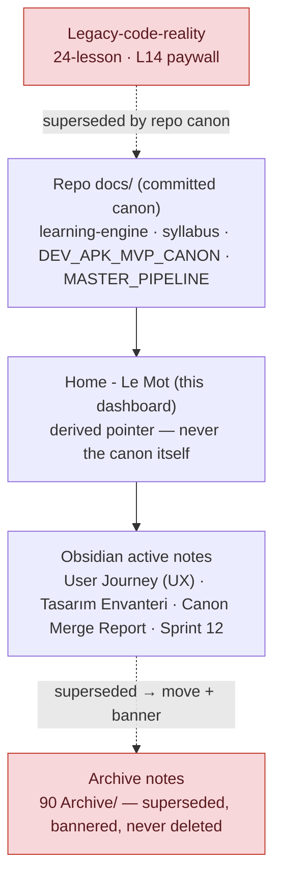

# Home - Le Mot

> **This is a _draft_ living in the repo (`docs/obsidian/`).** It is the proposed content for the vault landing note `01 Projeler/LeMot/Home - Le Mot.md`. It is **not** the live vault note yet — copying it into the vault is a separate, operator-approved step (redesign plan Phase 2). Nothing here changes code, runtime, or any existing note.

---

> ### 📍 Status banner
>
> - **Status:** Active dashboard draft
> - **Source of truth:** repo `docs/` + the committed syllabus canon under `docs/syllabus/`. This page only *points*; it never decides.
> - **Legacy warning:** the old **24-lesson syllabus** and the **L14 paywall** are **superseded** — do not treat them as active unless explicitly reactivated.
> - **Paywall canon:** **Campfire / soft paywall around L24.**
> - **Next task:** **L16 — Integration + A Small Moment seed → gate review first.**

This is the human/operator landing page for Le Mot. In two minutes it should tell a human, Claude, or Codex: what's **active canon**, what's **legacy**, where the **syllabus** stands, what the **next action** is, and what **must not be touched**.

---

## 🌿 What Le Mot is

Le Mot is a **premium French production engine — not a generic AI tutor.** It teaches people to *think in* and *produce* French through **reusable sentence engines** (a verb or pattern becomes a shape you can fill, not a table you memorize).

- **AI supports** feedback and variation — it does **not own the curriculum.** The learning spine teaches; AI lives *inside* a lesson spec and may vary, never author.
- **No streak. No XP. No reward theatre.** Calm, passive-mirror tone is part of the product's identity, not a preference.
- **Killer trinity:** Weave · Say It Your Way · Natural Reveal.

---

## 📚 Syllabus status

**Authored & committed as docs canon: L1–L15.** Next up: **L16** (gate review first). Soft paywall lands at **Campfire ~L24**, so the whole band below is **free**.

| Lesson | Status | Owned target (what it teaches) | Deferred danger (do NOT let it expand into) |
|---|---|---|---|
| **L1 Survival Kit** | ✅ committed | Survival/social chunks; first usable moments (`je voudrais …`) | Phrasebook bloat — don't inflate the active count with fixed expressions |
| **L2 Être** | ✅ committed | `être` as a *production engine*, one dominant active core | Full conjugation table / every person-form active |
| **L3 Negation / yes-no / tu-vous** | ✅ committed | `ne…pas`, yes-no intonation, tu/vous as social choice | `ne…plus/jamais/rien`, full question formation, conjugation expansion |
| **L4 Avoir-state** | ✅ committed | `j'ai faim/soif/besoin de`, `je n'ai pas faim`; the être↔avoir contrast | `j'ai envie de` (recog), age (needs numbers), `il y a` (own doorway), full paradigm |
| **L5 Objects / articles** | ✅ committed | `un`/`une` as noun packages (`le`/`la` supported, ID only) | Gender rules, agreement, plural (`les`/`des`), partitive (`du`/`de la`) |
| **L6 Integration** | ✅ committed | Recombine L1–L5 in human context; preview L7 (recognition) | A new grammar system; quiz/test framing |
| **L7 Aller movement** | ✅ committed | `aller` = movement / next-step (split-sense) | **Futur proche** (`je vais + inf.`) — recognition only, **not owned** |
| **L8 Où / location questions** | ✅ committed | `où` as where-control (`où est…?`, `c'est où?`, `tu vas où?`) | `est-ce que`/inversion/other Q-words, `y` as place pronoun, preposition system |
| **L9 Faire-light** | ✅ committed | `faire` = small action / pause (split-sense) | Weather (`il fait froid`), sport, idioms, `se faire`, full paradigm |
| **L10 Integration** | ✅ committed | Recombine L7–L9; preview L11 pouvoir-light (recognition) | Ownership of the preview; test framing |
| **L11 Pouvoir-light** | ✅ committed | Help / permission (`vous pouvez m'aider ?`, `je peux faire une pause ?`) | Broad ability, possibility (`il se peut`), conditionnel (`je pourrais`), subjunctive |
| **L12 Est-ce que wrapper** | ✅ committed | `est-ce que` as a yes/no **wrapper** over already-owned clauses | The full question system, question words, inversion, `qu'est-ce que`, `y`/`en` |
| **L13 Integration** | ✅ committed | Recombine L11–L12 (can-do + asking); preview L14 (`j'y vais`, recog) | Ownership of the preview |
| **L14 y-light** | ✅ committed | Place-`y` in chunks (`j'y vais`, `on y va`), recognition-first | `en`, the `y`/`en` contrast, `il y a` as a system, broad `à + place` replacement |
| **L15 Devoir / Falloir-light** | ✅ committed | `il faut + inf.` primary + `je dois + inf.` supported (asymmetric light) | Full `devoir` paradigm, **`il faut que + subjonctif`**, conditionnel (`je devrais`) |
| **L16 — NEXT** | 🔜 gate review first | Integration + **A Small Moment seed** (first reading-response ritual, recombine L11–L15) | Generic AI chat; past-tense leak (reading stays **present-only**) |

> Full per-lesson specs live in `docs/syllabus/` (`L01-…lesson-spec.md` … `L15-…compact-spec.md`). The L10–L20 plan is `docs/syllabus/L10-L20-band-map-v0.md` — a **v0 working map (Option C)**, not a locked full syllabus.

---

## ✅ Active decisions

- **Campfire ~L24 is the live paywall.** The L14 paywall is **legacy/archive**.
- **L1–L15 are authored and committed** as docs canon; **L16 is next**, but a **gate review comes before** the spec.
- **The L10–L20 band map is `v0` (working plan), not a locked full syllabus** — order beyond what's authored can still shift.
- **A Small Moment seeds *lightly* at L16** (a short reading-response ritual) and recurs ~L19. It is a retention/usefulness feature, **not a grammar engine** — and **not** a chatbot.
- **Word Graph is post-beta.**
- **Mon Lexique entries must align with the canonical item-ID convention** (`docs/syllabus/canonical-item-id-convention-v0.1.md`).
- **AI generation obeys the lesson spec** (`docs/syllabus/ai-generation-contract-v1.md`): it may produce variation inside the active/supported/recognition scope, and must **never leak an unseen form** even if the French is valid.

---

## ⛔ Do-not-touch / danger zones

- **Do not** treat the old **24-lesson syllabus** as active.
- **Do not** treat the **L14 paywall** references as active.
- **Do not** let AI generate **outside** the active / supported / recognition scope of the current lesson.
- **Do not** turn **A Small Moment** into a generic AI chat.
- **Do not** open the **full question system** from `est-ce que` (it's a wrapper only).
- **Do not** open the **full pronoun system** from `y` (place-`y` chunks only).
- **Do not** open the **subjunctive** from `il faut` (`il faut + inf.` only).
- **Do not** change **runtime / code** from this dashboard. This page is documentation; it triggers no build, no flag, no schema change.

---

## 🔓 Open gates (need a human decision)

- **L16 A Small Moment seed scope** — how light is the first reading-response ritual?
- **Futur proche ownership point** — recommended **at/after the Campfire approach (~L24+)**, *not* in L10–L20. Confirm L18 stays preview-only.
- **Free-tier tuning before Campfire** — how strong should the **L18 futur-proche preview** be (light recognition vs near-ownership "supported")?
- **A Small Moment depth / paid-zone boundary** — how much of the deeper, AI-driven version is reserved for the paid zone?
- **Practice Pool Challenge depth** — how far Challenge items push before Campfire.
- **Runtime alignment vs docs canon** — `CLAUDE.md` § Current State still describes the legacy 24-lesson / L14 reality; needs a legacy banner.
- **Legacy note cleanup** — `LeMot.md` and `User Journey` mix active + dead canon; banner/split pending.

---

## ▶️ Next actions (in order)

1. **L16 Integration + A Small Moment seed — gate review first**, then the spec.
2. **Create the real Active Canon Dashboard in the Obsidian vault** (`01 Projeler/LeMot/Home - Le Mot.md`) — after this draft is approved.
3. **Add legacy banners** to the contaminated notes (`CLAUDE.md` § Current State, `LeMot.md`, `User Journey`).
4. **Create the Visual Maps note** in the vault (the diagrams from the redesign plan + below).
5. **Run a docs ↔ Obsidian consistency audit** (do any active notes contradict this dashboard?).
6. **Only then** consider file moves / renames (the irreversible-feeling step — approval-gated).

---

## 🗺️ Visual map

### A) Current syllabus spine (L1–L16)

```mermaid
flowchart LR
  L1["L1 Survival"] --> L2["L2 Être"] --> L3["L3 Negation/Q"] --> L4["L4 Avoir-state"] --> L5["L5 Articles"]
  L5 --> L6["L6 Integration"] --> L7["L7 Aller"] --> L8["L8 Où"] --> L9["L9 Faire-light"] --> L10["L10 Integration"]
  L10 --> L11["L11 Pouvoir-light"] --> L12["L12 Est-ce que"] --> L13["L13 Integration"] --> L14["L14 y-light"] --> L15["L15 Devoir/Falloir"]
  L15 --> L16["L16 Integration\n+ A Small Moment seed"]
  L16 -.free band continues.-> CAMP{{"Campfire ~L24\nsoft paywall"}}
  classDef done fill:#d4edda,stroke:#27AE60,color:#1e3a26;
  classDef next fill:#fff3cd,stroke:#E67E22,color:#5a3d10;
  classDef gate fill:#e8e0f7,stroke:#7C3AED,color:#2e1a52;
  class L1,L2,L3,L4,L5,L6,L7,L8,L9,L10,L11,L12,L13,L14,L15 done;
  class L16 next;
  class CAMP gate;
```

### B) Documentation source-of-truth flow

---

## 🔗 Links

**Vault notes** (Obsidian-style — *some may not exist yet; create as the tree is built*):
[[Product Philosophy]] · [[Learning Engine]] · [[Syllabus Overview]] · [[A Small Moment]] · [[Runtime vs Canon Gap List]] · [[Archive - Superseded Decisions]] · [[Canon Merge Report 2026-05-16]] · [[Sprint 12 Plan]] · [[Notes Archive Index]]

**Real source docs** (repo — these definitely exist, prefer these for canon):
- Pedagogy engine — `docs/learning-engine-v1.md`
- Lesson archetypes — `docs/syllabus/lesson-archetype-templates-v1.md`
- Canonical item IDs — `docs/syllabus/canonical-item-id-convention-v0.1.md`
- AI generation contract — `docs/syllabus/ai-generation-contract-v1.md`
- L10–L20 band map (v0) — `docs/syllabus/L10-L20-band-map-v0.md`
- L1–L5 retrospective — `docs/syllabus/L01-L05-foundation-spine-retrospective.md`
- Dev APK scope — `docs/DEV_APK_MVP_CANON.md`
- Pipeline / workflow — `docs/MASTER_PIPELINE_v1.2.1.md`
- Note-tree redesign plan — `docs/obsidian/obsidian-note-tree-redesign-plan-v0.md`

---

## 🤖 If you are Claude or Codex, read this first

- **Active canon = the repo `docs/` + committed syllabus canon.** When this dashboard and an old note disagree, follow the repo canon and the dashboard pointer, not the old note.
- **Legacy warning:** the 24-lesson syllabus and L14 paywall are **superseded**. **Never silently reinterpret a legacy note as current.** If a note looks legacy, say so and check before acting.
- **Scope is sacred:** stay inside each lesson's active / supported / recognition scope. Don't let a preview hook become a production target. Don't open the full systems listed in the danger zones above.
- **Ask / stop conditions:** if a request would revive legacy canon, expand a deferred system, move the paywall, or change runtime behavior — **stop and ask first.**
- **No code or runtime edits unless explicitly requested.** This dashboard never authorizes a build, flag, schema, or content change.
- **Prefer additive docs changes** over rewrites. When you do change something, **report exactly which files changed.**
- **In cloud sessions:** the Obsidian vault is operator-only — queue a `docs/CLOUD_SYNC_QUEUE.md` row instead of writing vault notes.

---

*Draft v0 — proposed content for the vault `Home - Le Mot.md`. Calm, current, and pointer-only. If it ever starts deciding canon instead of pointing to it, trim it back.*
