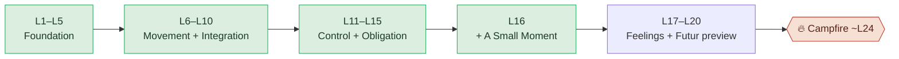
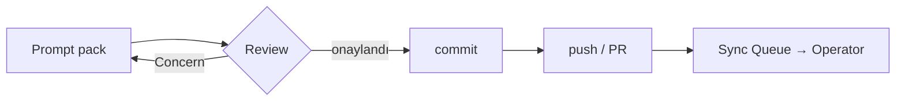

# Le Mot — Obsidian Customization / Visual Note System (v0)

> **This is a design draft living in the repo (`docs/obsidian/`).** It proposes how the Le Mot Obsidian vault *could* look and behave. It creates **no** actual Templater templates, CSS snippets, canvases, or vault notes — those are later, separately-approved steps. Nothing here changes app code, runtime, flags, schema, or any existing note.

> **What this is not:** a generic PKM/Templater pack. It is a Le Mot-specific visual language built on the product's own metaphors — the mountain trail, the Campfire at ~L24, the summit — and the app's own palette (brick `#C0392B`, green `#27AE60`, amber `#E67E22`, purple `#7C3AED`; Newsreader serif + Outfit sans).

---

## 1. Customization philosophy

The vault should feel the way the app feels: **premium, calm, human, and on a journey up a mountain.** Reading a note should lower the heart rate, not raise it.

Targets:
- **Premium** — restraint, whitespace, good type. Looks considered, not themed.
- **Calm** — muted palette, no flashing accents, no badges shouting for attention.
- **Human** — warm headings, plain language, a product story you can feel.
- **Mountain / journey** — trail, campfire, summit, fog, river, stone as the working vocabulary.
- **Not gamified** — zero XP/streak/reward visual language. (This is product identity, not taste.)
- **Not corporate-boring** — no grey enterprise-wiki feel either. It should feel *crafted*.
- **Vibecoder-friendly + safe for Claude/Codex** — status is visible at a glance, and an agent can never *miss* whether a note is active or legacy.

**The one rule that governs all of this:**
> Customization exists to make the vault **easier to use and harder to misread** — never decoration for its own sake. If a visual choice makes status *less* obvious, it's wrong, however pretty.

---

## 2. Visual identity direction

A **muted mountain palette**: warm parchment in light mode, soft charcoal (not pure black) in dark mode, restrained accents that map to *meaning*, not mood. No childish saturated colors, no Duolingo green-blast, no reward gold.

### Proposed semantic color tokens

> Tokens only — **not final CSS.** Each maps a vault meaning to a calm, on-brand hue (anchored loosely to the app palette so the vault feels like the same brand). Final hex values get tuned in the CSS phase.

| Token | Meaning | Mood / hue direction | Loose anchor |
|---|---|---|---|
| `--lm-summit` | Active canon — the settled, high ground | deep evergreen, confident, cool | app green `#27AE60`, desaturated |
| `--lm-trail` | Working draft / in-progress | warm ochre/amber, moving | app amber `#E67E22`, softened |
| `--lm-campfire` | Review / paywall / gather-round moments | ember orange-red, warm glow | between amber and brick |
| `--lm-fog` | Uncertainty / open question | soft blue-grey, low contrast | neutral slate |
| `--lm-archive` | Superseded / historical | faded sepia-slate, dimmed | warm grey, low saturation |
| `--lm-danger` | Do-not-use / forbidden | muted brick, serious not alarming | app brick `#C0392B`, muted |
| `--lm-river` | Runtime-vs-canon alignment | slate teal, "flowing between" | cool teal |
| `--lm-stone` | Stable foundation / structure | warm taupe-grey, quiet | neutral parchment-grey |

**Mode behavior:** parchment-cream surfaces in light mode; soft charcoal (`#1c1b1a`-ish, never `#000`) in dark mode. Accents desaturate ~15% in dark mode so nothing glows. Newsreader for titles/headings (the app's serif), Outfit/system sans for body.

---

## 3. Custom callout system

Ten Le Mot callouts. Each is a small, recognizable banner so a reader (or agent) knows the *kind* of content before reading a word. Keep the set small — ten is the ceiling, not a starting point.

> Obsidian syntax reminder: `> [!canon] Title` … custom types are defined later in a CSS snippet (Phase 5). Until then they render as default callouts, which is fine.

| Callout | Purpose | When to use | Icon | Color mood |
|---|---|---|---|---|
| `[!canon]` | Mark settled, active canon | A decision that is currently authoritative | ⛰️ | `--lm-summit` evergreen |
| `[!legacy]` | Mark superseded/old thinking | Old syllabus, L14 paywall, dead decisions | 🍂 | `--lm-archive` sepia |
| `[!next]` | The next step on the trail | The single next action + owner | 👣 | `--lm-trail` ochre |
| `[!danger]` | Hard do-not-touch boundary | Forbidden revivals, runtime edits, scope blowouts | ⛔ | `--lm-danger` brick |
| `[!gate]` | Open question needing a decision | Unresolved gates (futur proche ownership, etc.) | 🚪 | `--lm-fog` blue-grey |
| `[!ai]` | AI generation boundary | What AI may/may not generate for this lesson/feature | 🤖 | `--lm-river` teal |
| `[!runtime]` | Runtime ↔ canon gap | Where shipped code differs from current canon | 🌊 | `--lm-river` teal |
| `[!campfire]` | Campfire / paywall context | The ~L24 soft paywall and free/paid boundary | 🔥 | `--lm-campfire` ember |
| `[!map]` | Visual map / diagram | Mermaid maps, trail diagrams | 🗺️ | `--lm-stone` taupe |
| `[!human]` | Human note / vibe check | Product feeling, "does this still feel like Le Mot?" | 🌿 | warm neutral |

### Examples

```md
> [!canon] Campfire is the paywall
> Soft paywall lands at **Campfire ~L24**. L1–L20 are free.

> [!legacy] 24-lesson syllabus is retired
> The old 24-lesson / L14-paywall model is superseded. Do not treat as active
> unless explicitly reactivated. → see [[Notes Archive Index]].

> [!danger] Don't open the subjunctive from `il faut`
> L15 owns `il faut + inf.` only. `il faut que + subjonctif` is deferred.

> [!ai] L16 generation scope
> A Small Moment reading stays **present-tense only**. No past-tense leak,
> even if the French is valid. Active/supported/recognition scope only.

> [!gate] Futur proche ownership point — OPEN
> Recommended: owned at/after Campfire (~L24+), not in L10–L20. Confirm L18 stays preview-only.
```

---

## 4. Dashboard card system

The Home dashboard should feel like a **cockpit / trailhead board**: glanceable cards, status-first, nothing you have to scroll to understand. Each "card" is a callout block, so it works today without CSS and gets the card surface later (Phase 5).

Card set: **Current Trail · Active Canon · Next Action · Open Gates · Danger Zones · Syllabus Progress · Agent Instructions · Visual Maps.**

### Example cards (work now, no CSS required)

```md
> [!next] Current trail — where we are
> **L1–L15 committed.** Next: **L16 Integration + A Small Moment seed** (gate review first).
> Campfire ~L24 · whole band is free.

> [!canon] Active canon — the high ground
> Premium French production engine · Weave / Say It Your Way / Natural Reveal ·
> no streak/XP · AI varies, never authors. Source of truth: `docs/` + `docs/syllabus/`.

> [!danger] Danger zones — do not cross
> No 24-lesson revival · no L14 paywall · no AI outside scope ·
> A Small Moment ≠ chat · no runtime edits from the vault.
```

> A dashboard card **points** to the canonical note; it never restates the canon in full. If a card starts growing paragraphs, it's becoming a fourth canon — trim it.

---

## 5. Humanized note sections

Robotic spec headings make a calm vault feel like a compliance manual. Warm the headings; keep them just as clear. Recommended heading vocabulary:

| Robotic | Le Mot heading |
|---|---|
| Executive Summary | **Where we are** |
| Rationale / Background | **Why this matters** |
| Current State / Spec | **Current canon** |
| Constraints / Prohibitions | **What not to do** |
| Risk Review | **What can go wrong** |
| Impact Analysis | **What this changes** |
| Out of Scope | **What stays untouched** |
| Next Action | **Next step on the trail** |
| References / See Also | **Links / trail markers** |
| Notes / Misc | **Smoke signals** |
| Review / Decision Log | **Campfire notes** |

These read like a person wrote them, and they reinforce the mountain metaphor without becoming cute. (A lesson note can additionally use **"What you can do now"** for the can-do outcome.)

---

## 6. Template personalities

Each note *type* has a personality — a default shape and tone. Not a rigid form; a starting stance.

**A) Home dashboard** — *the cockpit.* Short, visual, status-first. Cards over prose. You should never scroll it to know where things stand.

**B) Active canon note** — *calm authority.* States the decision and its boundaries, then stops. Leads with `[!canon]`, includes `[!danger]` boundaries. Not long — if it sprawls, it's two notes.

**C) Feature note** — *promise first.* Opens with the **product promise and the user experience**, *then* implementation. "What it feels like to use" before "how it's built."

**D) Lesson note** — *can-do, not a copy of the spec.* Leads with **"What you can do now"**, then the **owned / deferred** boundary. **Links to** the repo spec; does not duplicate it. Carries an `[!ai]` scope line.

**E) Workflow note** — *operator-friendly.* A strict **NO list** up top, then a **copyable prompt block**. Built to be pasted and run, with `[!danger]` boundaries explicit.

**F) Archive note** — *clearly dead.* A loud superseded banner at the very top (`[!legacy]`), a one-line disposition (what replaced it), then the historical content untouched below. Pretty but unmistakably archive.

**G) Session log** — *a human work journal.* Decisions + a **vibe check** ("did this still feel like Le Mot?"). Warm, dated, personal. Ends with `[!human]`.

---

## 7. Templater customization ideas

> **No templates created here** — these are proposals. Keep the JS trivial; complexity is how Templater packs rot.

A "New Le Mot note" template could:
- **Prompt for note type** (dashboard / canon / feature / lesson / workflow / archive / session) and **status** (active / draft / superseded).
- **Auto-date** and stamp `last_reviewed`.
- **Auto-insert the matching callout banner** for the chosen type (canon→`[!canon]`, archive→`[!legacy]`, etc.).
- **Auto-link the Home dashboard** as a trail marker.
- **Auto-add a "Do not treat this as canon" banner** when type = archive.
- **Auto-add a "Claude/Codex read this first" block** when type = workflow.
- **Auto-insert a small "Next step on the trail"** stub.
- **Auto-insert a `related_repo_paths` field** so the note points at real `docs/` sources.

### Simple example snippets (illustrative — not installed)

```md
---
type: <% tp.system.suggester(["canon","feature","lesson","workflow","archive","session"], ["canon","feature","lesson","workflow","archive","session"]) %>
status: <% tp.system.suggester(["active","draft","superseded"], ["active","draft","superseded"]) %>
created: <% tp.date.now("YYYY-MM-DD") %>
last_reviewed: <% tp.date.now("YYYY-MM-DD") %>
related_repo_paths:
  - docs/
---

> [!human] Vibe check
> Does this still feel like Le Mot — calm, premium, on the trail?

## Next step on the trail
- [ ] <% tp.file.cursor() %>

🧭 [[Home - Le Mot]]
```

A conditional banner (kept deliberately small):

```md
<%* if (tp.frontmatter.status === "superseded") { %>
> [!legacy] This note is archive — do not treat as current canon.
<%* } %>
```

---

## 8. CSS snippet ideas

> **No CSS files created here.** Ideas + one illustrative snippet, **marked draft / not installed.**

Proposed snippets (each small, each toggleable in Appearance → CSS snippets):
- **Custom callout colors** — bind the ten callouts to the §2 tokens.
- **Dashboard cards** — soft surfaces, gentle shadow, rounded corners for dashboard callouts only.
- **Compact metadata block** — shrink/soften the frontmatter properties view so it isn't louder than the content.
- **Active vs legacy banner** — a left accent bar: evergreen for `[!canon]`, sepia + slight desaturation for `[!legacy]`.
- **Visual-map note style** — center Mermaid, give it breathing room.
- **Narrow readable line width** — cap long notes (~70–75ch) for calm reading.
- **Soft card surfaces** for dashboard sections.

### Illustrative snippet (DRAFT — do not install yet)

```css
/* lemot-callouts.css — DRAFT, not installed. Phase 5 only. */
.callout[data-callout="canon"]   { --callout-color: 39,174,96;  } /* summit  */
.callout[data-callout="legacy"]  { --callout-color: 150,135,120; opacity:.92; } /* archive */
.callout[data-callout="danger"]  { --callout-color: 192,57,43;  } /* brick   */
.callout[data-callout="campfire"]{ --callout-color: 214,110,60; } /* ember   */

/* calm reading width for long notes */
.markdown-preview-view.is-readable-line-width .markdown-preview-sizer { max-width: 72ch; }
```

---

## 9. Mermaid / visual style

Recommended maps to live in a `Visual Maps - Le Mot` note (Phase later): **syllabus trail L1–L24 · product canon dependency · active vs legacy flow · AI guardrail map · workflow prompt→review→commit→push.** Keep diagrams calm: few nodes, brand colors, soft fills.

### Example A — syllabus trail toward Campfire



### Example B — workflow (prompt → review → commit → push)



---

## 10. Safety rules for customization

- **Visual polish must never hide source-of-truth status.** Status banners win over aesthetics, always.
- **A pretty archive note is still an archive note** — the `[!legacy]` banner stays loud.
- **No dashboard or vault note duplicates repo docs deeply.** Link to `docs/`; don't restate it.
- **Use links, not copies, for canon.** A copy is a future contradiction.
- **Agents must read the status banner first** — the customization makes that banner impossible to miss; it does not replace it.
- **No runtime/code change ever comes from Obsidian customization.** Templates and CSS touch the vault only.
- **Templater must reduce drift, not add clutter.** If a template tempts someone to spawn ten half-empty notes, it's too eager — simplify it.

---

## 11. Implementation phases

> Each phase ends at a review checkpoint. Vault writes start at Phase 2; nothing irreversible until much later.

| Phase | What changes | What must NOT change | Checkpoint |
|---|---|---|---|
| **1 — Approve this draft** | Nothing (this doc only) | Any vault/code file | Operator agrees on palette, callouts, personalities |
| **2 — Home dashboard in vault** | Create `01 Projeler/LeMot/Home - Le Mot.md` from the approved dashboard draft | Existing notes, repo `docs/` | Dashboard tells the truth in 2 min |
| **3 — Callout conventions (manual)** | Start using the ten callouts in active notes by hand | No bulk rewrites; banners are additive | Callouts read clearly, render fine |
| **4 — Templater templates** | Add the "New Le Mot note" template(s) | Existing note content; runtime | New notes get correct banner + links; no clutter |
| **5 — CSS snippets** | Add callout/card/line-width snippets | Note *content*; vault structure | Looks calm in light + dark; status still obvious |
| **6 — Legacy banners** | Add `[!legacy]` banners to contaminated notes (`LeMot.md`, `User Journey`) + `CLAUDE.md` Current State (separate repo step) | The decisions themselves (banner only) | Every legacy section is unmistakably marked |
| **7 — File moves (later)** | The note-tree moves from the redesign plan | Everything until explicitly approved | Link audit clean; the one irreversible-feeling step |

---

## 12. Recommended next step

**Do Phase 2 first: create the actual Home dashboard in the vault** — *before* templates, CSS, or banners.

Why this and not the others:
- The dashboard draft is **already written and approved** (`docs/obsidian/Home - Le Mot.dashboard-draft.md`). Standing it up in the vault is the **highest-value, lowest-risk** move — it gives the operator and agents a true landing page immediately.
- **Templates first would be premature** — you template the *shape of notes you've validated*, and the dashboard is the first note to validate.
- **CSS first is the classic trap** — polishing pixels before there's a page worth polishing. The callouts render fine as defaults; CSS can wait.
- **Banners and moves are later** by design (more risk, less immediate payoff).

So: **Phase 2 (Home dashboard in vault) → then Phase 3 (callouts by hand on the dashboard + a couple of canon notes) → then templates/CSS once the conventions have proven themselves.** Resist doing all of customization at once; let the dashboard earn the rest.

---

## Output Report

**Files created / changed**
- Created: `docs/obsidian/lemot-obsidian-customization-v0.md` (this file). Nothing else created, moved, renamed, rewritten, or deleted.

**Customization philosophy summary** — Premium, calm, human, mountain-journey vault that mirrors the app's feel; customization exists to make notes **easier to use and harder to misread**, never decoration for its own sake; explicitly non-gamified and safe for Claude/Codex (status always visible).

**Callout system summary** — Ten Le Mot callouts (`canon`, `legacy`, `next`, `danger`, `gate`, `ai`, `runtime`, `campfire`, `map`, `human`), each with purpose, when-to-use, icon, and a semantic color mood; render as defaults today, get bound to tokens in the CSS phase.

**Dashboard / card ideas** — Cockpit/trailhead board with eight glanceable cards (Current Trail, Active Canon, Next Action, Open Gates, Danger Zones, Syllabus Progress, Agent Instructions, Visual Maps); cards are callout blocks that **point** to canon, never restate it. Three worked examples included.

**Templater customization ideas** — A single "New Le Mot note" template that prompts for type + status, auto-dates, auto-inserts the matching banner, auto-links Home, conditionally adds the archive / agent-read-first blocks, and stamps `related_repo_paths`; two trivial illustrative snippets (no JS complexity), nothing installed.

**CSS / visualization ideas** — Seven small toggleable snippet ideas (callout colors, dashboard cards, compact metadata, active/legacy accent bar, map style, narrow line width, soft surfaces) + one illustrative draft snippet marked not-installed; calm Mermaid style with two examples (syllabus trail to Campfire; prompt→review→commit→push).

**Confirmations**
- ✅ No actual vault files modified — no Obsidian templates, CSS snippets, canvases, or notes; nothing under `01 Projeler/LeMot/**` or `Le Mot .md/**`; `LeMot.md` and `Notes Archive Index.md` untouched.
- ✅ No runtime/code files touched — nothing under `lemot-app/**`, `app/**`, `components/**`, `content/**`, `data/**`; no `package.json`/lockfile, validators, feature flags, schema/storage/backend, `itemRegistry.ts`, `.gitignore`, or `graphify-out/`. The only write was this one draft file in `docs/obsidian/`.

**Suggested commit message (do NOT commit — for the operator)**
```txt
docs(obsidian): add Le Mot Obsidian customization design pack v0

Le Mot-specific vault visual system: mountain/trail/campfire palette
tokens, ten custom callouts, dashboard card system, humanized heading
vocabulary, per-type template personalities, Templater + CSS snippet
ideas (none installed), Mermaid style, safety rules, and a phased
rollout. Design draft only — no vault/template/CSS files, no
runtime/code touched.
```
