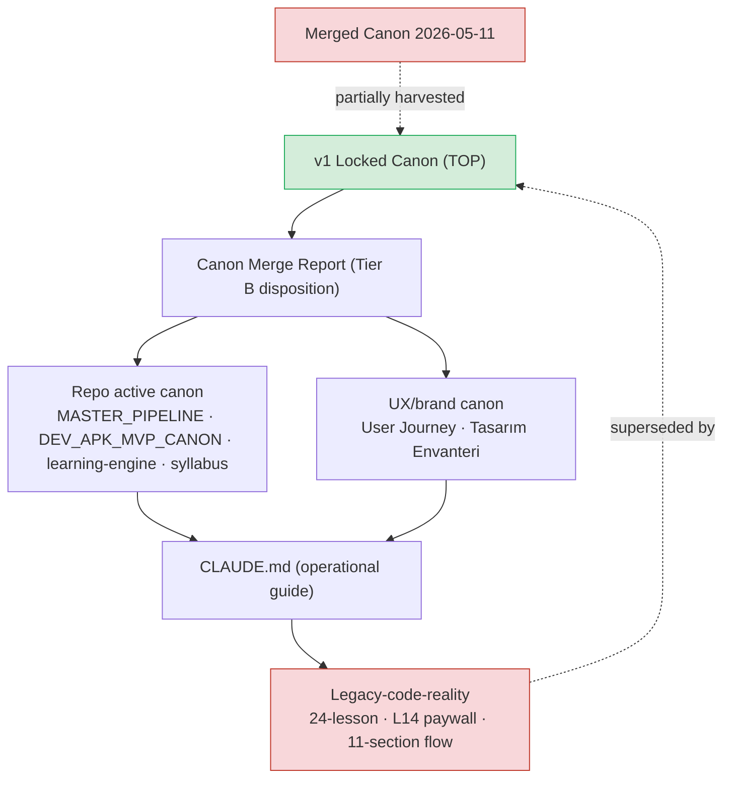
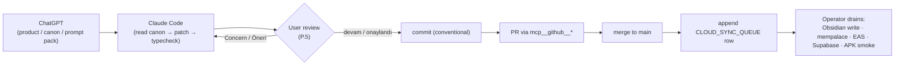
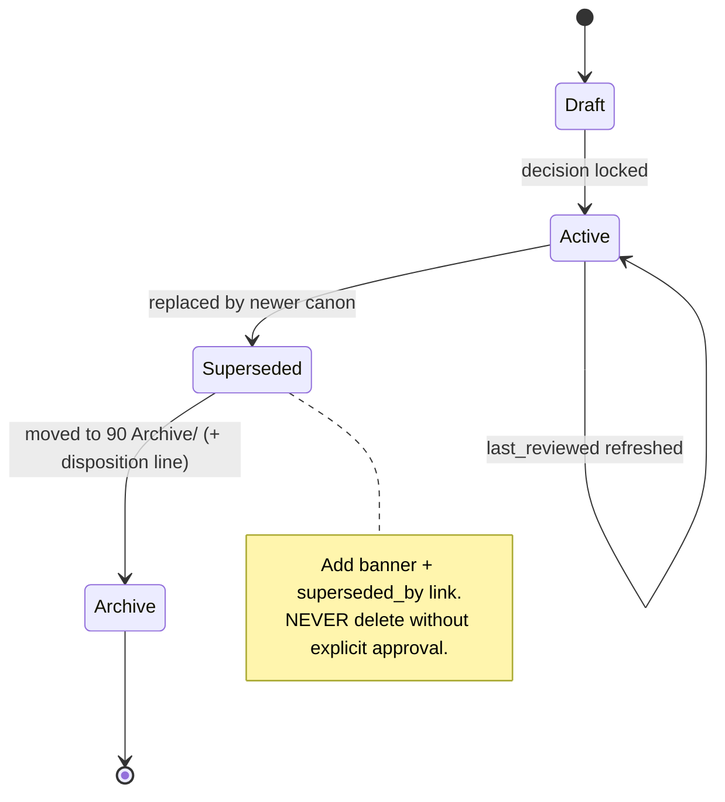

# Obsidian Note-Tree Audit + Redesign Plan (v0)

> **Status**: planning / audit only. Authorizes **no** file moves, renames, rewrites, deletions, or code/runtime changes. The only file created by this pass is this document. Nothing was moved, renamed, or deleted; no app/runtime/schema/flag/validator/lockfile/`graphify-out/` file was touched.
>
> **Scope**: the Le Mot documentation *as a knowledge tree* — the Obsidian vault note folder, the repo `docs/` tree, and the operator-vault `Le Mot .md/` folders, and how they relate. This is a map and a proposal, not an execution.
>
> **Audience**: the human operator (Jamo) and the AI agents (Claude/Codex) that read these notes to decide what to build.

---

## 0. What I read (provenance)

**Obsidian vault — `~/Desktop/ObsidianVault/01 Projeler/LeMot/`**
- `LeMot.md` (1504 lines) · `LeMot - User Journey.md` (1684 lines) · `Canon Merge Report 2026-05-16.md` · `Notes Archive Index.md` · `Sprint 12 Plan 2026-05-16.md` · `Tasarım Envanteri.md` · `L1-L5 Proofreading.md` · `Dev APK Smoke Test 08.05.2026.md` · `Test Checklist.md`

**Repo — `~/Desktop/lemot/docs/` + root**
- `CLAUDE.md` · `docs/MASTER_PIPELINE_v1.2.1.md` · `docs/DEV_APK_MVP_CANON.md` · `docs/CLOUD_SYNC_QUEUE.md` · `docs/learning-engine-v1.md` · `docs/workstreams/README.md` · `docs/syllabus/*` (template v1.1, archetypes v1, canonical-ID v0.1, ai-generation-contract v1, L10–L20 band map, L01–L05 retrospective, L01–L15 specs + gate reviews)

**Not directly readable but referenced everywhere** — the operator-vault `~/Desktop/Le Mot .md/` folders, including the file the whole system calls **TOP CANON**: `Le_Mot_Locked_Canon_and_Claude_Prompts_v1.md` (the "v1 Locked Canon").

---

## 1. Executive Summary

### What is wrong with the current note tree

Le Mot does not have *a* note tree. It has **three disconnected documentation homes with no shared map and one major unresolved contradiction running through all of them.**

1. **Three homes, no index that spans them.**
   - **Repo `docs/`** — clean, shallow, cloud-canonical, genuinely good. The syllabus and learning-engine layer here is the healthiest documentation Le Mot has.
   - **Obsidian vault `01 Projeler/LeMot/`** — the messy one. Nine notes, two of them enormous (`LeMot.md` 108 KB, `User Journey` 86 KB), mixing live status with dead history.
   - **Operator-vault `Le Mot .md/`** — dated prompt packs + the **highest-authority pedagogy doc (v1 Locked Canon)**, which is *not committed anywhere an agent can read it*.
   - The single most authoritative document in the entire product is the **least discoverable** one. That is backwards.

2. **`LeMot.md` is a landfill.** One 1504-line file holds: active Sprint 12 status, the dead 24-lesson syllabus, an aspirational 80-lesson A1→C1 plan, sprint history back to 2026-04-10, killer-feature brainstorms, TTS strategy, and cost analysis. An agent told to "read the project note" ingests four contradictory canons at once.

3. **Two syllabi are both presented as "current."** The repo (`MASTER_PIPELINE` §2, `L10-L20-band-map`, `learning-engine-v1`) says: **Campfire/soft paywall ~L24, Core 150, v1 spine starting "Je suis."** The root `CLAUDE.md` "Current State", `LeMot.md` § Syllabus, and `User Journey` say: **24 lessons, paywall after L14, 5-9-6-4 milestones, 11-section flow.** The contradiction *is* resolved — buried in `Notes Archive Index.md` as "legacy-code-reality" — but the resolution lives in a fourth file, and the contaminated files carry **no banner** saying so. A reader who opens `CLAUDE.md` first believes the wrong thing.

4. **Status labels exist but are not where a reader stands.** `Notes Archive Index.md` defines an excellent 8-label vocabulary (`TOP CANON`, `LEGACY-CODE-REALITY`, `SUPERSEDED`, …). But the labels live in *that* file, applied to *other* files. Open `LeMot.md` or `User Journey.md` directly and there is no in-note signal of what is live vs. dead.

5. **No "Home" / dashboard.** `Notes Archive Index.md` is the de-facto entry point, but it is a hierarchy table, not a "where are we, what's next, what's blocked" board. There is nowhere a human (or agent) can land in 30 seconds and know the current state.

### What the new structure should achieve

- **One landing page** (`Home - Le Mot.md`) that answers: what is Le Mot today, what's the current syllabus truth, what's the next action, what's blocked, what's hot.
- **A clean active/legacy boundary** — every note declares its own status in its first three lines; legacy never sits un-banner­ed next to live canon.
- **Respect the existing repo/vault/operator split** instead of collapsing it. The repo `docs/` layer is already good; the vault should **link to it, not duplicate it.**
- **Make the TOP canon discoverable** — at minimum a pointer note in the vault and an import row so an agent isn't told "the most important doc exists somewhere on the operator's Desktop."
- **Shrink `LeMot.md`** from a landfill into a thin, current project note, with its history split into an archive — *without losing the product story.*

### What should NOT be changed yet

- **No file moves or renames in this pass.** This document is a plan; Phase 3 (moves) happens only after the operator approves.
- **The repo `docs/` tree** — it is already shallow and healthy. Do not "reorganize" it to match a vault scheme. The only repo gap is the stale `CLAUDE.md` "Current State," and that is a *banner/label* fix, not a restructure.
- **The cloud/operator boundary** in `MASTER_PIPELINE` (cloud never writes the vault; Sync Queue is the bridge). The redesign must live *inside* that rule, not around it.
- **No content rewriting.** Humanizing notes (Phase 4) is additive banners + structure, not re-authoring decisions.

---

## 2. Current Inventory (classified)

> Classification uses the categories requested, mapped onto the labels already defined in `Notes Archive Index.md`.

### Obsidian vault — `01 Projeler/LeMot/`

| Note | Size | Classification | Honest note |
|---|---|---|---|
| `Notes Archive Index.md` | 14 KB | **Workflow/process** (meta-index) | The best-maintained note in the vault. Closest thing to a Home today, but it's a table, not a dashboard. Keep as the canon-hierarchy reference; promote a *dashboard* above it. |
| `Canon Merge Report 2026-05-16.md` | 29 KB | **Active canon** (Tier B disposition) | Current. Holds Q1–Q19 unresolved questions — these are *open gates* and belong surfaced on the dashboard. |
| `Sprint 12 Plan 2026-05-16.md` | 65 KB | **Working planning** (active sprint) | Live (last updated 2026-05-18). Large but legitimately active. D1–D6 locks live here. |
| `Tasarım Envanteri.md` | 29 KB | **Active canon** (design/UX inventory) | 155 screen/states with Tier B classification overlay. Current. |
| `LeMot - User Journey.md` | 86 KB | **Active canon (UX/brand) + Archive (pedagogy)** — *mixed* | Marked `[CURRENT CANON]` for UX/brand/privacy, but still contains the L14 paywall ceremony and Merged-Canon pedagogy that the repo now calls legacy. Needs an in-note "UX live / pedagogy superseded by v1 Canon" banner. |
| `LeMot.md` | 108 KB | **Working planning + Archive** — *heavily mixed* | The landfill (see §1.2). Active sprint pointer + dead 24-lesson syllabus + 80-lesson dream + sprint history since April. Top cleanup priority. |
| `L1-L5 Proofreading.md` | 49 KB | **Runtime alignment / content QA** | Content audit reference. Overlaps the repo's `L01-L05-foundation-spine-retrospective.md` — clarify which is canonical (repo retrospective is newer/cloud-canonical). |
| `Test Checklist.md` | 17 KB | **Workflow/QA** | Mirrors repo `DEV_APK_SMOKE_TEST_CHECKLIST.md` (placeholder). Decide one source of truth. |
| `Dev APK Smoke Test 08.05.2026.md` | 9 KB | **Archive/superseded** (dated tester run) | A specific 2026-05-08 tester run. Historical record; archive candidate. |

### Repo — `~/Desktop/lemot/`

| Doc | Classification | Honest note |
|---|---|---|
| `docs/MASTER_PIPELINE_v1.2.1.md` | **Workflow/process** (auto-loaded via `@`) | The operational rulebook. Healthy. Canon precedence §2 is the de-facto source of truth for "what's legacy." |
| `docs/DEV_APK_MVP_CANON.md` | **Active canon** (Dev APK scope) | Tight, current, well-scoped. |
| `docs/learning-engine-v1.md` | **Active canon** (pedagogy) | Clean. The engine spec. |
| `docs/syllabus/*` (template, archetypes, ID convention, ai-contract, band-map, retrospective, L01–L15) | **Active canon** (syllabus) | The healthiest doc set in the product. Per-lesson gate-review → compact-spec discipline is working. |
| `docs/workstreams/*` | **Working planning** | Cloud-canonical sprint specs. Good. |
| `docs/CLOUD_SYNC_QUEUE.md` | **Workflow/process** (operator worklist) | 10+ PENDING rows. This is itself an *open-gates* surface the dashboard should summarize. |
| `docs/EAS_PREVIEW_BUILD.md`, `docs/DEV_APK_SMOKE_TEST_CHECKLIST.md` | **Runtime alignment / ops** | Build + QA ops. Checklist is a placeholder. |
| `CLAUDE.md` (root) | **Operational guide — contaminated** | "Current State" still describes 24-lesson / L14 paywall / 11-section flow as live. Labelled legacy *only externally* (Notes Archive Index). **Top runtime-alignment risk.** |

### Operator-vault — `~/Desktop/Le Mot .md/`

| Item | Classification | Honest note |
|---|---|---|
| `Le_Mot_Locked_Canon_and_Claude_Prompts_v1.md` (v1 Locked Canon) | **TOP CANON — needs human review for partial import** | Highest authority, **uncommitted, unreadable by cloud agents.** The system's biggest discoverability bug. |
| `LeMot_Product_Canon_Merged_2026-05-11.md` | **Archive/superseded** (partially harvested) | Explicitly "do not read for active decisions." |
| April/May dated folders (prompt packs, design changes, resolution notes) | **Archive / reference / prompt-log** | Indexed already in `Notes Archive Index.md`. Leave in place. |

### Unknown / needs human review
- **`L1-L5 Proofreading.md` vs `docs/syllabus/L01-L05-foundation-spine-retrospective.md`** — which is canonical for L1–L5 content QA? (Recommend: repo retrospective; vault note → reference.)
- **`Test Checklist.md` vs `docs/DEV_APK_SMOKE_TEST_CHECKLIST.md`** — one is a 17 KB real checklist, one is a repo placeholder. Which wins? (Recommend: import vault → repo, then vault → archive.)
- **Where the v1 Locked Canon should be imported** (full commit vs. a committed summary + pointer). Human decision.

---

## 3. Proposed Note Tree

### Critical stance first: the requested 9-group scheme is over-engineered for this vault

The vault note folder currently holds **nine files**. Standing up nine numbered folders (`00`–`90`) for nine notes is structure for its own sake, and two of those groups (`20_LEARNING_ENGINE`, `30_SYLLABUS`) would **duplicate the repo `docs/` layer that is already the cloud-canonical home for that content.** Duplicating syllabus/engine canon into the vault is how the *next* contradiction gets born.

So the plan splits the nine logical groups across the **two physical homes that already exist**, and recommends a **lean 5-folder vault tree**, not nine.

### 3a. Who owns what (the nine logical groups, mapped to real homes)

| Logical group | Lives in | Why |
|---|---|---|
| `00_START_HERE` | **Vault** (new `Home - Le Mot.md`) | The human lands in Obsidian; the dashboard belongs there. |
| `10_PRODUCT_CANON` | **Vault** + pointer to operator-vault v1 Canon | UX/brand/journey/design + identity. |
| `20_LEARNING_ENGINE` | **Repo `docs/`** (already there) | `learning-engine-v1.md`. Vault **links**, does not copy. |
| `30_SYLLABUS` | **Repo `docs/syllabus/`** (already there) | The healthy lesson-spec layer. Vault **links**, does not copy. |
| `40_FEATURES` | **Vault** (only if a feature note actually exists) | Don't create empty folders. Fold into `10` until earned. |
| `50_RUNTIME_ALIGNMENT` | **Repo `docs/`** (build/smoke) + vault `CLAUDE-drift` note | The "repo says X, code does Y" gaps. |
| `60_WORKFLOWS` | **Repo `docs/`** (`MASTER_PIPELINE`, workstreams, Sync Queue) | Already cloud-canonical. Vault **links**. |
| `70_VISUAL_MAPS` | **Vault** (Mermaid notes) | Obsidian renders Mermaid; this is where diagrams belong. |
| `90_ARCHIVE` | **Vault** (`90 Archive/`) | Superseded notes + `LeMot.md` history split. |

### 3b. Recommended physical vault tree (lean — primary recommendation)

```txt
01 Projeler/LeMot/
├── Home - Le Mot.md            ← NEW dashboard (00_START_HERE)
├── _Index - Notes & Canon.md   ← Notes Archive Index, optionally renamed (link hub)
├── 10 Canon/
│   ├── Product Canon (v1 pointer).md   ← NEW: summary + link to operator-vault TOP canon
│   ├── User Journey (UX live).md       ← current User Journey.md (UX canon)
│   ├── Tasarım Envanteri.md            ← design/state inventory
│   └── Canon Merge Report 2026-05-16.md ← Tier B disposition + open Q1–Q19
├── 20 Sprints/
│   └── Sprint 12 Plan.md               ← active sprint
├── 30 QA & Content/
│   ├── L1-L5 Proofreading.md           ← marked "reference; repo retrospective canonical"
│   └── Test Checklist.md               ← marked "mirror of repo checklist"
├── 70 Visual Maps/
│   └── Le Mot - Maps.md                ← NEW: the Mermaid diagrams from §7
└── 90 Archive/
    ├── LeMot (full history pre-Sprint12).md   ← the split-out sprint log
    ├── Dev APK Smoke Test 08.05.2026.md
    └── _Archive disposition.md                ← one-line "why archived + replacement" per note
```

> Five working folders (`10`, `20`, `30`, `70`, `90`) + two top-level entry notes. That is the *most* structure nine notes can justify. If the note count later passes ~30, promote `40 Features` and split `10 Canon` — not before.

### 3c. The repo side stays as-is (already healthy)

```txt
~/Desktop/lemot/
├── CLAUDE.md                       ← fix: add "legacy state" banner to § Current State
└── docs/
    ├── MASTER_PIPELINE_v1.2.1.md   ← 60_WORKFLOWS (canonical)
    ├── DEV_APK_MVP_CANON.md        ← 10/50 active
    ├── learning-engine-v1.md       ← 20_LEARNING_ENGINE (canonical)
    ├── CLOUD_SYNC_QUEUE.md         ← 60_WORKFLOWS (operator worklist)
    ├── EAS_PREVIEW_BUILD.md        ← 50_RUNTIME_ALIGNMENT
    ├── DEV_APK_SMOKE_TEST_CHECKLIST.md
    ├── syllabus/                   ← 30_SYLLABUS (canonical)
    ├── workstreams/                ← working planning
    └── obsidian/                   ← this plan + any future doc-architecture notes
```

**Do not restructure the repo `docs/` tree.** The only repo action this plan recommends is a *banner* on `CLAUDE.md`'s stale "Current State" — and even that is a separate, explicitly-approved step.

---

## 4. Human-Friendly Note Template

### 4a. Standard note (canon / feature / engine notes)

```md
---
status: active            # active | draft | superseded | archive
type: canon               # canon | decision | workflow | lesson | feature | runtime-gap | visual-map
owner: mixed              # human | claude | codex | mixed
last_reviewed: 2026-05-25
related_files:
  - "[[Home - Le Mot]]"
---

> **[ACTIVE CANON]** — short one-liner on what this note is the source of truth for.
> Superseded by: —    |    Replaces: —

## Why this matters
[1–3 sentences. The product reason this note exists. Plain language, not spec-speak.]

## Current canon
[What is true *now*. The decisions an agent must honor.]

## What NOT to do
[The traps. Forbidden revivals (XP/streak), legacy assumptions, scope smuggling.]

## How this affects the app
[Concrete: which screens, flags, files, or lessons this touches.]

## Open questions
[Unresolved gates. Link to the dashboard's open-gates list.]

## Next action
[The single next concrete step, and who owns it (human/claude/codex/operator).]

## Related notes
[[…]] · [[…]]
```

### 4b. Quick decision note (short form)

```md
---
status: active
type: decision
owner: human
last_reviewed: 2026-05-25
---

> **[DECISION · LOCKED 2026-05-25]**

**Decision:** [one sentence]
**Why:** [one sentence]
**Affects:** [files / screens / lessons]
**Supersedes:** [link or —]
**Next:** [action + owner]
```

> Keep both templates short. If a note needs more than the standard template's seven headings, it is probably two notes.

---

## 5. Vibecoder-Friendly Layer (writing notes Claude/Codex can use safely)

The goal: an agent should be able to act on a note **without re-deriving the whole product**, and should never mistake a draft for canon. Concretely:

1. **Status in the first three lines.** Frontmatter `status:` + a `> **[LABEL]**` blockquote banner. An agent reading the top of the file knows instantly whether to trust it. This is the single highest-value change — it's what `LeMot.md` and `User Journey.md` lack today.
2. **Active vs. legacy, explicitly, in-note.** Don't rely on an external index. If a section is dead, prefix it: `> 🔄 **[SUPERSEDED → v1 Canon §5]** the 24-lesson syllabus below is legacy-code-reality, not pedagogy canon.`
3. **"Do not touch" boundaries.** A `## What NOT to do` block on every canon note. Mirror the `MASTER_PIPELINE` forbidden list (no XP/streak revival, no paywall-gate changes, no Merged-Canon-2026-05-11 as active).
4. **Current decision vs. old idea.** Locked decisions get `[LOCKED <date>]`; brainstorm/aspirational content gets `[DRAFT]` or `[PARKING LOT]` and lives in a clearly-marked section or `90 Archive/`.
5. **Next prompt / next action.** Every active note ends with one concrete `## Next action` + owner. This is what lets an agent (or the human) resume without a meeting.
6. **Source links + file/path references.** Use repo-relative paths (`docs/...`, `lemot-app/...`) so cloud agents can actually open them. Mark operator-vault paths explicitly: `operator-vault (Sync Queue if changed)` — exactly as `workstreams/README.md` already requires.
7. **Status tags consistent across notes** (see §6) so dashboards and Obsidian queries can roll them up.

> **The cloud rule still binds:** notes in the vault are operator-side. A cloud agent must not be told to *write* them — it queues a Sync Queue row instead. The vibecoder layer makes vault notes *safe to read*, not writable by cloud.

---

## 6. Status / Tag System (minimal — resist over-engineering)

Reuse the vocabulary `Notes Archive Index.md` already defines; don't invent a parallel one. Frontmatter, kept small:

```yaml
status: active | draft | superseded | archive
type:   canon | decision | workflow | lesson | feature | runtime-gap | visual-map
owner:  human | claude | codex | mixed
last_reviewed: YYYY-MM-DD
# optional, only when they exist — don't force them:
supersedes:    "[[old note]]"
superseded_by: "[[new note]]"
related_files: [ ... ]
```

**Deliberately dropped from the default:** `risk: low|medium|high`. Risk is real for *decisions*, but tagging every note with a risk level is the kind of ceremony that decays into noise. Add `risk:` only on the handful of decision notes where it changes behavior (e.g. schema migration, paywall). Don't make it mandatory.

**In-note banner labels** (the blockquote line, human-facing) map 1:1 to the index's existing set:
`[TOP CANON]` · `[CURRENT CANON]` · `[OPERATIONAL GUIDE]` · `[LEGACY-CODE-REALITY]` · `[REFERENCE]` · `[SUPERSEDED]` · `[PROMPT LOG]` · `[DRAFT/PARKING LOT]`.

That's it. One frontmatter block (4 required keys), one banner line, the existing label set. Anything more is over-build.

---

## 7. Visualizations (Obsidian-friendly Mermaid)

Put these in `70 Visual Maps/Le Mot - Maps.md`. Five proposed; all render natively in Obsidian.

### 7.1 Documentation topology — the three homes (most important)

```mermaid
flowchart LR
  subgraph OV["Operator-vault ~/Desktop/Le Mot .md/ (operator-only)"]
    TOP["v1 Locked Canon\n[TOP CANON] — uncommitted!"]
    MERGED["Merged Canon 2026-05-11\n[SUPERSEDED]"]
  end
  subgraph VAULT["Obsidian vault 01 Projeler/LeMot (operator-only, read in local sessions)"]
    HOME["Home - Le Mot\n[dashboard]"]
    UX["User Journey\n[CURRENT CANON: UX]"]
    DES["Tasarım Envanteri\n[CURRENT CANON: design]"]
    MERGE["Canon Merge Report\n[CURRENT: disposition]"]
  end
  subgraph REPO["Repo docs/ (cloud-canonical, agent-readable)"]
    MP["MASTER_PIPELINE_v1.2.1\n[WORKFLOW]"]
    ENG["learning-engine-v1\n[CANON]"]
    SYL["syllabus/*\n[CANON]"]
    DEV["DEV_APK_MVP_CANON\n[CANON]"]
    SQ["CLOUD_SYNC_QUEUE\n[operator worklist]"]
  end
  TOP -.partial import needed.-> REPO
  HOME --> UX & DES & MERGE
  HOME --> MP & DEV
  REPO ==Sync Queue rows==> SQ
  SQ ==operator drains==> VAULT
  MERGED -. do not read for active .-> TOP
```

### 7.2 Canon precedence (dependency / authority graph)



### 7.3 Syllabus L1–L20 band map (v1 spine + Campfire)

```mermaid
flowchart LR
  L1["L1 Je suis\n(Survival)"] --> L2["L2 Être"] --> L3["L3 Negation/Q"] --> L4["L4 Avoir"] --> L5["L5 Articles"]
  L5 --> L6["L6 Integration"] --> L7["L7 Aller"] --> L8["L8 Où"] --> L9["L9 Faire"] --> L10["L10 After-class"]
  L10 --> L11["L11 Pouvoir"] --> L12["L12 Est-ce que"] --> L13["L13 Can-do"] --> L14["L14 Y-light"] --> L15["L15 Devoir/Falloir"]
  L15 --> L16["L16–L20\n(band map v0)"]
  L16 --> CAMP{{"Campfire ~L24\nsoft paywall"}}
  classDef done fill:#d4edda,stroke:#27AE60;
  classDef plan fill:#fff3cd,stroke:#E67E22;
  class L1,L2,L3,L4,L5,L6,L7,L8,L9,L10,L11,L12,L13,L14,L15 done;
  class L16 plan;
```



### 7.4 Workflow: ChatGPT → Claude → review → commit → push → Operator



### 7.5 Active-canon vs. archive lifecycle



> **Optional 6th** — *AI generation guardrail map* (from `ai-generation-contract-v1.md`: spine → lesson spec → AI may vary, never author curriculum). Worth adding once the AI-generation work is active; skip for now to avoid an empty diagram.

---

## 8. Active Canon Dashboard — `Home - Le Mot.md`

Proposed layout (the note a human/agent lands on first):

```md
---
status: active
type: workflow
owner: mixed
last_reviewed: 2026-05-25
---

> **[HOME · Le Mot]** — start here. If a note disagrees with this dashboard, the dashboard points you to the authoritative source; it is not itself the canon.

## 🧭 Product identity
French for English speakers. Premium, calm, no gamification.
Killer trinity: **Weave · Say It Your Way · Natural Reveal.**
Forbidden forever: XP · streak · level-up · reward theatre.

## 📚 Syllabus truth (read this before any lesson work)
- **ACTIVE (v1):** Core 150, spine starts **L1 "Je suis"**, soft paywall **Campfire ~L24**.
  → `docs/syllabus/` + `docs/learning-engine-v1.md`
- **LEGACY-CODE-REALITY (shipped Dev APK, NOT pedagogy canon):** 24 lessons · paywall after L14 · 11-section flow.
  → see [[Canon Merge Report 2026-05-16]]. Do not treat as current.
- Authored so far: **L1–L15** specs in repo. Next: **L16 Integration**.

## ▶️ Next action
[single concrete next step + owner] — e.g. "Operator: physical-device smoke of EAS preview APK 4564ccd6…"

## 🔓 Open gates
- Canon Merge Report **Q1–Q19** unresolved → [[Canon Merge Report 2026-05-16]] §6
- Sprint 12 **D1–D6** lock status → [[Sprint 12 Plan]] §15.0
- `docs/CLOUD_SYNC_QUEUE.md` — **N PENDING** operator rows

## 🔒 Active locked decisions (top 5)
- No gamification (XP/streak removed) · Campfire paywall ~L24 · Weave naming · …

## ⚠️ Risk alerts
- `CLAUDE.md` § Current State still describes legacy 24-lesson/L14 — un-bannered drift.
- v1 Locked Canon (TOP) lives only in operator-vault, uncommitted.
- `LeMot.md` mixes active + dead canon (cleanup pending).

## 🔗 Core notes
[[Canon Merge Report 2026-05-16]] · [[User Journey (UX live)]] · [[Tasarım Envanteri]] · [[Sprint 12 Plan]] · [[_Index - Notes & Canon]]
Repo: `docs/MASTER_PIPELINE_v1.2.1.md` · `docs/DEV_APK_MVP_CANON.md`
```

> The dashboard is **derived**, not authoritative — it must say so, or it becomes a fourth competing canon. It points; it does not decide.

---

## 9. Archive / Legacy Strategy

**Principle: preserve everything, contaminate nothing.**

1. **One archive folder** — `90 Archive/` in the vault. Superseded notes move here in Phase 3. Repo equivalent already exists: `CLOUD_SYNC_QUEUE.md` has an `## Archive` section, and `Notes Archive Index.md` already tracks operator-vault history.
2. **Superseded banner on the note itself** — first line:
   `> 🔄 **[SUPERSEDED 2026-05-25 → [[replacement note]]]** kept for trail only. Do not use for active decisions.`
3. **Never delete unless explicitly approved.** Default is move + banner. Deletion requires a clear operator instruction.
4. **One-line disposition at the top of every archived note** — what it was, why it died, what replaced it. Collect these in `90 Archive/_Archive disposition.md` so the archive itself has an index.
5. **Link to the replacement active note** via `superseded_by:` frontmatter + the banner link, so following the trail forward is one click.
6. **Splitting `LeMot.md` is archival, not deletion.** The current-state pointer stays in a thin `LeMot.md`; the historical sprint log (April–Sprint 11) moves to `90 Archive/LeMot (full history pre-Sprint12).md` with a banner. The product story is preserved, just not in the agent's reading path.

---

## 10. Migration Plan (phased, review-gated)

> Each phase ends at a review checkpoint. Nothing in Phase 1–2 moves or deletes anything. Moves start only at Phase 3, after explicit approval.

### Phase 1 — Audit & map only *(this document)*
- **Changes:** creates this plan. Nothing else.
- **Must not change:** any existing note, any code/runtime file.
- **Checkpoint:** operator reads, confirms inventory + tree direction.

### Phase 2 — Dashboard + indexes (additive only)
- **Changes:** create `Home - Le Mot.md`; optionally add a top-of-file pointer in `Notes Archive Index.md` linking to Home. Create the `Product Canon (v1 pointer).md` stub linking to the operator-vault TOP canon. **No existing note edited beyond an optional one-line pointer.**
- **Must not change:** `LeMot.md`, `User Journey`, repo `docs/` content, any code.
- **Checkpoint:** does the dashboard tell the truth in 30 seconds? Are the open gates accurate?

### Phase 3 — Move / archive notes (the only phase that moves files)
- **Changes:** create the 5 vault folders; move notes per §3b; move `Dev APK Smoke Test 08.05.2026.md` and the split `LeMot.md` history into `90 Archive/`; add disposition lines. Update wikilinks broken by moves.
- **Must not change:** note *content* (only location + banners); repo `docs/`; any code. **Approval required before this phase runs.**
- **Checkpoint:** link audit — zero broken `[[wikilinks]]`; every moved note has a banner.

### Phase 4 — Humanize active canon notes (additive banners + structure)
- **Changes:** add the §4 template banners/frontmatter to the active canon notes (`User Journey`, `Tasarım Envanteri`, `Canon Merge Report`, thin `LeMot.md`); split legacy sections behind `[SUPERSEDED]` markers. Add the `CLAUDE.md` "Current State = legacy" banner **as a separate repo docs-only step.**
- **Must not change:** the *decisions* themselves (no re-authoring); code/runtime.
- **Checkpoint:** can an agent open any active note and know its status from line 1?

### Phase 5 — Add visual maps
- **Changes:** create `70 Visual Maps/Le Mot - Maps.md` with the §7 diagrams.
- **Must not change:** anything else.
- **Checkpoint:** diagrams render in Obsidian; match current canon.

### Phase 6 — Optional Codex/agent consistency audit
- **Changes:** run an agent pass to verify no active note contradicts the dashboard, no legacy note is un-bannered, all repo-relative paths resolve.
- **Must not change:** code; only flag drift as follow-ups.
- **Checkpoint:** clean consistency report, or a punch-list of doc fixes.

---

## 11. Risk Review

| Risk | Likelihood | Mitigation |
|---|---|---|
| **Moving too many files at once** breaks the operator's muscle memory + Obsidian links | High if rushed | Phase 3 is isolated, approval-gated, and link-audited. Move in one reviewed batch, not piecemeal over weeks. |
| **Breaking `[[wikilinks]]`** on move | High | Use Obsidian's "update links on move" (it rewrites links automatically); still run a Phase-3 link audit. Don't move files via the OS file explorer — move them *inside* Obsidian. |
| **Archive/canon mixing** — the exact disease this plan treats | Medium | In-note banners (§5/§9) + status frontmatter, not reliance on an external index. |
| **Over-engineering the tag system** | Medium | §6 caps it at 4 required keys + existing label set; `risk:` dropped from default. |
| **Notes turning robotic** (the user's explicit fear) | Medium | The template leads with `## Why this matters` in plain language; the product story moves to a preserved history note, not deleted. Humanizing is Phase 4, additive. |
| **Losing the human product story** | Medium | `LeMot.md` history is archived, not deleted; the killer-trinity/identity narrative is promoted to the dashboard's top. |
| **Claude treating a draft as canon** | High today | `status: draft` frontmatter + `[DRAFT/PARKING LOT]` banner + the dashboard's explicit "syllabus truth" block. |
| **A new "Home" becoming a fourth competing canon** | Medium | Dashboard is explicitly *derived* and says "if in doubt, follow the linked source." |
| **Cloud agent told to write vault notes** (violates `MASTER_PIPELINE`) | Medium | Plan keeps vault writes operator-only; cloud emits Sync Queue rows. Stated in §5. |
| **v1 Locked Canon stays uncommitted** | High | Phase 2 stub + an import decision flagged for human review (§12). |

---

## 12. Recommended Next Step

**Do Phase 2 first: create `Home - Le Mot.md`.** Not the moves, not the humanizing — the dashboard.

Reasoning:
- It is **purely additive** — zero risk, nothing moves, nothing breaks.
- It delivers the **biggest single improvement** immediately: one place that tells the truth about the syllabus contradiction, the open gates, and the next action. That alone neutralizes the worst current failure mode (an agent reading `CLAUDE.md` and believing the legacy syllabus).
- It is the **anchor every later phase links back to**, so building it first makes Phases 3–5 cheaper.
- It surfaces, in writing, the two highest-value follow-ups for a human decision: **(a)** import (or commit a summary of) the v1 Locked Canon so the TOP canon is agent-readable, and **(b)** add the `[LEGACY-CODE-REALITY]` banner to `CLAUDE.md` § Current State.

**Explicitly do _not_ start file moves (Phase 3) yet.** Moves are the one irreversible-feeling step; they wait for explicit approval and should run as a single link-audited batch inside Obsidian.

Sequence after that: Phase 2 (dashboard) → operator review → Phase 4 banners on the 3–4 active notes (still no moves) → then Phase 3 moves once the active set is clearly labelled → Phase 5 maps.

---

## Output Report

**Files created / changed**
- **Created:** `docs/obsidian/obsidian-note-tree-redesign-plan-v0.md` (this file). Folder `docs/obsidian/` created implicitly by writing the file.
- **Changed:** none.
- **Moved / renamed / deleted:** none.

**Summary of proposed note tree**
- Stop pretending there's one tree — there are **three homes** (repo `docs/`, Obsidian vault, operator-vault). Keep the repo layer as-is (it's healthy); fix only the **vault**.
- **Reject the 9-folder scheme** for the vault (9 notes ≠ 9 folders, and it would duplicate the repo's syllabus/engine canon). Recommend a **lean 5-folder vault tree** (`10 Canon`, `20 Sprints`, `30 QA & Content`, `70 Visual Maps`, `90 Archive`) + `Home - Le Mot.md` + the existing index note.
- Vault **links to** the repo syllabus/engine canon; it does not copy it.

**Top 5 cleanup priorities**
1. Create `Home - Le Mot.md` dashboard (single source of "current truth").
2. Banner the syllabus contradiction everywhere it appears — especially add `[LEGACY-CODE-REALITY]` to `CLAUDE.md` § Current State (separate repo step).
3. Split `LeMot.md` (1504 lines) → thin current note + archived history.
4. Make the **v1 Locked Canon (TOP)** discoverable — pointer note now, import decision flagged for the operator.
5. Resolve the two duplicate pairs: `L1-L5 Proofreading` vs repo retrospective; `Test Checklist` vs repo smoke checklist.

**Top 5 visualization ideas**
1. Documentation topology — the three homes + Sync-Queue bridge (§7.1).
2. Canon precedence / authority graph (§7.2).
3. Syllabus L1–L20 band map with Campfire ~L24 (§7.3).
4. Workflow ChatGPT → Claude → review → commit → Operator (§7.4).
5. Active-vs-archive lifecycle state diagram (§7.5). *(Optional 6th: AI-generation guardrail map.)*

**Migration plan** — six review-gated phases (§10). Phases 1–2 additive/zero-risk; Phase 3 is the only file-moving phase and is approval-gated + link-audited; Phases 4–6 additive banners, maps, and an optional consistency audit.

**Confirmations**
- ✅ **No existing note was moved, renamed, or deleted.**
- ✅ **No runtime/code file was touched** — no app/`lemot-app/` source, no `package.json`/lockfile, no validators, schema, feature flags, content runtime, `itemRegistry`, or `graphify-out/`.
- ✅ **No commit or push performed.** Repo left on branch `main`; the only working-tree change is this new untracked file (plus pre-existing untracked `graphify-out/`).

**Suggested commit message (do NOT commit — for the operator)**
```txt
docs(obsidian): add note-tree audit + redesign plan v0

Audit of the three Le Mot documentation homes (repo docs/, Obsidian
vault, operator-vault) and a lean, review-gated redesign plan:
dashboard-first, banner-based active/legacy boundary, 5-folder vault
tree, Mermaid maps. Plan only — no notes moved/renamed/deleted, no
runtime/code touched.
```
