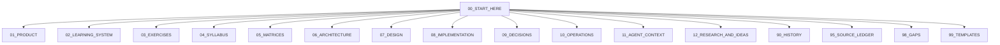

# 🪨 Le Mot Holy Codex

> [!canon] Bu vault, **Le Mot / Cairn** French-learning app'inin kalıcı kurumsal hafızasıdır.
> Yeni bir ekip üyesine, ajana veya altı ay sonraki bize "**önce bunu oku**"
> diyebileceğimiz tek giriş kapısı. Ham konuşma arşivi ile canonical bilgi burada
> **ayrı** tutulur; her iddianın bir **statüsü**, bir **kaynağı** ve bir
> **implementation karşılığı** vardır.

## Le Mot / Cairn nedir? (30 saniye)

İngilizce konuşanlar için bir **Fransızca öğrenme uygulaması** (Expo / React
Native / TypeScript). Ürün sözü:

> **"Cairn, önce kullanılabilir parçaları (chunks) öğretir, öğrencinin bunları
> gerçek niyet içinde kullanmasına izin verir, mantığı temastan *sonra* açar ve
> neyin/ne zaman/neden geri döneceğine hafıza durumuna bakarak karar verir."**
> — Cairn v1.0 spec (CANONICAL, intent layer)

Killer mekanik: **[[Weave System|Weave]]** — öğrenci sahiplendiği Fransızca
"engine"lerden bir iskelet kurar, bilmediği parçaları İngilizce bırakır
(`je voudrais but pas today`). Başka hiçbir uygulama bunu yapmıyor.

> [!warning] İki isim, tek ürün. "**Le Mot**" eski (v7) isim; ürün "**Cairn**"
> (bir patika taş yığını) olarak yeniden çerçeveleniyor. Kod tabanı hâlâ
> `lemot-app`. Bkz. [[Product Vision]] ve [[90 History Index|History]].

## Bugün gerçekte ne çalışıyor? (kısa gerçek)

> [!implemented] Sevkedilebilir yüzey = **Round 1 Dev APK**, dersler **L0–L6**,
> emülatör smoke ile KABUL EDİLDİ ve DONDURULDU (P0–P3 sıfır). Fiziksel cihaz
> smoke + EAS build hâlâ **operator-only ve bekliyor**. **L7 bloke.**
> Tam durum: [[03 Current State]].

Kod tabanında **üç paralel ders runtime'ı** aynı anda var (kritik ayrım):

| Sistem | Ne | Statü |
|---|---|---|
| **A. Legacy 24-lesson** | Eski v7 akışı (`data/lessons` → `SECS`) | HISTORICAL, dev-apk'te gizli |
| **B. Static authored v1** | `content/lessons/v1/*`, 7 ekran tipi, `LessonRendererV1` | **IMPLEMENTED — sevkedilen dev-apk yüzeyi** (Home L1–L6'ya kısıtlar) |
| **C. Learning-engine** | `content/learning-engine/*` saf motorlar | Gerçek kod, ama **sandbox/founder-gated**, public yüzeyde değil |

CLAUDE.md'nin kendi banner'ı der ki: learning-engine uzun vadeli ürün temeli,
**v1 geçici bir smoke yüzeyi, genişletme.** Detay: [[Learning System Overview]],
[[Runtime Content Architecture]].

## Codex bu soruların hepsini cevaplar

- Le Mot nedir, sözü ne? → [[Product Vision]] · [[Product Promise]]
- Öğrenme felsefesi? → [[Learning Philosophy]]
- Bir ders nasıl çalışır? → [[Lesson Anatomy]] · [[Lesson Flow]]
- Weave nedir, neden merkezî? → [[Weave System]]
- Egzersiz türleri, her biri ne öğretir/ölçer, hangi hataları üretir? → [[Exercise System Overview]] · [[Exercise Error Matrix]]
- Chip nedir? Spine/active/supported/recognition/ghost/carryover/pattern/formula/noun-package/accounting/UI farkı? → [[Chip System Overview]] · [[Chip Taxonomy]]
- Bir cümle neden chip değildir? → [[Chip Taxonomy#Bir cümle neden chip değildir]]
- L0 neden Lesson 1 değildir? → [[L0 The First Step]]
- Spine L1→L24 nasıl ilerler? → [[Syllabus Overview]] · [[Lesson Status Matrix]]
- Mastery, error tracking, Mon Lexique, Daily Review nasıl? → [[Mastery Model]] · [[Error Tracking System]] · [[Mon Lexique]] · [[Daily Review]]
- Self-producing engine nedir, gerçekten aktif mi? → [[Self-Producing Engine]]
- Veri nasıl akar (registry→lesson→renderer→scoring→storage)? → [[Data Flow]] · [[Registry Architecture]]
- Sync, privacy, deletion? → [[Sync Architecture]] · [[Privacy and Data Deletion]]
- Product stage & feature flags neyi açar/kapatır? → [[Product Stages and Feature Flags]]
- Tasarım dili, V4/Cairn yönü? → [[Design System Overview]] · [[Cairn Brand Direction]]
- Bir karar neden verildi, hangi alternatif reddedildi? → [[Decision Index]]
- Hangi fikir açık/ertelenmiş? → [[05 Open Loops]] · [[Deferred Decisions]]
- Spec/registry/runtime/test/cihaz eşleşiyor mu? → [[Spec to Runtime Matrix]] · [[08 Source of Truth Map]]
- Rolüme göre ne okumalıyım? → [[09 Role-Based Onboarding Paths]]
- "Şunun için ne demiştik?" → ilgili ana nota git; her sistemin **tek** ana evi var.

## Vault haritası

| Klasör | Ne için |
|---|---|
| [[00 Le Mot Holy Codex|00_START_HERE]] | Giriş, harita, güncel durum, açık döngüler, sözlük, statü modeli |
| **01_PRODUCT** | Vizyon, söz, felsefe, stage'ler, monetization, non-goals, riskler |
| **02_LEARNING_SYSTEM** | Chip sistemi, Weave, mastery, error tracking, Mon Lexique, self-producing engine |
| **03_EXERCISES** | Her egzersiz tipi + seçim/kanıt/hata matrisleri |
| **04_SYLLABUS** | L0–L24 spine, tasarım kuralları, ders notları |
| **05_MATRICES** | Kanıta dayalı çapraz matrisler (spec↔runtime dâhil) |
| **06_ARCHITECTURE** | Sistem, veri akışı, route, storage, sync, privacy, AI, Supabase |
| **07_DESIGN** | Görsel dil, Cairn markası, ekranlar, tipografi, erişilebilirlik |
| **08_IMPLEMENTATION** | Ne kodlandı: runtime map, PR map, ledger, teknik borç, testler |
| **09_DECISIONS** | ADR karar hafızası (aktif/ertelenmiş/reddedilmiş/superseded) |
| **10_OPERATIONS** | Geliştirme akışı, ajan işbirliği, promotion kuralları, gate'ler |
| **11_AGENT_CONTEXT** | Ajanlar için bağlam paketleri + "varsayma" listesi |
| **12_RESEARCH_AND_IDEAS** | Fikir kutusu, gelecek özellikler, deneyler |
| **90_HISTORY** | Tarihsel kanon, zaman çizelgeleri, superseded spec'ler |
| **95_SOURCE_LEDGER** | Kaynak defteri: repo doküman + kod + test envanteri |
| **98_GAPS** | Bilinmeyenler, çelişkiler, doğrulama gerektirenler |
| **99_TEMPLATES** | Not şablonları |

## Nasıl kullanılır (üç kural)

1. **Önce statüye bak.** Her iddia `canon_status` / `implementation_status` /
   `verification_status` taşır. [[06 Canon and Status Legend]].
2. **Tek ana ev.** Her sistemin bir canonical açıklaması vardır; diğer notlar
   ona **link verir**, kopyalamaz.
3. **Tarihi ezme.** Karar değişince eskisini `superseded` işaretle, silme.

> [!open-loop] Aktif açık döngüler ve bloke edilen işler: [[05 Open Loops]].
> Yeni katılan biri: [[10 New Contributor First Day]].

<!-- gh-nav -->

## 🧭 GitHub Navigation

[⬆ README](../../README.md) · [🪨 Holy Codex](../00_START_HERE/00%20Le%20Mot%20Holy%20Codex.md) · [Current State](../00_START_HERE/03%20Current%20State.md) · [Open Loops](../00_START_HERE/05%20Open%20Loops.md)

**Bu klasördeki notlar (00_START_HERE):**

- [Le Mot Holy Codex](./00%20Le%20Mot%20Holy%20Codex.md) ⟵ *bu not*
- [How to Use This Vault](./01%20How%20to%20Use%20This%20Vault.md)
- [Product Map](./02%20Product%20Map.md)
- [Current State — 2026-07-14](./03%20Current%20State.md)
- [Current Priorities — 2026-07-14](./04%20Current%20Priorities.md)
- [Open Loops — açık döngü izleyicisi](./05%20Open%20Loops.md)
- [Canon and Status Legend](./06%20Canon%20and%20Status%20Legend.md)
- [Glossary — Le Mot / Cairn terimleri](./07%20Glossary.md)
- [Source of Truth Map](./08%20Source%20of%20Truth%20Map.md)
- [Role-Based Onboarding Paths](./09%20Role-Based%20Onboarding%20Paths.md)
- [New Contributor First Day](./10%20New%20Contributor%20First%20Day.md)
