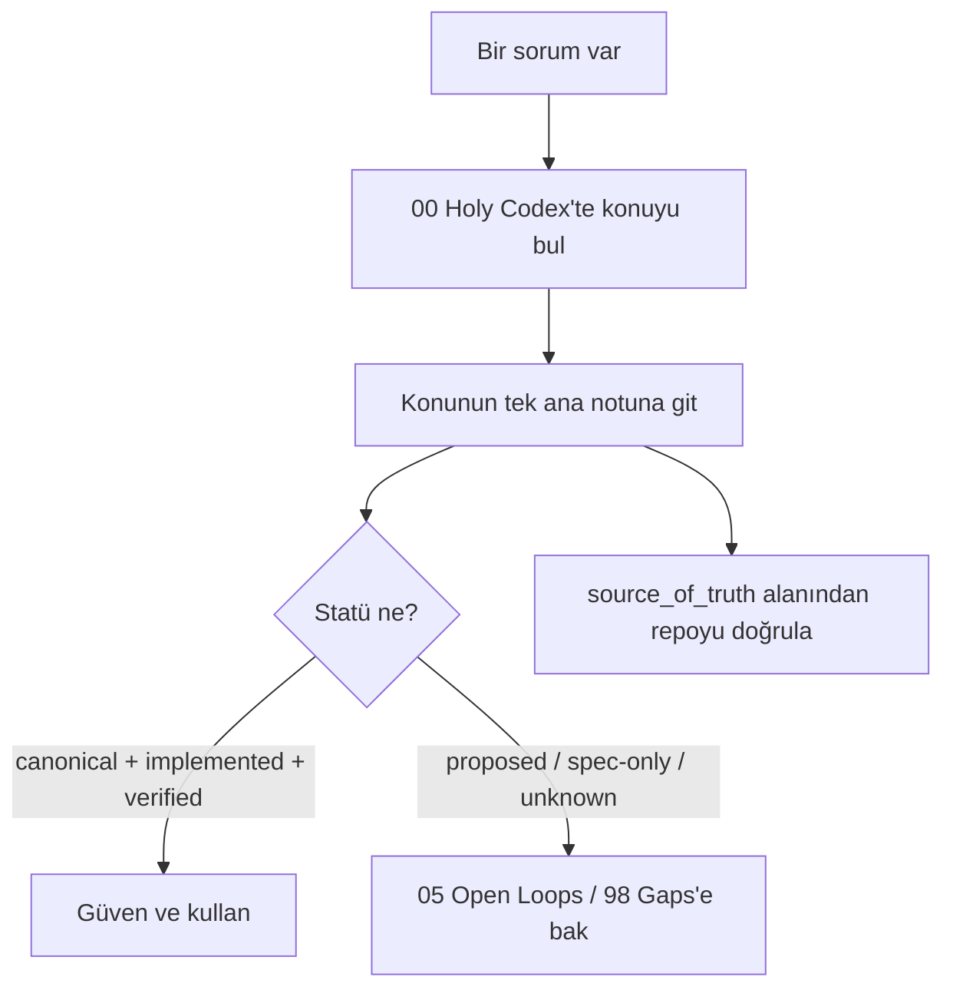

# How to Use This Vault

> Bu vault Le Mot/Cairn'in **kalıcı özel hafızasıdır** — repoya commit edilmez.
> Kurulum: kökteki `README_INSTALL.md`.

## Üç kural (tekrar)
1. **Önce statüye bak.** Her not `canon_status` / `implementation_status` /
   `verification_status` taşır → [[06 Canon and Status Legend]].
2. **Tek ana ev.** Her sistemin bir canonical açıklaması var; diğerleri özet + link.
3. **Tarihi ezme.** Karar değişince eskisini `superseded` işaretle, silme → [[90 History Index]].

## Bir soruyu nasıl cevaplarım?

## Not tipleri ve şablonlar
Yeni bir sistem/ders/egzersiz/karar için `99_TEMPLATES/` altındaki uygun şablonu
kopyala: [[System Spec Template]], [[Lesson Template]], [[Exercise Template]],
[[Decision Record Template]], [[Implementation Ledger Template]], [[Source Record Template]],
[[Open Loop Template]], [[Research Note Template]], [[Handoff Template]].

## Callout'lar
`[!canon]` `[!implemented]` `[!warning]` `[!historical]` `[!decision]` `[!open-loop]` `[!example]`
— anlamları [[06 Canon and Status Legend]]'da.

## Güncelleme disiplini
- Bir notu değiştirdin → `last_updated` güncelle; gözden geçirdin → `last_reviewed`.
- Her önemli iddiaya kaynak (dosya:satır / PR#) bağla; bilinmiyorsa UNKNOWN + [[Needs Verification]].
- Bir karar Obsidian'da kilitlendi → [[Obsidian to Git Promotion Rules]] akışıyla repoya taşı.

## Arama ipuçları (Obsidian)
- Graph view ile bir sistemin komşularını gör.
- Backlink paneli "bu nereye bağlı?" sorusunu cevaplar.
- Tag pane: `#matrix`, `#decision`, `#open-loop`, `#historical`.
- `08 Source of Truth Map` her zaman "hangi kaynak kazanır" sorusunun cevabı.
