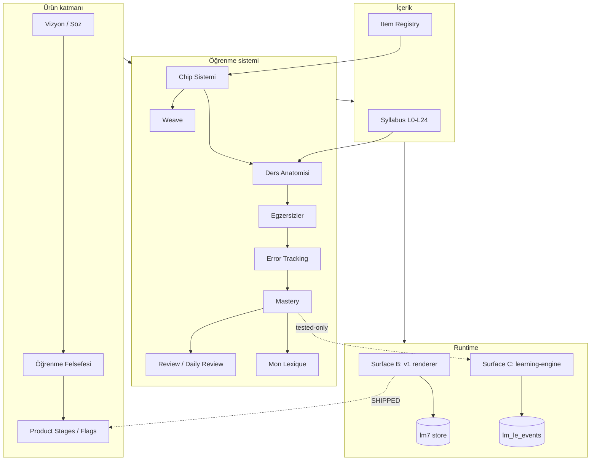

# Product Map

> Cairn'in parçaları ve nasıl bağlandıkları — tek diyagramda büyük resim.

> Diyagram özeti: Vizyon → felsefe → chip sistemi (Weave dâhil) → ders/egzersiz →
> hata/mastery/review döngüsü. İçerik tarafında syllabus + item registry besler.
> Runtime'da **sevkedilen yüzey B** `lm7`'ye yazar; **motor yüzeyi C** ayrı
> `lm_le_events` log'una yazar ve şu an yalnızca test/sandbox'ta. İki store disjoint
> (ana entegrasyon bloğu). [[Runtime Content Architecture]].

## Ana giriş noktaları

| Ne öğrenmek istiyorsun? | Git |
|---|---|
| Ürün neden var | [[Product Vision]] · [[Product Promise]] |
| Nasıl öğretiyor | [[Learning System Overview]] · [[Weave System]] |
| Bir ders | [[Lesson Anatomy]] · [[Lesson Flow]] |
| Egzersizler | [[Exercise System Overview]] |
| Müfredat | [[Syllabus Overview]] · [[Lesson Status Matrix]] |
| Mimari | [[System Architecture]] · [[Data Flow]] |
| Ne kodlandı | [[Implementation Overview]] · [[Implementation Ledger]] |
| Kararlar | [[Decision Index]] |
| Şu an | [[03 Current State]] · [[05 Open Loops]] |
