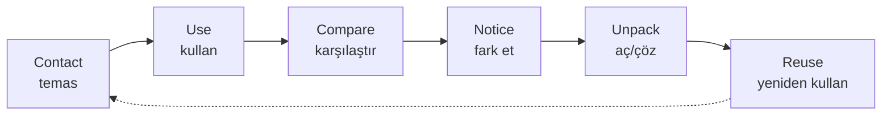

# Learning Philosophy

> [!canon] Temel öğrenme döngüsü (CANONICAL, v1.0 §, `...v1_0.md:218-228`):
> **Contact → Use → Compare → Notice → Unpack → Reuse.**
> "Whole first → use → notice → unpack → reuse." (`...v1_0.md:68-80`)

## Amaç

Bu not, "Cairn öğrenmeyi **nasıl** modelliyor?" sorusunun canonical evidir. Ürün
sözünün ([[Product Promise]]) altındaki pedagojik motor budur. Runtime karşılığı
için [[Learning System Overview]] ve [[Whole First, Unpack Later]].

## Temel döngü (CANONICAL)

Öğrenci önce **bütün** bir kullanılabilir parçayla temas eder, onu gerçek niyet
içinde **kullanır**, model cevapla **karşılaştırır**, kalıbı **fark eder**, mikro-mantığı
temastan *sonra* **açar** ve parça hafıza döngüsüne girip **yeniden** döner. Kritik
kural: **"No grammar dump before contact."** (`...v1_0.md:68-80`) — gramer, temastan
önce asla dökülmez.

## Ürün kimliği ilkeleri (CANONICAL, "tercih değil")

> [!canon] Dev APK canon §1, bunları **ürün kimliği** olarak (tercih değil) kilitler
> (`DEV_APK_MVP_CANON.md:11-21`):
> No XP / No streaks / No lives / No punishment / No hard-block progression /
> **Weave is the core mechanic** / **AI is supportive, not the core product.**
> "These are not preferences. They are the product's identity."

Bu ilkeler pedagojiyi doğrudan biçimlendirir: ilerleme hard-block değildir
(yanlış cevap yol tıkamaz), hata *veri*dir ceza değil ([[Error Tracking System]]),
ve motivasyon dış ödülle değil yeterlilik hissiyle gelir. Yasaklı dil listesi:
[[Non-Goals]].

## Hedef öğrenci felsefeyi nasıl büker

En güncel founder niyeti (nerdy hobbyists, "inside-out"), felsefeyi biraz derinleştirir:

> [!canon] Insight kartları "one notch deeper on why this works (still no conjugation
> tables)" gidebilir; mekanik kapıları (zamirler, kip mantığı) önceliklenir.
> — CANONICAL, `CAIRN_PRODUCT_ANSWERS_2026_07.md:14-20`. Bkz. [[Insight and Notice]].

## Araştırma temeli (yön)

> [!historical] v0.1 §5 (SUPERSEDED doc, yön uyumlu): "Meaning and usage before rules...
> Input before output... Mistakes are data, not punishment... Confidence is the real
> outcome... The mentor is a steady guide, not a quizmaster and not a mascot."
> (`CAIRN_PRODUCT_DEFINITION_v0.1.md:56-63`). Bu ifade v1.0 ile değiştirildi ama
> ilkeler değişmedi.

## Felsefe vs. runtime (statü)

> [!warning] Felsefe **CANONICAL**; runtime karşılığı **partial**. Döngünün
> "Unpack" (mikro-mantık) ve "Reuse" (hafıza-tabanlı geri dönüş) katmanları
> büyük ölçüde learning-engine (sandbox/founder-gated) ve spec seviyesindedir;
> sevkedilen v1 (L0–L6) statik-authored yüzeydir. Ayrım: [[Runtime Content Architecture]],
> [[Self-Producing Engine]].

## İlgili Notlar

- Üst indeks: [[00 Le Mot Holy Codex]]
- [[Product Vision]] — felsefenin ürün-seviyesi özeti
- [[Learner Experience Principles]] — felsefenin UX kurallarına inişi
- [[Learning System Overview]] — runtime öğrenme sistemi
- [[Whole First, Unpack Later]] — "bütün önce, mantık sonra" ilkesinin ana evi
