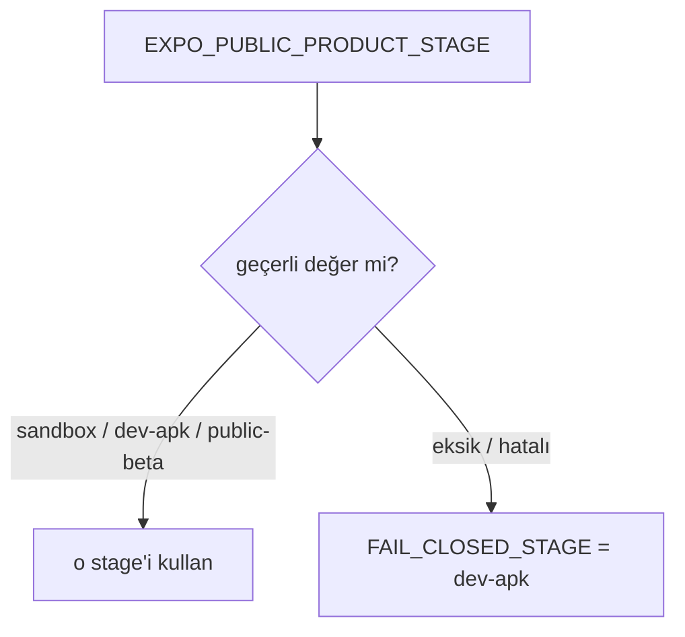

# Product Stages and Feature Flags

<!-- gh-toc -->

## İçindekiler

- [Amaç](#amaç)
- [Üç stage — IMPLEMENTED](#üç-stage-implemented)
- [Fail-closed kuralı (CANONICAL + IMPLEMENTED)](#fail-closed-kuralı-canonical-implemented)
- [Feature flag matrisi (CANONICAL + IMPLEMENTED)](#feature-flag-matrisi-canonical-implemented)
- [aiChat vs aiLesson vs aiEnabled (kritik ayrım)](#aichat-vs-ailesson-vs-aienabled-kritik-ayrım)
- [dev-apk gizlemeleri = scope kontrolü, monetization değil](#dev-apk-gizlemeleri-scope-kontrolü-monetization-değil)
- [DEV_APK_LESSON_LIMIT — LEGACY, dikkat](#devapklessonlimit-legacy-dikkat)
- [Statü](#statü)
- [İlgili Notlar](#ilgili-notlar)

> [!canon] Cairn üç ürün-stage'i tanır: **`sandbox | dev-apk | public-beta`**.
> Her stage bir feature-flag seti açar. Eksik/geçersiz env **fail-closed** olarak
> `dev-apk`'e düşer — asla `sandbox`'a değil. — CANONICAL & IMPLEMENTED,
> `lemot-app/config/productStage.ts`.

## Amaç

Bu not, `productStage.ts`'teki stage + feature-flag scaffold'unun canonical evidir.
Mimari yönü [[Product Stage Architecture]]; kod-seviyesi eşleme [[Feature Flags Map]];
bu sürümün ne içerdiği [[Dev APK Scope]].

## Üç stage — IMPLEMENTED

- **`sandbox`** — dahili emülatör/dev testi; **her flag açık**, hiçbir şey kilitli
  değil. Yalnızca `EXPO_PUBLIC_PRODUCT_STAGE=sandbox` ile *açıkça* istenir; artık
  fallback değildir (`productStage.ts:41-43`).
- **`dev-apk`** — kontrollü dış MVP testi; minimum yüzey, ilk-3-dakika kancası için.
  Tester APK'nin sevkettiği stage (`productStage.ts:44-49`).
- **`public-beta`** — gelecekteki monetize beta; paywall + RevenueCat açık, seçili
  özellikler açılır (`productStage.ts:50-51`).

## Fail-closed kuralı (CANONICAL + IMPLEMENTED)

> [!implemented] `FAIL_CLOSED_STAGE = "dev-apk"` (`productStage.ts:18`).
> "A missing or invalid env must NOT resolve to `sandbox`... `dev-apk` is the most
> restricted real stage, so an unconfigured or mistyped build ships the minimal
> tester surface instead." (`productStage.ts:13-18`).
> `resolveProductStage(value)` geçerli bir açık değeri onurlandırır, aksi halde
> `dev-apk` döner (`productStage.ts:28-36`); aktif stage `process.env.EXPO_PUBLIC_PRODUCT_STAGE`'ten
> okunur (`productStage.ts:53-55`).

Neden önemli: env'i yanlış yazılmış / hiç set edilmemiş bir tester APK, **tüm
sandbox yüzeyini** (paywall'sız-ama-her-şey-açık) yanlışlıkla sevketmek yerine
en kısıtlı gerçek yüzeyi sevkeder. STATUS teyit: "sandbox is no longer the fallback
stage"; "An unset or mistyped env intentionally boots dev-apk"; "EAS preview sets
EXPO_PUBLIC_PRODUCT_STAGE=dev-apk explicitly." (`STATUS.md:256-260`). KNOWN_GAPS bunu
"Healthy — do not touch" altında listeler (`KNOWN_GAPS.md:181-186`).

## Feature flag matrisi (CANONICAL + IMPLEMENTED)

Kaynak: `FEATURES_BY_STAGE`, `productStage.ts:68-129`. **Kalın** = Dev APK'in
belirleyici değerleri.

| Flag | sandbox | dev-apk | public-beta | Kaynak satır |
|---|---|---|---|---|
| `paywall` | false | **false** | true | `:71,87,111` |
| `revenueCat` | false | **false** | true | `:72,88,112` |
| `aiChat` (standalone Chat tab) | true | **false** | true | `:73,89,113` |
| `aiLesson` (Say It Your Way + Mini Conversation) | true | **true** | true | `:74,90,114` |
| `aiEnabled` (AI master network switch) | true | **false** | **false** | `:75,93,119` |
| `wordGraph` | true | false | false | `:76,94,120` |
| `monLexique` | true | false | true | `:77,95,121` |
| `leCarnet` | true | false | false | `:78,96,122` |
| `practice` | true | false | true | `:79,100,123` |
| `dailyReview` | true | false | true | `:81,105,125` |
| `progress` | true | false | true | `:82,106,127` |
| `v1LessonEngine` | true | false | false | `:83,107,128` |

## `aiChat` vs `aiLesson` vs `aiEnabled` (kritik ayrım)

> [!implemented] Bunlar bilerek üç ayrı flag'dir (`productStage.ts:57-67`):
> - `aiChat` = standalone Chat tab görünürlüğü (dev-apk'te **kapalı**).
> - `aiLesson` = ders içi AI bölümleri (Say It Your Way + Mini Conversation) —
>   dev-apk'te **açık**, çünkü "part of every lesson, not an optional bonus surface".
> - `aiEnabled` = **master switch**; false iken `lib/ai` Edge Function yardımcıları
>   fail-closed olur ve **hiç network çağrısı yapmaz**, Supabase env olsa bile.
>   "In-lesson AI sections fall back deterministically."

> [!warning] `aiEnabled` **hem dev-apk HEM public-beta**'da `false`. AI, "sandbox
> dışında varsayılan olarak fail-closed" — açık bir sonraki gate'e kadar. Yani AI
> stack pratikte **DORMANT** (`productStage.ts:110-119`; STATUS Deferred: "flip
> aiEnabled outside sandbox" `STATUS.md:276-278`). Bkz. [[AI Role and Guardrails]],
> [[AI Architecture]].

## dev-apk gizlemeleri = scope kontrolü, monetization değil

> [!warning] `practice`, `dailyReview`, `progress` dev-apk'te gizli çünkü **legacy
> 24-lesson / flashcard materyalini** yüzeye vururlar — para duvarı değil, kapsam
> kontrolü (`productStage.ts:96-108`). `Progress` (`stats.tsx`) legacy 24-lesson
> syllabus render eder; `dailyReview` legacy flashcard havuzundan çeker.

## `DEV_APK_LESSON_LIMIT` — LEGACY, dikkat

> [!warning] `DEV_APK_LESSON_LIMIT = 5` **LEGACY TEST BUILD** olarak işaretli
> (`productStage.ts:133-139`): "Filter assumes 24-lesson syllabus... Dev APK SHIPS
> WITH LIMIT=5 AS-IS — limit semantics change Sprint 12." Bu sabit, runtime'ın
> gerçekte L0–L6 sevkettiği gerçeğinin gerisinde kalır; `index.tsx` Home cap'i
> number<=6 kullanır. Bkz. [[Dev APK Scope]] (L1–L5 canon vs L0–L6 runtime divergence),
> [[Spec Runtime Divergences]].

## Statü

> [!implemented] Stage resolution + fail-closed + `FEATURES_BY_STAGE` = **IMPLEMENTED**
> (source-inspected). STATUS: Round 1 = "Dev APK only, no Supabase env, AI closed
> (fallback-only)" (`STATUS.md:206`). Runtime smoke bu flag davranışını teyit etti
> (`STATUS.md:124-127`).

## İlgili Notlar

- Üst indeks: [[00 Le Mot Holy Codex]]
- [[Dev APK Scope]] — dev-apk stage'inin ürün kapsamı
- [[Product Stage Architecture]] — mimari perspektif
- [[Feature Flags Map]] — flag → kod tüketim eşlemesi
- [[Monetization and Scope Boundaries]] — paywall/revenueCat flag'lerinin anlamı
