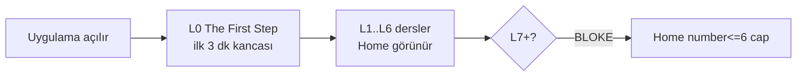

# User Journey

> [!canon] Cairn'in öğrenci yolculuğu, ürün-stage'ine göre **farklı yüzeyler** açar.
> Bugün gerçekten yaşanan yolculuk = **Dev APK, L0–L6**: ilk 3 dakika kancası →
> birkaç ders → sakin ilerleme. Paywall, Chat, Progress, Daily Review bu turda kapalı.

## Amaç

Bu not, öğrencinin uygulamayı ilk açtığı andan ilerlemesine kadarki yolu tek
canonical yerde toplar. Yolculuğun *hangi özellikleri gördüğü* stage'e bağlıdır;
bu kapı [[Product Stages and Feature Flags]]'te tanımlıdır. Sürüm kapsamı
[[Dev APK Scope]].

## İlk temas: ilk 3 dakika (CANONICAL)

> [!canon] "The Dev APK lives or dies in the first 3 minutes." Lesson Zero /
> first-3-minutes hook en yüksek önceliktir. — `DEV_APK_MVP_CANON.md:42-48`

Yolculuk **Lesson Zero (L0 "The First Step")** ile başlar: konjugasyon/gramer
dökümü olmadan, öğrenciyi doğrudan kullanılabilir bir Fransızca parçasıyla temas
ettiren minik bir kanca. Felsefe: "whole first" ([[Learning Philosophy]]).

## Bugün yaşanan yolculuk (Round 1 Dev APK) — IMPLEMENTED

> [!implemented] STATUS smoke doğrulaması: "Daily Review hidden; Progress hidden;
> L1-L6 only; no paywall/subscription/trial/pricing." — `STATUS.md:124-127`.
> Round 1 L0–L6 runtime KABUL EDİLDİ ve DONDURULDU (emulator smoke #136 / `8cefe81`,
> P0–P3 sıfır, `STATUS.md:109-140`).

> [!warning] **L7 bloke.** "No L7 implementation — blocked until the operator device
> smoke passes and an explicit closeout decision." Home görünürlük artışı (`<=6 → <=7`)
> ayrı bir gözden geçirilmiş karardır. — `README.md:135-137`, `STATUS.md:214-227`.
> Runtime detayı: `index.tsx` number<=6 cap (bkz. load-bearing facts, [[03 Current State]]).

Not: L0–L6 smoke'ta "L2 ve L3 orijinal smoke'ta tam sıralı tamamlanmadı; L4–L6
deep link ile örneklendi" (HISTORICAL dürüstlük notu, `STATUS.md:128-133`).

## Bir dersin içindeki mikro-yolculuk

Ders içi akış, temel döngüyü ([[Learning Philosophy]]) somutlaştırır: Meet →
Insight/Notice → Fill → Weave → Say It Your Way → Natural Reveal → Recap. Ekran
tipleri [[Lesson Anatomy]] ve [[Lesson Flow]]'da; her egzersizin evi 03_EXERCISES.
In-lesson AI (Say It Your Way + Mini Conversation) `aiLesson` ile kavramsal olarak
açık ama Dev APK'te AI network kapalı (`aiEnabled=false`) → deterministik fallback
(`productStage.ts:86-93`).

## Tam ürün yolculuğu (ileriki stage'ler) — PLANNED / spec

> [!warning] Aşağısı **spec/planned**, sevkedilmedi.
> Tam ürün vizyonunda yolculuk ~150+ derse uzanır ve **paywall'a** ulaşır. Founder
> Q&A: **"Campfire Mode @ L24 (paywall boundary)"** — L24'te paywall girer; ödeme
> yapmayan öğrenci, KENDİ sahiplendiği kelimelerden ve error tracking'ten üretilen
> bir practice loop'una ("Campfire Mode") geçer. C1 (locked): Campfire içeriği
> GENERATED, hardcoded değil. — `CAIRN_PRODUCT_ANSWERS_2026_07.md:59-67`.
> Paywall yerinin belirsizliği için [[Monetization and Scope Boundaries]].

## Statü

> [!warning] Yolculuk **provisional**: erken (L0–L6) kısmı IMPLEMENTED & VERIFIED
> (emulator), geç kısmı (paywall, Campfire, Mon Lexique, Progress) spec/planned.
> canon_status provisional çünkü tam yolculuğun paywall boundary'si (L24 mü, sonra
> mı?) reconcile edilmemiş. Bkz. [[Product Risks]], [[05 Open Loops]].

## İlgili Notlar

- Üst indeks: [[00 Le Mot Holy Codex]]
- [[Learner Experience Principles]] — yolculuğun his/ton kuralları
- [[Dev APK Scope]] — bugün sevkedilen tur
- [[Product Stages and Feature Flags]] — hangi stage neyi açar
- [[Monetization and Scope Boundaries]] — paywall boundary'si
