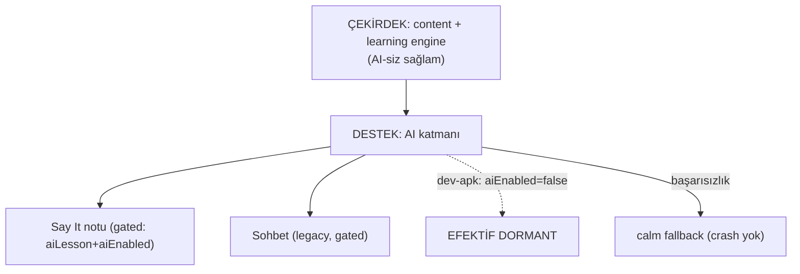

# AI Role and Guardrails

<!-- gh-toc -->

## İçindekiler

- [Executive Summary](#executive-summary)
- [Why It Exists](#why-it-exists)
- [Current Canon](#current-canon)
- [How It Works](#how-it-works)
- [Failure Modes](#failure-modes)
- [Diagrams](#diagrams)
- [Runtime Implementation](#runtime-implementation)
- [Known Gaps](#known-gaps)
- [Open Questions](#open-questions)
- [Related Notes](#related-notes)

> [!canon] Purpose — Cairn'de AI'ın rolü nedir (ve **ne değildir**)? Destek katmanı vs çekirdek, dev-apk'te neden kapalı, ve hangi AI mimarileri açıkça reddedildi.

## Executive Summary

Cairn'de AI **çekirdek değil, destek katmanıdır.** Motor kanonu net: "**The engine must be sound without AI.**" (`learning-engine-v1.md:276`). AI, üretim değerlendirmesi (Say It Your Way notu) ve sohbet gibi *destekleyici* yerlerde durur; ama içeriği, mastery'yi ya da kanıtı AI üretmez. Bugün **dev-apk'te tüm AI efektif olarak kapalı** (`aiEnabled=false`), sadece `aiLesson=true` bir flag var ama `aiEnabled` olmadan çalışmaz — Say It AI notu "skipped". Açıkça reddedilenler: RAG/upload, multi-agent tutor. Guardrail: AI başarısızlığı **asla crash etmez**, calm fallback gösterir.

## Why It Exists

En kolay ürün hatası "AI'ı merkeze koymak"tır — CLAUDE.md bunu açıkça yasaklar: "Make AI the core — it's a supporting layer, content + learning engine is the core" (Do NOT listesi). Sebep: AI stokastiktir, dil öğretiminin doğruluk/tutarlılık gereksinimini tek başına karşılayamaz; ayrıca maliyet/gizlilik/offline riskleri var. Cairn bu yüzden motoru AI'sız sağlam yapar; AI sadece kenarları zenginleştirir.

## Current Canon

### AI = destek katmanı (CANONICAL)
> "AI is a supporting layer, never the core; The engine must be sound without AI." — `learning-engine-v1.md:276`. CLAUDE.md Do-NOT: "Make AI the core."

### Reddedilenler (CANONICAL, REJECTED)
"No RAG/upload, no multi-agent tutor" (`learning-engine-v1.md:277-278`).

### Smoke sınırı (CANONICAL)
"No runtime engine implementation before the Dev APK smoke test" (`learning-engine-v1.md:271`) — AI dâhil tüm runtime motor smoke'a kadar sınırlı.

### Dev-apk'te AI kapalı (IMPLEMENTED)
> [!warning] dev-apk feature flag'leri: `aiChat/aiEnabled` **OFF**, `aiLesson=true`. Ama `aiEnabled=false` olduğundan AI stack **efektif olarak dormant.** Bkz. [[Product Stages and Feature Flags]].

## How It Works

### AI'ın durabileceği yerler (destek)
- **Say It Your Way notu:** yalnızca `validationMode==="ai-assisted-with-fallback" && FEATURES.aiLesson` → `evaluateSayIt()`. **dev-apk'te `aiEnabled=false` olduğu için atlanır** (`status:"skipped"`, `SayItYourWayV1.tsx:58-61`). Bkz. [[Say It Your Way]].
- **Legacy Mini Conversation / legacy Say It:** `!FEATURES.aiLesson` → **null render** (dev-apk-hidden).
- **error-engine:** AI-free ("pure, AI-free, no storage/network") — feedback köprüsü AI kullanmaz.

### Guardrails
- **AI başarısızlığı crash etmez** → calm fallback (SayIt deterministik reveal gösterir).
- AI içeriği/mastery/kanıtı üretmez (motor AI-siz sağlam).
- No RAG, no upload, no multi-agent.
- Server-side limitler (public-beta'da), no client `service_role`, no unbounded response. Bkz. [[AI Architecture]].

## Failure Modes
- **AI çevrimdışı/hata:** SayIt notu skip, deterministik reveal devam eder — öğrenci akışı kesilmez.
- **AI'a bağımlılık sızması:** eğer bir yüzey AI olmadan çalışmıyorsa, "engine must be sound without AI" ihlali — tasarım hatası.

## Diagrams

Çekirdek AI'sız çalışır; AI yalnızca gated destek noktalarında durur ve dev-apk'te kapalıdır. Başarısızlık her zaman sakin bir fallback'e düşer.

## Runtime Implementation
### Code References
- `lemot-app/config/productStage.ts` — feature flag'ler (`aiEnabled=false` dev-apk).
- `SayItYourWayV1.tsx:38-61` — aiEligible gate + skip.
- `error-engine.ts` — AI-free feedback köprüsü.
### Test References
`devApkScope.test.ts` — AI gating.
### Product-Stage Availability
- **sandbox/dev-apk:** AI efektif kapalı.
- **public-beta:** paywall+revenueCat eklenir ama `aiEnabled` hâlâ false — AI stack dormant kalır.

## Known Gaps
- AI yolları kodda var ama hiçbir stage'de canlı değil (dormant).
- Server-side rate limit / Supabase Edge Function deploy operator-only, pending (bkz. [[AI Architecture]]).

## Open Questions
> [!open-loop] AI hangi stage'de/koşulda açılacak (maliyet/gizlilik/kalite eşiği)? → [[05 Open Loops]]

## Related Notes
[[Say It Your Way]] · [[Feedback and Scoring Philosophy]] · [[Self-Producing Engine]] · [[AI Architecture]] · [[Product Stages and Feature Flags]]
