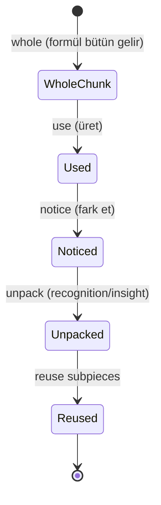
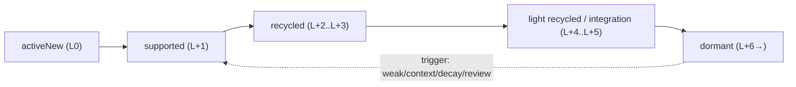

# Chip Lifecycle

<!-- gh-toc -->

## İçindekiler

- [Executive Summary](#executive-summary)
- [Why It Exists](#why-it-exists)
- [Current Canon](#current-canon)
- [How It Works](#how-it-works)
- [Examples](#examples)
- [Runtime Implementation](#runtime-implementation)
- [Known Gaps](#known-gaps)
- [Open Questions](#open-questions)
- [Policy Hardening — Default Carryover Horizon (2026-07-18)](#policy-hardening-default-carryover-horizon-2026-07-18)
- [Policy Hardening — Exposure → Recognition → activeNew Promotion (2026-07-18)](#policy-hardening-exposure-recognition-activenew-promotion-2026-07-18)
- [Related Notes](#related-notes)

> [!canon] Purpose — Bir chip zaman içinde nasıl davranış değiştirir? Unpackable-chunk döngüsü, carryover aşamaları ve Mon Lexique'in iki ayrı yaşam-döngüsü kavramı — hepsi tek yerde, karıştırmadan.

## Executive Summary

Chip'ler statik etiketler değil; **davranışları zamanla değişir.** Üç ayrı yaşam döngüsü vardır ve bunlar birbirine karıştırılmamalıdır: (1) **Unpackable-chunk döngüsü** — bir formül önce bütün öğrenilir, sonra alt-parçalara açılır (CANONICAL). (2) **Carryover döngüsü** — tanıtılan bir chip lessons boyunca active→supported→recycled→dormant kayar (v0.3 §10, **PROPOSAL/revisable**). (3) **Mon Lexique döngüsü** — hidden→added→weak (mastery projeksiyonu, IMPLEMENTED engine). Kanon net bir uyarı verir: "Lesson chip surface ≠ carryover selection ≠ flashcard review" (`v0.3:307-309`).

## Why It Exists

Aynı `s'il vous plaît` chip'i L1'de "please" bütünüyken, L8'de `vous`'un fark edildiği bir unpack anına, L15'te bir carryover adayına dönüşebilir. Tek bir "status" bunu taşıyamaz — bu yüzden davranışı zamanla modellemek gerekir. Ama üç döngüyü karıştırmak (ör. carryover yoğunluğunu flashcard scheduling gibi tasarlamak) klasik bir hatadır; bu not onları ayrı tutmak için var.

## Current Canon

### 1. Unpackable-chunk döngüsü (CANONICAL, v0.3 §5, :153)
> "Whole first → use → notice → unpack → reuse subpieces"

Örnek (`v0.3:159-163`): `s'il vous plaît` = önce bütün "please" → sonra `vous`'u fark et → çok daha sonra literal yapı. Kural: "**Unpacking is recognition/insight first, not active grammar production.**" (`v0.3:171`). Unpack kartları "**yalnızca temastan sonra, tek bir kenara dar**" (bkz. [[Whole First, Unpack Later]]).

### 2. Carryover döngüsü (v0.3 §10 — **PROPOSAL, revisable**, :336-344)
| Aşama | Offset | Bucket eşlemesi |
|---|---|---|
| introduced / activeNew | L0 | `activeNew` |
| dense supported carry-in | L+1 | `supported` |
| supported / recycled (context-fit) | L+2 – L+3 | `supported` veya `recycled` |
| light recycled / integration adayı | L+4 – L+5 | `recycled` |
| dormant (tetiklenmedikçe) | L+6 → | trigger olmadan yüzeye çıkmaz |

> [!warning] Bu tablo "**v0.3 PROPOSAL — revisable**". **CANONICAL düzeltme:** "**There is no numeric carryover window currently canonized. L11→L16 should not be treated as proof of a hard 5-lesson lifecycle.**" (`v0.3:331-332`). "Integration every 4–5 lessons" bir **yerleşim pacing sezgisi**, carryover reach değil (`v0.3:334`).

**Dormant reactivation trigger'ları** (`v0.3:346-352`): mastery weak; context gerektirir; recall/decay zamanı; yeni pattern ihtiyacı; scheduled review; exposure promotion fırsatı.

**Rolling window (CANONICAL):** "The learned graph grows; the active carryover window rolls. Previous chips are candidates, not defaults." (`v0.3:373-374`). Global öğrenilmiş chip grafiği **sonsuza büyüyebilir**, ama active carryover penceresi **doğrusal büyümemeli, tepe yapıp yuvarlanmalı** (`v0.3:380-381`). Seçim skoru: bkz. [[Content Selection]].

### 3. Mon Lexique döngüsü (CANONICAL projeksiyon, IMPLEMENTED engine)
`monLexiqueStatus` (mastery.ts:283-288): `isWeak → "weak"`; else `productionSuccess > 0 → "added"`; else `"hidden"`. "**recognition alone never auto-adds.**" Detay: [[Mon Lexique]].

### İki döngüyü karıştırma (CANONICAL, v0.3:307-317)
"**Lesson chip surface ≠ carryover selection ≠ flashcard review. Mon Lexique UI ≠ Lexique Memory ≠ Carryover Selector.**" "Do not design lesson carryover density as if it were flashcard scheduling." (`v0.3:317`).

## How It Works

### State / Lifecycle

Unpackable döngü: parça önce bütün kullanılır, sonra fark edilir, sonra ayrıştırılır (üretim değil, recognition), sonra alt-parçalar yeniden kullanılır.

Carryover döngü (PROPOSAL): chip active'ten dormant'a kayar; bir trigger onu yeniden yüzeye çekebilir. Offset'ler sabit pencere değil, sezgidir.

### Guardrails
- **Recycle Load Protection (CANONICAL):** "Recycle cannot steal the lesson." (`v0.3:388`). Her cümlenin bir yük bütçesi var: target load baskın, recycle load destekleyici, exposure load opsiyonel ve capped kalmalı (`v0.3:390`). Bkz. [[Difficulty and Cognitive Load]].

## Examples
> [!example] `un café`'nin yuvarlanması (`v0.3:407-414`): target → anchor → context → refresh, tenses arası. Aynı chip farklı derslerde farklı rol (target→recycle) oynar; asla mekanik dump edilmez.

## Runtime Implementation
### Code References
- `lemot-app/content/learning-engine/carryover-selector.ts` — "Carryover Selector v0 (spec §65.6) — pure, deterministic, RN-free"; recycled = **query-time carryover rolü**, saklanan mastery mutasyonu değil. **fixture/spec-only** (herhangi bir canlı ders yüzeyine bağlı değil).
- `lemot-app/content/learning-engine/lexique-memory.ts` — "Lexique Memory v0.1 — pure derived layer over frozen mastery-v0.2" (`WEAKNESS_K=2.0`, `WEAK_RESIDUAL_FLOOR=0.15`). fixture/spec-only.
- `lemot-app/content/learning-engine/mastery.ts:283-288` — `monLexiqueStatus` projeksiyonu (IMPLEMENTED engine).

### Product-Stage Availability
Unpackable döngü: kanon; runtime insight-card yeniden kullanımı **PROPOSED**. Carryover selector + lexique memory: **fixture/spec-only** (System B, sandbox). Mon Lexique status: engine-only.

## Known Gaps
- Carryover numeric penceresi PROPOSED, kilitli değil.
- Unpack için ayrı bir kart tipi yok (mevcut `insight-card` yeniden kullanımı PROPOSED, henüz yapılmadı — `v0.3:224`).

## Open Questions
> [!open-loop] Carryover reach sayısal olarak kanonlaşacak mı, yoksa selection-score'a mı bırakılacak? → [[05 Open Loops]]

## Policy Hardening — Default Carryover Horizon (2026-07-18)

> [!canon] **PRIMARY POLICY HOME** for the default carryover **horizon** and dormant/reactivation semantics. Bu, yukarıdaki v0.3 §10 "PROPOSAL, revisable" tablosunu **authoring amacıyla** bir **LOCKED DEFAULT**'a çevirir. **NON-CLAIM:** kaynak `v0.3` hâlâ "no numeric window is *canonized*" der (`v0.3:331-332`) ve bu tavan **empirik değildir**; burada kilitlenen şey bir **yazım default'u**dur, bilimsel yasa değil. **Runtime seçim yine selection-score-güdümlü ve sandbox'tadır** — bu tablo runtime'ı wire etmez.

### Hibrit model [HARD INVARIANT]

Açık soru ("sayısal reach mı, selection-score mı?") **hibrit** ile kapandı (→ [[05 Open Loops]]):

1. **Sayısal horizon** → default **eligibility ve density**'yi belirler (aşağıdaki tablo).
2. **Selection score** → uygun adaylar içinden **hangisinin gerçekten döneceğine** karar verir ([[Content Selection]]).
3. **Evidence/curriculum trigger** → bir item'ı horizon dışına **uzatabilir veya reaktive edebilir**.
4. Bir item **yalnızca önceki derste var diye** yüzeye çıkmaz.

### Default horizon [LOCKED DEFAULT]

`L+n` = item'ın ilk tanıtımından (`firstIntroducedIn`) sonraki ders offset'i.

| Pencere | Rol | Default eligibility/density |
|---|---|---|
| **L0** | activeNew tanıtımı | carryover **değil** |
| **L+1 – L+2** | yoğun supported carryover | **en yüksek** default eligibility |
| **L+3 – L+5** | normal recycled carryover | **orta** density |
| **L+6** | hafif konsolidasyon | **düşük** default selection önceliği |
| **L+7 – L+9** | yalnız extension window | evrensel yükümlülük **değil**; item yalnız bir **evidence/curriculum trigger** varsa aktif kalır |
| **L+10 →** | default **dormant** | mastery/Lexique Memory geçmişi **korunur**; sonradan reaktive edilebilir |

> [!warning] **[HARD INVARIANT]** "Dokuz ders" = "her derste göster" **DEĞİLDİR.** Bu bir **maksimum eligibility kuyruğu**dur, zorunlu tekrar değil. Güçlü, yakın zamanda aşırı kullanılmış, düşük önemli veya bağlam-uyumsuz item **daha erken** ayrılabilir. **Dormant ≠ silinmiş/unutulmuş:** dormant item Lexique Memory'de kalır ve Mon Lexique'te görünür kalabilir ([[Mon Lexique]]).

### Differentiated per-type defaults [LOCKED DEFAULT / TUNABLE PARAMETER]

Sistem şekli kilitli; süreler **TUNABLE** (smoke sonrası):

- **simple noun/context item:** genellikle **3–5 ders**.
- **functional/formula chunk:** genellikle **5–7 ders**.
- **spine/pattern:** **hard expiry yok**, ama **otomatik görünme hakkı da yok** (context/prereq/weakness/integration/spiral ile seçilir; [[Spine and Carryover Logic]]).
- **error-tagged item:** repair + spaced confirmation kapanana dek **L+9'a kadar uzayabilir** ([[Error Tracking System]]).
- **integration prerequisite:** bağımlılık gerçekten aktifken uzayabilir.

### Dormant / reactivation

Dormant item silinmez; şu trigger'larla geri döner (seçim skoru: [[Content Selection]]): mastery weak · context gerekir · recall/decay zamanı · yeni pattern ihtiyacı · scheduled review · exposure-promotion fırsatı · integration/prerequisite ihtiyacı. Yük tavanları: [[Difficulty and Cognitive Load]].

## Policy Hardening — Exposure → Recognition → activeNew Promotion (2026-07-18)

> [!canon] **PRIMARY POLICY HOME** for the **promotion contract**. Rol tanımları [[Chip Taxonomy]]'de; bütçe [[Difficulty and Cognitive Load]]'ta; kanıt etkileri [[Mastery Model]]'de; registry kimliği [[Registry Architecture]]'da. Sınıf: **[HARD INVARIANT] / [LOCKED DEFAULT] / [OPEN]**.

### Promotion invariants [HARD INVARIANT]

- **Exposure sayısı tek başına sahiplik yaratmaz.**
- **Tekrarlı görünürlük otomatik promote etmez.**
- **Ghost/exposure, açık promotion olmadan gerekli üretim cevabı olamaz.**
- **Promotion `activeNew` bütçesini baypas etmez.**
- **Üretime terfi eden item, promotion dersinde `activeNew` sayılır.**
- Önceki exposure **yeniliği azaltabilir**, ama item'ı **"bedava" yapmaz.**
- **Exposure kanıtı ile production kanıtı ayrı kalır** ([[Mastery Model]]).
- **Model answer reveal yeterli promotion kanıtı değildir.**
- **Promotion, sabit registry kimliği gerektirir** ([[Registry Architecture]]).

### Promotion eligibility [LOCKED DEFAULT]

Bir exposure/recognition item `activeNew` adayı olur — **yalnız tümü** doğruysa:

1. sabit kanonik registry kimliği var,
2. en az bir **authored anlamlı önceki temas veya recognition fırsatı** olmuş,
3. yaklaşan derste **gerçek bir iletişimsel üretim ihtiyacı** var,
4. o derste **prerequisite-safe**,
5. `activeNew` ve `totalProductionLoad` bütçeleri taşıyabilir,
6. ders promotion'ı **açıkça beyan eder**,
7. ders bir **introduction/use/evidence planı** içerir,
8. item artık required-answer bölgelerinde **ghost muamelesi görmez**.

### Netleştirme [HARD INVARIANT]

- **"Anlamlı önceki temas" dekoratif görünme değildir.**
- Önceki exposure **destekleyici bağlamdır, öğretmenin yerine geçmez.**
- Bir item pedagojik uygunsa **görülmemişten doğrudan `activeNew`'e** geçebilir — exposure her item için **zorunlu değil.**
- Bir item, üretim sahipliği yararsızsa **süresiz recognition-only** kalabilir.
- **Kanıt olmadan global "üç exposure = active" kuralı UYDURULAMAZ** → sayısal eşik **OPEN/TUNABLE**.

### Promoted item için authoring alanları [LOCKED DEFAULT]

`previousRole` · `previousExposureLessons` · `promotionReason` · `promotionLesson` · `newRole = activeNew` · `activeNewBudgetImpact` · `productionEvidencePlan` · `postLessonLifecyclePlan`. (Ledger: [[Content Production Workflow]].)

### Enforcement status

- **authoring/review disiplini + validator candidate**; runtime enforcement iddia edilmez.

## Related Notes
[[Chip Taxonomy]] · [[Spine and Carryover Logic]] · [[Whole First, Unpack Later]] · [[Mon Lexique]] · [[Content Selection]] · [[Review and Recycling System]] · [[Difficulty and Cognitive Load]] · [[Error Tracking System]] · [[Registry Architecture]] · [[Mastery Model]]
