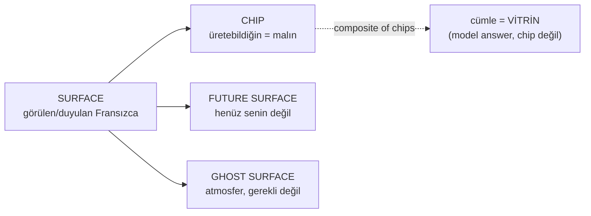

# Chip System Overview

<!-- gh-toc -->

## İçindekiler

- [Executive Summary](#executive-summary)
- [Why It Exists](#why-it-exists)
- [Current Canon](#current-canon)
- [How It Works](#how-it-works)
- [Examples](#examples)
- [Diagrams](#diagrams)
- [Runtime Implementation](#runtime-implementation)
- [Known Gaps](#known-gaps)
- [Open Questions](#open-questions)
- [Related Notes](#related-notes)

> [!canon] Purpose — "Chip" nedir, neyin chip *olmadığı*, ve chip'in dört komşu kavramdan (SURFACE / FUTURE SURFACE / GHOST SURFACE) farkı. Ayrıntılı tip listesi ve verdict'ler [[Chip Taxonomy]]'de.

## Executive Summary

**Chip = yeniden kullanılabilir üretim parçası — cümle ezberi değil.** Cairn'in temel öğretim birimidir: "Whole first, unpack later. Use first. Understand deeply. Return stronger. No grammar dump before contact." (`v0.3:47-51`). Kritik olarak bir chip **davranışıyla** tanımlanır, etiketiyle değil. Chip, öğrencinin *sahip olduğu / üretebildiği* şeydir (öğrencinin malı); ekranda görülen her Fransızca chip değildir. Bu ayrım (CHIP vs SURFACE vs FUTURE SURFACE vs GHOST SURFACE) tüm chip sisteminin belkemiğidir.

## Why It Exists

Bir dil uygulamasının en kolay hatası, gördüğü her Fransızca'yı "öğrenildi" saymaktır. Cairn bunu reddeder: sahiplenme (ownership) ile temas (exposure) ayrı tutulur. Chip kavramı bu ayrımı taşır — öğrenci bir chip'i *üretebiliyorsa* onun malıdır; sadece görmüşse o bir surface'tir. Bu, mastery'nin, carryover'ın ve Mon Lexique'in üzerine kurulduğu zemindir.

## Current Canon

### Chip tanımı (CANONICAL, v0.3 §3)
> "Chip = reusable building block, not sentence memorization. Whole first, unpack later. Use first. Understand deeply. Return stronger. No grammar dump before contact." — `v0.3:47-51`

Öğrenci **önce kullanır, sonra fark eder/ayrıştırır**: "Contact precedes explanation; explanation is narrow and attached to what was just seen, typed, or compared." (`v0.3:58`). Detay: [[Whole First, Unpack Later]].

### Dört komşu kavram (CANONICAL, `LESSON_FLOW_CANON_v1.md §2, :121-126`)
| Kavram | Anlamı |
|---|---|
| **CHIP** | Sahiplenilmiş/desteklenmiş üretim parçası — **öğrencinin malı** (the learner's own). |
| **SURFACE** | Görülen/duyulan herhangi bir Fransızca. |
| **FUTURE SURFACE** | Henüz senin değil (ileride gelecek biçim). |
| **GHOST SURFACE** | Atmosfer / yakındaki Fransızca. |

> [!warning] Bir chip **UI'da görünen bir pill değildir zorunlu olarak**. Görünürlük ile sahiplenme ayrı boyutlardır. Görünen pill'e "UI chip", takip edilen kayda "accounting chip" denir; bunlar [[Chip Taxonomy]]'de ayrışır.

### En sert kural: cümle chip değildir (CANONICAL)
"cümle, chip'lerin anlamlı birleşiminin **VİTRİNİ**dir" (`LESSON_FLOW_CANON_v1.md:107`). Tam cümle bir chip *kompozitidir*, sadece model answer olabilir. Bu, taksonominin kalbidir → [[Chip Taxonomy#Bir cümle neden chip değildir]].

## How It Works

### Inputs / Outputs
Chip'ler `itemRegistry.ts`'te `LearningItem` olarak yaşar; her birinin tek bir `status` alanı vardır (runtime). Kanon 12 davranışsal tip tanımlar ama runtime bunları tek enum'a çöker (bkz. [[Chip Taxonomy]]).

### State / Lifecycle
whole → use → notice → unpack → reuse (bkz. [[Chip Lifecycle]]). Bir chip lessons arası **carryover aday**ı olur (mekanik dump değil; bkz. [[Spine and Carryover Logic]]).

### Guardrails
- **Primary UI chip olarak tam cümle/çok-clause chip YOK** (`v0.3:89-98`).
- Recap `piecesUsed` chip'leri atomik olmalı (sentence-chip heuristic guard, `v1LessonStructure.test.ts`).
- `je`, `pas`, `ce`, `pour`, `avec`, `là`, `ici` gibi çıplak atomları **körlemesine forbidden yapma** (`v0.3:84`) — bunlar Caveat'tır.

## Examples
> [!example]
> - **CHIP (owned):** `je voudrais` — öğrenci üretebiliyor, malı.
> - **SURFACE:** bir model cevapta görünen tüm Fransızca satır.
> - **FUTURE SURFACE:** `parler` bir reveal'de görünür ama henüz üretilmesi beklenmez.
> - **GHOST SURFACE:** sahnedeki atmosferik Fransızca (`de l'eau` bir bağlamda geçer, gerekli değildir).

## Diagrams

Her Fransızca bir surface'tir; onların yalnızca sahiplenilen alt-kümesi chip olur. Cümle, chip'lerin birleşiminin vitrini — kendisi chip değildir.

## Runtime Implementation
### Code References
- `lemot-app/content/itemRegistry.ts` — LearningItem'lar (ITEM_REGISTRY), tek `status` alanı.
- `lemot-app/content/lessonTypes.ts` — payload'larda highlight/piece yapıları.

### Product-Stage Availability
Chip registry System A'da (v1) canlı; davranışsal taksonomi büyük ölçüde spec (v0.3).

## Known Gaps
- Zengin davranışsal tip ayrımı runtime'da yok (tek `status` enum). Detay: [[Chip Taxonomy]] "spec-vs-runtime".

## Open Questions
> [!open-loop] L1'in nihai chip listesi kasıtlı olarak açık (~34–35 hedef). → [[05 Open Loops]]

## Related Notes
[[Chip Taxonomy]] · [[Chip Lifecycle]] · [[Spine and Carryover Logic]] · [[Whole First, Unpack Later]] · [[Mon Lexique]]
