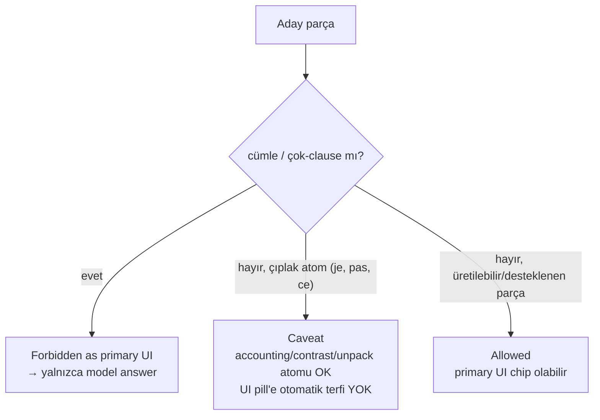

# Chip Taxonomy

<!-- gh-toc -->

## İçindekiler

- [Executive Summary](#executive-summary)
- [Why It Exists](#why-it-exists)
- [Current Canon](#current-canon)
- [Bir cümle neden chip değildir](#bir-cümle-neden-chip-değildir)
- [How It Works (spec vs runtime)](#how-it-works-spec-vs-runtime)
- [Failure Modes](#failure-modes)
- [Diagrams](#diagrams)
- [Runtime Implementation](#runtime-implementation)
- [Known Gaps](#known-gaps)
- [Open Questions](#open-questions)
- [Policy Hardening — Item Roles and UI Eligibility (2026-07-18)](#policy-hardening-item-roles-and-ui-eligibility-2026-07-18)
- [Related Notes](#related-notes)

> [!canon] Purpose — **CROWN NOTE.** Cairn'in ~12 davranışsal chip tipinin tamamı, 3-yollu verdict sistemi (Allowed / Caveat / Forbidden-as-primary-UI), ve neden bir cümlenin chip *olmadığı*. Bu, chip sisteminin tek canonical evi. Kaynak: `chip-taxonomy-and-lexique-lifecycle-v0.3.md` (CANONICAL, revisable — "no implementation authorization", v0.3:3).

## Executive Summary

Cairn'de bir chip **davranışıyla** tanımlanır, etiketiyle değil (`v0.3:66-80`). v0.3 spec'i ~12 davranışsal chip tipi tarifler; her aday chip üç verdict'ten birini alır: **Allowed** (primary UI chip olabilir), **Caveat** (accounting/pattern/contrast/unpack/exposure atomu olarak yasal ama otomatik primary UI chip değil), **Forbidden as primary UI chip** (cümle/clause — sadece model answer). En sert kural: **tam cümle bir chip değildir, chip'lerin kompozitidir.** Kritik uyarı: bu zengin taksonomi **spec**'tir; **runtime** hepsini tek bir `LearningItem.status` enum'una (`active|supported|recognition|recycled`) çöker.

## Why It Exists

"Bu bir chip mi?" sorusu Cairn içerik üretiminin en sık ve en tehlikeli sorusudur. Yanlış cevap iki yönde de zarar verir: (a) cümleyi chip sanmak → ezber üretir, sahiplenmeyi taklit eder; (b) `je`, `pas` gibi çıplak atomları körlemesine "yasak" ilan etmek → aşırı düzeltme, meşru accounting/contrast atomlarını kaybetmek. Bu taksonomi ikisini de bir davranış + verdict testine indirger.

## Current Canon

### Tam chip taksonomisi (CANONICAL — v0.3 §4, tablo :66-80)

Her tip **davranışıyla** tanımlıdır:

| # | Tip | Tanım (davranış) | Kaynak |
|---|---|---|---|
| 1 | **Spine chip** | Bir dersin etrafında kurulduğu **load-bearing üretilebilir motor** (`je suis`, `j'ai`, `je voudrais`, pattern `ne ___ pas`). Dersler arası tekrar eder; genelde `active`. | v0.3:68 |
| 2 | **Active chip** | Bu derste **üretmesi beklenen** chip. | v0.3:69 |
| 3 | **Recognition / passive chip** | Kasıtlı **fark edilir, üretilmez** (`oui`, `non`'a karşı). Farkında-ol, henüz-sahip-değil. | v0.3:70 |
| 4 | **Ghost / exposure chip** | Bir model/reveal/bağlamda **görülür ama henüz sahip değil** (`pour`, `parler`, `de l'eau`). Atomik veya paket düzeyinde; **doğruluk için asla gerekli değil.** | v0.3:71 |
| 5 | **Carryover chip** | Daha önce tanıtılmış, yeniden kullanım için **aday**; mastery/context ile **seçilir** — mekanik dökülmez. | v0.3:72 |
| 6 | **Pattern chip** | Bir slot-çerçevesi: `ne ___ pas`, `un/une ___`, `je voudrais ___`. | v0.3:73 |
| 7 | **Formula chunk** | Sabit çok-kelimeli **sosyal/söylem formülü**, tek yeniden-kullanılabilir işlev taşır; erken bölünürse kötüleşir (`s'il vous plaît`, `non merci`, `au revoir`). | v0.3:74 |
| 8 | **Noun / package chip** | Article+noun **tek doğal nesne/paket** olarak alınır (`un café`, `de l'eau`, `un verre d'eau`). | v0.3:75 |
| 9 | **Unpackable chunk** | Formül/paket **önce bütün öğrenilir**, sonra alt-parçalara ayrıştırılır. | v0.3:76 |
| 10 | **Accounting chip** | Canonical **registry item** (`itemId`), mastery/lifecycle için takip edilir. **Hiç gösterilmeyebilir.** | v0.3:77 |
| 11 | **UI chip** | Ekranda **görünen pill** (goal Main-pieces, recap `piecesUsed`, Weave hint parçaları). Accounting chip'lerin **seçilmiş, sınırlandırılmış alt kümesi**. | v0.3:78 |
| 12 | **Inline highlight** | Bir model cümlenin **içindeki vurgu span'i**. Bir chip'e *işaret eder*; kendisi standalone chip değildir. | v0.3:79 |
| — | **Model answer** | Karşılaştırma için açılan **tam doğal hedef cümle**. Bir model-answer cümlesi **otomatik olarak chip değildir**. | v0.3:80 |

> [!warning] "Unpackable chunk" (9) bir *yaşam döngüsü durumu*dur (§5): whole → use → notice → unpack → reuse. Ayrıntı: [[Chip Lifecycle]]. Model answer bir tip değil, bir *rol*; listeye taksonominin dışladığı sınır olduğu için dâhil edildi.

### 3-yollu verdict (CANONICAL — v0.3:102)

Her aday chip **tam olarak bir** verdict alır:

| Verdict | Anlam |
|---|---|
| **Allowed** | Primary UI chip olabilir. |
| **Caveat** | accounting / pattern / contrast / unpack / exposure atomu olarak yasal — ama **otomatik primary UI chip değil**. |
| **Forbidden as primary UI chip** | cümle / clause düzeyi — **yalnızca model answer**. |

> [!warning] **Aşırı düzeltmeye karşı düzeltme:** "**Do NOT blindly canonize `je`, `pas`, `ce`, `pour`, `avec`, `là`, `ici` as forbidden.**" (`v0.3:84`). Çıplak atomlar (`je`, `pas`, `ce`) **Caveat**'tır — accounting/contrast/unpack atomu olarak yasal ama göze batan UI pill'lerine otomatik terfi etmemeli (`v0.3:121-131, 145`).

## Bir cümle neden chip değildir

Bu bölüm, taksonominin çekirdek ayrımıdır.

**Sert kurallar (CANONICAL, v0.3:89-98, §4):**
> "**No full sentence chips as primary UI chips. No full multi-clause chips as primary UI chips.**"

Bir tam cümle bir chip **değildir**; o, chip'lerin bir **KOMPOZİTİ**dir. `je suis ici` = `je suis` + `ici`. `je ne suis pas ici` = `je suis` + pattern `ne ___ pas` + `ici`. Bir cümle, chip'lerin anlamlı birleşiminin **VİTRİNİdir**: "cümle, chip'lerin anlamlı birleşiminin VİTRİNİdir" (`LESSON_FLOW_CANON_v1.md:107`).

**İşlenmiş verdict'ler (CANONICAL, v0.3:128-131):** `je suis ici`, `j'ai une question`, `je ne suis pas ici`, `ce n'est pas pour moi` hepsi **"Forbidden (primary UI)"** — çünkü cümle/clause düzeyi = chip kompoziti. Ama: "**they may be model answers.**"

> [!example] Neden önemli? Eğer `je ne suis pas ici`'yi bir "chip" gibi bir pill olarak sunarsan, öğrenci onu **tek blok olarak ezberler** — pattern `ne ___ pas`'ı `je suis`'ten ayrıştıramaz, yeni cümle üretemez. Onu bir **model answer** olarak sunarsan, öğrenci onun `je suis` + `ne ___ pas` + `ici`'den nasıl kurulduğunu görür ve **kendisi üretir**. Sahiplenme (ownership) ile ezber (memorization) arasındaki tüm fark budur.

## How It Works (spec vs runtime)

### Spec katmanı (CANONICAL, v0.3)
12 davranışsal tip + 3-yollu verdict. "no implementation authorization ... v0.3, revisable" (`v0.3:3`). Bu bir **karar/dil** katmanı — kod değil.

### Runtime katmanı (IMPLEMENTED)
> [!warning] **Spec-vs-runtime çöküşü.** Runtime registry tüm bu davranışsal zenginliği **tek bir alana** indirger: `LearningItem.status: active | supported | recognition | recycled` (`v0.3:21`; STATUS.md `"recognition" = exposure tier` olarak okur). **Zengin davranışsal taksonomi bir runtime enum değildir.**

**Kısmi mekanizasyon (IMPLEMENTED, build-time):** Cairn Lesson-Flow validator'ları **V3 (future_as_answer)** ve **V4 (future_in_forbidden_zone)** artık `validate:content`'te **HARD ERROR** olarak çalışır ve mevcut `status` alanını okur — şema değişikliği yok (`canonRules.ts:96-155`; STATUS.md 2026-07-05). Bu **build-time validator**, runtime learner davranışı değil. V5 (insight_budget WARN, `INSIGHT_BUDGET_MAX=3`) da mekanize.

Eşleme (spec tipi → runtime status), yaklaşık ve kayıplı:

| Spec chip tipi | En yakın runtime `status` |
|---|---|
| Spine / Active | `active` |
| Carryover | `recycled` (query-time rol, saklanmaz) |
| Recognition / passive | `recognition` |
| Ghost / exposure | `recognition` (exposure tier) veya hiç registry'de değil |
| Supported carry-in | `supported` |
| Accounting / UI / Inline highlight / Pattern / Formula / Noun-package / Unpackable | **runtime enum'da doğrudan yok** — payload yapısı/örtük |

## Failure Modes
- **Cümleyi chip yapmak** → ezber, sahte ownership. V4 (piecesUsed forbidden zone) + sentence-chip heuristic guard (`v1LessonStructure.test.ts:66-76,372-390`, PROTECTED_CHUNKS = {`je ne suis pas`, `ce n'est pas`}) bunu yakalamaya çalışır.
- **Çıplak atomu forbidden sanmak** → aşırı düzeltme, meşru contrast/accounting atomlarını kaybetme (`v0.3:84`).
- **Future surface'ı cevap konumuna koymak** → V3 HARD ERROR.

## Diagrams

Verdict testi tek bir soruyla başlar: bu bir cümle/clause mi? Öyleyse yasak (sadece model answer). Çıplak atomsa Caveat. Gerçek üretim parçasıysa Allowed.

## Runtime Implementation
### Code References
- `lemot-app/content/itemRegistry.ts` — `LearningItem.status` (tek enum).
- `lemot-app/scripts/canonRules.ts:96-165` — V3/V4/V5 build-time validator'lar.
### Test References
- `canonRules.test.ts` — V3 (80-121), V4, V5 budget.
- `v1LessonStructure.test.ts:66-76,372-390` — sentence-chip heuristic + PROTECTED_CHUNKS.
### Product-Stage Availability
Registry System A'da canlı; validator'lar build-time; davranışsal taksonomi spec.

## Known Gaps
- Runtime, 12 tipin çoğunu temsil edemez (accounting/UI/inline/pattern/formula/noun-package için ayrı runtime işareti yok).
- v0.3 "revisable" — henüz kilitli değil.

## Open Questions
> [!open-loop] Runtime `status` enum'u spec taksonomisine ne kadar yakınsamalı (yeni alan mı, yoksa payload/derived mi)? → [[05 Open Loops]]
> [!open-loop] L1 nihai chip listesi kasıtlı açık. → [[05 Open Loops]]

## Policy Hardening — Item Roles and UI Eligibility (2026-07-18)

> [!canon] **PRIMARY POLICY HOME** for **item roles/identity** ve **UI chip eligibility**. Yük sayımı [[Difficulty and Cognitive Load]]'ta; horizon [[Chip Lifecycle]]'te. Bu bölüm yukarıdaki 12-tip davranışsal taksonomiyi bir **authoring role modeli**ne bağlar. Sınıf: **[HARD INVARIANT] / [LOCKED DEFAULT]**. **NON-CLAIM:** runtime `LearningItem.status` hâlâ 4-değerli düz enum'dur (bkz. yukarıdaki "How It Works — Runtime katmanı"); bu roller **authoring/accounting** katmanıdır, runtime enum değil.

### Authoritative item-role vocabulary (ders-içi rol)

`activeNew` · `supportedTarget` · `recognitionOnly` · `ghostExposure` · `incidentalCarryover` · `weaknessReturn / repairItem` · `integrationTarget` · `accountingOnly` · `modelAnswer surface` · `primary UI chip`

Bu roller **ders-içi**dir; kalıcı mastery statüsü değildir. Sayım karşılıkları: [[Difficulty and Cognitive Load]] accounting fields.

### Role integrity [HARD INVARIANT]

- Bir item **aynı derste iki çelişkili primary rol** taşıyamaz.
- Daha önce tanıtılmış bir item **tekrar `activeNew` olarak gizlenemez.**
- Daha önce tanıtılmış ama **gerçek ders hedefi** olan item **`supportedTarget` veya `integrationTarget`'tır — `incidentalCarryover` değil.**
- **`ghostExposure` asla "sahip olunan üretim" saymaz** (production gerekmedi → weakness de üretemez, [[Error Tracking System]]).
- **Bir item'ı göstermek, bir model answer'ı açmak veya bir dersi tamamlamak tek başına mastery kurmaz** ([[Mastery Model]] Non-Signals).
- **`recycled` bir query-time ders rolüdür**, kalıcı saklanan mastery statüsü değil ([[Mastery Model]]).
- **Full sentence / multi-clause yüzey primary UI chip değildir.**
- **Model-answer cümlesi bir yüzeydir**, ders'te göründü diye otomatik chip değildir.

### Primary UI chip — MAY include [LOCKED DEFAULT]

- spine / formula chunk'ları
- noun package'ları (`un café`, `de l'eau`)
- onaylı pattern chip'leri
- bağımsız yeniden kullanılabilir içerik kelimeleri
- onaylı sosyal/söylem formula chunk'ları

### Primary UI chip — MUST NOT include [HARD INVARIANT]

- full sentence
- multi-clause ifade
- yalnız derste göründü diye tam bir model answer
- future/ghost item
- learner-facing işlevi olmayan, UI'a terfi ettirilmiş registry atomu
- yeniden kullanılabilir iletişimsel rolü olmayan gramer parçası
- açık bir identity kararı olmadan aynı yüzey için **çift accounting kimliği**

### Ayrımlar [HARD INVARIANT]

- **accounting chip ≠ UI chip** (accounting hiç gösterilmeyebilir).
- **inline highlight ≠ chip** (bir chip'e işaret eder, kendisi değil).
- **model answer ≠ chip.**
- **ghost surface ≠ learner-owned chip.**
- **formula chunk** önce bütün öğrenilir, sonra unpack (`whole → use → notice → unpack → reuse`; [[Chip Lifecycle]]).
- **unpacking recognition/insight olarak başlar, otomatik active production DEĞİL.**

### Identity, promotion, demotion [LOCKED DEFAULT]

- **Identity stability:** bir `itemId` bir kez atanınca yüzey/anlam kimliği sabit kalır; aynı yüzeyin farklı katmanları (ör. `être` vs yüzey `est`) ayrı ID'ye **körlemesine kanonlaşmaz** — açık identity kararı gerekir.
- **Same-surface ambiguity:** çözülmemişse item carryover/UI'a **eligible değildir** (hard exclusion, [[Content Selection]]).
- **Promotion:** exposure → recognition → (kanıtla) production; her adım kanıt gerektirir, otomatik değil.
- **Demotion:** güçlü/aşırı-kullanılmış item recycled/dormant'a iner ([[Chip Lifecycle]]).
- **Production eligibility:** yalnız öğretilmiş/desteklenmiş item üretim slotuna girer; **görülmemiş form üretim cevabı olamaz** (V3/V4 validator zemini).
- **Recognition eligibility / exposure-only:** recognition item fark edilir, üretilmez; exposure-only item doğruluk için asla gerekli değildir.
- **`piecesUsed` / Main Pieces / recap'te görünme:** yalnız **atomik** chip'ler (cümle/clause değil); recap `piecesUsed` atomik olmalı (`v1LessonStructure.test.ts` PROTECTED_CHUNKS zemini).

## Related Notes
[[Chip System Overview]] · [[Chip Lifecycle]] · [[Spine and Carryover Logic]] · [[Whole First, Unpack Later]] · [[Weave System]] · [[Mastery Model]] · [[Difficulty and Cognitive Load]] · [[Content Selection]]
