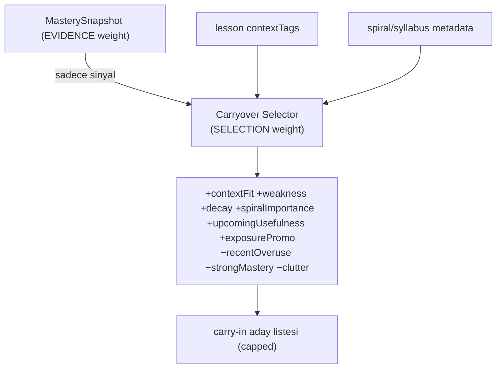

# Content Selection

<!-- gh-toc -->

## İçindekiler

- [Executive Summary](#executive-summary)
- [Why It Exists](#why-it-exists)
- [Current Canon](#current-canon)
- [How It Works](#how-it-works)
- [Diagrams](#diagrams)
- [Runtime Implementation](#runtime-implementation)
- [Known Gaps](#known-gaps)
- [Open Questions](#open-questions)
- [Policy Hardening — Selection Triggers (2026-07-18)](#policy-hardening-selection-triggers-2026-07-18)
- [Policy Hardening — Controlled contextTags Vocabulary (2026-07-18)](#policy-hardening-controlled-contexttags-vocabulary-2026-07-18)
- [Related Notes](#related-notes)

> [!canon] Purpose — "Bugün öğrenciye ne gösterilecek?" nasıl karar verilir? Carryover selection-score girdileri, practice selector önceliği, ve EVIDENCE-weight vs SELECTION-weight ayrımı.

## Executive Summary

İçerik seçimi Cairn'in "neyin geri döneceğine hafıza karar versin" sözünün mekaniğidir. İki ayrı seçici vardır: **Carryover Selector** (hangi eski chip'ler bu derse aday) ve **Practice Selector** (bugünün pratik seti). İkisi de mastery'yi bir *sinyal* olarak kullanır ama **asla skor üretmez** — bu, kritik ayrımın kalbidir: **EVIDENCE WEIGHT** (mastery çarpanı, reducer'da) ile **SELECTION WEIGHT** (ne teklif edilecek, selector'da) **asla karışmaz** (`LESSON_FLOW_CANON_v1.md §5.3`). Seçim çok-girdili bir skordur (contextFit, weakness, decay, spiralImportance...), mekanik dump değil.

## Why It Exists

Naif tasarım her eski chip'i her derse döker (yük patlar) ya da mastery çarpanını doğrudan seçime karıştırır (evidence bozulur). Cairn bunları ayırır: mastery sadece "ne kadar zayıf/güçlü" der; selector "bunu bugün göster/gösterme" der. Bu ayrım, kanıt bütünlüğünü korurken pedagojik esneklik verir.

## Current Canon

### Carryover selection-score girdileri (CANONICAL, v0.3:354-363)
`+contextFit +weakness +decay +spiralImportance +upcomingUsefulness +exposurePromotionPotential −recentOveruse −strongMastery −screenClutterRisk`

Bu bir ağırlıklı skordur: bağlama uyan, zayıf, solmuş, spiral açısından önemli, yakında gerekli, exposure-promotion fırsatı olan chip'ler **yukarı**; yakın zamanda aşırı kullanılmış, çok güçlü, ekranı kalabalıklaştıran chip'ler **aşağı**.

### Dormant reactivation trigger'ları (CANONICAL, v0.3:346-352)
mastery weak; context gerektirir; recall/decay zamanı; yeni pattern ihtiyacı; scheduled review; exposure promotion fırsatı. Bkz. [[Chip Lifecycle]].

### Practice selector önceliği (CANONICAL, §5.2)
SRS due (eski önce) → en zayıf weakPointTag → yaklaşan integration ihtiyaç listesi → çeşitlilik (family ardışık ≤2). Bkz. [[Review and Recycling System]].

### İki ağırlık ayrımı (CANONICAL, §5.3)
> [!canon] **EVIDENCE WEIGHT** = mastery çarpanı, mastery reducer'da yaşar (kanıtı nasıl tartıyoruz). **SELECTION WEIGHT** = bugün ne teklif edilecek, practice selector'da yaşar (ne gösteriyoruz). **İkisi asla karışmaz.** `practice-selector.ts` "SELECTION weight only ... never scores anything".

### Rolling window (CANONICAL)
"The global learned chip graph can grow indefinitely" ama "the active carryover window should peak / roll, not grow linearly forever" (`v0.3:380-381`). Recycle Load Protection: target load baskın, recycle destekleyici, exposure capped (`v0.3:388-390`). Bkz. [[Difficulty and Cognitive Load]].

## How It Works

### Inputs
MasterySnapshot (weakness/decay/dueAt/strongMastery), lesson `contextTags` (EXPLICIT caller input; boş → fail-closed), spiral/syllabus metadata, yaklaşan integration ihtiyaç listesi.

### Outputs
- Carryover Selector → bu dersin carry-in aday listesi (skorlu, capped).
- Practice Selector → bugünün seti (5–8 micro-action).

### Guardrails
- Selector asla skor üretmez (evidence bozmaz).
- `contextTags` boşsa fail-closed.
- Recent overuse / screen-clutter aşağı çeker (yük koruması).
- Aynı family ardışık ≤2 (çeşitlilik).

## Diagrams

Mastery yalnızca sinyal verir; selector çok-girdili bir skorla adayları sıralar ve sınırlar. Evidence ve selection ağırlıkları ayrı katmanlarda kalır.

## Runtime Implementation
### Code References
- `lemot-app/content/learning-engine/carryover-selector.ts` — selection-score (fixture/spec-only).
- `lemot-app/content/learning-engine/practice-selector.ts` — "today's set", SELECTION-only (fixture/spec-only).
- `lemot-app/content/learning-engine/lexique-memory.ts` — recall/dormant aday türetimi (fixture/spec-only).
### Product-Stage Availability
Tüm seçiciler **sandbox-only**; canlı v1 dersleri seçimi yazılı içerikte elle yapar.

## Known Gaps
- Selector'lar canlı ders yüzeyine wire değil.
- Sayısal carryover reach kanonlaşmadı (bkz. [[Spine and Carryover Logic]]).

## Open Questions
> [!open-loop] Selection-score ağırlıkları nasıl kalibre edilecek (veri olmadan)? → [[05 Open Loops]]

## Policy Hardening — Selection Triggers (2026-07-18)

> [!canon] **PRIMARY POLICY HOME** for carryover/return **selection triggers**. Eligibility penceresi [[Chip Lifecycle]]'te; contract [[Spine and Carryover Logic]]'te; yük tavanları [[Difficulty and Cognitive Load]]'ta. Bu, yukarıdaki v0.3:354-363 skor girdilerini **genişletir** (çelişmez). Sınıf: **[LOCKED DEFAULT]** (ağırlık kalibrasyonu **OPEN/TUNABLE**).

Selector bir item'ı **eligibility penceresi içindeyse** (horizon) skorlar; skor **hangisinin döneceğine** karar verir. Selector **asla evidence weight üretmez** (§5.3 ayrımı korunur).

### Positive triggers (yukarı çeker)

`contextFit` · `weakness` · `decay / refreshDue` · `spiralImportance` · `upcomingUsefulness` · `integrationNeed` *(yeni)* · `prerequisiteNeed` *(yeni)* · `exposurePromotionPotential`

### Negative triggers (aşağı çeker)

`recentOveruse` · `alreadyStrong` · `screenClutterRisk` · `contextMismatch` *(yeni)* · `duplicateFunction` *(yeni)* · `totalLoadPressure` *(yeni — [[Difficulty and Cognitive Load]] yük tavanı baskısı)*

### Hard exclusions [HARD INVARIANT] (skordan bağımsız, asla seçilmez)

- **full-sentence / multi-clause chip** (yalnız model answer — [[Chip Taxonomy]]).
- **identity ambiguity** — aynı yüzey için çözülmemiş kimlik ([[Chip Taxonomy]] identity stability).
- **target overlap incidental carryover olarak yanlış sınıflanmış** (gerçek hedef → supported/integration target, [[Spine and Carryover Logic]]).
- **hiç temas edilmemiş item** (never-contacted → carryover adayı olamaz).
- **exposure-only item bir zorunlu üretim slotunda** (production gerektirmeyen item üretim slotuna konamaz).
- **context mismatch** (bağlam uymuyorsa geri getirilmez).
- **too recent AND already strong** — mevcut selector semantiğine tabi (yakın + güçlü item bastırılır).

## Policy Hardening — Controlled contextTags Vocabulary (2026-07-18)

> [!canon] **PRIMARY POLICY HOME** for `contextTags` as a **controlled authoring vocabulary**. Sınıf: **[HARD INVARIANT] / [LOCKED DEFAULT] / [OPEN]**. **Bugünkü gerçek:** `contextTags` runtime'da serbest-metin `string[]` (`carryover-selector.ts:58`, EXPLICIT caller input) — kanonik registry **yok**. Bu bölüm **policy** kurar; kod/şema değiştirmez.

### Kural [HARD INVARIANT]

- `contextTags` **tek bir kanonik controlled registry**'den gelmeli.
- Yazar/agent ders/item dosyalarında **inline yeni tag icat edemez.**
- **Bilinmeyen tag → fail closed.**
- **Boş contextTags**, context-matching gereken yerde **fail closed** kalır (mevcut selector davranışı).
- Selector eşleşmesi **kanonik tag** kullanır, keyfi yazım varyantı değil.

### Controlled registry, her tag için tanımlar [LOCKED DEFAULT]

canonical tag · kısa semantik anlam · izinli kullanım kapsamı · alias/deprecated formlar · varsa parent/group · örnekler · status (active/deprecated) · deprecated ise replacement tag.

### Normalizasyon [LOCKED DEFAULT]

- Alias'lar authoring/import sırasında **kabul** edilebilir,
- **kanonik değer persist edilir,**
- normalizasyon **deterministik**,
- alias'lar authored içerikte **süresiz kalmaz** (kanoniğe çevrilir).

### Yeni-tag prosedürü [LOCKED DEFAULT]

Bir yeni `contextTag` **aynı değişiklikte** şunları gerektirir: (1) registry girişi, (2) mevcut tag'lerin neden yetersiz olduğu, (3) etkilenen item/ders referansları, (4) collision/overlap kontrolü, (5) validation güncellemesi **veya** açık "validator-deferred" notu, (6) semantik vokabüler değişince CHANGELOG girişi.

### Bu pass'in sınırı [OPEN]

- **Büyük taksonomi UYDURULMADI.** Kanonik tag listesi **evidenced kullanımdan seed'lenmeli** (ayrı iş).
- **Gözlemlenen (kanonlaşmamış) mevcut string'ler:** `café`, `greeting`, `home`, `location`, `ordering` (`lemot-app/content/` içinde geçer) — **kanon değil**, seed adayı.
- **Collision/near-duplicate riskleri (yalnız tespit prompt'u, ön-onaylı değil):** `cafe`/`café` · `travel`/`trip` · `location`/`place` · `food`/`restaurant`/`ordering` · `feeling`/`state`/`wellbeing`. Merger **tahmin edilmez** — rapor edilir, karar ayrı.

### Enforcement status

- **authoring/import validator candidate** (henüz yok). **contextTag code/schema/validator bu pass'te eklenmedi.** Runtime enforcement iddia edilmez.

## Related Notes
[[Spine and Carryover Logic]] · [[Chip Lifecycle]] · [[Review and Recycling System]] · [[Mastery Model]] · [[Difficulty and Cognitive Load]] · [[Chip Taxonomy]] · [[Registry Architecture]] · [[Content Production Workflow]]
