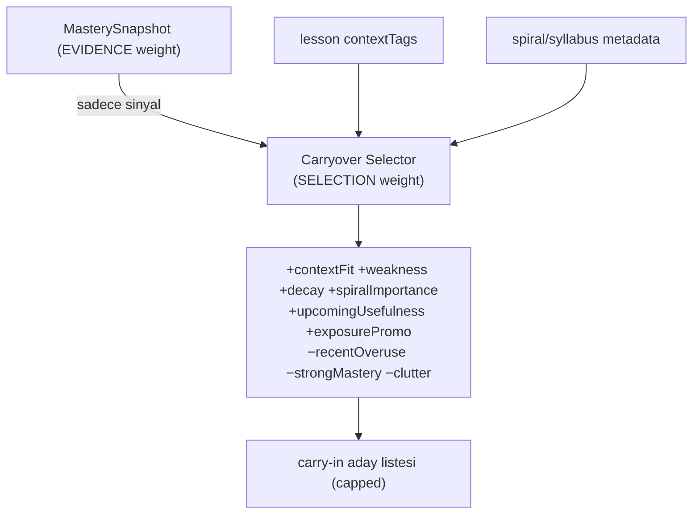

# Content Selection

<!-- gh-toc -->

## İçindekiler

- [Executive Summary](#executive-summary)
- [Why It Exists](#why-it-exists)
- [Current Canon](#current-canon)
- [How It Works](#how-it-works)
- [Diagrams](#diagrams)
- [Runtime Implementation](#runtime-implementation)
- [Known Gaps](#known-gaps)
- [Open Questions](#open-questions)
- [Related Notes](#related-notes)

> [!canon] Purpose — "Bugün öğrenciye ne gösterilecek?" nasıl karar verilir? Carryover selection-score girdileri, practice selector önceliği, ve EVIDENCE-weight vs SELECTION-weight ayrımı.

## Executive Summary

İçerik seçimi Cairn'in "neyin geri döneceğine hafıza karar versin" sözünün mekaniğidir. İki ayrı seçici vardır: **Carryover Selector** (hangi eski chip'ler bu derse aday) ve **Practice Selector** (bugünün pratik seti). İkisi de mastery'yi bir *sinyal* olarak kullanır ama **asla skor üretmez** — bu, kritik ayrımın kalbidir: **EVIDENCE WEIGHT** (mastery çarpanı, reducer'da) ile **SELECTION WEIGHT** (ne teklif edilecek, selector'da) **asla karışmaz** (`LESSON_FLOW_CANON_v1.md §5.3`). Seçim çok-girdili bir skordur (contextFit, weakness, decay, spiralImportance...), mekanik dump değil.

## Why It Exists

Naif tasarım her eski chip'i her derse döker (yük patlar) ya da mastery çarpanını doğrudan seçime karıştırır (evidence bozulur). Cairn bunları ayırır: mastery sadece "ne kadar zayıf/güçlü" der; selector "bunu bugün göster/gösterme" der. Bu ayrım, kanıt bütünlüğünü korurken pedagojik esneklik verir.

## Current Canon

### Carryover selection-score girdileri (CANONICAL, v0.3:354-363)
`+contextFit +weakness +decay +spiralImportance +upcomingUsefulness +exposurePromotionPotential −recentOveruse −strongMastery −screenClutterRisk`

Bu bir ağırlıklı skordur: bağlama uyan, zayıf, solmuş, spiral açısından önemli, yakında gerekli, exposure-promotion fırsatı olan chip'ler **yukarı**; yakın zamanda aşırı kullanılmış, çok güçlü, ekranı kalabalıklaştıran chip'ler **aşağı**.

### Dormant reactivation trigger'ları (CANONICAL, v0.3:346-352)
mastery weak; context gerektirir; recall/decay zamanı; yeni pattern ihtiyacı; scheduled review; exposure promotion fırsatı. Bkz. [[Chip Lifecycle]].

### Practice selector önceliği (CANONICAL, §5.2)
SRS due (eski önce) → en zayıf weakPointTag → yaklaşan integration ihtiyaç listesi → çeşitlilik (family ardışık ≤2). Bkz. [[Review and Recycling System]].

### İki ağırlık ayrımı (CANONICAL, §5.3)
> [!canon] **EVIDENCE WEIGHT** = mastery çarpanı, mastery reducer'da yaşar (kanıtı nasıl tartıyoruz). **SELECTION WEIGHT** = bugün ne teklif edilecek, practice selector'da yaşar (ne gösteriyoruz). **İkisi asla karışmaz.** `practice-selector.ts` "SELECTION weight only ... never scores anything".

### Rolling window (CANONICAL)
"The global learned chip graph can grow indefinitely" ama "the active carryover window should peak / roll, not grow linearly forever" (`v0.3:380-381`). Recycle Load Protection: target load baskın, recycle destekleyici, exposure capped (`v0.3:388-390`). Bkz. [[Difficulty and Cognitive Load]].

## How It Works

### Inputs
MasterySnapshot (weakness/decay/dueAt/strongMastery), lesson `contextTags` (EXPLICIT caller input; boş → fail-closed), spiral/syllabus metadata, yaklaşan integration ihtiyaç listesi.

### Outputs
- Carryover Selector → bu dersin carry-in aday listesi (skorlu, capped).
- Practice Selector → bugünün seti (5–8 micro-action).

### Guardrails
- Selector asla skor üretmez (evidence bozmaz).
- `contextTags` boşsa fail-closed.
- Recent overuse / screen-clutter aşağı çeker (yük koruması).
- Aynı family ardışık ≤2 (çeşitlilik).

## Diagrams

Mastery yalnızca sinyal verir; selector çok-girdili bir skorla adayları sıralar ve sınırlar. Evidence ve selection ağırlıkları ayrı katmanlarda kalır.

## Runtime Implementation
### Code References
- `lemot-app/content/learning-engine/carryover-selector.ts` — selection-score (fixture/spec-only).
- `lemot-app/content/learning-engine/practice-selector.ts` — "today's set", SELECTION-only (fixture/spec-only).
- `lemot-app/content/learning-engine/lexique-memory.ts` — recall/dormant aday türetimi (fixture/spec-only).
### Product-Stage Availability
Tüm seçiciler **sandbox-only**; canlı v1 dersleri seçimi yazılı içerikte elle yapar.

## Known Gaps
- Selector'lar canlı ders yüzeyine wire değil.
- Sayısal carryover reach kanonlaşmadı (bkz. [[Spine and Carryover Logic]]).

## Open Questions
> [!open-loop] Selection-score ağırlıkları nasıl kalibre edilecek (veri olmadan)? → [[05 Open Loops]]

## Related Notes
[[Spine and Carryover Logic]] · [[Chip Lifecycle]] · [[Review and Recycling System]] · [[Mastery Model]] · [[Difficulty and Cognitive Load]]
