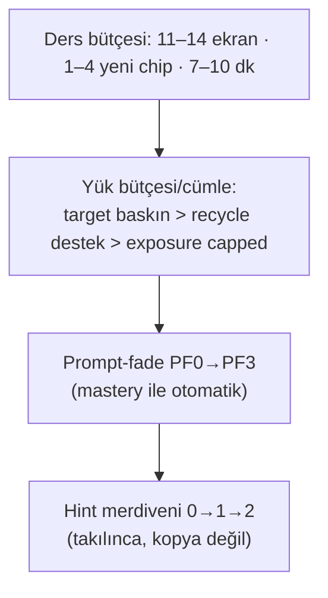

# Difficulty and Cognitive Load

<!-- gh-toc -->

## İçindekiler

- [Executive Summary](#executive-summary)
- [Why It Exists](#why-it-exists)
- [Current Canon](#current-canon)
- [How It Works](#how-it-works)
- [Failure Modes](#failure-modes)
- [Diagrams](#diagrams)
- [Runtime Implementation](#runtime-implementation)
- [Known Gaps](#known-gaps)
- [Open Questions](#open-questions)
- [Policy Hardening — Accounting and Budgets (2026-07-18)](#policy-hardening-accounting-and-budgets-2026-07-18)
- [Related Notes](#related-notes)

> [!canon] Purpose — Cairn zorluğu ve bilişsel yükü nasıl sınırlar? Ekran/chip bütçesi (invariant), recycle load protection, prompt-fade ve hint merdiveni — hepsi "yükü taşınabilir tut" ilkesinin araçları.

## Executive Summary

Cairn dersleri bilinçli olarak **küçüktür**. Bir invariant bütçe uygulanır: **11–14 ekran, 7–10 dakika, 1–4 yeni active chip, 3–5 üretim aksiyonu, ekran başına 1–3 micro-action (cap 4)** (`LESSON_FLOW_CANON_v1.md:36-44`). Yük üç mekanizmayla yönetilir: (1) **Recycle Load Protection** — "Recycle cannot steal the lesson"; her cümlenin bir yük bütçesi var (target baskın, recycle destek, exposure capped). (2) **Prompt-fade** (PF0–PF3) — desteğin kademeli çekilmesi. (3) **Hint merdiveni** — takılınca 0→1→2, ama asla kopyaya-hazır değil. Zorluk artar ama **her seferinde bir kenar**.

## Why It Exists

Bilişsel yük teorisi: çalışan bellek sınırlıdır; aynı anda çok yeni parça öğrenme başarısızlığı üretir. Cairn'in "calm premium journey" sözü de aynı yöne bakar — Duolingo tarzı yoğun döngü reddedilir. Bütçe invariantı bu ikisini birleştirir: her ders taşınabilir kalır, spine büyür ama patlamaz.

## Current Canon

### Ekran/chip bütçesi (CANONICAL, DEĞİŞMEZ, §1.1)
| Boyut | Sınır |
|---|---|
| Toplam ekran | 11–14 (9–11 aksiyon + 2–3 insight-card) |
| Micro-action | 15–25 toplam, ekran başına 1–3 (cap 4) |
| Süre | 7–10 dk |
| Yeni active chip | **1–4** |
| Üretim aksiyonu | 3–5 |

### Recycle Load Protection (CANONICAL, v0.3:388-390)
> "Recycle cannot steal the lesson." Her cümlenin bir yük bütçesi var: **target load baskın, recycle load destekleyici, exposure load opsiyonel ve capped.** Bkz. [[Chip Lifecycle]], [[Content Selection]].

### Prompt-fade (IMPLEMENTED engine, mastery.ts:35-36)
`PF_LEVELS = ["PF0","PF1","PF2","PF3"]`, `MAX_PF_INDEX = 3`. Başarı ile ilerler (destek çekilir), başarısızlık ile iner (destek geri gelir). Zorluğu mastery'ye göre otomatik ayarlar. Bkz. [[Mastery Model]].

### Hint merdiveni (IMPLEMENTED, Weave)
`hintLevel` 0→1→2: sessiz → ters-sıralı parçalar (asla kopyaya-hazır) → cloze şekli. "rebuild-the-thought, not copy" (EXERCISE_CANON §8). Bkz. [[Weave System]].

### Insight budget (CANONICAL + MECHANIZED)
L3 insight-card ≤3 (V5 validator, `canonRules.ts:158-165`, `INSIGHT_BUDGET_MAX=3`). Aşımı bilişsel yükü artırır → WARN.

### Integration Rhythm (CANONICAL heuristic)
~3 ardışık yeni-motor dersi review beat olmadan olmaz (`learning-engine-v1.md:130`) — yük dağıtımı için.

## How It Works

### State / Lifecycle
Prompt-fade item-başına mastery ile hareket eder; zorluk statik değil, kanıta uyarlanır. Hint merdiveni oturum içi, takılma anında devreye girer.

### Guardrails
- Yeni active chip ≤4/ders.
- Micro-action ≤4/ekran.
- Recycle target load'u çalamaz.
- Hint asla kopya sırası vermez (deterministik ters sıra).

## Failure Modes
- **Bütçe aşımı** → ders taşınamaz hale gelir; V1 (screen_action_count) ve V5 (insight_budget) yakalamak için var (V1 spec-only, V5 mekanize).
- **Recycle overload** → yeni öğrenme boğulur; load protection buna karşı.

## Diagrams

Yük dört kademede kontrol edilir: ders bütçesi, cümle-içi yük bütçesi, mastery-güdümlü prompt-fade ve takılma-anı hint merdiveni. Hepsi "her seferinde bir kenar" ilkesine hizmet eder.

## Runtime Implementation
### Code References
- `lemot-app/components/lesson-v1/screens/Weave.tsx` — hint ladder (IMPLEMENTED).
- `mastery.ts:35-36` — PF_LEVELS (engine, tested-only).
- `canonRules.ts:158-165` — V5 insight budget (MECHANIZED).
### Test References
`canonRules.test.ts` (V5).
### Product-Stage Availability
Hint ladder: dev-apk aktif. Prompt-fade: engine-only (v1 mastery çalıştırmaz). Bütçe: içerik-üretim kuralı (build-time).

## Known Gaps
- V1 (screen_action_count) mekanize değil (spec-only) — bütçe elle denetlenir.
- Prompt-fade canlı yüzeyde çalışmaz (event yok).

## Open Questions
> [!open-loop] Ekran-başına micro-action sınırı (V1) ne zaman mekanize edilecek? → [[05 Open Loops]]

## Policy Hardening — Accounting and Budgets (2026-07-18)

> [!canon] **PRIMARY POLICY HOME** for lesson load accounting, the production-load formula, and every numeric budget/cap. Diğer notlar sayıyı tekrar etmez, buraya link verir. Sınıflandırma etiketleri: **[HARD INVARIANT] / [LOCKED DEFAULT] / [TUNABLE PARAMETER] / [OPEN]**. Bu bir **authoring/canon policy** katmanıdır — canlı v1 runtime bunu **enforce etmez** (çoğu build-time/elle); bkz. [[#Non-claims]].

### Accounting fields (ders başına)

Her ders spec/review sheet'i şu alanları sayar (ledger: [[Content Production Workflow]]):

`activeNewCount` · `supportedTargetCount` · `productionCarryoverCount` · `recognitionCarryoverCount` · `repairItemCount` · `integrationTargetCount` · `exposureCount` · `totalProductionLoad`

### Production-load formülü [HARD INVARIANT]

```
totalProductionLoad =
    activeNewCount
  + supportedTargetCount
  + productionCarryoverCount
  + repairItemCount
  + integrationTargetCount
```

- **`activeNewCount` toplam ders zorluğu DEĞİLDİR.** Zorluk = `totalProductionLoad` + recognition/exposure yükü + ekran/insight bütçesi.
- **Anti-gaming [HARD INVARIANT]:** Bir ders "sadece 2 yeni chip" diyip fazla eski üretim yükünü `supportedTarget` / carryover / repair / integration kovalarına **saklayamaz**. `activeNew` bütçe kontrolü `totalProductionLoad` kontrolünü **geçersiz kılmaz**.
- **recognitionOnly ve ghost/exposure** item'ler `totalProductionLoad`'a **girmez** ama **ayrı bilişsel/yüzey bütçesi tüketir** (aşağıdaki cap'ler) — üretim gerektirmedikleri için "sahip olunan üretim" saymazlar ([[Chip Taxonomy]] role tanımları).

### Bütçe sınıfları [LOCKED DEFAULT]

Ayrı bütçeler; biri diğerini tüketmez:

- **activeNew budget** — [[Lesson Anatomy]] archetype'ına göre (Doorway 1–2, Standard 1–4, Integration 0).
- **supported/integration target budget** — eski hedefler; `activeNew`'i tüketmez, `totalProductionLoad`'a girer.
- **regular carryover budget** — görünür carryover; `activeNew`'i tüketmez.
- **repair reserve** — hata-tetikli; ayrı ve capped (aşağıda).
- **exposure budget** — ghost/exposure; capped, `totalProductionLoad`'a girmez.
- **total production / cognitive load** — hepsinin üstündeki tavan (ekran/chip invariantı, yukarıdaki §"Ekran/chip bütçesi").

### Numeric caps [TUNABLE PARAMETER] (tek kanonik yer)

| Cap | Değer | Sınıf | Not |
|---|---|---|---|
| Görünür carryover / ders | **≤ 3** | TUNABLE | CPW lint `carryover > 3` bunu enforce eder |
| Recycled item / cümle | **≤ 2** | TUNABLE | — |
| Exposure item / ünite | **≤ 2** | TUNABLE | recognition/ghost yüzey bütçesi |
| Weak (repair) item / cümle | **≤ 1** | TUNABLE | repair reserve ile hizalı |
| Target load share / ders | **≥ 0.50** | TUNABLE | CPW lint `target-share < 0.50` enforce eder |
| repairReserve / normal ders | **≤ 1 distinct item, ≤ 1 focused repair sequence** | LOCKED DEFAULT | aşağıda |

> [!warning] Bu sayılar **TUNABLE PARAMETER**'dır — sistem şekli kilitli, eşik smoke/kanıt sonrası değişebilir. **Bilimsel/kalibre-edilmiş değildir.** Enforcement bugün CPW build-time lint + elle; runtime validator DEĞİL ([[Content Production Workflow]]).

### Repair reserve [LOCKED DEFAULT]

- Normal derste **en fazla 1 distinct repair item** ve **1 odaklı repair dizisi**.
- Repair item `activeNew` bütçesini tüketmez; **ayrı capped repairReserve**'ü tüketir; **her zaman** `totalProductionLoad`'a girer.
- `totalProductionLoad` zaten doluysa: repair item **en düşük öncelikli normal carryover'ın yerine geçer** (öncelik değişir, yoğunluk değişmez).
- Yer değiştirme güvensizse: repair'i **Practice Hub / review**'a ertele.
- **[HARD INVARIANT]** Repair override **önceliği** değiştirir, **ders yoğunluğunu (total load) değiştirmez** — öğrenci hata yaptı diye daha yoğun bir dersle cezalandırılmaz. Eligibility ve akış: [[Error Tracking System]].

### Non-claims

- Bu bütçe/cap'ler **canlı v1 runtime'da enforce edilmez** (build-time lint + elle; runtime event yok).
- Sayılar **empirik olarak doğrulanmış değildir** (TUNABLE).
- Mevcut derslerin hepsinin bu ledger'a **uyduğu iddia edilmez** — retro-audit ayrı bir görev.

## Related Notes
[[Lesson Anatomy]] · [[Chip Lifecycle]] · [[Weave System]] · [[Mastery Model]] · [[Content Selection]] · [[Spine and Carryover Logic]] · [[Error Tracking System]] · [[Content Production Workflow]]
