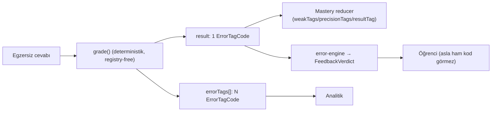

# Error Tracking System

<!-- gh-toc -->

## İçindekiler

- [Executive Summary](#executive-summary)
- [Why It Exists](#why-it-exists)
- [Current Canon](#current-canon)
- [How It Works](#how-it-works)
- [Diagrams](#diagrams)
- [Runtime Implementation](#runtime-implementation)
- [Known Gaps](#known-gaps)
- [Open Questions](#open-questions)
- [Kaynak içe aktarımı (Learning Engine Taxonomy, 2026-06-29 vault)](#kaynak-içe-aktarımı-learning-engine-taxonomy-2026-06-29-vault)
- [Policy Hardening — Error → Weakness → Repair (2026-07-18)](#policy-hardening-error-weakness-repair-2026-07-18)
- [Related Notes](#related-notes)

> [!canon] Purpose — Cairn bir hatayı nasıl etiketler, saklar ve mastery'ye taşır? 16-değerli `ErrorTagCode`, 27-değerli `WEAK_POINT_TAGS`, üç öğrenci-kanıt anahtarı (weakTags/precisionTags/resultTag) ve neden hepsinin dondurulduğu (YASA 3).

## Executive Summary

Hata takibi Cairn'in kanıt (evidence) katmanıdır. Grading deterministik ve registry-free'dir: `grade()` tek bir **`ErrorTagCode`** yayar (16-değerli frozen union). Bir `LearningEvent` bir `result` (mastery'ye giden tek kod) ve `errorTags[]` (analitiğe giden çoklu) taşır. Pedagojik zayıflıklar ayrı bir **27-değerli `WEAK_POINT_TAGS`** listesiyle anahtarlanır. Üç anahtar — **weakTags / precisionTags / resultTag** — öğrenci kanıtının referans anahtarlarıdır ve bu yüzden **YASA 3** ile sonsuza dek dondurulmuştur.

> [!warning] **Kritik uyumsuzluk:** sevkedilen **v1 renderer HİÇ LearningEvent yaymaz.** Fill/Weave/SayIt doğruluğu lokal hesaplar, hiç telemetri/kanıt üretmez. ErrorTagCode taksonomisi, mastery reducer ve event modeli **yalnızca learning-engine'de (sandbox)** yaşar (evidence 03: "v1 renderer emits NO LearningEvents", `03_exercises.md:427-433`).

## Why It Exists

"Neyin geri döneceğine hafıza karar versin" için hafızanın kanıta ihtiyacı var. Hata takibi bu kanıtı üretir: her yanlış cevap bir tag'e, tag mastery sayaçlarına, sayaçlar Mon Lexique/Practice projeksiyonlarına akar. Ama iki farklı dil vardır — bir **stored grading dili** (`ErrorTagCode`) ve bir **learner-facing feedback dili** (`FeedbackVerdict`). Bunları karıştırmak öğrenciye ham teknik kod göstermek demektir; error-engine bu köprüdür.

## Current Canon

### Grading dili — `ErrorTagCode` (IMPLEMENTED, `events.ts:31-47`)
16-değerli frozen union (VERIFIED):
```
correct · accepted_variant · punctuation_only · accent_only · spelling_near_miss ·
wrong_item · wrong_order · missing_word · extra_word · wrong_register · meaning_shift ·
blocked_form_used · recognition_only_form_used · overproduction_unseen_form ·
incorrect_but_understandable · empty_or_skip
```
`grade()` bunların "güvenli deterministik alt kümesini (16'nın 12'si)" yayar; registry-aware bir adaptör sonradan `wrong_item`/`overproduction_unseen_form`/`meaning_shift` yayabilir; "mastery zaten herhangi bir tag'i generic işler, bu bir superset ilişkisi, gap değil" (`p0-p2-checkpoint.md:70-72`). Compile-time exhaustiveness lock `ERROR_TAG_CODES` üzerinde (events.ts:75-81).

### Event kaydı (IMPLEMENTED)
`LearningEvent` (events.ts:107-134): `result: ErrorTagCode` (119), `errorTags: ErrorTagCode[]` (120), `clientEventId` (idempotency), `timestamp`, `itemIds`, `operation`, `sync` bloğu (`pending`/`synced`), `userAnswer` (ham metin, privacy-gated). Mastery reducer bunları per-item sayaçlara katlar: `seenCount`, `wrongCount`, `productionFailure`/`recognitionFailure`, `productionSuccess`/`recognitionSuccess`, `productionAttempts`/`recognitionAttempts`, **`weakTags`**, **`precisionCount`**, **`precisionTags`**.

### İki-vokabüler köprü — `error-engine.ts` (IMPLEMENTED, fixture/spec-only)
"Error Engine v0 (Cairn spec §13) — pure, AI-free, no storage/network" — `ErrorTagCode` (grading/stored, "It stays") ile **`FeedbackVerdict`** (learner-facing) arasındaki **tek köprü**. "Anything that renders feedback to the learner must consume a `FeedbackVerdict` (via `resolveFeedback` / `feedbackVerdictFromGrade`), never a raw `ErrorTagCode`." Bkz. [[Feedback and Scoring Philosophy]].

### Zayıf-nokta taksonomisi — `WEAK_POINT_TAGS` (IMPLEMENTED, `weakPointTags.ts:1-28`)
27-değerli frozen liste (VERIFIED): `avoir-vs-etre`, `j-ai-vs-je-suis`, `negation`, `ne-pas`, `ne-plus`, `y`, `en`, `y-en-contrast`, `object-pronoun-le-la-les`, `lui-leur`, `pronoun-order`, `aller-future`, `passe-compose`, `imparfait`, `past-contrast`, `conditional-softness`, `subjunctive-doorway`, `imperative`, `politeness`, `natural-speech`, `elision`, `liaison`, `silent-letters`, `gender`, `articles`, `partitives`, `prepositions`.

### Üç öğrenci-kanıt anahtarı + YASA 3 (CANONICAL + IMPLEMENTED, 2026-07-05)
> [!canon] `ROADMAP.md:31-40` (YASA 3): error tag'ler "öğrenci kanıtının referans anahtarıdır (**weakTags / precisionTags / resultTag**)". Bu yüzden dondurulurlar: "Shipped bir tag yeniden adlandırılamaz, silinemez; yeni tag AYNI PR içinde manifest'e kaydedilir." IMPLEMENTED: `scripts/shipped-error-tags.json` (**54 tag frozen** = WEAK_POINT_TAGS + ERROR_TAG_CODES + ERROR_TAXONOMY ids + content usage), bidirectional `validate:content` HARD ERROR, growth `npm run manifest:add-tag`. events.ts:53: "manifest freezes these values forever — learner evidence references them by string."

## How It Works

### Inputs / Outputs
Girdi: egzersiz cevabı. `grade()` → tek `ErrorTagCode` (`result`) + `errorTags[]`. Çıktı: `LearningEvent` → `lm_le_events`. Mastery reducer bunu okur (bkz. [[Mastery Model]]). Öğrenciye giden feedback: `FeedbackVerdict` (error-engine üzerinden).

### Guardrails
- Learner asla ham `ErrorTagCode` görmez → hep `FeedbackVerdict`.
- YASA 3: tag immutability, validator hard error.
- Precision tag'leri (punctuation/accent/spelling) failure değil (bkz. [[Mastery Model]]).

## Diagrams

Bir grade tek result (mastery'ye) + çoklu tag (analitiğe) üretir; öğrenciye giden yol her zaman FeedbackVerdict'ten geçer. Ama bu akış bugün yalnızca engine'de canlı.

## Runtime Implementation
### Code References
- `lemot-app/content/learning-engine/events.ts:31-47` — ErrorTagCode.
- `events.ts:107-134` — LearningEvent.
- `lemot-app/content/weakPointTags.ts:1-28` — 27 WEAK_POINT_TAGS.
- `lemot-app/content/learning-engine/error-engine.ts` — FeedbackVerdict köprüsü (fixture/spec-only).
- `lemot-app/scripts/shipped-error-tags.json` — 54-tag manifest.
### Test References
`events*.test.ts`, `canonRules.test.ts`, error-tag manifest validator.
### Product-Stage Availability
**Engine-only.** v1 renderer event yaymaz → error tracking canlı yüzeyde çalışmaz. Legacy `lm7` `logErr(...)` weak-spot tracker'ı ayrı ve bağımsızdır (`app/lesson/[id].tsx:284-303`, dev-apk-hidden).

## Known Gaps
- v1 renderer LearningEvent yaymaz (kanıt boşluğu).
- Legacy `logErr` ile engine ErrorTagCode iki ayrı hata sistemi.

## Open Questions
> [!open-loop] v1 egzersizleri engine event spine'ına ne zaman bağlanacak? → [[05 Open Loops]]

## Kaynak içe aktarımı (Learning Engine Taxonomy, 2026-06-29 vault)

> [!info] Kaynak: `Learning_Engine_and_Exercise_Types.md` §4 (Measurement / Signal Taxonomy) + §5 (Error source). **Zenginleştirir ama override ETMEZ** — runtime canon (HEAD `02f9f7a` / #196) üstün. Kaynağın merkez ilkesi: **"Measurement observes; it must not invent pedagogy."** Ölçüm gözlemler; yeni hedef yaratmaz, item'ı sessizce terfi ettirmez.

### Ölçüm / sinyal taksonomisi (kaynak §4)
Her egzersiz tipi bir "measurement mapping" taşır (ne yazabilir, hangi reveal/feedback'e bağımlı, hangi hataları doğurur, ne çıkarılmamalı). Ortak sözlük üç kova:

- **Event Signals** (ham olay): screen viewed · audio played/replayed · option selected · trap selected · typed attempt submitted · hint opened (pieces/cloze/idea) · confirmation reached · try-again used · keep-and-compare used · reveal viewed · lesson completed.
- **Derived Signals** (türetilmiş): hesitation/time-on-screen · retry count · missing authored target piece · repeated trap pattern · hint dependence · later recall success · production reuse across lessons.
- **Non-Signals** (sinyal DEĞİL — asla çıkarım yapma): bir completion ≠ mastery · bir reveal görüntüsü ≠ anlama · piece display ≠ piece ownership · AI övgüsü ≠ validation.

> [!warning] **Hata-kaynağını, öğrenci-zayıf-noktasına dönüşmeden ÖNCE sınıflandır** (kaynak §5). Miss'in kaynağı: learner / content / validator / UI-flow / tone / AI-generator / mastery-mapping error. Kötü distraktör, erken reveal, bozuk validator veya güvensiz üretilmiş item **öğrenci zayıflığı değildir**. Raw text veya AI freeform label kanonik hata sistemine dönüşemez; hata ancak taksonomiye *authored* edildikten sonra weak-point repair'i besler. Kaynak-sınıf → runtime `ErrorTagCode` eşlemesi için bkz. [[Exercise Error Matrix]].

Bu taksonomi bu notun mevcut kanonuyla **çelişmez**: runtime `ErrorTagCode`/`WEAK_POINT_TAGS`/YASA 3 = **stored grading dili**; §4 sinyal kovaları = onun *önündeki gözlem katmanı*. Ölçüm katmanı bugün yalnız engine/sandbox'ta canlıdır; **v1 renderer hiç LearningEvent yaymaz** (yukarıdaki Kritik uyumsuzluk).

## Policy Hardening — Error → Weakness → Repair (2026-07-18)

> [!canon] **PRIMARY POLICY HOME** for error-source classification → weakness → **repair eligibility ve akışı**. Repair'in **yük bütçesi** [[Difficulty and Cognitive Load]]'ta (repairReserve); mastery etkileri [[Mastery Model]]'de. Sınıf: **[HARD INVARIANT] / [LOCKED DEFAULT] / [TUNABLE PARAMETER]**.

### Weakness integrity [HARD INVARIANT]

- Error tracking **kanıt kaydeder; doğrudan pedagoji icat etmez.**
- **Tek bir miss** item'ı otomatik olarak sonraki derse **zorlamaz.**
- Yalnız **doğrulanmış öğrenci-kaynaklı hata** weakness yaratır.
- **content / validator / UI-flow / tone / AI-generator / mastery-mapping** hatası öğrenci zayıflığı **değildir** (yukarıdaki §Kaynak içe aktarımı §5 sınıflandırması).
- **exposure/ghost üretim başarısızlığı weakness yaratamaz** — üretim gerekmedi.
- **Precision-only** (punctuation/accent/spelling) mevcut precision politikasını izler ([[Mastery Model]]); **sessizce tam kavramsal weakness'a çevrilemez.**
- Error-triggered return **context ve safety** sınırlarına tabidir ([[Content Selection]] hard exclusions).

### Repair eligibility [LOCKED DEFAULT] (eşik [TUNABLE PARAMETER])

Bir item/tag **`repairEligible`** olur, şu iki durumdan **biri** olursa:

- aynı authored öğrenci hatası **aynı derste iki kez**, **veya**
- aynı hata **iki ayrı derste** tekrarlar.

> [!warning] Bu **eşik (twice / two-lesson)** bir **TUNABLE PARAMETER**'dır — sistem şekli kilitli, sayı smoke sonrası değişebilir; empirik değildir.

### Repair flow [LOCKED DEFAULT]

```
tek doğrulanmış miss
  → yalnız kanıt kaydet (return yok)

tekrarlı / eşik-aşan öğrenci hatası
  → repairEligible / weaknessReturn adayı

context-fit + load-fit (repairReserve ≤ 1)
  → ders repairReserve VEYA Practice Hub repair

başarılı repair
  → aciliyet AZALIR
  → zorunlu aynı-ders drill döngüsü YOK
  → sonraki 1–2 derste 1 spaced confirmation planla

başarılı spaced confirmation
  → repair override'ı KAPAT
  → item'ı normal rolling lifecycle'a döndür

kalıcı başarısızlık
  → weaknessReturn önceliğini koru, ama repair/load cap'lerini ASLA aşma
```

### Netleştirme [HARD INVARIANT]

- Repair item'ı **anında güçlü yapmaz.**
- Weakness geçmişi **silinmez.**
- Başarılı repair **aciliyeti azaltır** (mastery mapping: [[Mastery Model]]).
- Öğrenci hata yaptı diye **daha yoğun bir dersle cezalandırılmaz** — repair override önceliği değiştirir, ders yoğunluğunu değil ([[Difficulty and Cognitive Load]] repairReserve).

### Non-claims

- Error-driven repair **canlı v1 üretimde aktif değildir** (v1 renderer LearningEvent yaymaz — yukarıdaki Kritik uyumsuzluk). Bu bir **policy**dir, çalışan runtime değil.

## Related Notes
[[Mastery Model]] · [[Feedback and Scoring Philosophy]] · [[Self-Producing Engine]] · [[Exercise Error Matrix]] · [[Difficulty and Cognitive Load]] · [[Content Selection]] · [[Chip Lifecycle]]
