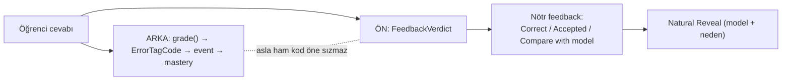

# Feedback and Scoring Philosophy

<!-- gh-toc -->

## İçindekiler

- [Executive Summary](#executive-summary)
- [Why It Exists](#why-it-exists)
- [Current Canon](#current-canon)
- [How It Works](#how-it-works)
- [Failure Modes](#failure-modes)
- [Diagrams](#diagrams)
- [Runtime Implementation](#runtime-implementation)
- [Known Gaps](#known-gaps)
- [Open Questions](#open-questions)
- [Related Notes](#related-notes)

> [!canon] Purpose — Cairn öğrenciye nasıl geri bildirim verir ve neden **puanlamaz**? Non-punitive ton, açık Weave'lerin derecelenmemesi, XP/skor/streak yasağı ve learner-facing FeedbackVerdict ayrımı.

## Executive Summary

Cairn'in feedback felsefesi tek cümleye iner: **kanıt topla, ama öğrenciyi cezalandırma.** Sevkedilen v1 yüzeyi **hiç skor/XP/streak/percent göstermez** (`LessonRendererV1.tsx:82-83`). Açık karışık Weave'ler **derecelenmez** — feedback reveal'dır (kilitli W1). "none" sonucu kırmızı bir hata değil, nötr bir "compare with the model" karşılaştırmasıdır. Say It Your Way asla grade etmez, asla boş ötesinde bloke etmez. Near-miss (noktalama/aksan/yazım) bir soft signal'dır, asla failure değil. Öğrenciye giden her feedback ham `ErrorTagCode` değil, learner-facing bir **`FeedbackVerdict`** olmalıdır.

## Why It Exists

Ürün sözü "calm premium journey ... learner confidence without gamification pressure." Puanlama ve ceza korku üretir, korku üretimi bloke eder. Ama kanıt (evidence) yine de gerekir — mastery ona dayanır. Cairn bu ikilemi ayırarak çözer: kanıt **arkada sessizce** toplanır (event/mastery), öğrenciye **önde** nötr, model-karşılaştırmalı, cesaretlendirici feedback gösterilir.

## Current Canon

### Skor/XP/streak yasağı (CANONICAL)
Header "part N of M" gösterir — **XP/score/streak/percent yok** (`LessonRendererV1.tsx:82-83`). Yasak copy token'ları (FLOW §Rule 3): **streak, XP, level up, achievement, amazing, perfect score.** `componentCopyGuard.test.ts` + `devApkCopyGuard.test.ts` bunu mekanik olarak korur. Bkz. [[Copy and Tone]].

### Açık Weave ungraded (CANONICAL, kilitli W1)
Açık karışık Weave derecelenmez; reveal feedback'tir. Grading an open mixed Weave = validator ERROR (EXERCISE_CANON §16). Weave sonuçları (`Weave.tsx:26-30`): exact="Correct." (yeşil), alternative="Accepted." (amber), none="Compare with the model answer." (**NÖTR, kırmızı değil**). Bkz. [[Weave System]].

### Say It Your Way asla grade etmez (CANONICAL)
"never grades, never blocks beyond empty" (`SayItYourWayV1.tsx` comment 25-27, 42-46). Anti-pattern (§16): "Speaking gives praise without target detection = ERROR" — model-answer-only asla sahte övgü uydurmaz. Bkz. [[Say It Your Way]].

### Near-miss soft signal (CANONICAL + IMPLEMENTED)
Precision tag'leri (punctuation_only/accent_only/spelling_near_miss) failure değil; soft signal (bkz. [[Mastery Model]]). Öğrenciyi weak yapmaz, kutusunu indirmez.

### FeedbackVerdict ayrımı (CANONICAL, IMPLEMENTED engine)
> [!canon] "Anything that renders feedback to the learner must consume a `FeedbackVerdict` (via `resolveFeedback` / `feedbackVerdictFromGrade`), never a raw `ErrorTagCode`." — `error-engine.ts` header. `ErrorTagCode` = stored/grading dili (arkada); `FeedbackVerdict` = learner-facing dili (önde). Bkz. [[Error Tracking System]].

### Discovery vs Assessment (CANONICAL, §1.3)
Meet+Notice = discovery (yanlış yok, skor yok); Build sonrası = assessment (kanıt üretir). Discovery ekranlarında feedback yok, çünkü ölçüm yok.

## How It Works

### Inputs / Outputs
Girdi: öğrenci cevabı. Arka çıktı: `ErrorTagCode` → event → mastery. Ön çıktı: FeedbackVerdict → nötr, model-karşılaştırmalı feedback (Natural Reveal). Bkz. [[Natural Reveal]].

### Guardrails
- Yasak token'lar (streak/XP/...) — copy guard testleri.
- Açık Weave dereceleme yasak.
- Say It grade/bloke yasak.
- Ham ErrorTagCode öğrenciye gösterilmez.
- Sahte övgü yok (target detection olmadan praise = ERROR).

## Failure Modes
- **Ham teknik kodu göstermek** → FeedbackVerdict köprüsü atlanırsa olur; error-engine bunu engeller.
- **Yasak dilin sızması** → copy guard testleri build-time yakalar.
- **Açık Weave'i derecelemek** → validator ERROR.

## Diagrams

Aynı cevap iki yola ayrılır: arkada sessiz kanıt, önde nötr model-karşılaştırma. İki dil (ErrorTagCode / FeedbackVerdict) asla karışmaz.

## Runtime Implementation
### Code References
- `LessonRendererV1.tsx:82-83` — no XP/score/streak.
- `Weave.tsx:26-30` — nötr RESULT_NOTES.
- `SayItYourWayV1.tsx` — grade etmez.
- `error-engine.ts` — FeedbackVerdict köprüsü (fixture/spec-only).
### Test References
`componentCopyGuard.test.ts`, `devApkCopyGuard.test.ts`, `weaveMatch.test.ts`.
### Product-Stage Availability
Non-punitive ton + no-score: dev-apk aktif (IMPLEMENTED). FeedbackVerdict köprüsü: engine-only (v1 renderer feedback'i lokal, deterministik verir).

## Known Gaps
- v1 feedback FeedbackVerdict köprüsünü kullanmaz (lokal hesap); engine köprüsü ayrı.
- Evidence weighting (EXERCISE_CANON §2 bands) mastery-v0.3 PROPOSAL.

## Open Questions
> [!open-loop] v1 feedback ne zaman FeedbackVerdict köprüsüne geçecek? → [[05 Open Loops]]

## Related Notes
[[Weave System]] · [[Error Tracking System]] · [[Mastery Model]] · [[Natural Reveal]] · [[Copy and Tone]] · [[Say It Your Way]]
