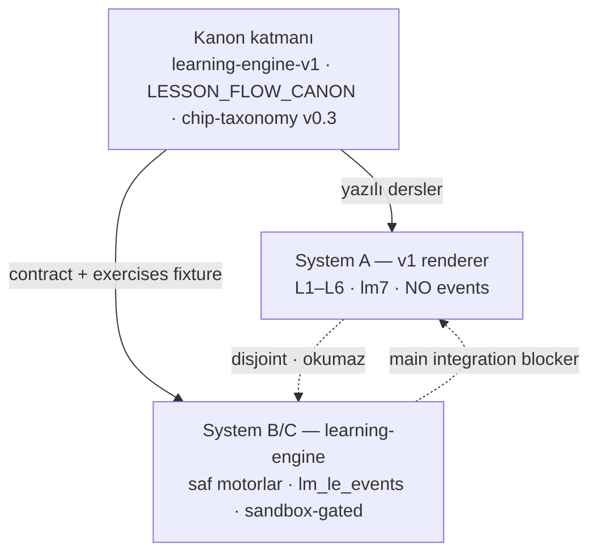

# Learning System Overview

<!-- gh-toc -->

## İçindekiler

- [Executive Summary](#executive-summary)
- [Why It Exists](#why-it-exists)
- [Current Canon](#current-canon)
- [How It Works](#how-it-works)
- [Failure Modes](#failure-modes)
- [Diagrams](#diagrams)
- [Runtime Implementation](#runtime-implementation)
- [Known Gaps](#known-gaps)
- [Open Questions](#open-questions)
- [Related Notes](#related-notes)
- [🧭 GitHub Navigation](#-github-navigation)

> [!canon] Purpose — Cairn'in **öğrenme sistemi** nedir, hangi katmanlardan oluşur, bugün gerçekte ne çalışıyor ve nerede sadece spec/fixture olarak duruyor? Bu not `02_LEARNING_SYSTEM` klasörünün giriş kapısıdır (MOC).

## Executive Summary

Cairn'in öğrenme sözü şudur: **kullanılabilir parçaları (chip) önce öğret → öğrencinin bunları gerçek niyet içinde ÜRETmesine izin ver → mantığı temastan *sonra* aç → neyin geri döneceğine hafıza karar versin.** Bu söz iki paralel, **birbirine bağlı olmayan** sistemle taşınıyor: sevkedilen **v1 renderer** (System A, L1–L6, statik yazılmış dersler) ve uzun vadeli **learning-engine** (System B/C, saf motorlar, sandbox/founder-gated). Kanon katmanı (`learning-engine-v1.md`, `LESSON_FLOW_CANON_v1.md`, chip-taxonomy v0.3) zengin; runtime çok daha yalın. Bu notun tek işi, bu üç katmanı (kanon / kod / kanıt) **birbirine karıştırmadan** haritalamak.

## Why It Exists

Le Mot tarihindeki en pahalı hata "karar verildi = çalışıyor = kanıtlandı" sanmaktı. Öğrenme sisteminde bu tuzak çok yoğun: chip taksonomisi 12 davranışsal tip tarifliyor ama runtime tek bir `status` enum'una çöküyor; mastery modeli 9-state diliyle konuşuluyor ama gerçek kaynak sayaç-türevli `MasterySnapshot`; bir "self-producing engine" var ama iki store (`lm7` vs `lm_le_events`) birbirini okumuyor. Bu overview, her alt-notun hangi sistemden bahsettiğini net tutmak için var.

## Current Canon

### İki-sistem yarığı (en önemli yapısal gerçek)

> [!warning] Repo **iki paralel, paylaşımsız öğrenme sistemi** çalıştırır. Aşağıdaki her iddia hangi sisteme ait olduğuyla birlikte okunmalı. — `chip-taxonomy-and-lexique-lifecycle-v0.3.md:20-22`

| Sistem | Ne | Statü |
|---|---|---|
| **A — Live v1 renderer** | `content/lessons/v1/*`, `components/lesson-v1/*`, `itemRegistry.ts`, `lessonTypes.ts`. L1–L6 render eder. | **IMPLEMENTED, runtime-active** (sandbox + dev-apk). Legacy `lm7` store, `{lessonId}-{sectionKey}: true`. |
| **B/C — Learning-engine** | `content/learning-engine/*` saf modüller + fixture'lar; renderer `app/learn/[fixtureId].tsx`. | **IMPLEMENTED ama sandbox/founder-gated.** Append-only `lm_le_events` yazar. Uzun vadeli ürün temeli. |

`app/(tabs)/index.tsx:151-155`: v1 yolu "Surfaced for internal (sandbox) and ... dev-apk". Learner renderer ise `PRODUCT_STAGE === "sandbox" && FEATURES.v1LessonEngine` ile kapılı (`p3-learner-renderer-checkpoint.md:54`), public-nav'da yok.

> [!warning] İki store **disjoint**: engine renderer `lm_le_events` yazar ama Home/Progress/Daily Review onu okumaz; v1 marker `lm7` yazar ama engine onu okumaz. Bu ayrılık **"the main integration blocker"** olarak adlandırılır (`learning-engine-progress-bridge-decision.md:39-42`). Detay: [[Self-Producing Engine]].

### Core Loop (CANONICAL, spec)

`learning-engine-v1.md:29-41`: her öğrenme nesnesi 7-aşamalı spiralden geçer — **Moment → Pieces → Pattern → Production → Reveal → Memory → Ownership**. "The loop is a spiral, not a circle" (line 41). Production "the point of the app" (line 36); onu besleyen üretim yüzeyi **killer trinity: Weave + Say It Your Way + Natural Reveal** (line 23).

### Ders girdi modeli (CANONICAL)

Bir ders tek cümleden değil, **sentence family**'den başlar: anchor + variation + contrast + rescue/natural + değiştirilebilir parçalar (`learning-engine-v1.md:47-57`). Detay: [[Lesson Anatomy]].

## How It Works

### Inputs
- **Kanon katmanı:** `learning-engine-v1.md` (pedagoji, "spec, not code" — line 3), `LESSON_FLOW_CANON_v1.md` (ders akışı, 2026-07-05), `chip-taxonomy v0.3` (chip davranışları).
- **Runtime içerik:** `content/lessons/v1/lesson-000..015.ts` (statik yazılmış); `itemRegistry.ts` (ITEM_REGISTRY, ~54 item, frozen).
- **Engine fixture'lar:** L1/L2/L11/L12/L14/L15/L16/L18 için `*.contract.ts` + `*.exercises.ts`.

### Outputs
- **System A:** ekran-doğru yürüyüş → tek legacy completion marker (`{number}-read_listen=true`), hiç LearningEvent üretmez.
- **System B:** `lm_le_events` append-only log → sayaç-türevli `MasterySnapshot` (bkz. [[Mastery Model]]).

### State / Lifecycle
Chip yaşam döngüsü (whole → use → notice → unpack → reuse) ve carryover/mon-lexique döngüleri [[Chip Lifecycle]]'te; spine/carryover mantığı [[Spine and Carryover Logic]]'te.

### Main Rules
- **Whole first, unpack later** (bkz. [[Whole First, Unpack Later]]).
- **Her ders yeni bir şey tanıtmalı, eskisini büyütmeli, geleceği hazırlamalı** (`learning-engine-v1.md:128`).
- **Screen budget invariant:** 11–14 ekran, 7–10 dk, 1–4 yeni active chip (`LESSON_FLOW_CANON_v1.md:36-44`). Bkz. [[Difficulty and Cognitive Load]].

### Guardrails
- Yasak dil: streak, XP, level up, achievement, "amazing/perfect score" (`FLOW §Rule 3`; `componentCopyGuard.test.ts`).
- AI çekirdek değil, destek katmanı; "The engine must be sound without AI" (`learning-engine-v1.md:276`). Bkz. [[AI Role and Guardrails]].
- Smoke sınırdır: "No runtime engine implementation before the Dev APK smoke test" (`learning-engine-v1.md:271`).

## Failure Modes
- **Kanon-runtime karıştırma:** zengin taksonomiyi runtime sanmak. Her alt-not bunu inline etiketlerle ayırır.
- **İki store karışması:** engine'de tamamlanan bir egzersiz Home'da hiçbir şey değiştirmez — beklenirse bug gibi görünür ama tasarım gereğidir (integration blocker).

## Diagrams

Yukarıdaki diyagram özü verir: tek kanon iki ayrı runtime'ı besler; iki runtime birbirini okumaz. Sevkedilen yüzey A, ürün geleceği B.

## Runtime Implementation
### Code References
- `lemot-app/content/lessonTypes.ts` — 7 frozen ScreenType.
- `lemot-app/content/itemRegistry.ts` — ITEM_REGISTRY.
- `lemot-app/content/learning-engine/` — mastery.ts, events.ts, graph.ts, carryover-selector.ts, mon-lexique.ts, practice-selector.ts, error-engine.ts.
- `lemot-app/app/(tabs)/index.tsx:151-155` — v1 path gate.

### Product-Stage Availability
System A: sandbox + dev-apk. System B/C: yalnızca sandbox/founder-gated deep-link. Detay: [[Product Stages and Feature Flags]].

## Known Gaps
- İki disjoint store → tek kaynak birleştirme yok (bkz. [[Self-Producing Engine]]).
- Runtime `status` enum, spec'in 12 chip tipini taşımıyor (bkz. [[Chip Taxonomy]]).

## Open Questions
> [!open-loop] Learning-engine public yüzeye ne zaman/nasıl çıkar? → [[05 Open Loops]]

## Related Notes
[[Lesson Anatomy]] · [[Lesson Flow]] · [[Chip System Overview]] · [[Chip Taxonomy]] · [[Weave System]] · [[Mastery Model]] · [[Error Tracking System]] · [[Self-Producing Engine]] · [[Runtime Content Architecture]]

<!-- gh-nav -->

## 🧭 GitHub Navigation

[⬆ README](../../README.md) · [🪨 Holy Codex](../00_START_HERE/00%20Le%20Mot%20Holy%20Codex.md) · [Current State](../00_START_HERE/03%20Current%20State.md) · [Open Loops](../00_START_HERE/05%20Open%20Loops.md)

**Bu klasördeki notlar (02_LEARNING_SYSTEM):**

- [AI Role and Guardrails](./AI%20Role%20and%20Guardrails.md)
- [Chip Lifecycle](./Chip%20Lifecycle.md)
- [Chip System Overview](./Chip%20System%20Overview.md)
- [Chip Taxonomy](./Chip%20Taxonomy.md)
- [Content Selection](./Content%20Selection.md)
- [Difficulty and Cognitive Load](./Difficulty%20and%20Cognitive%20Load.md)
- [Error Tracking System](./Error%20Tracking%20System.md)
- [Feedback and Scoring Philosophy](./Feedback%20and%20Scoring%20Philosophy.md)
- [Learning System Overview](./Learning%20System%20Overview.md) ⟵ *bu not*
- [Lesson Anatomy](./Lesson%20Anatomy.md)
- [Lesson Flow](./Lesson%20Flow.md)
- [Mastery Model](./Mastery%20Model.md)
- [Mon Lexique](./Mon%20Lexique.md)
- [Review and Recycling System](./Review%20and%20Recycling%20System.md)
- [Self-Producing Engine](./Self-Producing%20Engine.md)
- [Spine and Carryover Logic](./Spine%20and%20Carryover%20Logic.md)
- [Weave System](./Weave%20System.md)
- [Whole First, Unpack Later](./Whole%20First%2C%20Unpack%20Later.md)
