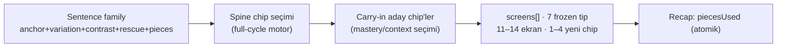

# Lesson Anatomy

<!-- gh-toc -->

## İçindekiler

- [Executive Summary](#executive-summary)
- [Why It Exists](#why-it-exists)
- [Current Canon](#current-canon)
- [How It Works](#how-it-works)
- [Examples](#examples)
- [Diagrams](#diagrams)
- [Runtime Implementation](#runtime-implementation)
- [Known Gaps](#known-gaps)
- [Open Questions](#open-questions)
- [Policy Hardening — Archetype Contracts (2026-07-18)](#policy-hardening-archetype-contracts-2026-07-18)
- [Related Notes](#related-notes)

> [!canon] Purpose — Bir Cairn dersi *neyden* yapılır? Girdi modeli (sentence family), motor derinliği, ekran/chip bütçesi ve süreklilik kuralı. (*Nasıl akar* sorusu [[Lesson Flow]]'da.)

## Executive Summary

Bir ders tek bir cümle ya da pasif kelime listesi değildir. Bir **sentence family**'den doğar: bir anchor cümle + varyasyonları + bir contrast + doğal/rescue biçim + değiştirilebilir parçalar (`learning-engine-v1.md:47-57`). Dersin etrafında döndüğü şey bir **spine chip**'tir (load-bearing üretilebilir motor). Her ders bir invariant bütçeye uyar: **11–14 ekran, 7–10 dakika, 1–4 yeni active chip, 3–5 üretim aksiyonu** (`LESSON_FLOW_CANON_v1.md:36-44`). Ve her ders süreklilik kuralına uyar: **yeni bir şey tanıt, eskisini büyüt, geleceği hazırla.**

## Why It Exists

Girdiyi "family" olarak modellemek, dersi ezberlenecek bir cümleye değil, **birleşebilen chip'lere** dayandırır — böylece öğrenci varyasyon üretebilir. Bütçe invariantı, dersi bilişsel olarak taşınabilir tutar (bkz. [[Difficulty and Cognitive Load]]). Süreklilik kuralı ise spine'ın L1→L24 boyunca örülmesini sağlar.

## Current Canon

### 1. Girdi: sentence family (CANONICAL)
`learning-engine-v1.md:47-57` — bir ders **asla** tek cümleden ya da pasif ifade listesinden başlamaz; anchor + variation + contrast + rescue/natural + interchangeable pieces içeren bir aileden başlar.

### 2. Motor derinliği (CANONICAL)
Üç düzey motor: **full-cycle / short-cycle / ambient** (`learning-engine-v1.md:63-69`). Bir ders tipik olarak **tek** full-cycle motora sahiptir. Full-cycle motor = spine chip'in tüm spiralden (Moment→Ownership) geçtiği şey.

### 3. Ekran ve chip bütçesi (CANONICAL, DEĞİŞMEZ/invariant)
`LESSON_FLOW_CANON_v1.md §1.1, :36-44`:
- **11–14 toplam ekran** (9–11 aksiyon ekranı + 2–3 insight-card kotası).
- **15–25 micro-action**, ekran başına 1–3 (cap 4).
- **7–10 dk** hedef.
- **1–4 yeni active chip.**
- **3–5 üretim aksiyonu.**

### 4. Süreklilik kuralı (CANONICAL)
"Every lesson must **introduce something new, grow something old, and prepare something future.**" — `learning-engine-v1.md:128`. Bunun mekanik karşılığı carry-in / carry-out sistemi: bkz. [[Spine and Carryover Logic]].

### 5. Integration Rhythm (CANONICAL heuristic, hard validator değil)
"roughly 3 consecutive new-engine lessons without an integration or review beat" kaçınılır (`learning-engine-v1.md:130`). Bu bir **pacing sezgisi**, sayısal carryover penceresi DEĞİL (`v0.3:334`).

## How It Works

### Inputs
Sentence family + seçilmiş spine chip + carry-in aday chip'ler (mastery/context ile seçilir, mekanik dump değil).

### Outputs
7 frozen ScreenType'tan oluşan bir `screens[]` dizisi (`lessonTypes.ts:40-47`): `meet-card`, `insight-card`, `fill-with-traps`, `weave`, `say-it-your-way`, `natural-reveal`, `recap`. Tip seti **7'de dondurulmuştur** ("tip seti 7'de kalır", `FLOW §12`); zenginlik yeni ekran tipiyle değil, payload içinde eklenir.

### State / Lifecycle
Dersin ürettiği chip'ler [[Chip Lifecycle]]'teki whole→use→notice→unpack→reuse döngüsüne girer.

### Main Rules
Bütçe invariantına + süreklilik kuralına + spine merkezliliğine uyum. Ekranların sırası [[Lesson Flow]]'da.

### Guardrails
- Ders başına yeni active chip **≤4** (aşımı [[Difficulty and Cognitive Load]] ihlali).
- L3 insight-card **≤3** (V5 validator, `canonRules.ts:158-165`, `INSIGHT_BUDGET_MAX=3`).
- Recap `piecesUsed` chip'leri **atomik** olmalı (cümle/clause chip = hata; `v1LessonStructure.test.ts:372-390`).

## Examples
> [!example] **L1 "Survival Kit"** (`content/lessons/v1/lesson-001.ts`, IMPLEMENTED) 10 ekran:
> insight (goal) → meet `Bonjour.` → insight (culture) → meet `Je voudrais un café.` → fill-with-traps (voudrais/veux/suis) → weave "Hello, I would like a coffee" → meet `S'il vous plaît.` → weave "…a coffee, please" → meet `Merci.` → say-it-your-way `un café` → recap.
> Bu, kanon omurgayla tutarlı: 1–2 meet, 1–2 logic, 1 guided try, 1–2 production, 1 reveal, 1 recap.

## Diagrams

Ders, bir cümle ailesinden spine seçer, eski chip'leri koşullu olarak katar, 7 tipten oluşan sınırlı bir ekran dizisine paketler ve atomik parça listesiyle kapatır.

## Runtime Implementation
### Code References
- `lemot-app/content/lessonTypes.ts:40-47` — ScreenType union (7).
- `lemot-app/content/lessons/v1/lesson-001.ts` — L1 örnek ders.
- `lemot-app/content/learning-engine/lessons/L{1,2,11,12,14,15,16,18}.contract.ts` — engine fixture kontratları.

### Test References
`v1LessonStructure.test.ts` — struktur guard (itemId/highlight/answerability/atomik piecesUsed).

### Product-Stage Availability
v1 dersleri L1–L6 dev-apk-görünür; L7–L15 kayıtlı ama Home'da gizli; engine fixture'lar sandbox-only.

## Known Gaps
- Kanon "her ekran konuşur" der ama meet/insight/recap runtime'da statik Continue ekranı (payload etkileşimi **Faz B PLANNED**; bkz. [[Lesson Flow]]).
- L16–L17 spec-only, dosya yok.

## Open Questions
> [!open-loop] L1 chip listesi **kasıtlı olarak kesinleşmedi** (~34–35 hedef, 31 aday, 3–4 eklenecek). Nihai listeyi uydurma. → [[05 Open Loops]]

## Policy Hardening — Archetype Contracts (2026-07-18)

> [!canon] **PRIMARY POLICY HOME** for lesson **archetype contracts**. Bütçe sayıları [[Difficulty and Cognitive Load]]'ta; carryover contract [[Spine and Carryover Logic]]'te; integration detay [[Integration Lesson Logic]]'te; review seçimi [[Review and Recycling System]]'de. Sınıf: **[LOCKED DEFAULT]**. Her archetype ders spec'inde adlandırılmalı ([[Content Production Workflow]] ledger `lessonArchetype`).

### Contract tablosu [LOCKED DEFAULT]

| Archetype | Communicative promise | activeNew | supported/carryover | exposure | Evidence | Total-load sınırı | Geçersiz gizli genişleme |
|---|---|---|---|---|---|---|---|
| **Doorway** | tek dar iletişimsel işlev | **1–2** | yalnız anchor/support | minimal | kısa üretim kanıtı | archetype/D&CL tavanı | geniş gramer açılımı |
| **Standard build** | bir primary yeni kenar | **1–4** (total-load korumasına tabi) | eski spine yeni bağlamda büyür; supported/carryover **açık** | capped | ≥1 anlamlı recombination | D&CL tavanı | eski üretim yükünü supported/carryover'a saklama |
| **Integration** | recombination/readiness | **0** (default) | reused = `integrationTarget` (incidental carryover değil) | capped | recombination/readiness kanıtı | D&CL tavanı | gizli yeni gramer sistemi |
| **Review** | iletişimsel tekrar | **0** (default, yeni ownership yok) | weakness/decay/due/upcoming/context'ten seçim | capped | due/weakness kapanışı | D&CL tavanı | sınırsız flashcard dump'a çökme |
| **Expansion** | *(canon'da ayrı archetype olarak kilitli DEĞİL)* | **[OPEN]** | — | — | — | — | Standard build varyantı sayılır; canon aksini demedikçe **uydurma yok** |

### Per-archetype kilitli davranış

- **Doorway:** 1–2 activeNew · tek dar işlev · **geniş gramer açılımı yok** · carryover yalnız anchor/support · kısa üretim kanıtı.
- **Standard build:** 1–4 activeNew (total-load korumasına tabi) · bir primary yeni kenar · **en az bir anlamlı recombination** · eski spine yeni bağlamda büyür · supported/carryover yükü **açık kalmalı** (anti-gaming, [[Difficulty and Cognitive Load]]).
- **Integration:** activeNew=0 default · reused item'lar **`integrationTarget`, gizli incidental carryover değil** · **gizli yeni gramer yok** · başarı = recombination/readiness kanıtı · integration target'lar normal incidental-carryover slot'larını tüketmez **ama** total production/sentence/screen/weak-item/cognitive-load bütçelerini tüketir ([[Spine and Carryover Logic]] integration exceptions).
- **Review:** default yeni ownership **yok** · seçim weakness/decay/due/upcoming-usefulness/context'ten ([[Content Selection]]) · **iletişimsel kalır**, sınırsız flashcard dump'a çökmez ([[Review and Recycling System]]).

### Non-claims

- Bu archetype kontratları **authoring policy**dir; runtime bunları enforce etmez (ekran tipi seti 7'de dondurulmuş, ama archetype/load kontratı build-time/elle). Mevcut derslerin hepsinin uyduğu **iddia edilmez** (retro-audit ayrı görev).

## Related Notes
[[Lesson Flow]] · [[Spine and Carryover Logic]] · [[Chip System Overview]] · [[Difficulty and Cognitive Load]] · [[Whole First, Unpack Later]] · [[Integration Lesson Logic]] · [[Review and Recycling System]] · [[Content Production Workflow]]
