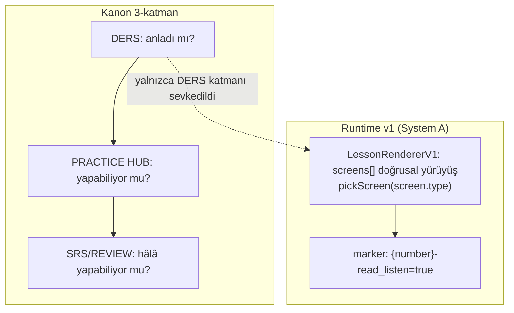

# Lesson Flow

<!-- gh-toc -->

## İçindekiler

- [Executive Summary](#executive-summary)
- [Why It Exists](#why-it-exists)
- [Current Canon](#current-canon)
- [How It Works](#how-it-works)
- [Failure Modes](#failure-modes)
- [Examples](#examples)
- [Diagrams](#diagrams)
- [Runtime Implementation](#runtime-implementation)
- [Known Gaps](#known-gaps)
- [Open Questions](#open-questions)
- [Related Notes](#related-notes)

> [!canon] Purpose — Bir ders **hangi sırayla** akar? Üç-katman kanon modeli (DERS / PRACTICE HUB / SRS-REVIEW), 7-tip'lik runtime yürüyüşü ve ikisi arasındaki fark.

## Executive Summary

Kanon akış modeli sabit bir bölüm listesi değil, bir **ekran-bütçesi + etkileşim** modelidir. Üç katman: **DERS** ("anladı mı?" — ilk hafif kanıt) → **PRACTICE HUB** ("yapabiliyor mu?" — tekrarlı kanıt) → **SRS/REVIEW** ("hâlâ yapabiliyor mu?" — zaman katmanı). Hedef denge ~%30 ders / ~%70 hub (`LESSON_FLOW_CANON_v1.md:13-19`). Runtime'da (System A) akış **veri-güdümlü**: `LessonRendererV1` `lesson.screens[]`'i doğrusal yürür, `pickScreen()` `screen.type` üzerinde switch yapar (`LessonRendererV1.tsx:138-159`). Kanon "her ekran konuşsun" der; runtime'da meet/insight/recap hâlâ statik Continue ekranı — bu fark **Faz B PLANNED**.

## Why It Exists

Sabit bölüm listesi (eski 11-section akışı gibi) katıdır ve her dersi aynı kalıba sokar. Ekran-bütçesi modeli esneklik verir: aynı 7 tipten farklı ders arketipleri kurulabilir, ama toplam yük sınırlı kalır. Üç katman ayrımı, "öğrendi" ile "yapabiliyor" ile "hâlâ yapabiliyor"u ayrı kanıt olarak ele alır — mastery bunun üzerine kurulur (bkz. [[Mastery Model]]).

## Current Canon

### Üç-katman mimarisi (CANONICAL, `LESSON_FLOW_CANON_v1.md §0, :13-17`)
| Katman | Soru | Kanıt |
|---|---|---|
| **DERS** | "anladı mı?" | ilk hafif kanıt |
| **PRACTICE HUB** | "yapabiliyor mu?" | tekrarlı kanıt |
| **SRS / REVIEW** | "hâlâ yapabiliyor mu?" | zaman katmanı |

Denge ~%30/%70, 4 kuraldan (K1–K4) **emergent**, dayatılmış değil (line 19).

### Discovery vs Assessment çizgisi (CANONICAL, §1.3)
- **Meet + Notice = discovery:** yanlış yok, skor yok, düşük-ağırlık telemetri (`item_seen`/`item_recognized`).
- **Build sonrası = assessment:** cevap kanıt üretir (`answer_submitted`/`item_produced`).

### Insight sistemi, 3 seviye 1 bütçe (CANONICAL, §1.4)
- **L1** coach voice (gömülü, ekran saymaz).
- **L2** gömülü micro-insight (long-press, ekran yok).
- **L3** insight-card (kendi ekranı, sayar, **2–3 cap**).
- L3 yerleşimi **anlama göre**, takvime göre değil: KAPI AÇICI (yeni kavramdan önce), KURTARICI (öngörülebilir hatadan sonra), MÜHÜRLEYİCİ (üretimden hemen sonra).

### Ders-sonu dizisi (CANONICAL, §9.1 — runtime PLANNED)
**Check → Recap ("taşını sen diz") → SRS anonsu (tek satır: "je vais artık senin — yarın kısa bir selam vermek için geri gelecek") → sonraki dersin sahnesine tek satır köprü.** SRS anonsu "streak'siz retention" için (Faz B). Bkz. [[Review and Recycling System]].

### İnteraksiyon spektrumu (CANONICAL, §1.2)
Her ekran ≥1 talep eder: DOKUN / SEÇ / KUR / ÜRET. "No passive screen."

## How It Works

### Runtime v1 yürüyüşü (IMPLEMENTED — aktif dev-apk yüzeyi)
`LessonRendererV1` `screens[]`'i `screenIndex` ile doğrusal yürür; `pickScreen()` 7 tip üzerinde switch (`LessonRendererV1.tsx:138-159`). Header "part N of M" gösterir — **XP/score/streak/percent yok** (comment 82-83). Sona ulaşınca tam olarak tek legacy marker yazar: `prog["{number}-read_listen"]=true` (`LessonRendererV1.tsx:23,36-40`) — Home'un doğrusal kilit açması için bir shim; "Full v1 progress mapping is a later workstream".

### State / Lifecycle
Ders bir kez baştan sona akar; her ekran kendi payload'ından beslenir. Discovery ekranları kanıt üretmez, assessment ekranları üretir (kanonda; runtime'da v1 hiç LearningEvent yazmaz — bkz. [[Error Tracking System]]).

### Guardrails
- Ekran tipi seti **7'de dondurulmuş** (§12); yeni tip eklenmez.
- Micro-action ekran başına ≤4 (V1 validator — **spec-only**, mekanize değil).
- Passive screen = V2 WARN (**spec-only**).

## Failure Modes
- **Kanon-runtime etkileşim boşluğu:** kanon meet-card'da "her chip'e dokun ve aktive et", recap'te "parçaları topla" ister; runtime'da bunlar statik Continue. Beklenirse eksik görünür ama **Faz B PLANNED**.
- Boş `screens[]` → renderer'ın yürüyecek ekranı yok (yapı guard'ı yakalar).

## Examples
> [!example] **L1 concrete order** (`lesson-001.ts`): insight(goal) → meet `Bonjour.` → insight(culture) → meet `Je voudrais un café.` → fill-with-traps → weave (supported) → meet `S'il vous plaît.` → weave (supported) → meet `Merci.` → say-it-your-way → recap.
> Kanon omurga (§5.1): 1–2 meet, 1–2 logic, 1 guided try, 1–2 production, 1 natural reveal, 1 recap.

## Diagrams

Kanon üç katman öngörür; sevkedilen runtime yalnızca DERS katmanının doğrusal bir yürüyüşüdür + Home kilidi için tek marker. Hub ve SRS katmanları büyük ölçüde PLANNED/sandbox.

## Runtime Implementation
### Code References
- `lemot-app/components/lesson-v1/LessonRendererV1.tsx:138-159` — yürüyüş + switch.
- `lemot-app/app/v1-lesson/[id].tsx` — route.
- Legacy 11-section akışı (`constants/sections.ts` SECS, `app/lesson/[id].tsx`) **dev-apk-HIDDEN** (`visibleLessons=[]`, `index.tsx:149`) — SUPERSEDED tester yönü olarak.

### Test References
`v1LessonStructure.test.ts` (answerability, atomik piecesUsed), `canonRules.test.ts` (V3/V4/V5).

### Product-Stage Availability
v1 flow: dev-apk (L1–L6). Kanon Hub/SRS katmanları: PLANNED. Engine renderer: sandbox-only.

## Known Gaps
- Meet/Insight/Recap etkileşimi (chip-tap, piece-collect) — Faz B PLANNED.
- Practice Hub + SRS runtime — büyük ölçüde DEFERRED (bkz. [[Review and Recycling System]]).

## Open Questions
> [!open-loop] Kanon "her ekran konuşur" ile runtime "statik Continue" ne zaman yakınsayacak (Faz B kapsamı)? → [[05 Open Loops]]

## Related Notes
[[Lesson Anatomy]] · [[Review and Recycling System]] · [[Feedback and Scoring Philosophy]] · [[Difficulty and Cognitive Load]] · [[Weave System]]
