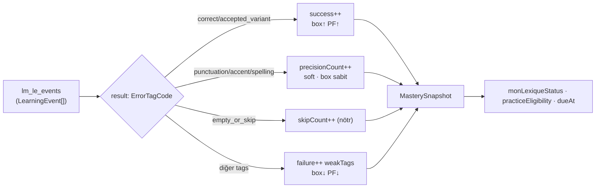

# Mastery Model

<!-- gh-toc -->

## İçindekiler

- [Executive Summary](#executive-summary)
- [Why It Exists](#why-it-exists)
- [Current Canon](#current-canon)
- [How It Works](#how-it-works)
- [Diagrams](#diagrams)
- [Runtime Implementation](#runtime-implementation)
- [Known Gaps](#known-gaps)
- [Open Questions](#open-questions)
- [Related Notes](#related-notes)

> [!canon] Purpose — Cairn bir chip'te ustalığı nasıl ölçer? Kaynak-of-truth `MasterySnapshot`, Leitner/prompt-fade kutuları, weak eşiği ve near-miss precision politikası. **IMPLEMENTED-but-tested-only** (engine, sandbox) — sevkedilen yüzeyde değil.

## Executive Summary

Mastery, saklanan bir durum makinesi **değildir**. Kaynak-of-truth, event log üzerinde saf `scoreEvents()` fonksiyonunun ürettiği **sayaç-türevli `MasterySnapshot`**'tır. Her item için: seen/wrong/success sayaçları, bir **Leitner kutusu** (0–4, aralıklar `[0,1,3,7,30]` gün), bir **prompt-fade düzeyi** (PF0–PF3) ve türetilmiş projeksiyonlar (`monLexiqueStatus`, `practiceEligibility`). Bir item, `wrongCount >= 3` (WEAK_THRESHOLD=3) veya herhangi bir `weakTags` sayısı `>= 3` olduğunda **weak**'tir. Near-miss (noktalama/aksan/yazım) bir **yumuşak sinyaldir, asla başarısızlık değil.**

> [!warning] Bu model gerçek koddur ama **yalnızca engine + sandbox'ta test edilmiştir.** Sevkedilen v1 renderer hiç LearningEvent yaymaz, dolayısıyla mastery **canlı yüzeyde çalışmaz**. Bu, "the main integration blocker"ın bir parçası (bkz. [[Self-Producing Engine]]).

## Why It Exists

Mastery, "neyin geri döneceğine hafıza karar versin" sözünün motorudur. Ama saklanan 9-state bir makine kırılgandır (migration, tutarsızlık). Cairn bunun yerine mastery'yi event log'un **saf bir projeksiyonu** yapar — her çalıştırmada sıfırdan yeniden hesaplanır, dolayısıyla migration gerektirmez ve deterministiktir (Karpathy engine-purity kontratı).

## Current Canon

### Kaynak-of-truth: sayaç-türevli snapshot (IMPLEMENTED)
> "The **source of truth today is the counter-derived `MasterySnapshot`** produced by `scoreEvents()` ... The 9-state framing should be **reconciled with** this counter-derived projection in a later docs pass; until then, the counters win." — `founder-self-learning-mastery-precision-policy.md:84-91`

> [!historical] "9-state mastery" dili **kavramsaldır**, docs-drift olarak işaretli; sayaçlar kazanır (precision-policy §4; p3/p4-checkpoint). Bir tür SUPERSEDED çerçeve.

### Eşikler/kurallar (VERIFIED in `mastery.ts`)
- **`WEAK_THRESHOLD = 3`** (mastery.ts:26). `isWeak` ⟺ `wrongCount >= 3` **VEYA** herhangi bir tek `weakTags` sayısı `>= 3` (mastery.ts:279-281).
- **Leitner:** `LEITNER_INTERVAL_DAYS = [0, 1, 3, 7, 30]` gün, 5 kutu (0–4), `MAX_LEITNER_BOX = 4` (mastery.ts:29-32). Başarı kutuyu ilerletir (`min(box+1, 4)`); başarısızlık indirir (`max(0, box-1)`).
- **Prompt-fade:** `PF_LEVELS = ["PF0","PF1","PF2","PF3"]`, `MAX_PF_INDEX = 3` (mastery.ts:35-36). Başarı ilerletir, başarısızlık indirir.
- **`monLexiqueStatus`** (mastery.ts:283-288): `isWeak → "weak"`; else `productionSuccess > 0 → "added"`; else `"hidden"`. "**recognition alone never auto-adds.**"
- **`practiceEligibility`** (mastery.ts:291-297): `isWeak → "challenge"`; else `productionSuccess > 0 → "stretch"`; else `recognitionSuccess > 0 || seenCount > 0 → "build"`; else `"none"`.
- **Challenge weak-only** (p4-checkpoint.md:64): `practiceEligibility === "challenge"` ⟹ `isWeak === true`.
- **`dueAt`** (audit B12): yalnızca kutuyu hareket ettiren success/failure yeni kutu aralığında yeniden zamanlanır; skip ve near-miss mevcut kutuda refresh (mastery.ts:273-277).
- **Snapshot her çalıştırmada event'lerden yeniden hesaplanır, persist edilmez** → `MASTERY_SNAPSHOT_VERSION` `v0.1 → v0.2`, "no migration is required" (precision-policy.md:96-98).

### Near-miss / precision politikası (IMPLEMENTED, 2026-06-04)
Önceden **tüm near-miss = tam başarısızlık** (HISTORICAL). Şimdi 4-bucket sınıflandırıcı:

| Bucket | Tag'ler | Etki |
|---|---|---|
| **Success** | `correct`, `accepted_variant` | success sayacı; kutu + prompt-fade **ilerler** |
| **Precision / near-miss** | `punctuation_only`, `accent_only`, `spelling_near_miss` | **soft signal** |
| **Skip** | `empty_or_skip` | `skipCount++`, nötr |
| **Failure** | diğer tüm `ErrorTagCode` | failure sayacı; weakTags; kutu + prompt-fade **iner** |

> [!canon] Precision event **`precisionCount`** ve **`precisionTags`**'i artırır; `wrongCount`/`productionFailure`/`recognitionFailure`/`weakTags`'i artırmaz; `isWeak` yapmaz; `promptFadeLevel`/`leitnerBox`'ı indirmez; production/recognition başarısı saymaz ("it never auto-adds to Mon Lexique"); eligibility `build`'e ulaşabilir ama asla `challenge`'a atlamaz (precision-policy.md:44-56). **Precision-only item'lar Build-only, asla Challenge** (p4-checkpoint.md:65).

### Staged strictness (DOCUMENTED, NOT IMPLEMENTED)
Daha ileri band'lar (L60+/L70+), monolingual faz, yüksek `promptFadeLevel`, item olgunluğu ve gelecekteki `accentCriticality` alanı "near-miss'i partial/full failure'a doğru terfi ettirebilir." "None of the following is implemented in this patch." (precision-policy §3) — **DEFERRED/PLANNED**.

## How It Works

### Inputs / Outputs
Girdi: `lm_le_events` (append-only LearningEvent log; her event bir `result: ErrorTagCode` + `errorTags[]`). Çıktı: item başına `MasterySnapshot` (sayaçlar + box + PF + projeksiyonlar). Bkz. [[Error Tracking System]].

### State / Lifecycle
Snapshot stateless-türetilir: events → reducer → snapshot, her çalıştırmada sıfırdan. Persist edilen tek şey event log'un kendisi.

### Guardrails
- Karpathy purity: `now` bir parametre; engine'de `Date.now`/`Math.random` yok.
- Precision asla failure değil.
- recognition tek başına Mon Lexique'e eklemez.

## Diagrams

Her event dört bucket'tan birine düşer; yalnızca gerçek başarı/başarısızlık kutuyu oynatır. Snapshot, sayaçlardan Mon Lexique ve Practice projeksiyonlarını türetir.

## Runtime Implementation
### Code References
- `lemot-app/content/learning-engine/mastery.ts:26-36` — sabitler.
- `mastery.ts:273-297` — dueAt + projeksiyonlar.
- `mastery.ts:279-288` — isWeak + monLexiqueStatus.
### Test References
Engine unit testleri (mastery reducer). Cihaz doğrulaması **YOK**.
### Product-Stage Availability
**IMPLEMENTED-but-tested-only:** engine + sandbox. Sevkedilen v1 yüzeyi mastery çalıştırmaz (event üretmez).

## Known Gaps
- v1 renderer event yaymaz → mastery canlı beslenmez (integration blocker).
- 9-state dili ile sayaç modeli docs-drift olarak uzlaştırılmadı.
- Staged strictness DEFERRED.

## Open Questions
> [!open-loop] Mastery canlı yüzeye ne zaman/nasıl bağlanacak? → [[05 Open Loops]]

## Related Notes
[[Error Tracking System]] · [[Review and Recycling System]] · [[Mon Lexique]] · [[Self-Producing Engine]] · [[Feedback and Scoring Philosophy]]
