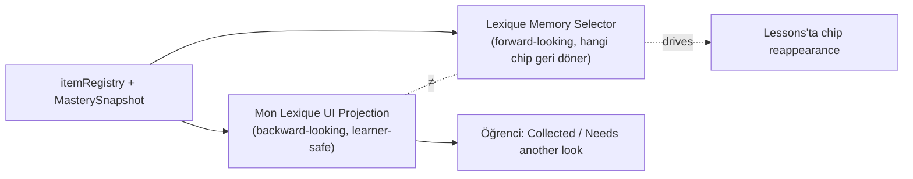

# Mon Lexique

<!-- gh-toc -->

## İçindekiler

- [Executive Summary](#executive-summary)
- [Why It Exists](#why-it-exists)
- [Current Canon](#current-canon)
- [How It Works](#how-it-works)
- [Diagrams](#diagrams)
- [Runtime Implementation](#runtime-implementation)
- [Known Gaps](#known-gaps)
- [Open Questions](#open-questions)
- [Related Notes](#related-notes)

> [!canon] Purpose — Mon Lexique nedir, iki ayrı kavramı (UI Projection bugün vs Lexique Memory gelecek), yaşam döngüsü (hidden/added/weak) ve hangi ürün-aşamasında açık. (UI ekran detayı [[Mon Lexique UI]]'de.)

## Executive Summary

Mon Lexique, motorun **öğrenci-yüzlü hafızasıdır** — sonradan takılan ayrı bir sözlük değil (`learning-engine-v1.md:224`, "the critical contract"). İki **ayrı** kavramı vardır ve bunlar karıştırılmamalı: (1) **Mon Lexique UI Projection** (bugün) — registry + `MasterySnapshot` üzerine backward-looking, learner-safe bir görünüm; scheduling/carryover/recombination YOK. (2) **Lexique Memory Selector** (gelecek internal engine) — hangi eski chip'lerin lessons'ta yeniden görüneceğini seçen carryover/recall/dormant motoru. Yaşam döngüsü statusleri: **hidden → added → weak**. Ürün aşaması: **Dev APK'te hidden/minimal**, MVP'de learner notebook, sonra AI, post-beta Word Graph.

## Why It Exists

"Öğrendiğim kelimeler nerede?" sorusu her dil uygulamasında var. Ama Cairn bunu ayrı bir wordbook/store olarak yaparsa, kanonun tek-kimlik kontratı kırılır (aynı chip lesson/Weave/Practice/Mon Lexique'te farklı ID taşır). Bu yüzden Mon Lexique bir **VIEW**'dur — registry + mastery üzerinden türetilir, ayrı store değil. İki kavramı ayırmak da kritik: UI backward-looking (ne topladın), Memory forward-looking (ne geri dönmeli).

## Current Canon

### Uyumluluk kontratı (CANONICAL, learning-engine-v1.md §14)
> "**Mon Lexique is the learner-facing memory of the engine — not a separate dictionary bolted on later.**" (line 224)

Bir **canonical identity** gerektirir: lesson content, Weave, Practice Pool, Daily Review, Natural Reveal, Mon Lexique, Word Graph aynı ID'yi paylaşır (lines 224-232). Kavramsal olarak tüketir: canonical ID, chunk/frame metadata, first-seen, where-used, carry lineage, mastery states, related chunks, weak-point tags, review hooks (lines 234-244). Ama **learner yüzeyi basit kalır**: meaning · examples · where you met it · related pieces · your own sentences · confidence/mastery · optional notes (lines 246-254). "**Do not expose technical matrix codes, status enums, or internal IDs to learners.**" (line 256).

### İki ayrı kavram (CANONICAL, v0.3 §9 — do-not-overload)
1. **Mon Lexique UI Projection (bugün):** "a learner-safe UI projection over the registry + `MasterySnapshot`. It is backward-looking ... no scheduling, no carryover, no recombination logic" (`v0.3:286`). IMPLEMENTED: `mon-lexique.ts` `selectMonLexiqueEntries` (PR #61) + UI shell (P4).
2. **Lexique Memory Selector (gelecek):** "chooses carryover / recall / dormant / exposure-promotion candidates; drives which old chips reappear in lessons." (`v0.3:294-296`). Kısmen IMPLEMENTED (fixture/spec-only): `lexique-memory.ts` "Lexique Memory v0.1 — pure derived layer over frozen mastery-v0.2" (`WEAKNESS_K=2.0`, `WEAK_RESIDUAL_FLOOR=0.15`).

> [!warning] **Üç ayrı sistem (CANONICAL, v0.3:307-309):** "Mon Lexique UI ≠ Lexique Memory ≠ Carryover Selector." Karıştırma.

### Yaşam döngüsü statusleri (IMPLEMENTED engine, mastery.ts:283-288)
`monLexiqueStatus`: `isWeak → "weak"`; else `productionSuccess > 0 → "added"`; else `"hidden"`. "**recognition alone never auto-adds.**" Near-miss precision de asla auto-add etmez (bkz. [[Mastery Model]]). UI etiketi: "Collected" / "Needs another look" (p4-checkpoint.md:92-93).

## How It Works

### Inputs / Outputs
Girdi: item registry + MasterySnapshot. Çıktı: learner-safe entry'ler (`selectMonLexiqueEntries`) — "itemId-driven and selector-derived ... it is a VIEW, not a separate wordbook/store" (p4-checkpoint.md:59). Learner-safe: id/tag/counter/JSON/bucket-adı YOK (p4-checkpoint.md:66).

### State / Lifecycle
hidden → added (production success) → weak (isWeak). Backward-looking; scheduling yapmaz. Forward-looking recall Lexique Memory'nin işi (bkz. [[Chip Lifecycle]], [[Content Selection]]).

### Guardrails
- Teknik kod/enum/ID öğrenciye gösterilmez.
- recognition tek başına eklemez.
- UI projection scheduling/carryover mantığı içermez.

## Diagrams

Aynı registry+mastery kaynağından iki farklı sistem türetilir: geriye bakan UI (topladıkların) ve ileriye bakan Memory (ne geri dönmeli). İkisi ayrı; karıştırılmaz.

## Runtime Implementation
### Code References
- `lemot-app/content/learning-engine/mon-lexique.ts` — `selectMonLexiqueEntries` (IMPLEMENTED, P4 sandbox-gated).
- `lemot-app/content/learning-engine/lexique-memory.ts` — Lexique Memory v0.1 (fixture/spec-only).
- `mastery.ts:283-288` — monLexiqueStatus.
### Product-Stage Availability
> [!warning] **Ürün aşaması tiered (CANONICAL):** "Dev APK: hidden/minimal; MVP/base: learner notebook; later: deeper AI; post-beta: Word Graph adjacency" (`learning-engine-v1.md:256`; MASTER_PIPELINE Rule 8). CLAUDE.md: "Mon Lexique hidden unless current stage allows." Bugün: **dev-apk'te HIDDEN** (`FEATURES.monLexique=false`); engine selector sandbox-only. Public'e ne zaman çıkacağı **OPEN DECISION** (`learning-engine-v1.md:291`).

## Known Gaps
- Runtime learner yüzeyi dev-apk'te kapalı.
- UI Projection ile Lexique Memory'nin canlı entegrasyonu yok.

## Open Questions
> [!open-loop] Mon Lexique public'e ne zaman açılır (hangi stage)? → [[05 Open Loops]]

## Related Notes
[[Mastery Model]] · [[Chip Lifecycle]] · [[Content Selection]] · [[Mon Lexique UI]] · [[Learning System Overview]]
