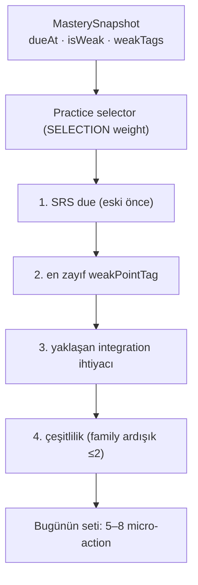

# Review and Recycling System

<!-- gh-toc -->

## İçindekiler

- [Executive Summary](#executive-summary)
- [Why It Exists](#why-it-exists)
- [Current Canon](#current-canon)
- [How It Works](#how-it-works)
- [Failure Modes](#failure-modes)
- [Diagrams](#diagrams)
- [Runtime Implementation](#runtime-implementation)
- [Known Gaps](#known-gaps)
- [Open Questions](#open-questions)
- [Related Notes](#related-notes)

> [!canon] Purpose — Chip'ler zamanla nasıl geri getirilir? Daily Review, Practice Hub seçici önceliği, Readiness Gate ve streak'siz SRS ritüeli. **Çoğu PLANNED/DEFERRED**; sevkedilen yüzeyde review yok.

## Executive Summary

Cairn'in retention katmanı üç parçadan oluşur: **Daily Review** (küçük günlük retrieval teklifi), **Practice Hub** (bugünün seti — 5–8 micro-action), ve **SRS/zaman katmanı** (chip'in geri dönme takvimi). Ortak ilke: **asla baskı üretmez** — "come back tomorrow", streak dili yasak; "a calm offer of retrieval" (`learning-engine-v1.md:216`). Practice Hub seçici sabit bir önceliğe uyar: SRS due → en zayıf weakPointTag → yaklaşan integration ihtiyacı → çeşitlilik. Kritik ayrım: **EVIDENCE WEIGHT** (mastery çarpanı) ile **SELECTION WEIGHT** (bugün ne teklif edilecek) **asla karışmaz.** Runtime'da: engine seçiciler fixture/spec-only; legacy Daily Review dev-apk'te kapalı; canonical SRS ritüeli PLANNED.

## Why It Exists

Öğrenilen bir chip kullanılmazsa solar; ama her chip'i her gün göstermek de yanlış (flashcard Anki-klonu tuzağı). Cairn "neyin/ne zaman geri döneceğine" mastery kanıtına bakarak karar verir: zayıf olan öncelikli, güçlü olan seyrek. Baskısız çünkü ürün sözü "calm premium journey" — streak/XP yasak.

## Current Canon

### Daily Review (CANONICAL, spec)
"Items eligible for the day's small review goal, drawn only from lessons the learner has actually reached." (`learning-engine-v1.md:211`). "Daily Review draws only from the *eligible* lesson pool and never manufactures pressure ('come back tomorrow', streak language) — it is a calm offer of retrieval" (line 216). Bkz. [[Daily Review]].

### Practice Pool seed'leri (CANONICAL)
Her ders yayar: Build / Stretch / Challenge / Daily Review / listening traps / weak-point repair / later retrieval (`learning-engine-v1.md:206-214`).

### Practice Hub seçici önceliği (CANONICAL, `LESSON_FLOW_CANON_v1.md §5.2, :230`)
"SRS due (eski önce) → en zayıf weakPointTag → yaklaşan entegrasyon dersinin ihtiyaç listesi → çeşitlilik (aynı family ardışık ≤2)". "Bugünün seti" = 5–8 micro-action, 3–5 dk, "a set more?" doğal duraklama (§5.1).

> [!canon] **İki ağırlık asla karışmaz** (§5.3): **EVIDENCE WEIGHT** (mastery çarpanı, mastery reducer'da yaşar) vs **SELECTION WEIGHT** (bugün ne teklif, practice selector'da yaşar). Bkz. [[Content Selection]].

### Readiness Gate (CANONICAL, §7 — PLANNED)
Integration-lesson-only "diagnosis + prescription" gate: `assessReadiness` `{ready, coldItems}` döner; eksik/bozuk veride **FAIL-OPEN** (line 270). Scope-locked: "Readiness gate yalnızca review-integration arketipli derslerde yaşar" (line 287). Build fazı FAZ C. **Kodda yok** (grep 0 hit).

### SRS görünürlüğü (CANONICAL — PLANNED, Faz B)
Ders-sonu: Check → Recap → **SRS anonsu** ("je vais artık senin — yarın kısa bir selam vermek için geri gelecek") — "streak'siz retention" için (§9.1, :344-350).

## How It Works

### Inputs / Outputs
Girdi: MasterySnapshot (dueAt, isWeak, weakTags), eligible lesson pool, yaklaşan integration ihtiyaç listesi. Çıktı: bugünün seti (Practice Hub) / günün review goal'ı (Daily Review).

### State / Lifecycle
Leitner kutuları chip'in geri dönme aralığını belirler ([0,1,3,7,30] gün; bkz. [[Mastery Model]]). Recycling, carryover döngüsüyle örtüşür ama aynı değildir ([[Chip Lifecycle]]).

### Guardrails
- Baskı yasak (streak/come-back-tomorrow) — `componentCopyGuard.test.ts`.
- Daily Review sadece **eligible** havuzdan çeker, asla gelecek-ders içeriği.
- Practice Hub asla dersi gate'lemez (optional-but-urged, §5.4).
- Evidence weight ≠ selection weight.

## Failure Modes
- **İki store karışması:** legacy Daily Review `lm7` (`dr:{date,count}`) okur; engine projeksiyonları ayrı. "Daily Review should eventually use engine mastery / review projections ... rather than the legacy `lm7` review state" (progress-bridge-decision.md:87-89) — PLANNED.
- Readiness gate yoksa integration dersi teşhis-reçete adımı olmadan akar (bugün böyle).

## Diagrams

Seçici sabit bir öncelik zincirinden bugünün küçük setini üretir; mastery yalnızca sinyal verir, seçim ağırlığı ayrı yaşar.

## Runtime Implementation
### Code References
- `lemot-app/content/learning-engine/practice-selector.ts` — "pure 'today's set' logic (§5.1/§5.2), SELECTION weight only, never scores anything" (PR #179, "factory's first product"). **fixture/spec-only.**
- `lemot-app/content/learning-engine/practice-pool.ts` — `selectPracticePoolBuckets` + `PracticePoolShell`, P4 sandbox-gated, "no generated exercises" (mevcut fixture'ları yeniden kullanır).
- `lemot-app/components/DailyReviewOverlay.tsx` — legacy MCQ overlay, `FEATURES.dailyReview=false` dev-apk'te (HIDDEN).
### Product-Stage Availability
- Engine seçiciler: sandbox-only.
- **Daily Review full UI YOK** — P4 sadece eligibility/due hook'ları tanımladı (deferred, SW.3 §4; p4-checkpoint.md:145).
- Legacy Daily Review card: dev-apk-hidden.
- SRS ritüeli + Readiness Gate: PLANNED (Faz B/C).

## Known Gaps
- Engine review projeksiyonu canlı Daily Review'a bağlı değil.
- Readiness Gate kodda yok.

## Open Questions
> [!open-loop] Daily Review legacy `lm7`'den engine projeksiyonlarına ne zaman geçecek? → [[05 Open Loops]]

## Related Notes
[[Mastery Model]] · [[Content Selection]] · [[Daily Review]] · [[Chip Lifecycle]] · [[Mon Lexique]]
