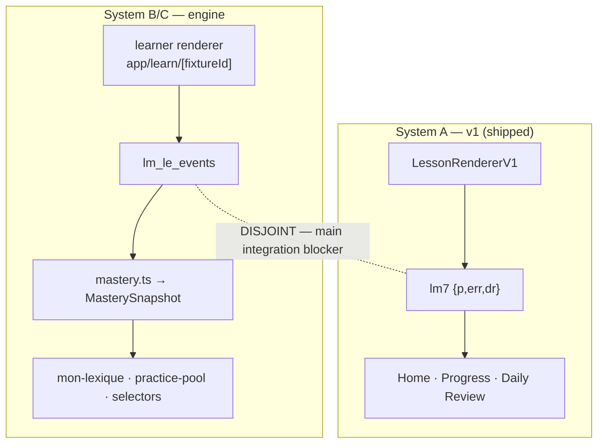

# Self-Producing Engine

<!-- gh-toc -->

## İçindekiler

- [Executive Summary](#executive-summary)
- [Why It Exists](#why-it-exists)
- [Current Canon](#current-canon)
- [How It Works — üç katmanı ayırmak](#how-it-works-üç-katmanı-ayırmak)
- [Diagrams](#diagrams)
- [Runtime Implementation](#runtime-implementation)
- [Known Gaps](#known-gaps)
- [Open Questions](#open-questions)
- [Related Notes](#related-notes)

> [!canon] Purpose — "Self-producing engine" (content factory) nedir, hangi parçası gerçekten çalışıyor (supported-runtime), hangisi fixture/dev, hangisi spec/gelecek — ve neden iki store'un ayrılığı "the main integration blocker".

## Executive Summary

Self-producing engine, Cairn'in uzun vadeli ürün temelidir: Fransızca'yı öğrencinin **üretebileceği** bir şeye çeviren pedagojik motor (`learning-engine-v1.md:15`). Üç katmanı net ayırmak şart: **(a) supported-runtime** — sandbox/founder-gated ama gerçek çalışan kod (learner renderer, mastery, events, mon-lexique, practice-pool); **(b) fixture/dev** — saf modüller + L1/L2/L11/L12/L14/L15/L16/L18 contract+exercises fixture'ları, canlı yüzeye bağlı doğrulanmamış; **(c) spec/gelecek** — pedagoji kanonu, henüz kod yetkilendirmeyen katman. En kritik gerçek: engine `lm_le_events` yazar, ama Home/Progress/Daily Review `lm7` okur — **iki store disjoint**, bu "the main integration blocker".

## Why It Exists

CLAUDE.md banner'ı der ki: "learning-engine is the long-term product foundation. Do not expand v1." v1 geçici bir smoke yüzeyi; engine ise ölçeklenebilir içerik üretiminin ("content factory") ve gerçek mastery/kanıt/carryover/practice türetiminin temeli. Ama henüz public yüzeye bağlanmadı — bu yüzden "gerçek kod var ama kimse görmüyor" durumu, sürekli yanlış anlaşılıyor. Bu not o üç katmanı ve blocker'ı net tutar.

## Current Canon

### Ne (CANONICAL, spec)
> "It is a canon/spec layer, not a code implementation. No runtime engine, schema, storage, or backend is defined or authorized here." — `learning-engine-v1.md:3`

Core Loop: Moment → Pieces → Pattern → Production → Reveal → Memory → Ownership (`:29-41`). "The engine must be sound without AI." (`:276`). Bkz. [[Learning System Overview]].

### Ana integration blocker (CANONICAL decision)
> [!warning] "Completing exercises in the engine renderer updates `lm_le_events` but nothing Home / Progress / Daily Review reads, and the v1 completion marker updates `lm7` but nothing the engine reads. **The two stores are disjoint.**" (`learning-engine-progress-bridge-decision.md:39-42`). Bu ayrılık **"the main integration blocker"** olarak adlandırılır (§2). Uzun vadeli canonical progress kaynağı `lm_le_events` event spine'ıdır; legacy `lm7` bridge marker'ları yalnızca guarded, açıkça geçici smoke shim olarak (progress-bridge §1/§4/§9). Bkz. [[Storage Architecture]].

## How It Works — üç katmanı ayırmak

### (a) Supported-runtime (IMPLEMENTED, sandbox/founder-gated — gerçek kod)
| Parça | Kod | Not |
|---|---|---|
| Learner renderer | `app/learn/[fixtureId].tsx` | Gate: `PRODUCT_STAGE === "sandbox" && FEATURES.v1LessonEngine`. Public-nav'da yok. "NO events, NO storage, NO mastery, NO network/AI" (header). |
| Mastery reducer | `mastery.ts` | Sayaç-türevli MasterySnapshot (bkz. [[Mastery Model]]). |
| Event model | `events.ts` | `lm_le_events` append-only (bkz. [[Error Tracking System]]). |
| Mon Lexique | `mon-lexique.ts` + shell | P4, sandbox-gated (bkz. [[Mon Lexique]]). |
| Practice Pool | `practice-pool.ts` + shell | P4, "no generated exercises". |

### (b) Fixture/dev (IMPLEMENTED, fixture/spec-only)
- Saf v0 modüller: `carryover-selector.ts`, `lexique-memory.ts`, `practice-selector.ts`, `error-engine.ts`, telemetry, `derive-drill.ts`, `graph.ts`. Hepsi pure/deterministic/RN-free; **canlı learner yüzeyine wire edildiği doğrulanmadı.**
- Fixture'lar: L1/L2/L11/L12/L14/L15/L16/L18 `*.contract.ts` + `*.exercises.ts`. "**not the full Core 150**" — interactive baseline L1/L14/L15/L18 destekli, L11/L12/L16 sonradan (chain smoke) eklendi (interactive-baseline.md:51-78).
- Dev debug yüzeyleri: `app/dev/learning-engine-player.tsx` / `-preview.tsx`.

### (c) Spec/gelecek (CANONICAL / PLANNED / DEFERRED)
- `learning-engine-v1.md` pedagoji, `LESSON_FLOW_CANON_v1`, chip-taxonomy v0.3, item-id v0.1 — kod değil.
- July "Content Factory" katmanı gerçek `main`'de ama 12 checkpoint dokümanı bunu tarif etmez; `ROADMAP.md`+`STATUS.md`+`LESSON_FLOW_CANON_v1.md`'de yaşar.
- Readiness Gate / exposure selector / instruction-weave: **kodda yok** (grep 0 hit).

### Guardrails
- Karpathy purity: pure, deterministic, explicit `now`, fail-closed.
- Smoke sınırdır: "No runtime engine implementation before the Dev APK smoke test" (`learning-engine-v1.md:271`).
- YASA 1/2/3: schema→migration aynı PR; itemId immutability; error-tag immutability (bkz. [[Error Tracking System]]).

## Diagrams

Engine kendi store'unu (`lm_le_events`) besler ve ondan mastery/projeksiyon türetir; sevkedilen v1 ise ayrı `lm7`'i besler. İki taraf birbirini okumaz — birleştirilene kadar engine hiçbir canlı yüzeyi etkilemez.

## Runtime Implementation
### Code References
- `lemot-app/content/learning-engine/` — tüm motor modülleri.
- `lemot-app/app/learn/[fixtureId].tsx` — founder-gated renderer.
- `derive-drill.ts`, `practice-selector.ts` — "factory's first product" (PR #179).
### Product-Stage Availability
Hepsi **sandbox/founder-gated**; hiçbir parçası dev-apk public yüzeyinde değil.

## Known Gaps
- **İki disjoint store** (ana blocker) — birleştirme workstream'i PLANNED.
- Saf selector modülleri canlı yüzeye wire değil.
- Full Core 150 fixture yok (yalnızca 8 ders).

## Open Questions
> [!open-loop] `lm7` ↔ `lm_le_events` birleştirme (progress bridge) ne zaman ve nasıl? → [[05 Open Loops]]
> [!open-loop] Engine public-nav'a ne zaman çıkar? → [[05 Open Loops]]

## Related Notes
[[Learning System Overview]] · [[Mastery Model]] · [[Error Tracking System]] · [[Content Selection]] · [[Learning Engine Architecture]] · [[Storage Architecture]]
