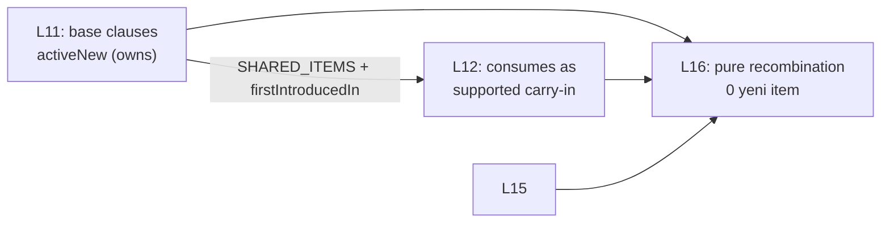

# Spine and Carryover Logic

<!-- gh-toc -->

## İçindekiler

- [Executive Summary](#executive-summary)
- [Why It Exists](#why-it-exists)
- [Current Canon](#current-canon)
- [How It Works](#how-it-works)
- [Examples](#examples)
- [Diagrams](#diagrams)
- [Runtime Implementation](#runtime-implementation)
- [Known Gaps](#known-gaps)
- [Open Questions](#open-questions)
- [Related Notes](#related-notes)

> [!canon] Purpose — Bir dersin **spine**'ı nedir, chip'ler dersler arası nasıl taşınır (carry-in/carry-out), ve neden carryover'ın "mekanik dökme" değil "seçim" olduğu.

## Executive Summary

Her ders bir **spine chip** etrafında kurulur: dersin load-bearing üretilebilir motoru (`je suis`, `j'ai`, `je voudrais`, pattern `ne ___ pas`) (`v0.3:68`). Spine dersler arası tekrar eder ve büyür. Bunu sağlayan mekanizma **carry system**'dir: carry-in (recycled aday'lar) / carry-out (bu dersten çıkıp beklenen üretim) / transformation plan / fade (`learning-engine-v1.md:120-126`). Kritik ilke: carryover **mekanik değildir** — chip'ler *aday*dır, *default* değil; mastery/context ile seçilir. Kodda bunu `carryover-selector.ts` (fixture/spec-only) ve `SHARED_ITEMS` registry (IMPLEMENTED) gerçekler.

## Why It Exists

Diller birikimlidir: L12 `je suis`'i "yeniden öğretmemeli", onu *kullanmalı*. Ama her eski chip'i her derse dökmek de yanlıştır — bilişsel yükü patlatır ve dersi çalar ("Recycle cannot steal the lesson", `v0.3:388`). Carry system, "neyi geri getir" sorusunu bir mekanik listeye değil, bir seçim skoruna bağlar. Spine ise bu birikimin omurgasıdır — L1→L24 boyunca örülen ana motor.

## Current Canon

### Spine chip (CANONICAL)
"The load-bearing *producible engine* a lesson is built around ... Recurs across lessons; usually `active`." (`v0.3:68`). Bkz. [[Chip Taxonomy]] (tip 1).

### Süreklilik ilkesi (CANONICAL)
"Every lesson must **introduce something new, grow something old, and prepare something future.**" (`learning-engine-v1.md:128`).

### Carry system (CANONICAL, learning-engine-v1.md §8, :120-126)
- **carry-in** = recycled (eski chip aday olarak gelir).
- **carry-out** = expected production (bu dersten çıkıp sonraki derste üretilmesi beklenen).
- **transformation plan** = chip'in nasıl dönüşeceği.
- **fade** = desteğin çekilmesi.

### Shared carry-in precedent (CANONICAL + IMPLEMENTED)
> [!implemented] "L11 owns base clauses `activeNew` → **L12 consumes them as `supported` carry-in** (define-once `SHARED_ITEMS` + `firstIntroducedIn`)." (`v0.3:327`). "**L16 pure recombination:** introduces **zero new items**; recombines L11/L12/L15/SHARED via contract buckets." (`v0.3:328`). Kod: `SHARED_ITEMS` registry + duplicate-ID guard `mergeItemMapsStrict`, PR #26 (`interactive-baseline.md:34`).

### Carryover ≠ mekanik dump (CANONICAL)
"previously-introduced chip that is a **candidate** for reuse, **selected** by mastery/context — never mechanically dumped." (`v0.3:72`). Rolling window: "Previous chips are candidates, not defaults." (`v0.3:373-374`).

> [!warning] **Sayısal carryover penceresi YOKTUR (CANONICAL).** "There is no numeric carryover window currently canonized. L11→L16 should not be treated as proof of a hard 5-lesson lifecycle." (`v0.3:331-332`). L+0..L+6 tablosu bir **PROPOSAL**tır (bkz. [[Chip Lifecycle]]).

### Integration Rhythm (CANONICAL heuristic)
"roughly 3 consecutive new-engine lessons without an integration or review beat" kaçınılır (`learning-engine-v1.md:130`). Bir hard validator değil, sezgi. Bkz. [[Integration Lesson Logic]].

## How It Works

### Inputs
Öğrenilmiş chip grafiği (`graph.ts` `buildItemGraph` — "Pure derived ownership / prerequisite / carry-in graph", `p0-p2-checkpoint.md:22`), lesson `contextTags`, mastery snapshot.

### Outputs
Bu dersin carry-in aday listesi (selection-score ile sıralı; bkz. [[Content Selection]]).

### Guardrails
- **Recycle Load Protection:** target load baskın, recycle destekleyici, exposure capped (`v0.3:388-390`).
- `contextTags` EXPLICIT caller input; boş → **fail-closed** (carryover-selector.ts header).

## Examples
> [!example] **L16 pure recombination:** sıfır yeni item tanıtır; L11/L12/L15/SHARED chip'lerini contract bucket'ları üzerinden yeniden birleştirir. Bu, carry system'in en saf gösterimi — dersin tamamı carry-in'den kurulur.

## Diagrams

L11 bazı chip'lere sahip olur; L12 onları supported carry-in olarak tüketir; L16 hiç yeni item eklemeden L11/L12/L15/SHARED'i yeniden birleştirir. Define-once + duplicate-ID guard bunu güvenli kılar.

## Runtime Implementation
### Code References
- `lemot-app/content/learning-engine/carryover-selector.ts` — Carryover Selector v0 (spec §65.6), pure/deterministic/RN-free, recycled = query-time rol. **fixture/spec-only** (canlı ders yüzeyine bağlı doğrulanmadı).
- `lemot-app/content/learning-engine/graph.ts` — `buildItemGraph` derived carry-in graph. **fixture/spec-only.**
- `SHARED_ITEMS` registry + `mergeItemMapsStrict` — IMPLEMENTED (PR #26).

### Product-Stage Availability
SHARED_ITEMS + define-once carry-in: engine (System B) fixture'larda IMPLEMENTED. Selector: sandbox-only. Live v1 dersleri carryover'ı yazılı içerikte elle uygular.

## Known Gaps
- Carryover selector saf modül; canlı ders yüzeyine wire edildiği doğrulanmadı.
- Sayısal reach kanonlaşmadı.

## Open Questions
> [!open-loop] Carryover reach sayısal mı kalacak yoksa tamamen selection-score'a mı bırakılacak? → [[05 Open Loops]]

## Related Notes
[[Chip Taxonomy]] · [[Chip Lifecycle]] · [[Lesson Anatomy]] · [[Content Selection]] · [[Integration Lesson Logic]] · [[Difficulty and Cognitive Load]]
