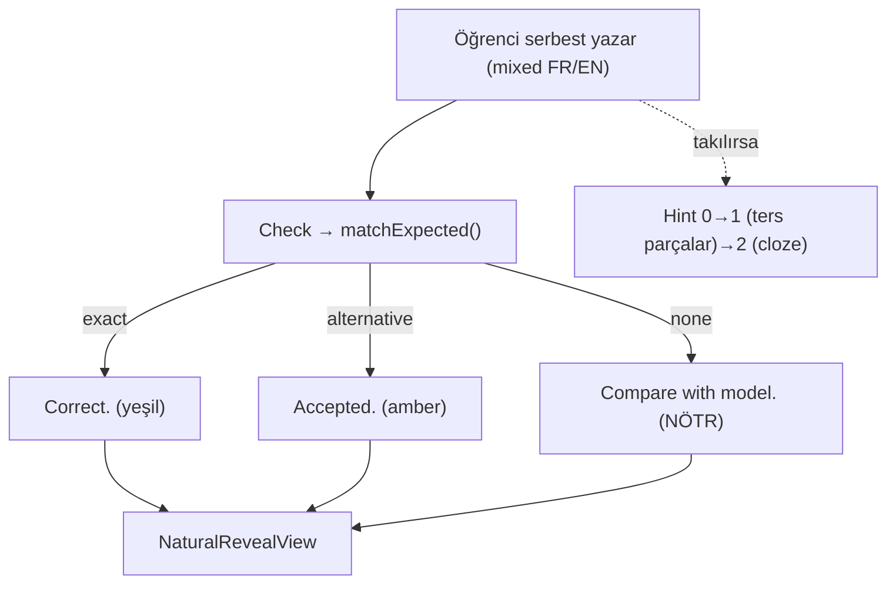

# Weave System

<!-- gh-toc -->

## İçindekiler

- [Executive Summary](#executive-summary)
- [Why It Exists](#why-it-exists)
- [Current Canon](#current-canon)
- [How It Works](#how-it-works)
- [Examples](#examples)
- [Diagrams](#diagrams)
- [Runtime Implementation](#runtime-implementation)
- [Known Gaps](#known-gaps)
- [Open Questions](#open-questions)
- [Related Notes](#related-notes)

> [!canon] Purpose — Cairn'in **killer mekaniği** Weave nedir, neden merkezî, nasıl derecelenir (ve neden açık Weave'ler **derecelenmez**). Egzersiz-mekanik detayı [[Weave]]'de; bu not sistemik/pedagojik ev.

## Executive Summary

Weave, öğrencinin **karışık Fransızca/İngilizce** cümle yazdığı mekaniktir: sahiplendiği parçaları Fransızca, gerisini İngilizce bırakır (`je voudrais but pas today`). Amaç "en küçük kullanışlı yükseltme" (smallest useful upgrade), asla zorla tam çeviri değil. **Kilitli karar W1: açık karışık Weave'ler DERECELENMEZ — feedback, reveal'dır.** Bu, Cairn'i başka hiçbir uygulamanın yapmadığı şey yapar: sahiplenmeyi (owned French skeleton) ölçmeden, üretim cesaretini kırmadan pratik ettirir. Runtime'da **IMPLEMENTED ve aktif** (dev-apk), hint merdiveni canlı.

## Why It Exists

Klasik çeviri egzersizi öğrenciyi "ya hep ya hiç"e zorlar: tüm cümleyi Fransızca kuramıyorsan başarısızsın. Bu, üretimi bloke eder ve korku üretir. Weave bu bariyeri kaldırır: bildiğin kadarını Fransızca koy, gerisini İngilizce bırak — böylece her seviyede **hemen üretebilirsin**. Fransızca iskelet sahiplendiğin motorlardan gelir; bilinmeyen parçalar İngilizce kalır. Sahiplenme büyüdükçe iskelet büyür. Bu, killer trinity'nin (Weave + Say It Your Way + Natural Reveal) merkezidir.

## Current Canon

### Tanım (CANONICAL, EXERCISE_CANON §1.3)
Öğrenci karışık Fransızca/İngilizce yazar; bilinen parçalar Fransızca, gerisi İngilizce; "smallest useful upgrade", asla zorla tam çeviri.

### Kilitli W1 (CANONICAL)
**Açık karışık Weave'ler ungraded — reveal feedback'tir.** (`EXERCISE_CANON`, Weave.tsx comment 72-75). Açık bir karışık Weave'i **derecelemek** bir validator ERROR'udur (EXERCISE_CANON §16). Detay: [[Feedback and Scoring Philosophy]].

### Weave türleri (CANONICAL, `lessonTypes.ts:120-146`)
`weaveType: supported | mid | context | open`. supported = en fazla iskele; open = serbest karışık (ungraded).

### Anti-pattern (CANONICAL, EXERCISE_CANON §16)
- "Weave repair used as a designed translation exercise" = ERROR.
- "Broken Weave Reconstruction" = **REJECTED/removed** (§11 edit 7).
- Grading an open mixed Weave = lint ERROR.

## How It Works

### Inputs
`WeavePayload`: `weaveType`, `prompt`, `context?`, `suggestedPieces[]`, `expectedAnswers[]`, `acceptedAlternatives?`, `naturalAlternatives?`, `hintCloze?`, `reveal: NaturalRevealPayload` (`lessonTypes.ts:120-146`).

### Outputs / Correctness (IMPLEMENTED)
Öğrenci serbest yazar → Check. `matchExpected()` (`normalizeAnswer.ts:25-45`) üç sonuç döner: `"exact"` (expectedAnswer eşleşir), `"alternative"` (acceptedAlternatives), `"none"`. Normalizasyon (`normalize()`, 14-23): accent/case/virgül/nokta/smart-quote katlar; **`?`/`!` ve apostrof anlamlı kalır**. **Runtime hiç LearningEvent yaymaz** (System A).

### Feedback (IMPLEMENTED, non-punitive)
`RESULT_NOTES` (Weave.tsx:26-30): exact = "Correct." (yeşil); alternative = "Accepted." (amber); none = "Compare with the model answer." (**NÖTR, kırmızı değil**). Sonra `NaturalRevealView`. "none" **asla bir wrong-answer hatası değil**, bloke etmeyen bir karşılaştırma.

### Hint merdiveni (IMPLEMENTED, EXERCISE_CANON §8)
`hintLevel` 0→1→2:
- **0** = sessiz "Need a hint?".
- **1** = suggestedPieces **ters sırada** gösterilir (`orderHintPieces`, deterministik, asla kopyaya-hazır sıra).
- **2** = `hintCloze` şekli (ör. "Bonjour, je voudrais ___, s'il vous plaît."). Cloze gösterilince parçalar toplanır.
Bu, kanonun "rebuild-the-thought, not copy" ilkesinin runtime evi. Bkz. [[Difficulty and Cognitive Load]].

### Guardrails
- Açık Weave'i dereceleme (lint ERROR).
- Reveal W2 penceresini aşamaz (~3-4, max 5-6 ders ileri, recognition-only).
- Question-form Weave cevapları soru-işaretsiz alternatif taşımalı (çünkü `?` normalize'da anlamlı; `v1LessonStructure.test.ts:327-342`).

## Examples
> [!example] L1 (`lesson-001.ts`): weave (supported) prompt "Hello, I would like a coffee" → beklenen `Bonjour, je voudrais un café`. Öğrenci `Bonjour, I would like un café` yazarsa: iskelet sahiplendiği kadar Fransızca, gerisi İngilizce — reveal model cevabı gösterir, ceza yok.

## Diagrams

Weave üç sonuçtan birine düşer ama üçü de reveal'a gider; "none" bir hata değil karşılaştırmadır. Hint merdiveni kopyalatmaz, düşünceyi yeniden kurdurtur.

## Runtime Implementation
### Code References
- `lemot-app/components/lesson-v1/screens/Weave.tsx` — renderer, RESULT_NOTES, hint ladder, nötr "Weave" ink badge.
- `lemot-app/components/lesson-v1/screens/normalizeAnswer.ts:14-45` — normalize + matchExpected.
- `lemot-app/content/lessonTypes.ts:120-146` — WeavePayload.
### Test References
`weaveMatch.test.ts`, `weaveCopy.test.ts`, `v1LessonStructure.test.ts:303-342`.
### Product-Stage Availability
**IMPLEMENTED, aktif dev-apk** (L1–L6). Hint ladder canlı. AI yok (deterministik).

## Known Gaps
- Weave evidence/telemetri üretmez (v1 renderer LearningEvent yaymaz) → mastery beslemez.

## Open Questions
> [!open-loop] Weave sonuçları engine event spine'ına ne zaman bağlanacak (evidence olarak)? → [[05 Open Loops]]

## Related Notes
[[Weave]] · [[Natural Reveal]] · [[Feedback and Scoring Philosophy]] · [[Chip System Overview]] · [[Difficulty and Cognitive Load]]
