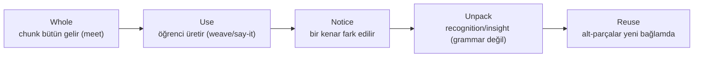

# Whole First, Unpack Later

<!-- gh-toc -->

## İçindekiler

- [Executive Summary](#executive-summary)
- [Why It Exists](#why-it-exists)
- [Current Canon](#current-canon)
- [How It Works](#how-it-works)
- [Examples](#examples)
- [Diagrams](#diagrams)
- [Runtime Implementation](#runtime-implementation)
- [Known Gaps](#known-gaps)
- [Open Questions](#open-questions)
- [Related Notes](#related-notes)

> [!canon] Purpose — Cairn'in çekirdek pedagojik ilkesi: öğrenci **önce kullanır**, mantığı **temastan sonra** açar. Bu notun tek işi bu ilkeyi ve runtime karşılıklarını tanımlamak.

## Executive Summary

Cairn ders vermez, sonra pratik yaptırmaz — tam tersini yapar. **"Whole first, unpack later. Use first. Understand deeply. Return stronger. No grammar dump before contact."** (`v0.3:48-51`). Öğrenci bir chunk'ı önce bütün kullanır (`je voudrais` = "I would like"), mantığı (conditionnel) çok sonra açılır. Açıklama **temasa bağlıdır, dardır ve tek bir kenara odaklanır**: "Contact precedes explanation; explanation is narrow and attached to what was just seen, typed, or compared." (`v0.3:58`).

## Why It Exists

Geleneksel dil öğretimi grammar-first'tür: kural → örnek → alıştırma. Bu, üretimi geciktirir ve öğrenciyi "anladım ama konuşamıyorum" durumuna hapseder. Cairn'in sözü üretim önceliklidir ("Production is the point of the app", `learning-engine-v1.md:36`). Bunu mümkün kılmak için mantık ertelenmeli: öğrenci `je voudrais`'i conditionnel'i "öğrenmeden" **çok önce** kullanır (`learning-engine-v1.md:170`). Grammar dump, temastan önce gelirse sözü kırar.

## Current Canon

### Çekirdek ilke (CANONICAL, v0.3 §3)
> "Whole first, unpack later. Use first. Understand deeply. Return stronger. No grammar dump before contact." — `v0.3:48-51`

> "**The learner should use language first, then notice/unpack the logic.** Contact precedes explanation; explanation is narrow and attached to what was just seen, typed, or compared." — `v0.3:58`

### Chunk-before-grammar kuralı (CANONICAL)
`learning-engine-v1.md:170`: "`je voudrais` (conditionnel) ... arrive long before the conditional is 'taught'". Chunk temas eder; kural sonra, dar, temasa bağlı gelir.

### Meet-card davranışı (CANONICAL)
"meet-card: kanon cümle **bütün gelir**; öğrenci chip'lere dokunarak ayrıştırır (whole sentence arrives; learner decomposes by tapping chips)" (`LESSON_FLOW_CANON_v1.md:66`).

### Unpack kartları (CANONICAL, v0.3 §6)
Notice / Micro-Logic / Chunk Unpack / Contrast / Edge / Return-to-Moment kartları, hepsi "**only after contact, narrow to one edge**" (`v0.3:180, 195-201`).

> [!warning] Bu kartlar "**must not add active mastery by themselves**; they may record seen/exposure/notice state separately from production mastery" (`v0.3:224`). Yani unpack, recognition/insight'tır — active grammar üretimi değil (`v0.3:171`). Mevcut `insight-card`'ı yeniden kullanma yaklaşımı **PROPOSED**, henüz ayrı kart tipi olarak yapılmadı.

## How It Works

### State / Lifecycle
Bu ilke, unpackable-chunk döngüsünde somutlaşır: whole → use → notice → unpack → reuse (bkz. [[Chip Lifecycle]]).

### Main Rules
1. Chunk önce bütün gelir (meet-card, whole sentence).
2. Öğrenci kullanır (weave, say-it).
3. Açıklama sadece temastan sonra, dar, tek kenar (insight-card).
4. Unpack = recognition/insight, active üretim değil.

### Guardrails
- **No grammar dump before contact** (`v0.3:51`).
- Unpack kartları tek başına active mastery **eklemez** (`v0.3:224`).
- Insight budget ≤3 L3-card (V5 validator).

## Examples
> [!example] `s'il vous plaît`:
> - **L1:** bütün "please" olarak kullanılır (formula chunk).
> - **sonra:** `vous`'un içeride olduğu fark edilir (notice).
> - **çok sonra:** literal yapı ("if it pleases you") açılır (micro-logic).
> Her aşama temasa bağlı; hiçbiri grammar dump değil.

## Diagrams

İlke soldan sağa akar: temas → kullanım → fark ediş → açılım → yeniden kullanım. Grammar hiçbir zaman en solda (temastan önce) değildir.

## Runtime Implementation
### Code References
- `lemot-app/components/lesson-v1/screens/MeetCard.tsx` — whole cümle sunumu (runtime'da statik; "tap each chip to activate" etkileşimi **PLANNED**, henüz yok).
- `lemot-app/components/lesson-v1/screens/InsightCard.tsx` — dar açıklama kartı (trigger sistemi PLANNED).

### Product-Stage Availability
İlke tüm katmanlarda CANONICAL. Meet-card chip-tap etkileşimi + ayrı unpack kartları PLANNED/PROPOSED.

## Known Gaps
- Meet-card'ın "tap to decompose" etkileşimi runtime'da yok (statik Continue).
- Ayrı unpack kart tipi yok (insight-card reuse PROPOSED).

## Open Questions
> [!open-loop] Unpack için ayrı kart tipi mi, insight-card payload'ı mı? → [[05 Open Loops]]

## Related Notes
[[Chip System Overview]] · [[Chip Lifecycle]] · [[Learning Philosophy]] · [[Natural Reveal]] · [[Lesson Flow]]
