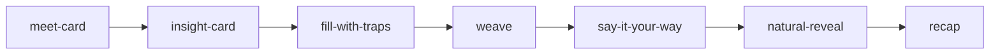

# Exercise System Overview

<!-- gh-toc -->

## İçindekiler

- [Purpose](#purpose)
- [En kritik yapısal gerçek: ÜÇ paralel egzersiz sistemi](#en-kritik-yapısal-gerçek-üç-paralel-egzersiz-sistemi)
- [The 7 frozen v1 screen types (CANONICAL — "tip seti 7'de kalır")](#the-7-frozen-v1-screen-types-canonical-tip-seti-7de-kalır)
- [Legacy 11-section flow (dev-apk-HIDDEN, SUPERSEDED)](#legacy-11-section-flow-dev-apk-hidden-superseded)
- [learning-engine egzersizleri (SPEC + sandbox-only)](#learning-engine-egzersizleri-spec-sandbox-only)
- [Kanıt boşluğu (kritik)](#kanıt-boşluğu-kritik)
- [Canon validators V1–V9](#canon-validators-v1v9)
- [Known Gaps / Open Questions](#known-gaps-open-questions)
- [Kaynak içe aktarımı (Learning Engine Taxonomy, 2026-06-29 vault)](#kaynak-içe-aktarımı-learning-engine-taxonomy-2026-06-29-vault)
- [Related Notes](#related-notes)
- [🧭 GitHub Navigation](#-github-navigation)

> [!canon] Bu not, Cairn'in bütün egzersiz/ekran tiplerinin **ana evi (MOC)**. Her egzersizin kendi notu vardır; burada üç runtime, seçim/kanıt/hata matrisleri ve "hangi egzersiz nerede yaşıyor" haritası toplanır.

Yukarı: [[00 Le Mot Holy Codex]] · Kardeş matrisler: [[Exercise Selection Matrix]] · [[Exercise Evidence Matrix]] · [[Exercise Error Matrix]] · [[Exercise Anti-Patterns]]

## Purpose

Cairn'de bir "egzersiz" = öğrencinin bir **ekranda** yaptığı bir mikro-eylem birimi. Amaç: temas → deneme → üretim → reveal → hafıza döngüsünü ekran ekran taşımak. Egzersizler **discovery** (yanlış yok, skor yok) ve **assessment** (cevap kanıt üretir) diye ikiye ayrılır (`docs/canon/LESSON_FLOW_CANON_v1.md` §1.3, CANONICAL).

## En kritik yapısal gerçek: ÜÇ paralel egzersiz sistemi

Kodda üç ayrı egzersiz/ekran sistemi var; **karıştırma** (Evidence Pack 03, orientation note, IMPLEMENTED):

| Sistem | Ne | Veri / Renderer / Route | Statü |
|---|---|---|---|
| **B. v1 7-ekran renderer** | Aktif dev-APK ders yüzeyi | `content/lessons/v1/*` · `components/lesson-v1/` · `app/v1-lesson/[id].tsx` | **IMPLEMENTED — sevkedilen yüzey (L1–L6)** |
| **A. Legacy 11-section flow** | Sprint-8/9 eski motoru | `data/lessons` · `components/sections/*` · `app/lesson/[id].tsx` | IMPLEMENTED ama **dev-apk-HIDDEN** (`visibleLessons=[]`, `index.tsx:149`); SUPERSEDED tester yönü olarak |
| **C. learning-engine** | Uzun vadeli "content factory" | `content/learning-engine/*` · `LearnerRendererShell` · `app/learn/[fixtureId].tsx` | Gerçek kod ama **sandbox/founder-gated**, event/storage yok |

> [!canon] CLAUDE.md banner: "v1 is a temporary Dev APK smoke surface. learning-engine is the long-term product foundation. Do not expand v1."

## The 7 frozen v1 screen types (CANONICAL — "tip seti 7'de kalır")

Aktif runtime, `lesson.screens[]` dizisini `screenIndex` ile lineer yürür; `pickScreen()` `screen.type` üstünden switch yapar (`LessonRendererV1.tsx:138-159`). Yedi tip (`ScreenType`, `lessonTypes.ts:40-47`):

| # | ScreenType | Not | Ana Not |
|---|---|---|---|
| 1 | `meet-card` | ilk temas, static Continue | [[Meet]] |
| 2 | `insight-card` | L3 promoted insight, static | [[Insight and Notice]] |
| 3 | `fill-with-traps` | tek-seçim, pedagojik trap distraktörler | [[Fill]] · [[Multiple Choice]] |
| 4 | `weave` | killer mekanik, hint ladder | [[Weave]] |
| 5 | `say-it-your-way` | serbest üretim, gradesiz | [[Say It Your Way]] |
| 6 | `natural-reveal` | model + neden + alternatif (feedback surface) | [[Natural Reveal]] |
| 7 | `recap` | "taşını sen diz", piecesUsed | [[Review]] |

Zenginlik yeni ekran tipiyle değil, **payload içinde** ve Practice-Hub'da eklenir (§12 Faz B, CANONICAL). Header "part N of M" gösterir; **XP/score/streak/percent YOK** (`LessonRendererV1.tsx:82-83,120`).

L1 "Survival Kit" (`content/lessons/v1/lesson-001.ts`, 10 ekran): insight-goal → meet Bonjour → insight-culture → meet `Je voudrais un café.` → fill-with-traps → weave → meet `S'il vous plaît.` → weave → meet `Merci.` → say-it → recap. Canon spine ile tutarlı (§5.1).

## Legacy 11-section flow (dev-apk-HIDDEN, SUPERSEDED)

`constants/sections.ts` `SECS` (11 anahtar) + `CHUNKS` (3 parça: Learn[0-3]/Practice[4-6]/Produce[7-10]): `read_listen, patterns, fill_fg, fill_fr, build, fill_write, quiz, combine_fg, say_it, mini_conv, review`. Her section notu: [[Read and Listen]], [[French Fill]], [[Build]], [[Combine and Weave]], [[Write]], [[Mini Conversation]]. `MASTERY_THRESHOLDS` (`sections.ts:48-60`) legacy'ye özel skor eşikleri tanımlar.

## learning-engine egzersizleri (SPEC + sandbox-only)

`content/learning-engine/lessons/L{1,2,11,12,14,15,16,18}.exercises.ts` + grader (`error-engine.ts`), mastery reducer (`mastery.ts`), telemetry. **PLANNED/DEFERRED ürün temeli**; testerlar görmez. Detay: [[Self-Producing Engine]], [[Learning Engine Architecture]].

## Kanıt boşluğu (kritik)

> [!warning] **v1 renderer HİÇ LearningEvent emit ETMEZ.** Fill/Weave/SayIt doğruluğu lokal hesaplar; telemetri/kanıt üretmez. `ErrorTagCode` taksonomisi, mastery reducer ve event modeli yalnız learning-engine'de (sandbox) yaşar. Legacy ise `logErr(...)` ile ayrı bir weak-spot izleyiciye yazar. Detay: [[Exercise Evidence Matrix]], [[Error Tracking System]].

## Canon validators V1–V9

Yalnız **V3/V4/V5 mekanize** (`scripts/canonRules.ts`); V1,V2,V6-V9 spec-only. Detay: [[Exercise Anti-Patterns]].

## Known Gaps / Open Questions

- Meet/Insight/Recap için canon'un "tap chips to activate" etkileşimi **Faz B PLANNED** — bugün static Continue.
- v1 runtime evidence emission → [[05 Open Loops]].
- Natural Reveal L1-L3 merge PR #180 device pass bekliyor.

## Kaynak içe aktarımı (Learning Engine Taxonomy, 2026-06-29 vault)

> [!info] Kaynak: `Learning_Engine_and_Exercise_Types.md` (private product/architecture canon, 2026-06-29). **Zenginleştirir ama override ETMEZ** — repo runtime canon (HEAD `02f9f7a` / #196) üstün kalır. Kaynağın kendi ilkesi: "lesson content/schema is source of truth; renderer displays; deterministic validator is the judge; AI is a bounded coach." Bu, yukarıdaki **ekran tipi** haritasının üzerine bir **ürün-egzersiz (learning action)** katmanı ekler.

**Kritik ayrım: egzersiz tipi ≠ renderer bileşeni.** Ürün-egzersiz tipi = öğrencinin **öğrenme eylemi** (learner-facing learning action). Bir renderer birden çok ürün-davranışı taşıyabilir; bir ürün-egzersiz ileride birden çok renderer'a sahip olabilir. Aşağıdaki 11 tip **ürün taksonomisidir**; §"7 frozen v1 screen type" ise bugünkü **renderer**'dır.

### 11 ürün-egzersiz tipi (kaynak §1)

| # | Ürün-egzersiz tipi | Öğrenme eylemi | Örnek ekran / mekanik | Weak-point üretebilir mi? | Statü |
|---|---|---|---|---|---|
| 1 | **Exposure** | oku, dinle, fark et; üretim istemez | `meet-card`, read/listen, passive insight | Hayır (yalnız exposure count) | current-runtime |
| 2 | **Recognition** | seç, eşle, ayırt et | `fill-with-traps`, package choice | Evet (scoped/authored ise) | current-runtime |
| 3 | **Guided Production** | destekle kısıtlı cevap kur/yaz | Weave / "Try it in French" | Evet (authored target chunk) | current-runtime |
| 4 | **Open Production** | serbest, kendi ifadesiyle | `say-it-your-way` | Varsayılan hayır (targetMove yoksa) | current-runtime |
| 5 | **Comparison** | denemesini doğal modelle karşılaştır | `natural-reveal`, model answer | Doğrudan hayır | current-runtime |
| 6 | **Reflection / Recap** | kullandığını adlandır, taşı | `recap`, piecesUsed | Doğrudan hayır | current-runtime |
| 7 | **Review / Resurfacing** | önceki materyali geri getir | Daily Review, Practice Pool Build/Stretch/Challenge | Evet (registry-backed) | PLANNED (dev-apk-hidden) |
| 8 | **Integration / Review Lesson** | önceki parçaları yeni anlamda birleştir | integration sekansı, cumulative Weave | Evet (scoped kombinasyon) | PLANNED |
| 9 | **Diagnostic Drill** | şüpheli bir weak-point'i doğrula | micro-contrast, targeted fill/listening trap | Evet (dar, authored tag) | FUTURE (validator-gated) |
| 10 | **Repair / Micro-Remediation** | doğrulanmış weak-point'i küçük hedefli tekrarla azalt | targeted fill, micro-contrast | Yalnız hedeflenen weak-point | FUTURE (validator-gated) |
| 11 | **Generative / Adaptive Variant** | authored seed'den güvenli varyant (recognize/produce/compare/repair alt-tip) | adaptive review card, generated-but-validated item | Yalnız authored/validated hedef | FUTURE (validator-gated) |

> [!warning] Tip 9–11 (Diagnostic Drill, Repair, Generative/Adaptive) **FUTURE**'dır ve **validator-gated** olmalıdır: authored schema/validator gate'ini asla bypass edemez. Kaynak §7: "generation can multiply approved patterns; it cannot invent the syllabus." Adaptive/self-replicating ders bugünkü runtime'da YOKtur.

### 7 v1 ekran tipi → ürün taksonomisi eşlemesi (kaynak §8)

| v1 ekran tipi | Ürün-egzersiz eşlemesi |
|---|---|
| `meet-card` | **Exposure** |
| `insight-card` | Exposure / açıklama / boundary naming |
| `fill-with-traps` | **Recognition** (trap feedback ile) |
| `weave` | **Guided Production + Comparison** |
| `say-it-your-way` | **Open Production** (+ confirmation + comparison) |
| `natural-reveal` | **Comparison / reveal** |
| `recap` | **Reflection / Ownership Recap** |

Not: Bir renderer birden çok ürün-davranışı taşır — `weave` hem Guided Production (üretim) hem Comparison (reveal) yürütür; `say-it-your-way` Open Production + Comparison. Bu, "egzersiz tipi ≠ renderer" ilkesinin somut kanıtı.

### Contract-layer operasyonları (kaynak §8)
`content/learning-engine/types.ts` operasyonları: `recognition`, `fill`, `build`, `register_switch`, `context_chain`, `open_production`. `free_conversation` **declared** ama blueprint union'ı bugün güvenli bounded seti kapsar. `lesson-v1` = bugünün Round 1 renderer'ı; `content/learning-engine/*` = contract-driven **future/parallel** engine katmanı. Bu eşleme wiring değişimi **yetkilendirmez**.

## Related Notes

[[Lesson Flow]] · [[Lesson Anatomy]] · [[Weave System]] · [[Mastery Model]] · [[Error Tracking System]] · [[Spec to Runtime Matrix]]
</content>
</invoke>

<!-- gh-nav -->

## 🧭 GitHub Navigation

[⬆ README](../../README.md) · [🪨 Holy Codex](../00_START_HERE/00%20Le%20Mot%20Holy%20Codex.md) · [Current State](../00_START_HERE/03%20Current%20State.md) · [Open Loops](../00_START_HERE/05%20Open%20Loops.md)

**Bu klasördeki notlar (03_EXERCISES):**

- [Build](./Build.md)
- [Combine and Weave](./Combine%20and%20Weave.md)
- [Daily Review](./Daily%20Review.md)
- [Exercise Anti-Patterns](./Exercise%20Anti-Patterns.md)
- [Exercise Error Matrix](./Exercise%20Error%20Matrix.md)
- [Exercise Evidence Matrix](./Exercise%20Evidence%20Matrix.md)
- [Exercise Selection Matrix](./Exercise%20Selection%20Matrix.md)
- [Exercise System Overview](./Exercise%20System%20Overview.md) ⟵ *bu not*
- [Fill](./Fill.md)
- [French Fill](./French%20Fill.md)
- [Insight and Notice](./Insight%20and%20Notice.md)
- [Meet](./Meet.md)
- [Mini Conversation](./Mini%20Conversation.md)
- [Multiple Choice](./Multiple%20Choice.md)
- [Natural Reveal](./Natural%20Reveal.md)
- [Read and Listen](./Read%20and%20Listen.md)
- [Review](./Review.md)
- [Say It Your Way](./Say%20It%20Your%20Way.md)
- [Weave](./Weave.md)
- [Write](./Write.md)
