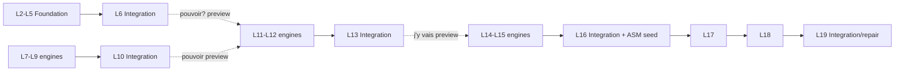

# Integration Lesson Logic

<!-- gh-toc -->

## İçindekiler

- [Executive Summary](#executive-summary)
- [Current Canon — the rhythm rule](#current-canon-the-rhythm-rule)
- [Preview-hook pattern](#preview-hook-pattern)
- [L16 novelty device (exception)](#l16-novelty-device-exception)
- [Guardrails](#guardrails)
- [Integration instances (audit'te 0 active-new)](#integration-instances-auditte-0-active-new)
- [Known Gaps](#known-gaps)
- [Related Notes](#related-notes)

> [!canon] Purpose — **Integration (Review/Integration archetype #10)** derslerinin ne zaman geldiği, ne içerdiği, ne içermediği. Instances: L6, L10, L13, L16. Band ritmi → [[Level and Band Map]].

## Executive Summary

Integration dersleri **yeni sistem tanıtmaz**; owned parçaları tek doğal insan akışında yeniden birleştirir. Ritim: **her ~4–5 derste bir, ya da ~3 ardışık new-engine dersinden sonra** (`lesson-archetype-templates-v1.md:300`). A~0–4 active-new (çoğu recycled), recycled ~%55 (`:280-281`). **[CANONICAL]**

## Current Canon — the rhythm rule

> [!canon] Cadence: **2 yeni engine → 1 integration**; asla >2 ardışık new-engine dersi (`band-map:81,116`). Eşleme: L11–L12→**L13**; L14–L15→**L16**; L17–L18→**L19**. **[CANONICAL rhythm rule]**

## Preview-hook pattern

> [!canon] Bir integration dersi **recognition-only forward preview hook** taşıyabilir: L6→L7 (aller), L10→L11 (pouvoir), L13→L14 (`y`) (`lesson-archetype-templates-v1.md:301,305-308`). **Preview hook ownership DEĞİLDİR**; bir sonraki ders onu açıkça sahiplenmeden üretim beklenmez. **[CANONICAL]**

## L16 novelty device (exception)

L16, önceki saf-integration beat'i (L13) yalnız 3 ders önce olduğundan "too little novelty" flag'ini savuşturmak için çok küçük bir novelty device ekler: **A Small Moment seed** (model-answer-only, present-only, known-items-only, ≤2–3 satır) (`lesson-archetype-templates-v1.md:310-316`). → [[L16 Integration and Small Moment]]. **[CANONICAL]**

## Guardrails

> [!warning] Integration dersleri **asla quiz/test gibi hissettirmemeli**; capability framing, score/reward yok (`lesson-archetype-templates-v1.md:288,296`). Banned language kuralı burada da geçerli (streak/XP/"perfect!"). → [[Learner Experience Principles]].

## Integration instances (audit'te 0 active-new)

Chip audit: L6/L10/L13 (ve L16 meta) integration'larında **0 active-new** (`audit:246`). Bu, ritmin runtime'da da tutulduğunun kanıtı. **[IMPLEMENTED]**

| Ders | Rol | Preview hook | Not |
|---|---|---|---|
| [[L6 Un Petit Moment]] | Foundation integration | aller (L7) | tek yeni lexis `aide`, `comprendre` |
| [[L10 Integration]] | After Class | pouvoir (L11) | doc patches proposed, not applied |
| [[L13 Integration]] | Can-Do & Asking | `j'y vais` (L14) | repair/can-do zinciri |
| [[L16 Integration and Small Moment]] | Integration + ASM | — | novelty device seed |

## Known Gaps
- L13, repair pair'i owned varsayıyor ama shipped değil (spec-vs-shipped tutarsızlığı). → [[Vocabulary Progression]], [[05 Open Loops]].

## Related Notes
[[Syllabus Overview]] · [[Level and Band Map]] · [[Syllabus Design Rules]] · [[L6 Un Petit Moment]] · [[L10 Integration]] · [[L13 Integration]] · [[L16 Integration and Small Moment]]
