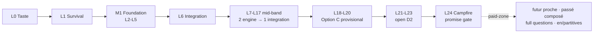

# Syllabus Overview

<!-- gh-toc -->

## İçindekiler

- [Executive Summary](#executive-summary)
- [Why It Exists](#why-it-exists)
- [Current Canon — L0→L24 spine narrative](#current-canon-l0l24-spine-narrative)
- [Audit verdict & known identity gap](#audit-verdict-known-identity-gap)
- [Failure Modes](#failure-modes)
- [Runtime Implementation](#runtime-implementation)
- [Known Gaps](#known-gaps)
- [Open Questions](#open-questions)
- [Related Notes](#related-notes)
- [🧭 GitHub Navigation](#-github-navigation)

> [!canon] Purpose — Bu not, Cairn'in **L0 → L24 ders omurgasının** (spine) tek ana evidir: her dersin kimliği, sırası, banttaki rolü ve **paywall'ın nerede oturduğu**. Ders bazlı detay için tek tek [[L2 Être]] … [[L18-L24 Roadmap]] notlarına, çapraz durum için [[Lesson Status Matrix]]'e git.

## Executive Summary

Spine, **L1'de başlar**; **L0 bir ön-onboarding tadımıdır**, tam ders değildir. Omurga **L5'e kadar kilitli (locked)**, **L6–L17 dokümante**, **L18–L20 provisional (band-map Option C)**, **L21–L23 açık (open decision D2)**, **L24 Campfire** bir landmark olarak oturmuş. Kaynak cümle: `l0-l24-founder-build-matrix-v0.md:72-76`. **[CANONICAL]**

Paywall/promise-gate **Campfire ~L24**'te settled; yani **L1–L20 tamamen ücretsiz / pre-Campfire**. Eski "**paywall after L14 / $12.99**" kararı **SUPERSEDED / archive** (kök `CLAUDE.md`'deki 24-lesson bracket). Bkz. [[Monetization and Scope Boundaries]]. **[CANONICAL]**

Runtime gerçeği spine'dan farklı: **L0–L15 authored & registered**, ama **yalnızca L0–L6 learner-visible**; L7–L15 kayıtlı ama Home-gated; L16–L17 spec-only. Ayrıntı → [[Lesson Status Matrix]].

## Why It Exists

Spine, "correct French is not sufficient" ilkesini (prerequisite-safety) bir **sıraya** çevirir: her ders yalnızca daha önce sahiplenilen (owned) ya da bu derste supported/recognition olarak verilen parçalara dayanır (`lesson-spec-template-v1.1.md:51`, `ai-generation-contract-v1.md:29`). Böylece öğrenci hiçbir zaman görmediği bir formu üretmek zorunda kalmaz. Detay kural seti → [[Syllabus Design Rules]].

## Current Canon — L0→L24 spine narrative

> [!canon] Aşağıdaki sıra ve rol dağılımı `l0-l24-founder-build-matrix-v0.md:72-76` ve band map `L10-L20-band-map-v0.md:12,79-85` ile bağlayıcıdır.

- **L0 — First Taste** (café onboarding). Tek çıktı: «Bonjour, je voudrais un café.» Bilinçli olarak **budget'ın altında** (onboarding, tam ders değil). → [[L0 The First Step]] (OWNER: orchestrator). **[CANONICAL/locked]**
- **L1 — Survival Kit.** İlk tam sosyal döngü (open→request→repair→close); kasıtlı **2-full-cycle-engine istisnası**. → [[L1 Survival Kit]] (OWNER: orchestrator). **[CANONICAL/locked]**
- **L2 — Être / Identity.** İlk mimari-fiil (`je suis` yalnız aktif). → [[L2 Être]]. **[locked]**
- **L3 — Yes, No & You.** `ne…pas` üretken + tu/vous sosyal seçim. → [[L3 Non]]. **[locked]**
- **L4 — Avoir / Human States.** être↔avoir kontrastı; `j'ai faim/soif/besoin de`. → [[L4 J'ai]]. **[locked]**
- **L5 — Objects / Articles.** `un/une` aktif; M1'i kapatır. → [[L5 Un Une]]. **[locked]**
- **L6 — Foundation Integration.** 0 yeni gramer; ilk integration beat. → [[L6 Un Petit Moment]]. **[documented]**
- **L7 — Aller / Movement** (compact "Je Vais" doorway olarak sevkedildi). → [[L7 Je Vais]]. **[documented]**
- **L8 — Où / Location Questions.** Tek soru sözcüğü `où`. → [[L8 Location Questions]]. **[documented]**
- **L9 — Faire / Small Actions.** split-sense `faire une pause`. → [[L9 Faire Une Pause]]. **[documented]**
- **L10 — After Class (Integration).** 0 yeni gramer; L11 pouvoir hook. → [[L10 Integration]]. **[documented]**
- **L11 — Pouvoir / Help & Permission.** split-sense pouvoir. → [[L11 Pouvoir]]. **[documented]**
- **L12 — Est-ce que wrapper.** owned clause üstüne yes/no. → [[L12 Est-ce Que]]. **[documented]**
- **L13 — Can-Do & Asking (Integration).** L11+L12+L7–L9 zinciri. → [[L13 Integration]]. **[documented]**
- **L14 — `y`-light / Place Pronoun.** `j'y vais` / `on y va`. → [[L14 Y]]. **[documented]**
- **L15 — Devoir / Falloir-light.** `il faut` primary, `je dois` supported. → [[L15 Devoir Falloir]]. **[documented]**
- **L16 — Integration + A Small Moment seed.** integration + küçük novelty device. → [[L16 Integration and Small Moment]]. **[documented]**
- **L17 — Human Context / Feelings Light.** `Ça va?`, `content(e)`; advice → paid-zone. → [[L17 Human Context and Feelings]]. **[documented]**
- **L18 — Futur proche stronger preview** *(NOT owned)*, **L19 — Integration/repair**, **L20 — Pre-Campfire checkpoint** — hepsi band-map **Option C provisional**. → [[L18-L24 Roadmap]]. **[PLANNED]**
- **L21–L23** — unspecified, **open decision D2**. **[PROPOSED/UNKNOWN]**
- **L24 — Campfire** — soft promise-gate landmark; paid-zone sözü burada gösterilir. **[CANONICAL landmark / PLANNED content]**

Yukarıdaki akış: L0 tadımdan sonra L1 tam ilk döngü, L2–L5 temel (Foundation), L6'dan itibaren "2 yeni engine → 1 integration" ritmi (bkz. [[Integration Lesson Logic]]), L18–L20 provisional on-ramp, L24 Campfire'da ücretli bölgenin sözü verilir. **Headline engine sayısı bu bantta owned = 0** (`band-map:57`) — yani L7–L17 hep light-slice sahipliği.

## Audit verdict & known identity gap

> [!implemented] **L1–L15 Chip Inventory Audit (2026-07)** verdict = **`CLEAN_WITH_REVIEW_ITEMS`** (`L1_L15_CHIP_INVENTORY_AUDIT_2026_07.md:240`). 16 ders / 80 chip'te **sıfır ihlal** (full-sentence chip, full-question chip, protected-chunk abuse yok). Detay → [[Lesson Status Matrix]] ve [[Chip Taxonomy]].

> [!warning] **R3 identity gap:** `ici` ve `faim` chip olarak üretiliyor ama arkalarında **registry item yok**; mastery event'leri hiçbir şeye tutunmuyor (`audit:43,57,64,71,82,105`). Fix (`word-ici`/`noun-faim`) **DEFERRED**. → [[05 Open Loops]].

## Failure Modes

- **Spine ile runtime karıştırılırsa:** "L15 dokümante" ≠ "L15 kullanıcıya görünür". Runtime yalnız L0–L6 görünür; gerisi Home-gated (`app/(tabs)/index.tsx` filter `l.number >= 1 && l.number <= 6`, `L07-compact-doorway.compact-spec.md:96-99`). **[CANONICAL]**
- **Legacy paywall @ L14 diriltilirse:** kök `CLAUDE.md` hâlâ eski bracket'i taşıyor; bu **archive**, spine kararını ezmez (`band-map:6,177,213`).
- **Spec ≠ shipped:** L7–L15 runtime dosyaları var ama **compact/de-scoped** yöne göre yazıldı, tam spec'lere değil (`evidence 04 §1`).

## Runtime Implementation
### Code References
- `lemot-app/content/lessons/v1/index.ts` — `V1_LESSONS`, lesson-000..015 (16 dosya) kayıtlı.
- `lemot-app/app/(tabs)/index.tsx` — Home cap `number <= 6`.
- `lemot-app/content/lessons/v1/lesson-000.ts:192` id `"v1-lesson-000"` … `lesson-015.ts:201,203` id `"v1-lesson-015"`, `number: 15`.
### Product-Stage Availability
sandbox / **dev-apk** (L0–L6 görünür) / public-beta (paywall + revenueCat eklenir; L1–L20 free zone).

## Known Gaps
- L16–L17 için runtime dosyası **yok** (spec-only).
- Futur-proche ownership noktası + free-tier tuning = **en üst açık risk** (`band-map:15,206`) — paywall pozisyonu değil.

## Open Questions
> [!open-loop] L21–L23 içeriği (open decision D2, `matrix:336`) ve L18 preview gücü çözülmemiş → [[05 Open Loops]], [[L18-L24 Roadmap]].

## Related Notes
[[00 Le Mot Holy Codex]] · [[Lesson Status Matrix]] · [[Syllabus Design Rules]] · [[Level and Band Map]] · [[Integration Lesson Logic]] · [[Vocabulary Progression]] · [[Grammar Progression]] · [[Phenomena Progression]] · [[Monetization and Scope Boundaries]]

<!-- gh-nav -->

## 🧭 GitHub Navigation

[⬆ README](../../README.md) · [🪨 Holy Codex](../00_START_HERE/00%20Le%20Mot%20Holy%20Codex.md) · [Current State](../00_START_HERE/03%20Current%20State.md) · [Open Loops](../00_START_HERE/05%20Open%20Loops.md)

**Bu klasördeki notlar (04_SYLLABUS):**

- [Grammar Progression](./Grammar%20Progression.md)
- [Integration Lesson Logic](./Integration%20Lesson%20Logic.md)
- [L0 — The First Step (First Taste)](./L0%20The%20First%20Step.md)
- [L1 — Survival Kit](./L1%20Survival%20Kit.md)
- [L10 — After Class (Integration)](./L10%20Integration.md)
- [L11 — Pouvoir / Help & Permission](./L11%20Pouvoir.md)
- [L12 — Est-ce que / Yes-No Question Wrapper](./L12%20Est-ce%20Que.md)
- [L13 — Can-Do & Asking (Integration)](./L13%20Integration.md)
- [L14 — y-light / Place Pronoun ("Let's Go")](./L14%20Y.md)
- [L15 — Devoir / Falloir-light / Obligation](./L15%20Devoir%20Falloir.md)
- [L16 — Integration + A Small Moment seed](./L16%20Integration%20and%20Small%20Moment.md)
- [L17 — Human Context / Feelings Light](./L17%20Human%20Context%20and%20Feelings.md)
- [L18–L24 — Roadmap Intent](./L18-L24%20Roadmap.md)
- [L2 — Être / Identity](./L2%20%C3%8Atre.md)
- [L3 — Yes, No & You (Negation / Tu-Vous)](./L3%20Non.md)
- [L4 — Avoir / Human States](./L4%20J%27ai.md)
- [L5 — Objects / Articles](./L5%20Un%20Une.md)
- [L6 — Foundation Integration ("Putting It Together")](./L6%20Un%20Petit%20Moment.md)
- [L7 — Aller / Movement (full) vs Je Vais frozen-chunk doorway (compact)](./L7%20Je%20Vais.md)
- [L8 — Où / Location & Movement Questions](./L8%20Location%20Questions.md)
- [L9 — Faire / Small Actions / Pause](./L9%20Faire%20Une%20Pause.md)
- [Lesson Status Matrix](./Lesson%20Status%20Matrix.md)
- [Level and Band Map](./Level%20and%20Band%20Map.md)
- [Phenomena Progression](./Phenomena%20Progression.md)
- [Syllabus Design Rules](./Syllabus%20Design%20Rules.md)
- [Syllabus Overview](./Syllabus%20Overview.md) ⟵ *bu not*
- [Vocabulary Progression](./Vocabulary%20Progression.md)
