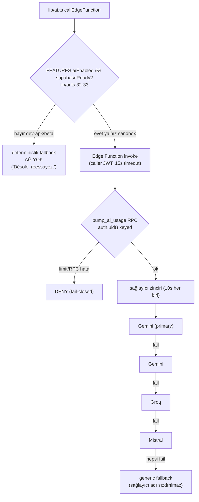

# AI Architecture

<!-- gh-toc -->

## İçindekiler

- [Executive Summary](#executive-summary)
- [Why It Exists](#why-it-exists)
- [Current Canon](#current-canon)
- [Diagrams](#diagrams)
- [Failure Modes](#failure-modes)
- [Examples](#examples)
- [Runtime Implementation](#runtime-implementation)
- [Known Gaps](#known-gaps)
- [Open Questions](#open-questions)
- [Related Notes](#related-notes)

> [!canon] Purpose — `aiEnabled` master switch'ini (fail-closed), sağlayıcı zincirini (**Gemini → Gemini → Groq → Mistral, Claude yok**), auth-gerektiren vs no-auth fonksiyonların neden **etkin olarak uykuda** olduğunu ve deterministik fallback'i açıklar.
> Üst bağlantı: [[00 Le Mot Holy Codex]] · [[System Architecture]] · [[Supabase]].

## Executive Summary

AI, üründe **destekleyici bir katmandır, çekirdek değildir** — ve bugün **etkin olarak uykuda**dır. `aiEnabled` master switch **dev-apk VE public-beta'da false**, yalnız sandbox'ta true'dur (`productStage.ts` tablosu). `lib/ai.ts callEdgeFunction`, `FEATURES.aiEnabled && supabaseReady` olmadıkça **hiçbir ağ çağrısı yapmaz** ve deterministik fallback döner (`lib/ai.ts:32-33`) [IMPLEMENTED, fail-closed]. Sonuç: sevkedilen tester/beta build'ler AI-kapalı çalışır; ders-içi AI bölümleri deterministik fallback'e nazikçe düşer. Sunucu sağlayıcı zinciri sırayla düşer: **Gemini (primary) → Gemini → Groq → Mistral** — Claude bu chat/eval zincirinde yoktur.

## Why It Exists

Cairn'in kimliği "premium French production engine — not a generic AI tutor"dur; AI müfredatı sahiplenmez, yalnız açıklar/değerlendirir ve **asla görülmemiş bir formu sızdırmaz** ([[AI Role and Guardrails]]). Bu not AI'ın teknik omurgasını ve neden varsayılan olarak kapalı olduğunu belgeler.

## Current Canon

- **Master switch** [IMPLEMENTED, fail-closed]: `aiEnabled` false ise ağ yok, deterministik string fallback (`lib/ai.ts:32-33`). Stage tablosu: sandbox=true, **dev-apk=false, public-beta=false**.
- **`aiChat` vs `aiLesson` ayrımı**: dev-apk'te `aiLesson=true` (ders-içi AI yapısal olarak açık) ama `aiEnabled=false` olduğundan yine deterministik fallback çalışır; `aiChat` (Chat sekmesi) dev-apk'te false. Detay: [[Product Stage Architecture]].
- **Sağlayıcı zinciri** (`_shared/providers.ts`): Gemini → Gemini → Groq → Mistral sırayla fallthrough (`ai-chat` chat/eval için). `ai-error` kaynağı Claude Haiku'ya referans verir ama AI uykuda olduğundan **etkin değil** (EAS doc `ANTHROPIC_API_KEY` "required for ai-error future").
- **Sunucu-sahipli kontrat**: sistem prompt'u sunucu sabiti, client `system` yok sayılır; `maxTokens ≤ 300` clamp; mesaj/payload cap (`ai-chat/index.ts:52-58`).
- **Rate limit** [fail-closed]: her fonksiyon `bump_ai_usage` RPC'sini `auth.uid()`'e keyed çağırır; limit/RPC yoksa istek **reddedilir** (`ratelimit.ts:14-38`). Günlük cap: `ai-chat` 20, `ai-evaluate` 40, `ai-error` 10.
- **Timeout**: her sağlayıcı fetch 10s `AbortSignal.timeout`; client 15s `AbortController` (`lib/ai.ts:19,35-57`).

## Diagrams

Düz dille: Her AI çağrısı önce master switch'e çarpar; dev-apk/public-beta'da kapı kapalı olduğundan hiç ağ olmadan deterministik bir yanıt döner. Yalnız sandbox'ta kapı açılır; orada bile rate-limit RPC'si yoksa/hata verirse istek reddedilir. Açık zincirde sağlayıcılar sırayla denenir (Gemini→Gemini→Groq→Mistral) ve hepsi başarısız olursa sağlayıcı adı sızdırılmadan genel bir fallback verilir.

## Failure Modes
- `aiEnabled` off / Supabase yapılandırılmamış → deterministik fallback, ağ yok.
- Ağ hatası / 15s timeout → fallback / "Temps d'attente dépassé".
- Rate-limit RPC hatası → deny (fail-closed).
- `ai_usage` tablosu deploy edilmemiş → her istek denied (güvenli varsayılan).

## Examples
> [!example]
> Round 1 Dev APK'de Say It Your Way ekranı: `evaluateSayIt` çağrılır ama `aiEnabled=false` → hiç ağ çağrısı olmadan model-cevap akışı deterministik fallback ile ilerler; smoke §8 "AI-disabled fallback never crashes" bekler.

## Runtime Implementation

### Code References
`lib/ai.ts:32-33,19,35-57,8-17,60-63`; `config/productStage.ts:71-136`; `ai-chat/index.ts:52-58`; `_shared/ratelimit.ts:14-38`.

### Test References
`aiContract`, `devApkCopyGuard` (`scripts/tests/`).

### Product-Stage Availability
`aiEnabled`: sandbox=true, dev-apk=false, public-beta=false. `aiChat`: dev-apk=false. `aiLesson`: dev-apk=true (ama fail-closed). Etkin sonuç: **AI stack effectively dormant** tüm sevkedilen build'lerde.

## Known Gaps
- `EAS_PREVIEW_BUILD.md` (AI-enabled gelecek), Round-1 "AI closed" politikası ve PR-C `ai-diag` kaldırması üç örtüşen-ama-farklı durumu anlatır; doc-hygiene item, niyet çelişkisi değil.
- `ai-error`/Claude Haiku yolu kaynakta var ama uykuda; canlı değil.

## Open Questions
> [!open-loop] AI hangi stage'de, hangi guardrail seti tamamlanınca açılacak? Açmadan önce şema deploy + `ai-diag` silme + secret verification operator blocker'ları var. → [[05 Open Loops]] · [[Supabase]].

## Related Notes
[[Supabase]] · [[Product Stage Architecture]] · [[AI Role and Guardrails]] · [[Failure and Recovery Model]] · [[System Architecture]] · [[00 Le Mot Holy Codex]]
