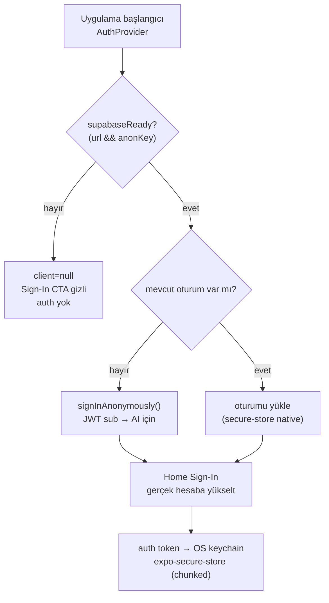

# Authentication

<!-- gh-toc -->

## İçindekiler

- [Executive Summary](#executive-summary)
- [Why It Exists](#why-it-exists)
- [Current Canon](#current-canon)
- [Diagrams](#diagrams)
- [Failure Modes](#failure-modes)
- [Examples](#examples)
- [Runtime Implementation](#runtime-implementation)
- [Known Gaps](#known-gaps)
- [Open Questions](#open-questions)
- [Related Notes](#related-notes)

> [!canon] Purpose — Supabase e-posta/parola auth'unu, oturumsuz başlangıçta **anonim oturum** oluşturmayı (AI çağrılarının JWT `sub`'ı olması için) ve auth token'ının native'de OS keychain'de nasıl saklandığını açıklar.
> Üst bağlantı: [[00 Le Mot Holy Codex]] · [[System Architecture]].

## Executive Summary

Auth, Supabase e-posta/parola'dır (`signUp/signIn/signOut`) ve `needsConfirmation` durumunu ele alır [IMPLEMENTED code-side]. Oturumsuz bir başlangıçta uygulama **otomatik anonim oturum** (`signInAnonymously`) açar ki AI çağrılarının bir JWT `sub`'ı olsun (`useAuth.ts:18-34`); Home'daki Sign-In gerçek hesaba yükseltir. Her şey `supabaseReady` ile kapılıdır. Native, oturumu OS keychain'de `expo-secure-store` ile saklar (şeffaf chunking); web `kvStorage`'a düşer (`lib/supabase.ts:16-42`). **Yalnız auth token** secure store'a taşınır.

## Why It Exists

Sunucu-taraflı AI rate-limit'i `auth.uid()`'e dayanır ([[AI Architecture]]); dolayısıyla bir kullanıcı hesap açmasa bile bir JWT kimliğine ihtiyaç vardır — anonim oturum bu boşluğu doldurur. Auth ayrıca opsiyonel bulut senkronunun ([[Sync Architecture]]) ön koşuludur.

## Current Canon

- **`useAuth.ts` / `AuthProvider.tsx`**: `signUp/signIn/signOut`, `needsConfirmation` yönetimi.
- **Anonim oturum** (`useAuth.ts:18-34`): oturumsuz başlangıçta `signInAnonymously` → AI çağrıları için JWT `sub`.
- **Token saklama (B19)** [IMPLEMENTED]: native `expo-secure-store` + `createChunkedSecureStorage` (şeffaf chunking) + tek-seferlik plaintext migration; web `kvStorage` fallback (`lib/supabase.ts:16-42`). Yalnız auth token secure store'da.
- **Kapı**: `supabaseReady = url && anonKey ikisi de set` (`lib/supabase.ts:10`); false ise client `null`, Sign-In CTA gizli (`index.tsx:190`).

## Diagrams

Düz dille: Uygulama açılınca, Supabase yapılandırılmışsa bir oturum aranır; yoksa sessizce anonim oturum açılır ki AI çağrılarının bir kimliği olsun. Kullanıcı isterse Home'dan gerçek hesaba yükseltir. Token native'de şifreli keychain'e (gerekirse parçalanarak) yazılır; yalnız token oraya taşınır, öğrenme verisi değil ([[Storage Architecture]]).

## Failure Modes
- `supabaseReady=false` (Round 1 Dev APK env'siz) → auth tamamen yok, CTA gizli, uygulama akmaya devam eder.
- `needsConfirmation` → e-posta onayı Dashboard'da kapatılmadıkça akış bekler (bilinen Sprint 10 blocker'ı).
- `noSupabaseAuthGuard` testi: auth kullanımının uygunsuz yerlere sızmadığını kilitler.

## Examples
> [!example]
> Round 1 Dev APK Supabase env olmadan build edilir → `supabaseReady=false` → hiç Sign-In görünmez, hiç anonim oturum açılmaz; smoke §4/§5 "no Sign In" bekler.

## Runtime Implementation

### Code References
`hooks/useAuth.ts:18-34`; `lib/supabase.ts:10,16-42`; `app/(tabs)/index.tsx:190`.

### Test References
`secureAuthStorage`, `noSupabaseAuthGuard` (`scripts/tests/`).

### Product-Stage Availability
Kod her stage'de; yalnız `supabaseReady` iken aktif. dev-apk Round 1 env'siz → auth kapalı. Detay: [[Supabase]].

## Known Gaps
- E-posta onayının Dashboard'da kapatılması operator-only (Sprint 10 blocker); cloud bunu yapamaz.

## Open Questions
> [!open-loop] Anonim oturum → gerçek hesap yükseltmesinde yerel `lm7` verisinin buluta ilk-birleştirme davranışı ([[Sync Architecture]]) ile tester consent akışı ([[Privacy and Data Deletion]]) nasıl kesişecek? → [[05 Open Loops]].

## Related Notes
[[Supabase]] · [[Sync Architecture]] · [[AI Architecture]] · [[Storage Architecture]] · [[System Architecture]] · [[00 Le Mot Holy Codex]]
