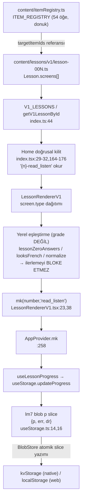

# Data Flow

<!-- gh-toc -->

## İçindekiler

- [Executive Summary](#executive-summary)
- [Why It Exists](#why-it-exists)
- [Current Canon — Zincir](#current-canon-zincir)
- [How It Works](#how-it-works)
- [Failure Modes](#failure-modes)
- [Examples](#examples)
- [Runtime Implementation](#runtime-implementation)
- [Known Gaps](#known-gaps)
- [Open Questions](#open-questions)
- [Related Notes](#related-notes)

> [!canon] Purpose — Bir öğrenci etkileşiminin **registry → lesson → renderer → scoring → storage** zinciri boyunca nasıl aktığını gösterir; ve neden Surface B'de "scoring" pratikte tek bir monotonik tamamlama işaretine indiğini açıklar.
> Üst bağlantı: [[00 Le Mot Holy Codex]] · [[System Architecture]].

## Executive Summary

Sevkedilen zincir (Surface B): `ITEM_REGISTRY` öğeleri → authored `lesson-00N.ts` (`screens[]`, `targetItemIds`) → `V1_LESSONS`/`getV1LessonById` → `LessonRendererV1` `screen.type` dağıtımı → yerel eşleştirme (grade değil) → tamamlanınca `mk()` → `lm7` blob'un `p` slice'ı. **Kritik nüans:** v1'de **puanlı geçiş kapısı yoktur**; tamamlama, ders sonunda bir kez yazılan tek monotonik işaret `{number}-read_listen`'dir [IMPLEMENTED]. Zengin, olay-tabanlı scoring yalnızca Surface C motorunda yaşar ve sevkedilen yüzeye bağlı değildir ([[Learning Engine Architecture]]).

## Why It Exists

"Öğrenci cevap verdiğinde ne olur, veri nereye gider?" sorusuna somut, dosya-satır düzeyinde cevap. Ayrıca "scoring var" varsayımını düzeltir: Surface B'de gerçek anlamda bir puanlama/gating motoru **yoktur**.

## Current Canon — Zincir

Düz dille: Registry öğeleri authored derslere `targetItemIds` üzerinden bağlanır (öğe tanımı orada tek kez yaşar, [[Registry Architecture]]). Ders yüklenir, renderer ekranları gezer, her ekran yerel olarak cevabı eşleştirir ama **yanlış cevap ilerlemeyi durdurmaz** — "no scoring, no ceremony". Ders sonunda tek bir tamamlama işareti `lm7.p`'ye atomik olarak yazılır ve Home bir sonraki dersi bu işaretle açar.

## How It Works

### Inputs
`ITEM_REGISTRY` öğeleri, authored `Lesson.screens[]`, kullanıcının ekran cevapları.

### Outputs
`lm7.p["{number}-read_listen"] = true`; Home doğrusal kilit açımı; hata girişleri (`err` slice) yerel olarak.

### State / Lifecycle
Tamamlama **monotonik**tir — bir kez `true` olur, geri alınmaz (bulut birleştirme de set-union kullanır, [[Sync Architecture]]).

### Main Rules
- Tek tamamlama anahtarı: `{number}-read_listen` (bölüm-başına değil, ders-başına).
- Yerel cevap eşleştirmesi ilerlemeyi **hiç** bloke etmez (v1'de gating yok).
- Tüm `lm7` yazımları tek atomik `BlobStore` üzerinden functional slice update ile gider — araya giren yazıcılar slice'ları ezmez (audit B6). Detay: [[Storage Architecture]].

### Guardrails
`BlobStore` atomikliği; corrupt-storage karantinası ([[Failure and Recovery Model]]).

## Failure Modes
- Öğrenci ders ortasında uygulamayı öldürürse: tamamlama işareti yazılmadığından ders "yarım" kalır; yeniden açılışta baştan başlar (Round 1 smoke §7 bunu doğrular).
- İki eşzamanlı yazıcı `err` ve `dr` slice'larına yazarsa: `BlobStore` slice birleştirmesi çakışmayı önler.

## Examples
> [!example]
> L1'de bir `FillWithTraps` ekranında yanlış cevap: ekran yerel olarak "yanlış" der, ama `mk()` çağrılmaz ve öğrenci yine de devam edebilir. Ders sonundaki `RecapCard`'tan sonra `mk(1,"read_listen")` → `lm7.p["1-read_listen"]=true` → Home L2'yi açar. Hiçbir puan/yıldız/streak yazılmaz (yasak dil canonu).

## Runtime Implementation

### Code References
`content/lessons/v1/index.ts:44`; `app/(tabs)/index.tsx:29-32,164-176`; `components/lesson-v1/LessonRendererV1.tsx:23,38`; `providers/AppProvider.tsx:258`; `hooks/useStorage.ts:14,16`.

### Test References
`lessonProgress`, `blobStore` suitleri (`scripts/tests/`).

### Product-Stage Availability
Bu zincir sandbox + dev-apk'te aktiftir (Surface B). Surface C'nin olay-tabanlı akışı ayrıdır ve yalnız sandbox'ta çalışır — [[Learning Engine Architecture]].

## Known Gaps
- Zengin scoring (per-item, near-miss, mastery) tümüyle Surface C motorunda; sevkedilen zincir onu **kullanmaz**. İki dünyanın ayrılığı = "main integration blocker".

## Open Questions
> [!open-loop] Surface B'nin monotonik tek-işaret modeli ile motorun olay-günlüğü ne zaman/nasıl birleştirilecek? Henüz tasarım yok. → [[05 Open Loops]].

## Related Notes
[[Runtime Content Architecture]] · [[Registry Architecture]] · [[Storage Architecture]] · [[Learning Engine Architecture]] · [[System Architecture]] · [[00 Le Mot Holy Codex]]
