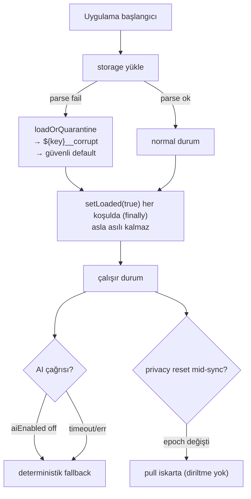

# Failure and Recovery Model

<!-- gh-toc -->

## İçindekiler

- [Executive Summary](#executive-summary)
- [Why It Exists](#why-it-exists)
- [Current Canon — Fail-closed matrisi](#current-canon-fail-closed-matrisi)
- [Diagrams](#diagrams)
- [Failure Modes](#failure-modes)
- [Examples](#examples)
- [Runtime Implementation](#runtime-implementation)
- [Known Gaps](#known-gaps)
- [Open Questions](#open-questions)
- [Related Notes](#related-notes)

> [!canon] Purpose — Tüm kod tabanının tutarlı **fail-closed / fail-safe** duruşunu tek yerde toplar: stage, AI, storage-corruption, privacy-reset yarışı, sync ve DB-deploy bağımlılığı için ne zaman bozulur ve ne olur.
> Üst bağlantı: [[00 Le Mot Holy Codex]] · [[System Architecture]].

## Executive Summary

Sistem baştan sona **fail-closed**tır: belirsizlik/hata durumunda en güvenli (en kısıtlı, veri-koruyan) yola düşer, asla yarım sonuç üretmez veya sessiz veri kaybetmez [IMPLEMENTED]. Bu, karpathy saflık sözleşmesinin "FAIL BEHAVIOR EXPLICIT" kuralının ([[Learning Engine Architecture]]) sistem geneline yayılmış halidir. Uygulama her koşulda başlatmayı bitirir (`setLoaded(true)` `finally`'de) — asla yüklenmemiş asılı kalmaz.

## Why It Exists

Bir öğrenme uygulamasında en pahalı hata veri kaybı ve sessiz yanlış durumdur. Bu not, "X bozulursa ne olur?" sorusunun her önemli alt sistem için tek referans tablosudur.

## Current Canon — Fail-closed matrisi

> [!implemented] Kaynak: evidence pack 05 §10.

| Alan | Tetikleyici | Davranış | Kaynak |
|---|---|---|---|
| **Product stage** | env eksik/typo | `dev-apk` (minimal), asla sandbox | `productStage.ts:16-40` |
| **AI** | `aiEnabled` off / Supabase yok | deterministik fallback, ağ yok | `lib/ai.ts:32-33` |
| **AI** | ağ hatası / 15s timeout | fallback / "Temps d'attente dépassé" | `lib/ai.ts:44-57` |
| **AI rate-limit** | RPC/tablo yok/hata | isteği **deny** | `ratelimit.ts:14-38` |
| **Storage** | parse edilemeyen blob | `${key}__corrupt`'a karantina, güvenli default, **ezme yok** | `useStorage.ts:56-113` |
| **Engine log** | bozuk olay günlüğü | append reddet (`CorruptEventLogError`) | `repository/local.ts:41-52` |
| **Privacy reset** | reset ↔ pull yarışı | epoch snapshot pull'u iskarta eder | `AppProvider.tsx:131-142` |
| **Sync** | push/pull hatası | `console.warn`, non-fatal | `useProgressSync.ts:44-58` |
| **DB deploy** | `ai_usage`/RPC deploy yok | her AI isteği denied (güvenli) | `schema.sql` §7 |

## Diagrams

Düz dille: Uygulama açılırken depolama bozuksa bile karantinaya alıp güvenli varsayılanla devam eder ve **her durumda** yüklemeyi bitirir. Çalışırken AI kapalıysa/hata verirse deterministik yanıta düşer; kullanıcı veriyi silerken bir senkron araya girerse epoch bariyeri o çekmeyi atar. Hiçbir yol veri ezmez veya uygulamayı asmaz.

## Failure Modes
Bu notun **tamamı** failure modes'tur; yukarıdaki tablo kanonik listedir. Her satır bir alt-mimari notunda derinleşir:
- Storage detayı → [[Storage Architecture]]
- AI detayı → [[AI Architecture]]
- Reset yarışı → [[Privacy and Data Deletion]]
- Stage çözümü → [[Product Stage Architecture]]

## Examples
> [!example]
> Bir tester dev-apk'yi uçak modunda açar, ders ortasında öldürür, yeniden açar: (1) ağ yok → AI zaten kapalı, sorun değil; (2) tamamlama işareti yazılmadı → ders baştan başlar; (3) depolama bozulmadı → normal akış. Round 1 smoke §7/§8 bu üçünü doğrular. Hiçbir crash yok.

## Runtime Implementation

### Code References
`productStage.ts:16-40`; `lib/ai.ts:32-33,44-57`; `useStorage.ts:56-113`; `repository/local.ts:41-52`; `AppProvider.tsx:131-142`; `useProgressSync.ts:44-58`; `ratelimit.ts:14-38`.

### Test References
`safeStorage`, `privacyResetBarrier`, `productStageResolution` (`scripts/tests/`).

### Product-Stage Availability
Fail-closed duruş her stage'de geçerlidir; en görünür etkisi dev-apk'te (AI kapalı, Supabase yok, minimal yüzey).

## Known Gaps
- Rate-limit sayacı reddedilen isteklerde de artar (kasıtlı); bu bir bug değil, tasarım notu (PR-C residual).

## Open Questions
> [!open-loop] `lm_le_snapshot` compaction/replay invariantı test-locked ama canlı bir compaction politikası devreye alınmadı; büyük olay günlüklerinde performans davranışı doğrulanmadı. → [[05 Open Loops]].

## Related Notes
[[Storage Architecture]] · [[AI Architecture]] · [[Product Stage Architecture]] · [[Privacy and Data Deletion]] · [[Learning Engine Architecture]] · [[System Architecture]] · [[00 Le Mot Holy Codex]]
