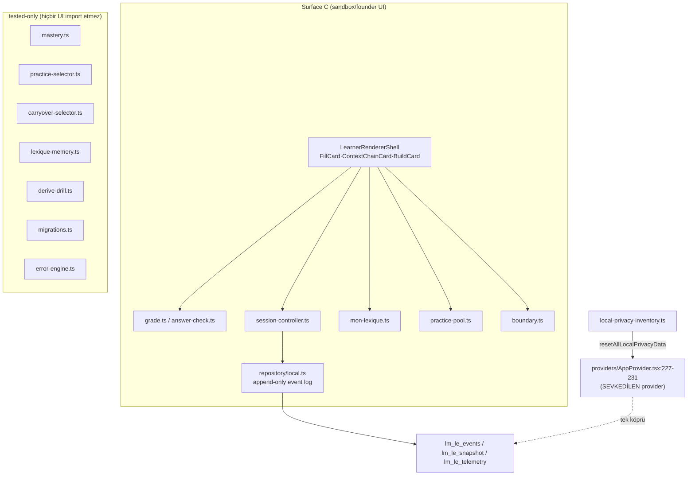

# Learning Engine Architecture

<!-- gh-toc -->

## İçindekiler

- [Executive Summary](#executive-summary)
- [Why It Exists](#why-it-exists)
- [Current Canon — Wired vs Tested-only](#current-canon-wired-vs-tested-only)
- [Karpathy saflık sözleşmesi (engine code)](#karpathy-saflık-sözleşmesi-engine-code)
- [How It Works](#how-it-works)
- [Diagrams](#diagrams)
- [Failure Modes](#failure-modes)
- [Examples](#examples)
- [Runtime Implementation](#runtime-implementation)
- [Known Gaps](#known-gaps)
- [Open Questions](#open-questions)
- [Related Notes](#related-notes)

> [!canon] Purpose — `content/learning-engine/*` modüllerinin ne olduğunu, hangilerinin **Surface C UI'a bağlı** hangilerinin **yalnız test edilmiş** olduğunu ve tek istisnayı (`local-privacy-inventory` sevkedilen provider'a bağlı) tek yerde listeler. Ayrıca **karpathy saflık sözleşmesini** açıklar.
> Üst bağlantı: [[00 Le Mot Holy Codex]] · [[System Architecture]] · [[Runtime Content Architecture]].

## Executive Summary

`content/learning-engine/`, kendi `index.ts`'inde "Executable content contract (v0.1)" olarak tanımlanır; import edilmesi "canlı ders renderer'ına DOKUNMAZ … mevcut kullanıcı-yüzü akışı etkilenmez" (`index.ts:1-13`). **Motorun tamamı ya founder-sandbox UI'dır (Surface C) ya da yalnız test edilmiştir — tek istisna `local-privacy-inventory`**, çünkü reset fonksiyonu `AppProvider.resetLocalData`'ya bağlıdır [IMPLEMENTED-and-wired]. Motorun kalıcılığı ayrı `lm_le_*` ad alanında yaşar ve "canlı-v7 anahtarları `lm7`/`lm7_srs`'i asla okumaz/yazmaz" (`repository/local.ts:14-38`). Bu, iki depolama dünyasının ayrılığıdır — "main integration blocker".

## Why It Exists

Learning-engine, CLAUDE.md banner'ının "uzun vadeli ürün temeli" dediği katmandır: mastery, seçiciler, Mon Lexique, practice pool, telemetri — hepsi saf, deterministik modüller. Ancak bugün **hiçbiri sevkedilen dev-apk yüzeyine bağlı değildir** (Surface B onu import etmez, [[Runtime Content Architecture]]). Bu not, "hangi modül gerçekten bir ekrana bağlı?" sorusunu dürüstçe cevaplar.

## Current Canon — Wired vs Tested-only

> [!implemented] Kaynak: import-graph grep (app/components/providers/hooks/lib vs scripts/tests), evidence pack 05 §5.

| Modül | Nerede import edilir (non-test) | Statü |
|---|---|---|
| `grade.ts` (deterministik grader) | `components/learning-engine/{FillCard,ContextChainCard,RegisterSwitchCard}.tsx`, `buildSequence.ts` | **wired → Surface C** |
| `answer-check.ts` (normalize/checkAnswer) | `ContextChainCard.tsx` + engine index | **wired → Surface C** |
| `session-controller.ts` | `{FillCard,ContextChainCard,BuildCard,RegisterSwitchCard,useLearningEngineSession.ts}` | **wired → Surface C** (loop) |
| `mon-lexique.ts` | `LearnerRendererShell`, `MonLexiqueEntryCard`, `MonLexiqueShell` | **wired → Surface C** |
| `practice-pool.ts` | `PracticePoolShell`, `PracticePoolItemRow`, `LearnerRendererShell` | **wired → Surface C** |
| `boundary.ts` | `LearnerRendererShell` | **wired → Surface C** |
| `telemetry.ts` | `PrivacyDataControls.tsx` (Surface C) + `scripts/telemetryReport.ts` + tests | **wired → Surface C** + build tooling |
| `repository/local.ts` (`LocalRepository`) | `session-controller` + privacy inventory + tests | **wired → Surface C** (append-only event log) |
| **`local-privacy-inventory.ts`** | **`providers/AppProvider.tsx`** + `PrivacyDataControls` + tests | **IMPLEMENTED-and-wired** (sevkedilen provider'a ulaşan tek motor modülü) |
| `mastery.ts` (mastery reducer/snapshot) | **yalnız testler** | tested-only |
| `practice-selector.ts` | **yalnız testler** | tested-only |
| `carryover-selector.ts` | **yalnız testler** | tested-only |
| `lexique-memory.ts` | **yalnız testler** | tested-only |
| `derive-drill.ts` | **yalnız testler** | tested-only |
| `migrations.ts` | **yalnız testler** | tested-only |
| `error-engine.ts` | `scripts/shippedErrorTags.ts` + testler | tested-only / build tooling |

**Kilit çıkarım:** `local-privacy-inventory` hariç, motor ya Surface C (yalnız sandbox/founder) ya da tested-only'dir. `grade.ts` saf, AI'sız, storage'sız, clock'suz deterministik bir grader'dır — "deterministic engine first; AI may explain later but never overrides" sözleşmesi (`grade.ts:1-30`).

## Karpathy saflık sözleşmesi (engine code)

> [!canon] Kaynak: `docs/engineering/karpathy.md` §4 (K4 kararı, 2026-07-05). Testler bu dört kuralı kilitler.

1. **PURE** — storage yok, network yok, React yok, AI yok, gizli durum yok.
2. **DETERMINISTIC** — aynı girdi → hep aynı çıktı; eşitlikler açıkça bozulur.
3. **EXPLICIT now** — saat bir parametredir; `Date.now()`/`Math.random()` engine mantığında asla görünmez.
4. **FAIL BEHAVIOR EXPLICIT** — her fonksiyon kötü girdide ne olacağını bildirir; varsayılan duruş **fail-closed** (`null`/"unsupported" döner, veri dokunulmaz), asla yarım sonuç, asla sessiz veri kaybı.

Bağlayıcılık: her PR'dan önce üçlü doğrulama yeşil (`typecheck`, `validate:content`, `test:learning-engine`); yeni engine mantığı contract testleriyle aynı PR'da; YASA 1 (schema → migration aynı PR) ve YASA 2 (itemId değişmezliği) her PR'a biner.

## How It Works

### Inputs
`LearningEvent`'ler (append-only), authored `LEARNING_ENGINE_FIXTURE` (L1, L2, L11, L12, L14, L15, L16, L18 fixtures + aggregate, `index.ts:180-233`).

### Outputs
Türev projeksiyonlar: `MasterySnapshot` (counter-derived, tested-only — [[Mastery Model]]), Mon Lexique bantları, Practice Pool seçimleri — hepsi olay-günlüğünden yeniden hesaplanabilir.

### State / Lifecycle
`mergeItemMapsStrict` import anında yinelenen id'de hard-fail eder (`index.ts:174-178`). Kalıcılık `lm_le_*` ad alanında ([[Storage Architecture]]).

### Guardrails
Saflık sözleşmesi + `test:learning-engine` (42 dosya). `LocalRepository` bozuk günlükte append reddeder (`CorruptEventLogError`).

## Diagrams

Düz dille: Sol küme (Surface C) yalnız sandbox'ta bir founder UI'ıdır; grade/session/lexique/pool modüllerini kullanır ve olayları `lm_le_*`'a yazar. Sağ küme tümüyle yalnız testlerden çağrılır — hiçbir ekrana bağlı değil. Alttaki tek ok, motorun sevkedilen dünyaya değdiği **yegâne** noktadır: privacy reset.

## Failure Modes
- Motor modülü içine `Date.now()` sızarsa: determinizm testi kırılır (saflık sözleşmesi).
- Olay günlüğü bozulursa: `CorruptEventLogError`, append reddedilir, veri korunur (fail-closed).

## Examples
> [!example]
> `scoreEvents()` (saf) bir dizi `LearningEvent`'ten `MasterySnapshot` türetir; `WEAK_THRESHOLD=3`; Leitner `[0,1,3,7,30]`. Bu tümüyle tested-only'dir — hiçbir sevkedilen ekran onu göstermez. Detay: [[Mastery Model]].

## Runtime Implementation

### Code References
`content/learning-engine/index.ts:1-13,174-178,180-233`; `grade.ts:1-30`; `repository/local.ts:14-38`; `providers/AppProvider.tsx:227-231`; `local-privacy-inventory.ts:47-54`.

### Test References
`scripts/tests/run.ts:1-50` — 42 dosya, saf Node/tsx, injected in-memory KV.

### Product-Stage Availability
Surface C UI: yalnız `sandbox && v1LessonEngine`. `local-privacy-inventory`: her stage'de (AppProvider üzerinden). Diğer modüller: runtime'da erişilmez (tested-only).

## Known Gaps
- İki depolama dünyasının ayrılığı: motor `lm_le_*`'ı sürer ama Home/Progress/Daily Review hâlâ legacy `lm7`'yi okur — "main integration blocker".

## Open Questions
> [!open-loop] tested-only modüllerin (mastery/selectors) Surface B'ye ne zaman/nasıl bağlanacağı belirsiz; entegrasyon köprüsü tasarlanmadı. → [[05 Open Loops]].

## Related Notes
[[Runtime Content Architecture]] · [[Storage Architecture]] · [[Mastery Model]] · [[Privacy and Data Deletion]] · [[Learning System Overview]] · [[System Architecture]] · [[00 Le Mot Holy Codex]]
