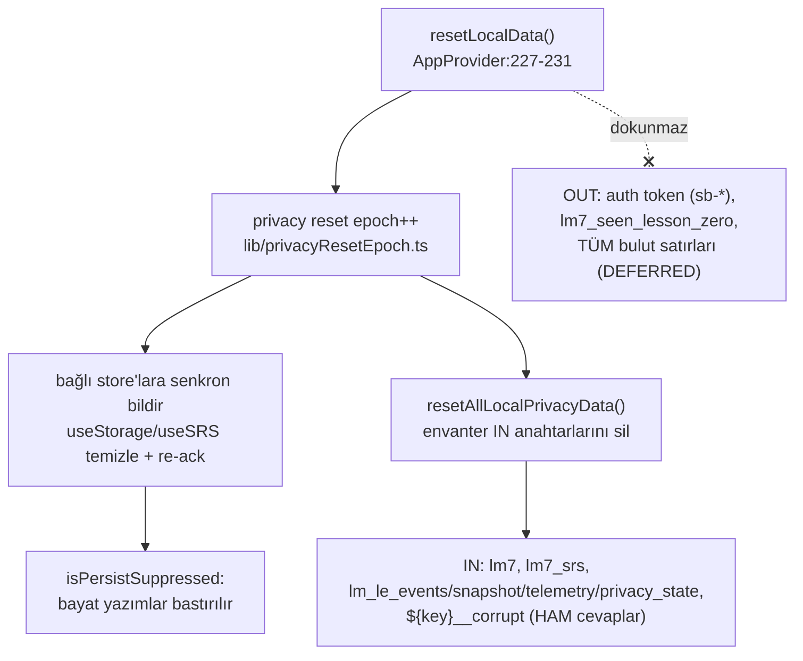

# Privacy and Data Deletion

<!-- gh-toc -->

## İçindekiler

- [Executive Summary](#executive-summary)
- [Why It Exists](#why-it-exists)
- [Current Canon](#current-canon)
- [Diagrams](#diagrams)
- [Failure Modes](#failure-modes)
- [Examples](#examples)
- [Runtime Implementation](#runtime-implementation)
- [Known Gaps](#known-gaps)
- [Open Questions](#open-questions)
- [Kaynak içe aktarımı (Open Questions / Backlog / Tech-Privacy / Sprint 12)](#kaynak-içe-aktarımı-open-questions-backlog-tech-privacy-sprint-12)
- [Related Notes](#related-notes)

> [!canon] Purpose — Yerel-önce gizlilik mimarisini (P5.1–P5.4C IMPLEMENTED), tek-gerçek-kaynak silme/dışa-aktarma envanterini, PR-H reset epoch bariyerini ve **ertelenen bulut silme + PROPOSED uzak `le_*` şemasını** açıklar.
> Üst bağlantı: [[00 Le Mot Holy Codex]] · [[System Architecture]] · [[Storage Architecture]].

## Executive Summary

Gizlilik varsayılanı **yerel-önce**dir: tüm öğrenme verisi cihazda `lm_le_*` ad alanında yaşar, bugün motordan hiçbir şey cihazı terk etmez. P5.1–P5.4C **kod-tarafı tamam** (`main` @ `786f5a0`): versiyonlu `PrivacyState`, tek-seferlik açıklama, dışa-aktarma özeti, iki-adımlı reset, PR-H yerel-reset epoch bariyeri [IMPLEMENTED, local]. **Bulut silme açıkça ERTELENMİŞ (audit C1)** — yerel reset "does NOT delete cloud data". Uzak Supabase senkronu consent-gated; `le_*` şeması **PROPOSED**; owner-scoped RLS; **client'ta asla `service_role` yok**.

## Why It Exists

Cairn Türkiye'de üretiliyor; KVKK/GDPR ham serbest-metin cevaplar (yüksek hassasiyet) için silme/dışa-aktarma hakkı gerektirir. Bu not "öğrenci verisi nerede, nasıl silinir/dışa aktarılır, bulut ne zaman devreye girer?" sorusunun tek adresi. (Not: hukuki tavsiye değil; herkese açık/tester lansmanından önce hukuki inceleme ayrı bir kapı.)

## Current Canon

### Yerel silme (PR-H) — IMPLEMENTED
`AppProvider.resetLocalData()` (`:227-231`) önce bir **privacy reset epoch**'u yükseltir (`lib/privacyResetEpoch.ts`), sonra `resetAllLocalPrivacyData()` çağırır (`local-privacy-inventory.ts`). Epoch, bağlı store'ları (`useStorage`, `useSRS`) senkron bilgilendirir: bellek-içi durumu temizle ve yeniden onayla → bayat durum yeniden kalıcılaşamaz, yeniden başlatmadan taze yazımlar sürer; aboneliksiz store'lar yazım-bastırılı kalır (`useStorage.ts:44-51,161-176`; `isPersistSuppressed` guard).

### Envanter tek-gerçek-kaynak (delete = export)
IN = `lm7`, `lm7_srs`, dört `lm_le_*` anahtarı, artı her `${key}__corrupt` kardeşi (HAM öğrenci cevapları tutar) (`local-privacy-inventory.ts:1-70`). OUT = auth token, onboarding bayrakları, tüm bulut satırları (`:16-20`). Silme ve dışa-aktarma **aynı** envanteri kullanır ki asla birbirinden ayrışmasın.

### Dışa aktarma
`privacy-data.ts` `exportLocalLearningData(...)` bir `LocalLearningDataExport` üretir (`:32-38`); Surface C `PrivacyDataControls.tsx` (sandbox founder UI) üzerinden yüzeylenir. **Öğrenci-güvenli özet, ham JSON/`userAnswer` dökümü YOK.**

### Bulut silme — DEFERRED
`AppProvider.tsx:225-226`: "Local-only — it does NOT delete cloud data" → audit C1, DEFERRED.

### Uzak şema/RLS — PROPOSED
Uzak/tester senkronu DISABLED; legacy Sprint-10 şeması (`profiles`/`user_progress`/`user_errors`) ayrı ve yeniden kullanılmaz; gelecek motor senkronu YENİ `le_*`/`learning_*` tabloları kullanır; **client'ta asla `service_role`**; `consent_version` + `consent_at` olmadan ingest yok; owner-scoped, deny-by-default RLS. Önerilen ingest yolu: **B — Edge Function / server gate** (consent+version+idempotency+zod tek yerde, client `service_role` tutmaz). Detay: [[Supabase]].

## Diagrams

Düz dille: Reset bir sayaç (epoch) yükseltir; bu sayaç tüm açık store'lara "durumunu temizle ve yeniden onayla" der. Ardından envanterin IN listesindeki tüm anahtarlar silinir — dahil `__corrupt` kardeşleri, çünkü orada ham cevaplar olabilir. Auth token, onboarding bayrakları ve bulut verisi **dokunulmaz** (bulut silme ertelendi). Epoch bariyeri, silme sırasında araya giren bayat bir yazımın silinen veriyi diriltmesini engeller.

## Failure Modes
- Silme sırasında bir store yazmaya çalışırsa → `isPersistSuppressed` bastırır (veri geri gelmez).
- Senkron pull silme ile yarışırsa → epoch snapshot pull'u iskarta eder ([[Sync Architecture]]).
- Bulut satırları: bugün silinmez (DEFERRED) — kullanıcıya bu sınır açıkça bildirilmeli (bilinen limit).

## Examples
> [!example]
> Founder sandbox'ta "Reset local data" → epoch++, `lm7`+`lm7_srs`+dört `lm_le_*`+`__corrupt` kardeşleri silinir; `sb-*` auth token ve `lm7_seen_lesson_zero` kalır; bulutta bir satır varsa **o silinmez** (audit C1).

## Runtime Implementation

### Code References
`AppProvider.tsx:227-231,225-226`; `local-privacy-inventory.ts:1-70,16-20,32-38`; `useStorage.ts:44-51,161-176`.

### Test References
`privacy`, `privacyLocal`, `privacyData`, `localPrivacyCompleteness`, `privacyResetBarrier` (`scripts/tests/`).

### Product-Stage Availability
Reset epoch/inventory her stage'de (AppProvider). Dışa-aktarma UI yalnız Surface C (sandbox founder deep-link). Uzak/tester senkronu hiçbir stage'de aktif değil.

## Known Gaps
- Bulut silme DEFERRED (audit C1); dışa aktarma bir dosya indirmesi/paylaşımı değil, yerel özet (P5 known limit).
- Legal review herkese açık/tester lansmanından önce ayrı bir kapı (P5.1 §14).

## Open Questions
> [!open-loop] Uzak `le_*` şeması, consent akışı ve bulut silme (P5.5→P5.7) ilk gerçek Operator/Supabase-deploy blocker'larını taşır; henüz uygulanmadı. → [[05 Open Loops]] · [[Supabase]].

## Kaynak içe aktarımı (Open Questions / Backlog / Tech-Privacy / Sprint 12)

> [!open-loop] 2026-05/2026-06 özel `Tech_and_Privacy_Decisions.md` notundan içe aktarılan **gizlilik ilkeleri
> ve açık kararlar**. Güncel repo kanonunu (HEAD #196; PR-H yerel reset IMPLEMENTED, bulut silme DEFERRED)
> **geçersiz kılmaz**; erken dönem duruşu pekiştirir ve açık kalemleri kayıt altına alır.

### Gizlilik ilkeleri (kaynak duruşu, güncel canon ile uyumlu)
- **Minimum topla** — yalnız gereken kadar veri.
- **Ham serbest-metin öğrenci girdisini AI'a gönderme** — tasarlanıp **açıkça bildirilmedikçe** (bugünkü canon: motordan hiçbir şey cihazı terk etmiyor).
- **Operator/özel notları git'te tutma.**
- **Secret loglama.**
- **Tester verisini hassas** kabul et.
- **Analytics amaca yönelik olsun, gözetim değil** (purposeful, not surveillance).
- **Çekirdek ilerleme AI/ağ hatasında hayatta kalmalı** (deterministic engine first; core progression must survive AI/network failure — D-33 ile hizalı).

### KVKK / GDPR — gelecekteki ihtiyaçlar [OPEN]
Hesaplar, analytics, AI veya production rollout başlayınca gerekli; local/dev-apk smoke için daha az acil ama yine ilgili:
- **Policy** (gizlilik politikası)
- **Consent** (rıza akışı + `consent_version`/`consent_at`)
- **Deletion path** (bulut silme yolu — bugün DEFERRED, audit C1; bkz. [[05 Open Loops]] Q-IN12 değil, C1)
- **Analytics disclosure** (açıklama)
- **Processor list** (işleyen listesi)

### Backend (provisional) [OPEN]
- **Cloudflare vs Supabase** açık; validation gerçek bir gereksinim yaratana dek backend kilitlenmez. Bkz. [[05 Open Loops]] Q-IN8.
- Uzak mimari notları product validation gerçek bir gereksinim yaratana dek **provisional**.

> [!note] Kaynak-not "Historical Source Pointers" eski retention/storage-cap/telemetry/AI-cost-cap fikirlerini
> **provisional** işaretler — implementasyondan önce yeniden doğrulanmalı. Analytics event schema, AI feedback
> data handling, account/auth timing, tester consent wording, data retention açık kararları [[05 Open Loops]]
> (Q-IN9–Q-IN12) altında izlenir; `userAnswer` redaction ve cloud deletion path [[Research Questions]] #9/#10'da.

## Related Notes
[[Storage Architecture]] · [[Sync Architecture]] · [[Supabase]] · [[Learning Engine Architecture]] · [[System Architecture]] · [[Legal Compliance and Data Governance]] (hukuki katman: dayanak/saklama/sorumlu — OPEN) · [[00 Le Mot Holy Codex]]
