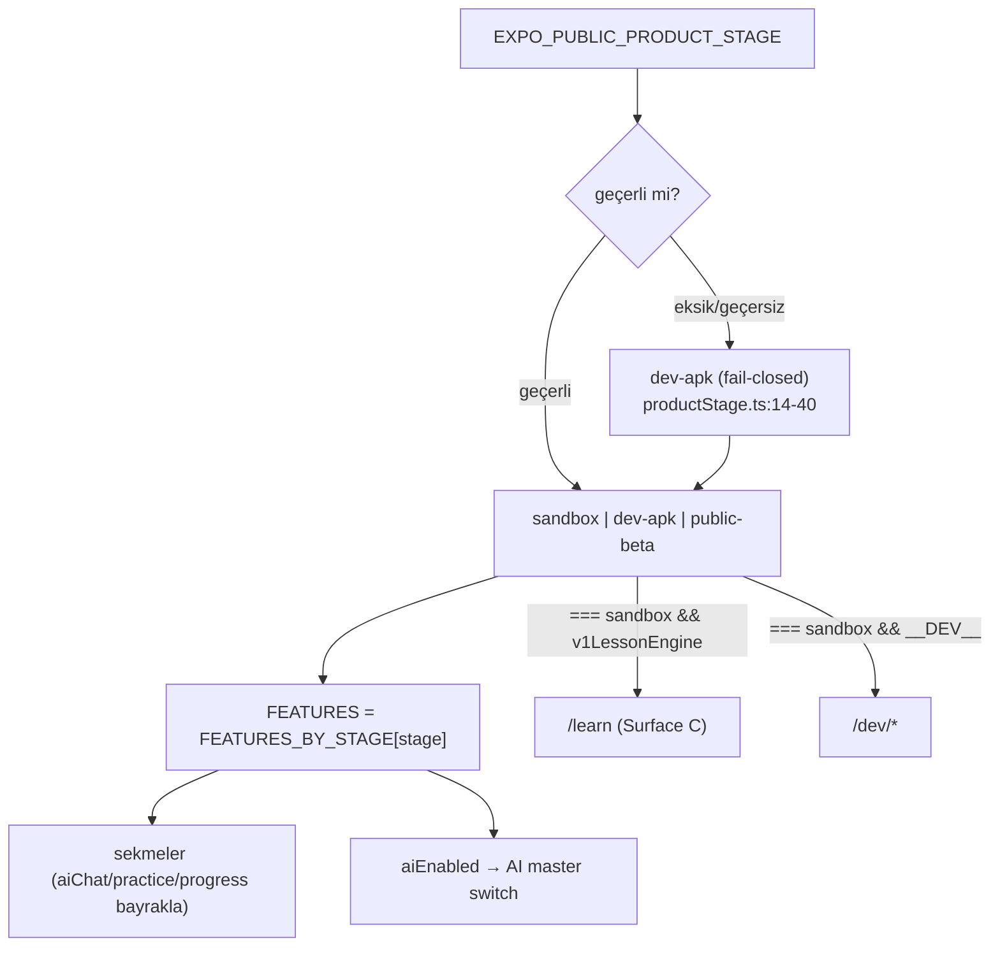

# Product Stage Architecture

<!-- gh-toc -->

## İçindekiler

- [Executive Summary](#executive-summary)
- [Why It Exists](#why-it-exists)
- [Current Canon — Bayrak tablosu](#current-canon-bayrak-tablosu)
- [Diagrams](#diagrams)
- [Failure Modes](#failure-modes)
- [Examples](#examples)
- [Runtime Implementation](#runtime-implementation)
- [Known Gaps](#known-gaps)
- [Open Questions](#open-questions)
- [Related Notes](#related-notes)

> [!canon] Purpose — `ProductStage` (sandbox | dev-apk | public-beta) çözümünü, **fail-closed dev-apk** varsayılanını, bayrak tablosunu ve `/learn` + `/dev/*` route'larının neden bayrak yerine doğrudan stage karşılaştırmasıyla kapılandığını açıklar.
> Üst bağlantı: [[00 Le Mot Holy Codex]] · [[System Architecture]] · [[Route Architecture]].

## Executive Summary

`ProductStage = sandbox | dev-apk | public-beta`; `FEATURES = FEATURES_BY_STAGE[PRODUCT_STAGE]`. Eksik/geçersiz `EXPO_PUBLIC_PRODUCT_STAGE` **`dev-apk`'e (en kısıtlı gerçek stage) çözülür — sandbox'a değil** [IMPLEMENTED, fail-closed] (`productStage.ts:14-40`). Böylece yapılandırılmamış bir build minimal yüzeyi sevk eder. `/learn` `sandbox && v1LessonEngine` ile, `/dev/*` `sandbox && __DEV__` ile doğrudan stage karşılaştırmasıyla kapılıdır. Ürün-kararı katmanı: [[Product Stages and Feature Flags]]; tablo: [[Feature Stage Matrix]].

## Why It Exists

Aynı kod tabanı üç farklı yüzey sevk etmelidir: founder sandbox (her şey açık), Dev APK tester (minimal smoke), public-beta (paywall'lı). Stage sistemi bunu tek bayrak matrisiyle yönetir ve yanlış yapılandırmada güvenli tarafa düşer.

## Current Canon — Bayrak tablosu

> [!implemented] Kaynak: `config/productStage.ts FEATURES_BY_STAGE` (`:71-136`).

| Feature flag | sandbox | dev-apk | public-beta |
|---|---|---|---|
| paywall | false | false | **true** |
| revenueCat | false | false | true |
| aiChat (Chat sekmesi) | true | **false** | true |
| aiLesson (ders-içi AI) | true | **true** | true |
| aiEnabled (AI master switch) | true | **false** | **false** |
| wordGraph | true | false | false |
| monLexique | true | false | true |
| leCarnet | true | false | false |
| practice | true | false | true |
| dailyReview | true | false | true |
| progress | true | false | true |
| v1LessonEngine | true | false | false |

Önemli incelikler:
- **`aiEnabled` dev-apk VE public-beta'da false** → AI stack effectively dormant ([[AI Architecture]]).
- **`aiChat` ≠ `aiLesson`**: dev-apk ders-içi AI'ı yapısal açık tutar (`aiLesson=true`) ama Chat sekmesini gizler; yine de `aiEnabled=false` olduğundan ders AI'ı fallback çalışır.
- `DEV_APK_LESSON_LIMIT = 5` HISTORICAL bir sabit, legacy 24-lesson filtresine bağlı, frozen/legacy (`productStage.ts:138-146`).

## Diagrams

Düz dille: Env değişkeni okunur; geçerliyse o stage, değilse en kısıtlı gerçek stage olan dev-apk seçilir (asla sandbox değil). Seçilen stage bir bayrak seti verir; sekmeler bayraklarla, ders yüzeyleri ise doğrudan stage karşılaştırmasıyla açılır/kapanır.

## Failure Modes
- Env typo → dev-apk (minimal), sandbox'ın founder yüzeyi kazara sızmaz.
- `productStageResolution.test.ts` + `devApkScope.test.ts` bu davranışı kilitler.

## Examples
> [!example]
> `EXPO_PUBLIC_PRODUCT_STAGE=devapk` (yanlış yazım) → geçersiz → fail-closed `dev-apk` → paywall/aiChat/practice/progress hepsi kapalı, yalnız v1 L1–L6 patika. Tehlikeli sandbox yüzeyi açığa çıkmaz.

## Runtime Implementation

### Code References
`config/productStage.ts:14-40,71-136,138-146,58-136`; `app/learn/[fixtureId].tsx:32-33`; `app/dev/learning-engine-player.tsx:529`.

### Test References
`productStageResolution`, `devApkScope` (`scripts/tests/`).

### Product-Stage Availability
Bu sistemin kendisi tüm stage'leri tanımlar. Source-of-truth yorumu `docs/DEV_APK_MVP_CANON.md`'ye işaret eder.

## Known Gaps
- `DEV_APK_LESSON_LIMIT = 5` legacy Surface A'ya ait donuk bir sabit; v1 (Surface B) Home cap'i (number ≤ 6) ondan ayrıdır — karıştırılmamalı ([[Route Architecture]]).

## Open Questions
> [!open-loop] public-beta paywall'ı Campfire ~L24'te; ama AI hâlâ `aiEnabled=false`. AI hangi stage/koşulda açılacak? → [[05 Open Loops]] · [[AI Architecture]].

## Related Notes
[[Route Architecture]] · [[AI Architecture]] · [[Product Stages and Feature Flags]] · [[Feature Stage Matrix]] · [[System Architecture]] · [[00 Le Mot Holy Codex]]
