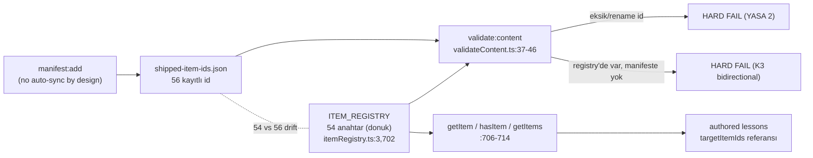

# Registry Architecture

<!-- gh-toc -->

## İçindekiler

- [Executive Summary](#executive-summary)
- [Why It Exists](#why-it-exists)
- [Current Canon](#current-canon)
- [How It Works](#how-it-works)
- [Diagrams](#diagrams)
- [Failure Modes](#failure-modes)
- [Examples](#examples)
- [Runtime Implementation](#runtime-implementation)
- [Known Gaps](#known-gaps)
- [Open Questions](#open-questions)
- [Related Notes](#related-notes)

> [!canon] Purpose — `ITEM_REGISTRY`'nin (dondurulmuş 54 öğe) tek gerçek kaynak olarak nasıl çalıştığını, itemId değişmezliğinin (YASA 2) build ile nasıl zorlandığını ve **54-registry vs 56-manifest sürüklenmesini** (K3 çift yönlü kontrol) açıklar.
> Üst bağlantı: [[00 Le Mot Holy Codex]] · [[System Architecture]].

## Executive Summary

`content/itemRegistry.ts` (715 satır), tek dondurulmuş nesne literali `ITEM_REGISTRY = { ... } as const satisfies Record<string, LearningItem>` (`:3`, `:702`) — **54 öğe** (54 top-level anahtar / 54 `id:` alanı doğrulandı) [IMPLEMENTED]. Öğeler değişmez id ile anahtarlanır; `relatedItemIds` hafif bir kelime-grafiği komşuluğu kurar; `weakPointTags` öğeleri hata taksonomisine bağlar. itemId değişmezliği ("YASA 2 / K3") build ile zorlanır: `scripts/shipped-item-ids.json` (**56 kayıtlı id**) + saf checker `shippedItemIds.ts`. **54-vs-56 farkı gerçektir** ve K3 çift yönlü kontrolü tam da bu sürüklenmeyi yakalamak için vardır.

## Why It Exists

Cairn'in "chip"leri (öğrenme öğeleri) tek yerde, değişmez kimliklerle tanımlanmalıdır ki ilerleme/mastery/Mon Lexique verisi zamanla bozulmasın. Registry o tek yerdir; validator ise "bir kez sevkedilen id asla sessizce yeniden adlandırılamaz" yasasını mekanik olarak uygular.

## Current Canon

> [!implemented] Öğe dağılımı (evidence pack 05 §4): 34 chunk, 5 noun, 4 pronoun, 3 verb, 3 grammar-nugget, 2 adverb, 2 sound-pattern, 1 micro-contrast. Statü: 32 active, 16 supported, 6 recognition.

- **Accessors**: `ItemId = keyof typeof ITEM_REGISTRY` (`:704`), `getItem`, `hasItem` (type guard), `getItems` (`:706-714`); `content/index.ts` üzerinden yeniden export edilir.
- **itemId değişmezliği (YASA 2 / K3)** [IMPLEMENTED, build-enforced]: `validate:content`, sevkedilen bir id registry'den eksik/yeniden-adlandırılmışsa HARD-FAIL eder; **ve (K3, çift yönlü)** registry'de olup manifeste kaydedilmemiş bir id varsa da hard-fail eder (`validateContent.ts:37-46`, `shippedItemIds.ts:1-40`). Büyüme yalnız kasıtlı: `manifest:add` — "there is NO auto-sync by design" (`shippedItemIds.ts:10-12`).
- **Kardeş manifest**: `shipped-error-tags.json` (30 tag) + `shippedErrorTags.ts`, hata-tag sözlüğünü dondurur ("YASA 3", `validateContent.ts:48-56`).

## How It Works

### Inputs
Yeni `LearningItem` tanımları (registry'ye eklenir), `manifest:add` ile kaydedilen id'ler.

### Outputs
`ItemId` tip birliği, `getItem`/`hasItem`/`getItems` erişimi, `validate:content` pass/fail.

### State / Lifecycle
Registry **donuk** (`as const`); id'ler kaydedildikten sonra değişmez. Kullanım matrisi: [[Registry Usage Matrix]].

### Main Rules (YASA'lar)
- **YASA 2**: sevkedilen itemId değişmez; yeni id aynı PR'da kaydedilir.
- **K3**: manifest ↔ registry çift yönlü tutarlılık; her iki yön de hard-error.
- **YASA 3**: sevkedilen error-tag'ler değişmez (30 tag donuk).

### Guardrails
`validate:content` CI'da bloklar; `shippedItemIds`/`shippedErrorTags`/`canonRules` guard testleri.

## Diagrams

Düz dille: Registry öğeleri derslere id ile bağlanır. Validator, registry ile manifest'i iki yönlü karşılaştırır: sevkedilen bir id kaybolursa da, kaydedilmemiş yeni bir id çıkarsa da build kırılır. Manifest yalnız elle (`manifest:add`) büyür — kasıtlı sürtünme, sessiz büyümeyi engeller.

## Failure Modes
- **54-vs-56 drift** [UNKNOWN pass state]: manifest 56 id listeler, canlı registry 54 anahtar taşır. K3 bu farkı yüzeye çıkarmak için vardır; `validate:content`'in şu an geçip geçmediği bu read-only geçişte çalıştırılmadı → doğrulanmalı.
- Bir id'i yeniden adlandırmak (registry'de) manifeste dokunmadan → YASA 2 hard-fail.

## Examples
> [!example]
> Bir yazar `chunk-bonjour`'u `chunk-salut` yapmak isterse: registry değişir ama `shipped-item-ids.json` hâlâ `chunk-bonjour` bekler → `validate:content` HARD-FAIL. Doğru yol: yeni id ekle, `manifest:add` ile kaydet, eskiyi bırakma kararını kanonda belgele.

## Runtime Implementation

### Code References
`content/itemRegistry.ts:3,702,704,706-714`; `scripts/shippedItemIds.ts:1-40,10-12`; `scripts/validateContent.ts:37-46,48-56`.

### Test References
`shippedItemIds`, `shippedErrorTags`, `canonRules` (`scripts/tests/`).

### Product-Stage Availability
Registry tüm yüzeylerin altında bir veri katmanıdır; validator CI/build zamanı çalışır (runtime stage'e bağlı değil).

## Known Gaps
- 54 (registry) vs 56 (manifest) vs L1_L15 audit'in 52 öğe/41 kullanılan/11 dormant sayımı — her kaynağın kendi sayısını taşır; tek sayıya zorlanmamalı. Kullanım detayı: [[Registry Usage Matrix]].

## Open Questions
> [!open-loop] `validate:content` 54/56 farkıyla şu an geçiyor mu? Çalıştırılıp doğrulanmalı. → [[05 Open Loops]] · [[Needs Verification]].

## Related Notes
[[Data Flow]] · [[Runtime Content Architecture]] · [[Registry Usage Matrix]] · [[System Architecture]] · [[00 Le Mot Holy Codex]]
