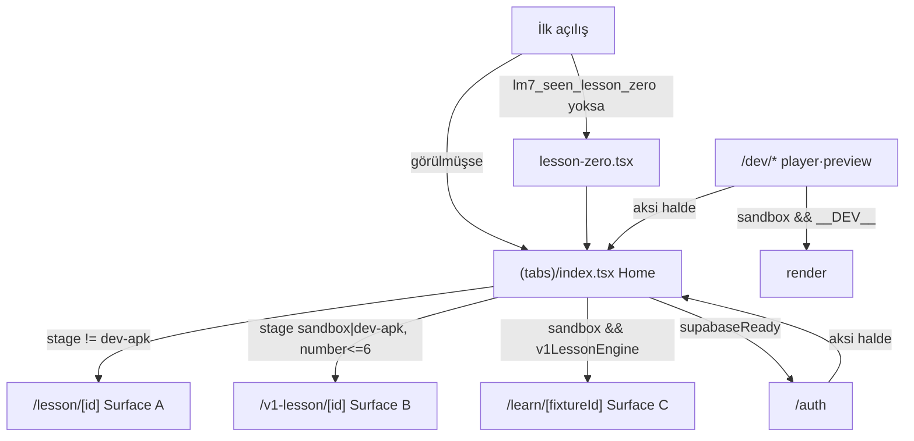

# Route Architecture

<!-- gh-toc -->

## İçindekiler

- [Executive Summary](#executive-summary)
- [Why It Exists](#why-it-exists)
- [Current Canon — Route tablosu](#current-canon-route-tablosu)
- [How It Works](#how-it-works)
- [Diagrams](#diagrams)
- [Failure Modes](#failure-modes)
- [Examples](#examples)
- [Runtime Implementation](#runtime-implementation)
- [Known Gaps](#known-gaps)
- [Open Questions](#open-questions)
- [Related Notes](#related-notes)

> [!canon] Purpose — expo-router dosya ağacındaki tüm route'ları ve her birinin **stage/flag kapısını** listeler; özellikle üç ders yüzeyinin (A/B/C) hangi route ve hangi koşulla açıldığını netleştirir.
> Üst bağlantı: [[00 Le Mot Holy Codex]] · [[System Architecture]].

## Executive Summary

Route ağacı `app/` altında dosya-tabanlıdır (expo-router). Sekmeler (`aiChat`/`practice`/`progress`/`dailyReview`) `FEATURES` bayraklarıyla `_layout.tsx`'te gizlenir; ders yüzeyleri ise doğrudan `PRODUCT_STAGE ===` karşılaştırmalarıyla kapılır. En kritik gating idiomu: **v1 patika ve `/learn` route'u bayrak yerine doğrudan stage karşılaştırması kullanır** (yorum: "Home-only condition; does NOT flip the v1LessonEngine feature flag"). Detaylı bayrak tablosu: [[Product Stage Architecture]]. Route↔stage matrisinin tablo hali: [[Route Matrix]].

## Why It Exists

"Hangi ekran ne zaman görünür, deep-link ile nereye düşerim?" sorusu Round 1 smoke'un merkezindedir (§9 gating checks). Bu not o kapıları tek yerde toplar.

## Current Canon — Route tablosu

> [!implemented] Kaynak: `app/` ağacı + `_layout.tsx` + `productStage.ts`.

| Route dosyası | Amaç | Stage/flag kapısı |
|---|---|---|
| `(tabs)/index.tsx` | Home "Journey": daily review, milestones, legacy dersler, v1 patika | her zaman; içerik stage'e göre değişir |
| `(tabs)/chat.tsx` | AI Chat sekmesi | `FEATURES.aiChat` yoksa gizli (`_layout.tsx:44`) |
| `(tabs)/practice.tsx` | Senaryo/flashcard pratik | `FEATURES.practice` yoksa gizli (`_layout.tsx:57`) |
| `(tabs)/stats.tsx` | Progress (legacy 24-lesson) | `FEATURES.progress` yoksa gizli (`_layout.tsx:70`) |
| `auth.tsx` | Sign in/up | yalnız `supabaseReady` iken (Home CTA'yı kapılar, `:190`) |
| `lesson/[id].tsx` | Legacy runtime (Surface A) | `visibleLessons` boş değilse (dev-apk değil, `:149`) |
| `v1-lesson/[id].tsx` | v1 authored runtime (Surface B) | Home patikayı sandbox\|dev-apk iken gösterir (`:150-153`) |
| `learn/[fixtureId].tsx` | Founder motor shell (Surface C) | `PRODUCT_STAGE==="sandbox" && FEATURES.v1LessonEngine` (`:32-33`) |
| `dev/learning-engine-player.tsx` | Motor debug player | `PRODUCT_STAGE==="sandbox" && __DEV__` (`:529`) |
| `dev/learning-engine-preview.tsx` | Motor önizleme | sandbox/dev |
| `lesson-zero.tsx` | İlk-açılış onboarding (redirect hedefi) | ilk açılış, `lm7_seen_lesson_zero` yoksa (`index.tsx:26,60-64`) |
| `how-weave-works.tsx` | Weave açıklayıcı | erişilebilir route, artık zorunlu ilk-açılış değil (`index.tsx:56-59`) |

## How It Works

### Inputs
`PRODUCT_STAGE`, `FEATURES` bayrakları, `supabaseReady`, `lm7_seen_lesson_zero` onboarding bayrağı.

### Outputs
Görünür sekme seti; erişilebilir/yönlendirilen route'lar; ilk-açılış redirect.

### Main Rules
- **Sekmeler bayrakla gizlenir** (`aiChat`/`practice`/`progress`).
- **Ders yüzeyleri stage ile kapılır** — v1 patika ve `/learn` doğrudan `PRODUCT_STAGE ===` kullanır, bilerek bayrak çevirmez (`index.tsx:150-153`).
- **Legacy Surface A dev-apk'te gizli**: `visibleLessons = PRODUCT_STAGE === "dev-apk" ? [] : LESSONS` (`index.tsx:149`).
- **Deep-link gating**: `/chat`, `/practice`, `/dev/*`, `/learn` gated stage'lerde Home'a düşer (Round 1 §9).

### Guardrails
`devApkScope` guard testi dev-apk yüzeyinin kapsamını kilitler.

## Diagrams

Düz dille: İlk açılış Lesson Zero'ya, sonra Home'a gider. Home üç ders yüzeyinin kapısıdır; hangisinin açıldığı stage'e bağlıdır. Gated bir deep-link (örn. dev-apk'te `/chat`) kullanıcıyı sessizce Home'a düşürür — dead-end yok.

## Failure Modes
- Yeni route eklenince expo-router typed-route üretimi gecikebilir; geçici `"/route" as never` cast'i dar kapsamda kabul, ama broad `as any` yasak (MASTER_PIPELINE Expo Router notu).
- Yanlış stage yapılandırması → fail-closed dev-apk → en kısıtlı route seti ([[Product Stage Architecture]]).

## Examples
> [!example]
> dev-apk build'de tester `/dev/learning-engine-player` deep-link'i açarsa: `PRODUCT_STAGE==="sandbox" && __DEV__` yanlış → Home'a redirect (Round 1 smoke §9 bunu bekler).

## Runtime Implementation

### Code References
`app/(tabs)/_layout.tsx:44,57,70`; `app/(tabs)/index.tsx:149,150-153,190,26,56-64`; `app/v1-lesson/[id].tsx:8`; `app/learn/[fixtureId].tsx:32-33`; `app/dev/learning-engine-player.tsx:529`.

### Test References
`devApkScope`, `productStageResolution` (`scripts/tests/`).

### Product-Stage Availability
Tüm gating stage'e bağlı; tam bayrak matrisi [[Product Stage Architecture]], tablo hali [[Route Matrix]].

## Known Gaps
- `how-weave-works` artık zorunlu ilk-akış değil ama route olarak erişilebilir; Round 1'de `/how-weave-works` elle açılabilir.

## Open Questions
> [!open-loop] Home L6 cap'ini yükselten "smoke-bearing unlock PR" ne zaman gelecek (L7–L9 pilotunu görünür kılmak için)? → [[05 Open Loops]].

## Related Notes
[[Product Stage Architecture]] · [[Runtime Content Architecture]] · [[Route Matrix]] · [[System Architecture]] · [[00 Le Mot Holy Codex]]
