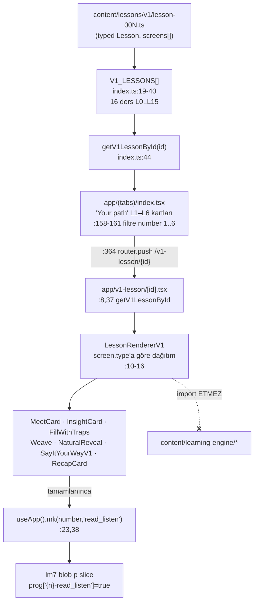

# Runtime Content Architecture

<!-- gh-toc -->

## İçindekiler

- [Executive Summary](#executive-summary)
- [Why It Exists](#why-it-exists)
- [Current Canon — Üç Yüzey Tablosu](#current-canon-üç-yüzey-tablosu)
- [How It Works — Surface B veri akışı (load-bearing runtime)](#how-it-works-surface-b-veri-akışı-load-bearing-runtime)
- [Failure Modes](#failure-modes)
- [Examples](#examples)
- [Runtime Implementation](#runtime-implementation)
- [Known Gaps](#known-gaps)
- [Open Questions](#open-questions)
- [Related Notes](#related-notes)

> [!canon] Purpose — Bu **crown note**, tüm kod tabanının en kritik mimari gerçeğini tek yerde anlatır: **üç paralel ders runtime'ı aynı anda yaşar** (A legacy gizli, B static-v1 sevkedilen, C learning-engine sandbox-only) ve bunlar **kod paylaşmaz**.
> Üst bağlantı: [[00 Le Mot Holy Codex]] · [[System Architecture]].

## Executive Summary

Kod tabanında birbirinden bağımsız **üç ders yüzeyi** vardır. Sevkedilen tester deneyimi yalnızca **Surface B** (static authored v1): `content/lessons/v1/*` → `V1_LESSONS` → Home → `/v1-lesson/[id]` → `LessonRendererV1` → `screen.type`'a göre dağıtım → `mk()` → `lm7` blob. **Surface B, `content/learning-engine`'den HİÇBİR ŞEY import etmez** [IMPLEMENTED] — motoru dokunmadan authored `LessonScreen`'leri doğrudan render eder (`LessonRendererV1.tsx:8-16`). CLAUDE.md canonu bunu doğrular: "v1 geçici smoke yüzeyi, learning-engine uzun vadeli temel."

## Why It Exists

En pahalı yanlış anlama, "tek bir Cairn ders motoru var" sanmaktır. Aslında biri **tarihsel** (A), biri **bugün sevkedilen ama kasıtlı olarak minimal** (B), biri de **zengin ama henüz yalnız founder-sandbox'ta** (C) üç ayrı sistem vardır. Bir iddianın hangi yüzeye ait olduğunu bilmeden onun "implemented" olup olmadığı söylenemez.

## Current Canon — Üç Yüzey Tablosu

> [!implemented] Kaynak: evidence pack 05 §0; kod grep'i `LessonRendererV1` import ağacı.

| Yüzey | İçerik kaynağı | Renderer | Route | Erişilebilir | Statü |
|---|---|---|---|---|---|
| **A. Legacy 24-lesson** | `data/lessons` (`LESSONS`) | `LessonPractice` + `SECS` (11 bölüm) | `/lesson/[id]` | sandbox, public-beta (dev-apk'te **gizli**) | IMPLEMENTED / HISTORICAL |
| **B. Static authored v1** | `content/lessons/v1/*` (16 dosya L0–L15) | `LessonRendererV1` | `/v1-lesson/[id]` | sandbox + dev-apk (Home L1–L6'ya kısıtlar) | **IMPLEMENTED (sevkedilen tester yüzeyi)** |
| **C. Learning-engine** | `content/learning-engine/*` fixtures | `LearnerRendererShell` / dev player | `/learn/[fixtureId]`, `/dev/*` | yalnız sandbox (founder) | IMPLEMENTED-tested-only / SPEC-ONLY |

**Kritik ayrım:** A, B, C kod paylaşmaz. `LessonRendererV1`, `content/learning-engine`'in hiçbir modülünü import etmez; authored `LessonScreen`'leri render eder ve ilerlemeyi `useApp().mk` üzerinden yazar (`LessonRendererV1.tsx:8-16,26,38`). Motorun (C) tüm zenginliği (mastery, selectors, Mon Lexique) B'ye **hiç ulaşmaz** — bkz. [[Learning Engine Architecture]].

## How It Works — Surface B veri akışı (load-bearing runtime)

Düz dille: Yazar `lesson-00N.ts` dosyasını elle üretir; bu dosyalar `V1_LESSONS` dizisinde toplanır; Home ekranı yalnızca `number` 1–6 olanları kart olarak gösterir; kullanıcı tıklayınca `/v1-lesson/{id}`'e gider; `LessonRendererV1` `lesson.screens[]`'i gezip her ekranı `screen.type`'a göre doğru bileşene dağıtır; ders bitince tek bir tamamlama işareti yazılır. Kırmızı kesik ok en önemli gerçektir: **bu zincir motoru hiç çağırmaz.**

### 7 dondurulmuş v1 ekran tipi
`content/lessonTypes.ts` `ScreenType` = 7 tür (`:38-45`); discriminated union `LessonScreen` (`:229-236`): **MeetCard, InsightCard, FillWithTraps, Weave, SayItYourWay, NaturalReveal, Recap** — her biri `{id, type, targetItemIds?, weakPointTags?, payload}`. Meet/Insight/Recap bugün statik "Continue" ekranları; ekran-içi etkileşim **Faz B PLANNED**. Egzersiz detayları: 03_EXERCISES notları.

### Scoring — yok denecek kadar az
Surface B'de **puanlı geçiş kapısı yoktur**: tamamlama, ders sonunda bir kez yazılan tek monotonik işaret `{number}-read_listen`'dir. Home aynı anahtarı doğrusal kilit açımı için okur (`app/(tabs)/index.tsx:29-32,164-176`). CLAUDE.md/yorumlar bunu "no scoring, no ceremony" der. `FillWithTraps`/`Weave`/`SayItYourWay` yerel eşleştirme yapar (`lib/lessonZeroAnswers.ts`, `lib/looksFrench.ts`, `lib/normalize.ts`) ama ilerlemeyi **bloke etmez**. Tam zincir: [[Data Flow]].

### Lesson type şeması — zengin ama çoğu tüketilmiyor
`Lesson` (`lessonTypes.ts:302-330`) `practicePool, dailyReviewHooks, monLexiqueEntries, offlineBehavior` gibi alanlar taşır ama `LessonRendererV1` bunları **tüketmez** → IMPLEMENTED runtime üzerinde SPEC-ONLY alanlar.

## Failure Modes
- Bir yazar `lesson-00N.ts`'e yeni ekran tipi eklemek isterse: 7 tip dondurulmuştur; `v1LessonStructure` guard testi şekli zorlar.
- Home cap'i (number ≤ 6) elle yükseltilmedikçe L7–L15 kayıtlı olsa da görünmez — bu bir bug değil, kasıt (Content Factory Contract). Bkz. [[Route Architecture]].

## Examples
> [!example]
> Home'da L2 kartına dokunmak: `router.push("/v1-lesson/lesson-002")` → `getV1LessonById("lesson-002")` → `<LessonRendererV1 lesson={...}>` → ilk ekran `MeetCard`. Ders sonunda `mk(2, "read_listen")` → `lm7.p["2-read_listen"]=true` → Home L3'ü açar. Motor (C) bu akışta hiç uyanmaz.

## Runtime Implementation

### Code References
`components/lesson-v1/LessonRendererV1.tsx:8-16,23,38`; `content/lessons/v1/index.ts:19-40,44`; `app/(tabs)/index.tsx:158-161,364`; `app/v1-lesson/[id].tsx:8,37`; `content/lessonTypes.ts:38-45,229-236,302-330`.

### Test References
`v1LessonStructure` guard (ekran şekli); `round1ContentContracts.test.ts` (ekran sayıları).

### Product-Stage Availability
Surface B: sandbox + dev-apk (Home L1–L6 cap). Surface A: sandbox + public-beta, dev-apk'te gizli. Surface C: yalnız sandbox && `v1LessonEngine`. Tam kapı tablosu: [[Product Stage Architecture]], [[Route Architecture]].

## Known Gaps
- `content/lessons/v1/` 16 dosya (L0–L15) içerir; L0–L6 learner-visible, L7–L15 kayıtlı-ama-Home-gated; L16–L17 spec-only (dosya yok). STATUS.md'nin "7 lessons" ifadesi bayat bir 91f1b04 snapshot'ıdır.

## Open Questions
> [!open-loop] Faz B'de Meet/Insight/Recap ekranlarına per-screen etkileşim eklenecek — henüz PLANNED, şekli açık. → [[05 Open Loops]].

## Related Notes
[[Data Flow]] · [[Learning Engine Architecture]] · [[Registry Architecture]] · [[Route Architecture]] · [[System Architecture]] · [[00 Le Mot Holy Codex]]
