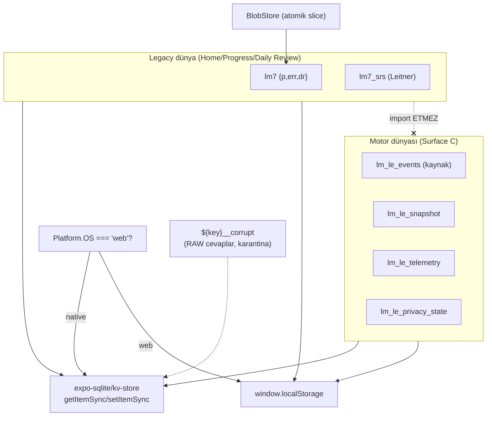

# Storage Architecture

<!-- gh-toc -->

## İçindekiler

- [Executive Summary](#executive-summary)
- [Why It Exists](#why-it-exists)
- [Current Canon — Anahtar tablosu](#current-canon-anahtar-tablosu)
- [How It Works](#how-it-works)
- [Diagrams](#diagrams)
- [Failure Modes](#failure-modes)
- [Examples](#examples)
- [Runtime Implementation](#runtime-implementation)
- [Known Gaps](#known-gaps)
- [Open Questions](#open-questions)
- [Related Notes](#related-notes)

> [!canon] Purpose — Tüm yerel depolama anahtarlarını, şemalarını, native/web dikişini, atomik `BlobStore`'u ve **iki ayrık depolama dünyasını** (`lm7` vs `lm_le_*`) tek yerde tanımlar.
> Üst bağlantı: [[00 Le Mot Holy Codex]] · [[System Architecture]].

## Executive Summary

Yerel depolama native'de `expo-sqlite/kv-store`, web'de `localStorage`'dır (`lib/storage.ts:3-25`). İki ayrık dünya vardır: **legacy `lm7` dünyası** (Home/Progress/Daily Review'i sürer) ve **motor `lm_le_*` dünyası** (yalnız Surface C'yi sürer). Birincil blob `lm7` = `{p, err, dr}` [IMPLEMENTED]; tüm yazımları tek atomik `BlobStore` üzerinden functional slice update ile gider (audit B6). Bozuk blob'lar `${key}__corrupt` kardeşine karantinaya alınır, orijinal asla ezilmez ([[Failure and Recovery Model]]).

## Why It Exists

"Öğrencinin ilerlemesi fiziksel olarak nerede, hangi anahtarda, hangi şemada?" ve "silme/dışa aktarma neyi kapsar?" sorularının tek adresi. İki dünyanın ayrılığı, tüm senkron/gizlilik tasarımının temelidir.

## Current Canon — Anahtar tablosu

> [!implemented] Kaynak: `hooks/useStorage.ts`, `useSRS.ts`, `repository/local.ts`, `local-privacy-inventory.ts`.

| Anahtar | Şema / içerik | Dünya | Kaynak |
|---|---|---|---|
| `lm7` | `{ p: Record<string,boolean>, err: ErrorEntry[], dr: {date,count} }` | legacy | `useStorage.ts:14,16` |
| `lm7_srs` | Leitner 5-box SRS/mastery blob | legacy | `useSRS.ts:24` |
| `lm_le_events` | append-only olay günlüğü (motorun **gerçek kaynağı**) | motor | `repository/local.ts:35-37` |
| `lm_le_snapshot` | mastery snapshot (opsiyonel cache) | motor | `repository/local.ts:35-37` |
| `lm_le_telemetry` | yerel telemetri (içerik hata ayıklama) | motor | `telemetry.ts` |
| `lm_le_privacy_state` | versiyonlu `PrivacyState` (P5.4A) | motor | `local-privacy-inventory.ts` |
| `${key}__corrupt` | karantinaya alınmış ham blob (RAW öğrenci cevapları içerir) | ikisi de | `safeStorage.ts` |
| `lm7_seen_lesson_zero`, `sb-*` | onboarding bayrağı, auth token | **kapsam DIŞI** (reset/export etmez) | `local-privacy-inventory.ts:16-20` |

## How It Works

### Inputs
`mk()` ilerleme yazımları ([[Data Flow]]); motor olay append'leri; SRS güncellemeleri; privacy state.

### Outputs
Disk'e serileştirilmiş blob'lar (native kv-store / web localStorage).

### State / Lifecycle
`lm7` monotonik büyür (`p` slice tamamlamalar); `lm_le_events` yalnız append; snapshot türev/yeniden hesaplanabilir. Privacy reset epoch'u tüm bağlı store'ları senkron temizler ([[Privacy and Data Deletion]]).

### Main Rules
- **Atomik `BlobStore`**: `updateProgress/updateErrors/updateDailyReview/updateStoredData` functional slice update; araya giren yazıcılar slice'ları ezmez (`useStorage.ts:24-33,116-160`).
- **İki dünya kesin ayrı**: motor "canlı-v7 anahtarları `lm7`/`lm7_srs`'i asla okumaz/yazmaz" (`repository/local.ts:14-38`).
- **`__corrupt` kardeşleri HAM cevap taşır** → gizlilik envanterine dahil (silinir/dışa aktarılır).

### Guardrails
`loadOrQuarantine` (corrupt guard, PR-A); `local-privacy-inventory` tek-gerçek-kaynak (delete=export). Detay: [[Failure and Recovery Model]], [[Privacy and Data Deletion]].

## Diagrams

Düz dille: Platforma göre native kv-store veya web localStorage seçilir. İki blob kümesi — legacy `lm7`/`lm7_srs` ve motor `lm_le_*` — aynı fiziksel depoyu kullansa da **birbirini hiç okumaz/yazmaz**. Bozuk bir blob asla ezilmez; `__corrupt` kardeşine taşınır ve orada ham öğrenci cevapları bulunabileceğinden gizlilik silme kapsamına girer.

## Failure Modes
- Parse edilemeyen blob → `loadOrQuarantine` `${key}__corrupt`'a taşır, güvenli bellek-içi varsayılan tutar, orijinali boş veriyle **ezmez** (`useStorage.ts:56-107`; SRS aynası `useSRS.ts:69-76`).
- İki dünyanın karışması: tasarım gereği imkânsız (ayrı ad alanları); "main integration blocker" tam da bu ayrılıktır.

## Examples
> [!example]
> Ders tamamlanınca `updateProgress` `lm7.p`'ye `{"1-read_listen": true}` slice'ı ekler; `err`/`dr` slice'ları dokunulmaz. Aynı anda motorda bir `answer_submitted` olayı `lm_le_events`'e append edilir — iki kayıt asla çakışmaz.

## Runtime Implementation

### Code References
`lib/storage.ts:3-25`; `hooks/useStorage.ts:14,16,24-33,56-107`; `useSRS.ts:24`; `repository/local.ts:35-37`; `local-privacy-inventory.ts:16-20,47-54`.

### Test References
`safeStorage`, `blobStore`, `secureAuthStorage`, `localRepository`, `localPrivacyCompleteness` (`scripts/tests/`).

### Product-Stage Availability
`lm7`/`lm7_srs`: her stage (legacy yüzeyler). `lm_le_*`: yalnız Surface C aktifken yazılır (sandbox), ama privacy-state envanteri her stage'de reset/export kapsamındadır.

## Known Gaps
- Deployed Supabase DB'de dropped `streak` sütunu hâlâ olabilir (migration debt, DEFERRED); bu yerel `lm7`'ye değil, buluta ait bir borçtur — [[Sync Architecture]].

## Open Questions
> [!open-loop] `lm_le_snapshot` compaction ~1000 olayda önerilir ama v0 kaynağı silmez; canlı bir compaction politikası henüz devreye alınmadı. → [[05 Open Loops]].

## Related Notes
[[Data Flow]] · [[Learning Engine Architecture]] · [[Privacy and Data Deletion]] · [[Sync Architecture]] · [[Failure and Recovery Model]] · [[System Architecture]] · [[00 Le Mot Holy Codex]]
