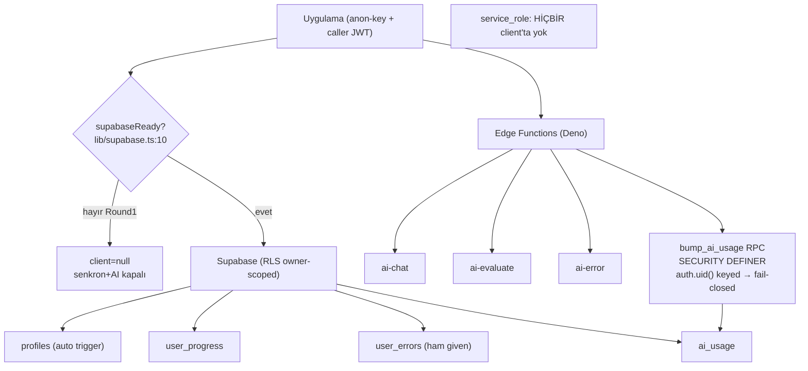

# Supabase

<!-- gh-toc -->

## İçindekiler

- [Executive Summary](#executive-summary)
- [Why It Exists](#why-it-exists)
- [Current Canon](#current-canon)
- [Diagrams](#diagrams)
- [Failure Modes](#failure-modes)
- [Examples](#examples)
- [Runtime Implementation](#runtime-implementation)
- [Known Gaps](#known-gaps)
- [Open Questions](#open-questions)
- [Related Notes](#related-notes)

> [!canon] Purpose — Supabase backend'ini (RLS'li tablolar, Edge Functions, `bump_ai_usage` RPC), owner-scoped RLS'i, **client'ta `service_role` olmaması** ilkesini ve deploy'un neden operator-only olduğunu açıklar.
> Üst bağlantı: [[00 Le Mot Holy Codex]] · [[System Architecture]].

## Executive Summary

Supabase kod-tarafı hazırdır ama **deploy operator-only**dır ve Round 1 Dev APK **Supabase env olmadan** çalışır (senkron + AI tamamen kapalı). Şema (`supabase/schema.sql`), hepsi RLS-etkin ve owner-scoped (`auth.uid()`) dört tablo tanımlar: `profiles`, `user_progress`, `user_errors`, `ai_usage` [CANONICAL/IMPLEMENTED, deploy operator]. Edge Functions (Deno): `ai-chat`, `ai-evaluate`, `ai-error` + `_shared/{contract,providers,ratelimit}.ts`. Sunucu sistem prompt'unu ve token/mesaj limitlerini **sahiplenir**; herhangi bir client `system` alanı yok sayılır. **`service_role` hiçbir yerde client-side kullanılmaz** — fonksiyonlar caller JWT'sine bağlı anon-key client kullanır.

## Why It Exists

Cairn'in bulut ihtiyaçları (opsiyonel ilerleme senkronu, sunucu-korumalı AI proxy) tek bir backend'de toplanır. Bu not "hangi tablolar, hangi fonksiyonlar, hangi güvenlik duruşu ve neden cloud bunu deploy edemez?" sorusunu cevaplar.

## Current Canon

### Tablolar (`supabase/schema.sql`) — hepsi RLS, owner-scoped
| Tablo | İçerik | Not |
|---|---|---|
| `profiles` | signup'ta `handle_new_user` trigger ile otomatik | owner-only RLS |
| `user_progress` | `progress` jsonb, `daily_review` jsonb, unique `user_id` | senkron hedefi ([[Sync Architecture]]) |
| `user_errors` | word/section/given/correct/lesson_id, user+word indeksli | ham `given_answer` server-side — kopyalanmaması gereken risk |
| `ai_usage` | per-user/fn/day sayaç; yalnız SECURITY DEFINER `bump_ai_usage` yazar; execute `authenticated`'a | rate-limit tablosu ([[AI Architecture]]) |

`updated_at` auto-touch trigger'ları. Deployed DB hâlâ dropped `streak` sütunu taşıyabilir (migration debt, DEFERRED to public beta).

### Edge Functions (Deno)
- `ai-chat`, `ai-evaluate` (Say It Your Way), `ai-error` (Claude Haiku hata analizi) + `_shared/{contract,providers,ratelimit}.ts`.
- Sunucu **sistem prompt'unu sahiplenir**, `maxTokens`/mesaj sınırlarını clamp'ler; client `system` yok sayılır (`ai-chat/index.ts:52-58`).
- PR-C ile `ai-diag` (kimlik-doğrulamasız debug endpoint) **kaynaktan silindi**; deployed kopya operator'ün `supabase functions delete ai-diag` çalıştırmasını gerektirir (operator blocker). Detay: [[AI Architecture]].

### Güvenlik duruşu
- **`service_role` asla client-side** — anon-key + caller JWT; RPC yalnız `authenticated`'a grant.
- **Owner-scoped, deny-by-default RLS** her tabloda.
- Rate-limit RPC (`bump_ai_usage`) `auth.uid()`'e keyed, atomik `INSERT … ON CONFLICT … RETURNING`, fail-closed (`ratelimit.ts:14-38`).

## Diagrams

Düz dille: Uygulama Supabase'e yalnızca kullanıcının kendi JWT'siyle bağlanır; her tablo RLS ile yalnız sahibine açıktır. AI çağrıları Edge Functions'a gider; sunucu prompt'u ve limitleri kendi tutar. Rate-limit sayacı SECURITY DEFINER bir RPC ile atomik güncellenir ve tablo/RPC yoksa istek reddedilir. Round 1'de tüm bu kutu env olmadığından **kapalıdır**.

## Failure Modes
- `ai_usage` + `bump_ai_usage` deploy edilmeden AI açılırsa → her AI isteği reddedilir (fail-closed, `schema.sql` §7).
- Push/pull hataları non-fatal (`console.warn`) — [[Sync Architecture]].
- Deployed `ai-diag` silinmezse eski debug endpoint sızıntı riski taşır (PR-C operator step).

## Examples
> [!example]
> AI'ı public-beta'da açmadan önce operator: `supabase/schema.sql` uygula (`ai_usage`+`bump_ai_usage`), `ai-chat`/`ai-evaluate`/`ai-error` deploy et, deployed `ai-diag`'ı sil, sağlayıcı secret'larını (Gemini min.) gir. Bu adımlar tamamlanana dek AI fail-closed kalır.

## Runtime Implementation

### Code References
`supabase/functions/ai-chat/index.ts:52-58`; `_shared/ratelimit.ts:14-38`; `lib/supabase.ts:10`; `supabase/schema.sql`.

### Test References
`aiContract`, `noSupabaseAuthGuard` (`scripts/tests/`).

### Product-Stage Availability
Backend kodu her stage'de referanslanabilir ama yalnız env + deploy varsa canlı. Round 1 dev-apk: Supabase env yok → tümü kapalı. EAS env push + fonksiyon deploy + secret verification **operator-only**.

## Known Gaps
- Deployed DB'de dropped `streak` sütunu (migration debt, DEFERRED).
- `user_errors.given_answer` server-side ham cevap saklar — gelecek `le_*` şemasına **kopyalanmaması** gereken precedent ([[Privacy and Data Deletion]]).

## Open Questions
> [!open-loop] Gelecek motor-senkronu için önerilen `le_*`/`learning_events` şeması PROPOSED; deploy ilk gerçek Supabase operator blocker'ını taşır (P5.5→P5.7). → [[05 Open Loops]] · [[Privacy and Data Deletion]].

## Related Notes
[[Authentication]] · [[Sync Architecture]] · [[AI Architecture]] · [[Privacy and Data Deletion]] · [[System Architecture]] · [[00 Le Mot Holy Codex]]
