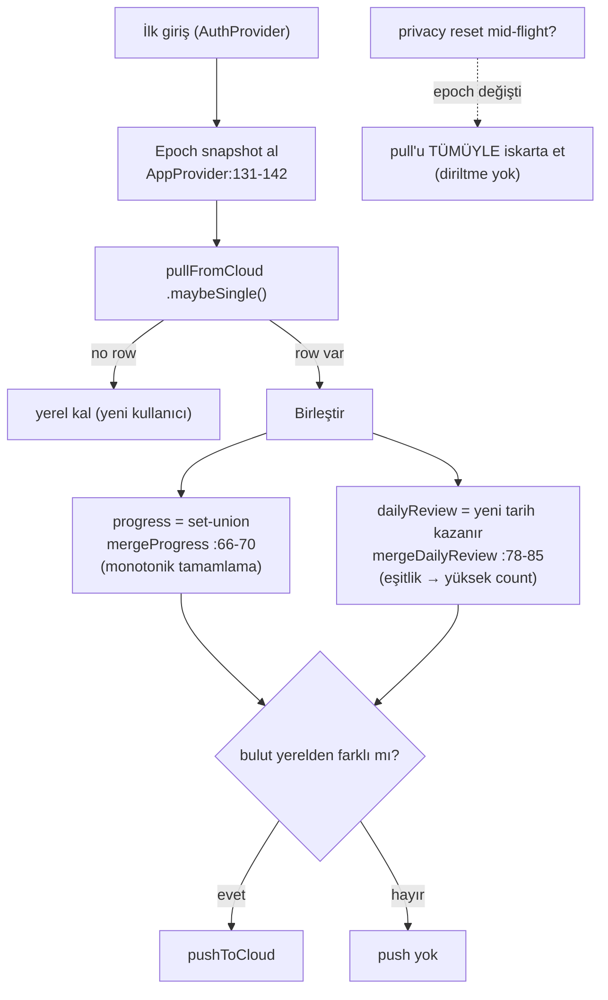

# Sync Architecture

<!-- gh-toc -->

## İçindekiler

- [Executive Summary](#executive-summary)
- [Why It Exists](#why-it-exists)
- [Current Canon](#current-canon)
- [How It Works — İlk-giriş birleştirmesi](#how-it-works-ilk-giriş-birleştirmesi)
- [Failure Modes](#failure-modes)
- [Examples](#examples)
- [Runtime Implementation](#runtime-implementation)
- [Known Gaps](#known-gaps)
- [Open Questions](#open-questions)
- [Related Notes](#related-notes)

> [!canon] Purpose — Legacy `lm7` ilerlemesinin Supabase'e nasıl (opsiyonel) senkronlandığını, ilk-giriş **birleştirme** mantığını ve **PR-H privacy reset epoch bariyerinin** senkronu nasıl güvenli kıldığını açıklar.
> Üst bağlantı: [[00 Le Mot Holy Codex]] · [[System Architecture]].

## Executive Summary

Bulut senkronu **opsiyoneldir** ve yalnızca legacy `lm7` dünyasını kapsar (motor `lm_le_*` dünyası bulutla senkronlanmaz — [[Learning Engine Architecture]]). `useProgressSync` `user_progress`'e upsert eder, `.maybeSingle()` ile çeker, hataları `console.warn` ile yutar (non-fatal) [IMPLEMENTED code-side; deploy operator-only]. İlk girişte birleştirme: ilerleme **set-union** (monotonik tamamlama), dailyReview **yeni tarih kazanır** (eşitlikte yüksek count). Bir privacy reset senkron sırasında olursa **epoch snapshot** çekilen veriyi tümüyle iskarta eder — silinen veri diriltilemez.

## Why It Exists

Öğrenci cihaz değiştirdiğinde ilerlemesini kaybetmemeli; ama gizlilik-önce tasarımda senkron asla yerel silmeyi ezmemeli. Bu not iki gereksinimi nasıl bir arada tuttuğumuzu gösterir.

## Current Canon

> [!implemented] `hooks/useProgressSync.ts` + `AppProvider.tsx:120-197`.

- `pushToCloud`: `user_progress` upsert (sütunlar `progress`, `daily_review`, `onConflict: user_id`).
- `pullFromCloud`: `.maybeSingle()` seçimi; "no row" beklenen yeni-kullanıcı yolu (`useProgressSync.ts:44-58`).
- `pushError`: `user_errors` insert; hatalar non-fatal.
- **Bulut opsiyonel**: `supabaseReady = url && anonKey ikisi de set` (`lib/supabase.ts:10`); false ise client `null` ve Sign-In CTA gizli.
- **Errors pull'da yerel kalır** (`useProgressSync.ts:59`) — bulut hataları çekilmez.

## How It Works — İlk-giriş birleştirmesi

Düz dille: Giriş anında önce bir epoch fotoğrafı çekilir. Bulut satırı varsa yerel ile birleştirilir: tamamlamalar kümesel birleşir (hiçbir tamamlama kaybolmaz), günlük inceleme daha yeni tarihi tutar. Yalnız bulut yerelden farklıysa geri yazılır. Eğer çekme sırasında kullanıcı verisini silerse, epoch değiştiği için çekilen veri tümüyle atılır — silinen ilerleme geri gelmez ([[Privacy and Data Deletion]]).

## Failure Modes
- Push/pull ağ hatası → `console.warn`, non-fatal, uygulama akmaya devam eder.
- Senkron ↔ reset yarışı → epoch bariyeri pull'u iskarta eder (test: `privacyResetBarrier`).
- Bulut yapılandırılmamışsa (`supabaseReady=false`) → hiç senkron yok, CTA gizli.

## Examples
> [!example]
> Cihaz A'da L1–L4 tamamlanmış, bulutta L1–L3 var. Girişte set-union → L1–L4 (hiçbir şey kaybolmaz). Bulut yerelden farklı (L4 eksik) → `pushToCloud` L4'ü buluta yazar.

## Runtime Implementation

### Code References
`useProgressSync.ts:44-58,59`; `AppProvider.tsx:120-197,66-70,78-85,131-142`; `lib/supabase.ts:10`.

### Test References
`privacyResetBarrier` (`scripts/tests/`).

### Product-Stage Availability
Kod her stage'de mevcut ama yalnız `supabaseReady` iken aktif. Round 1 Dev APK **Supabase env olmadan** çalışır → senkron tamamen kapalı. Deploy operator-only. Detay: [[Supabase]].

## Known Gaps
- Motor dünyası (`lm_le_*`) bulutla **senkronlanmaz**; uzak öğrenme-motoru senkronu consent-gated ve PROPOSED (`le_*` şeması) — [[Privacy and Data Deletion]].
- Deployed DB'de dropped `streak` sütunu migration debt (DEFERRED).

## Open Questions
> [!open-loop] Legacy `lm7` senkronu ile motorun consent-gated `le_*` senkronu iki ayrı yol; birleşik bir kimlik/senkron modeli henüz tasarlanmadı. → [[05 Open Loops]].

## Related Notes
[[Storage Architecture]] · [[Privacy and Data Deletion]] · [[Supabase]] · [[Authentication]] · [[System Architecture]] · [[00 Le Mot Holy Codex]]
