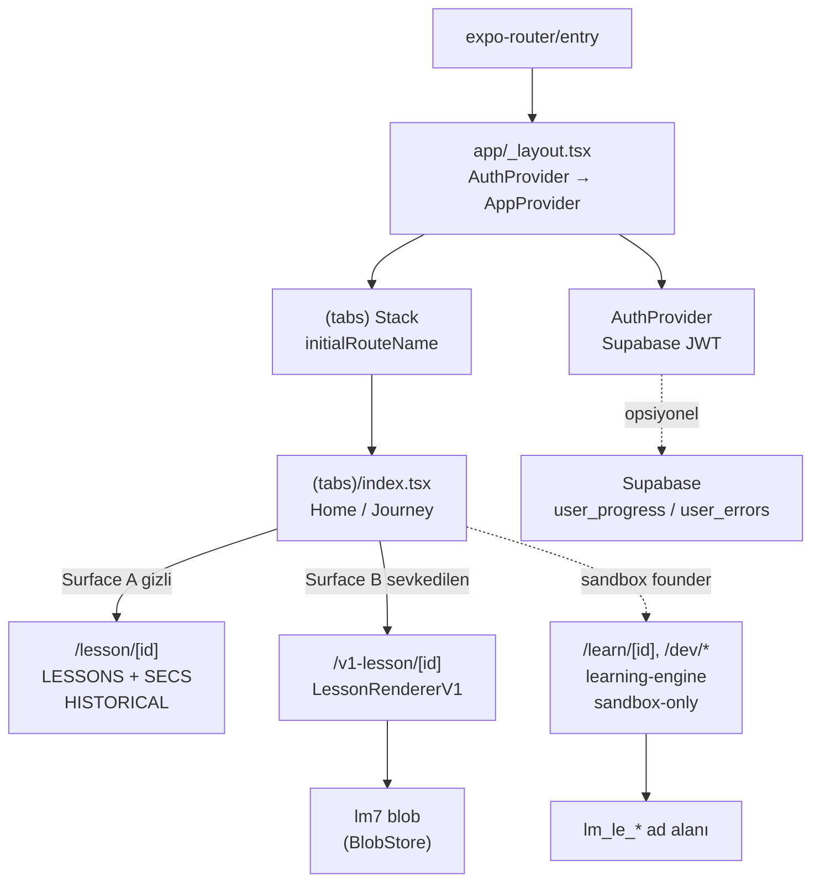

# System Architecture

<!-- gh-toc -->

## İçindekiler

- [Executive Summary](#executive-summary)
- [Why It Exists](#why-it-exists)
- [Current Canon](#current-canon)
- [How It Works](#how-it-works)
- [Diagrams](#diagrams)
- [Runtime Implementation](#runtime-implementation)
- [Known Gaps](#known-gaps)
- [Open Questions](#open-questions)
- [Related Notes](#related-notes)
- [🧭 GitHub Navigation](#-github-navigation)

> [!canon] Purpose — Bu not, 06_ARCHITECTURE klasörünün giriş kapısıdır: teknoloji yığını, sağlayıcı ağacı, native/web depolama dikişi ve **kodda aynı anda yaşayan üç paralel ders runtime'ı** üst düzeyde burada özetlenir; her alt sistem kendi ana notuna dallanır.
> Üst bağlantı: [[00 Le Mot Holy Codex]].

## Executive Summary

Le Mot / Cairn, **Expo SDK ~55 / React Native 0.83.6 / React 19.2 / TypeScript ~5.9 strict / expo-router ~55** üzerine kurulu, dosya tabanlı yönlendirmeli bir mobil uygulamadır [IMPLEMENTED]. Uygulama ağacı iki sağlayıcıyla sarılır: `AuthProvider → AppProvider`. En kritik mimari gerçek teknoloji seçimi değil, **kodda üç ayrı ders/içerik runtime'ının bir arada var olmasıdır** (A legacy gizli, B static-v1 sevkedilen, C learning-engine sandbox-only). Ayrıntı: [[Runtime Content Architecture]] (crown note). Genel duruş baştan sona **fail-closed**: yapılandırılmamış her şey en kısıtlı gerçek yüzeye düşer.

## Why It Exists

Bu not, "sistem nasıl bir arada duruyor?" sorusuna 30 saniyede cevap verir ve okuyucuyu doğru alt-mimari notuna yönlendirir. Ayrıca en sık yapılan hatayı — "tek bir ders motoru var" varsayımını — daha ilk ekranda düzeltir.

## Current Canon

> [!implemented] Framework yığını `lemot-app/package.json` bağımlılıklarında: Expo ~55, RN 0.83.6, React 19.2, expo-router ~55, NativeWind 4 (Tailwind), reanimated 4, TypeScript ~5.9 strict.

- **Giriş / sağlayıcılar** [IMPLEMENTED]: `expo-router/entry` → `app/_layout.tsx`, ağacı `AuthProvider` → `AppProvider` ile sarar, Outfit/Newsreader fontlarını yükler, splash'ı gizler, `Stack`'i (`(tabs)`, `auth`, `lesson/[id]`) tanımlar; `initialRouteName: "(tabs)"` (`app/_layout.tsx:12-58`).
- **Native vs web depolama dikişi** [IMPLEMENTED]: `lib/storage.ts` → `kvStorage`, native'de `expo-sqlite/kv-store` (senkron `getItemSync`/`setItemSync`), web'de `window.localStorage`; seçim `Platform.OS === "web"` ile (`lib/storage.ts:3-25`). Detay: [[Storage Architecture]].
- **Scripts** (`package.json:6-16`): `typecheck` (`tsc --noEmit`), `validate:pools`, `validate:content`, `manifest:add`, `manifest:add-tag`, `telemetry:report`, `test:learning-engine` — hepsi `tsx` ile çalışan Node scriptleri.

## How It Works

### Inputs
Kullanıcı etkileşimi (Home patika, ders ekranları), `EXPO_PUBLIC_PRODUCT_STAGE` env değişkeni ([[Product Stage Architecture]]), isteğe bağlı Supabase env ([[Supabase]]).

### Outputs
Ekranlar (expo-router route ağacı, [[Route Architecture]]), yerel depolamaya yazılan ilerleme blob'ları ([[Storage Architecture]]), isteğe bağlı bulut senkronu ([[Sync Architecture]]).

### State / Lifecycle
`AppProvider` `lm7` blob'unu ve türev durumları tutar; `AuthProvider` Supabase oturumunu yönetir ([[Authentication]]). Öğrenme-motoru durumu ayrı `lm_le_*` ad alanında yaşar ([[Learning Engine Architecture]]).

### Main Rules
CLAUDE.md banner canonu: **"v1 geçici bir Dev APK smoke yüzeyidir; learning-engine uzun vadeli ürün temelidir. v1'i genişletme."** Kod bu ayrımı somutlaştırır (Surface B minimal, Surface C zengin ama gated).

### Guardrails
Fail-closed stage çözümü, atomik `BlobStore`, corrupt-storage karantinası, AI master switch — hepsi [[Failure and Recovery Model]]'de toplanır.

## Diagrams

Düz dille: Uygulama tek girişten açılır, iki sağlayıcıyla sarılır ve sekme yığınına iner. Home ekranı üç ders yüzeyinin kapısıdır ama yalnızca **B**'yi (v1) tester'a gösterir; **A** dev-apk'te gizli, **C** yalnız sandbox/founder'da. İki depolama dünyası (`lm7` vs `lm_le_*`) birbirinden ayrıdır ve bulut tamamen opsiyoneldir.

## Runtime Implementation

### Code References
`app/_layout.tsx:12-58`, `lib/storage.ts:3-25`, `config/productStage.ts:71-136`, `package.json:6-16`.

### Test References
`scripts/tests/run.ts:1-50` — 42 `*.test.ts` dosyası, saf Node/tsx, "NO React Native / Expo / device layer is loaded". Detay: [[Failure and Recovery Model]].

### Product-Stage Availability
Tüm stage'ler uygulamayı yükler; içerik/yüzey stage'e göre değişir ([[Product Stage Architecture]]).

## Known Gaps
- İki depolama dünyasının ayrılığı ("main integration blocker") — legacy `lm7` Home/Progress'i sürer, motor `lm_le_*` yalnız Surface C'yi sürer. Detay: [[Learning Engine Architecture]].

## Open Questions
> [!open-loop] `validate:content` şu an geçiyor mu? 54-registry vs 56-manifest sayı farkı (K3) bunu etkileyebilir — bu read-only geçişte çalıştırılmadı. → [[05 Open Loops]], detay [[Registry Architecture]].

## Related Notes
[[Runtime Content Architecture]] · [[Data Flow]] · [[Route Architecture]] · [[Product Stage Architecture]] · [[Storage Architecture]] · [[Failure and Recovery Model]] · [[00 Le Mot Holy Codex]]

<!-- gh-nav -->

## 🧭 GitHub Navigation

[⬆ README](../../README.md) · [🪨 Holy Codex](../00_START_HERE/00%20Le%20Mot%20Holy%20Codex.md) · [Current State](../00_START_HERE/03%20Current%20State.md) · [Open Loops](../00_START_HERE/05%20Open%20Loops.md)

**Bu klasördeki notlar (06_ARCHITECTURE):**

- [AI Architecture](./AI%20Architecture.md)
- [Authentication](./Authentication.md)
- [Data Flow](./Data%20Flow.md)
- [Failure and Recovery Model](./Failure%20and%20Recovery%20Model.md)
- [Learning Engine Architecture](./Learning%20Engine%20Architecture.md)
- [Privacy and Data Deletion](./Privacy%20and%20Data%20Deletion.md)
- [Product Stage Architecture](./Product%20Stage%20Architecture.md)
- [Registry Architecture](./Registry%20Architecture.md)
- [Route Architecture](./Route%20Architecture.md)
- [Runtime Content Architecture](./Runtime%20Content%20Architecture.md)
- [Storage Architecture](./Storage%20Architecture.md)
- [Supabase](./Supabase.md)
- [Sync Architecture](./Sync%20Architecture.md)
- [System Architecture](./System%20Architecture.md) ⟵ *bu not*
