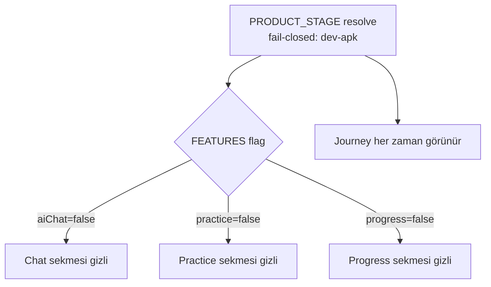

# Navigation Model

> [!canon] Purpose — Kullanıcının uygulamada nasıl dolaştığı: alt tab bar, hangi sekmelerin hangi ürün-aşamasında göründüğü, ve dev-apk'ta neyin gizlendiği.

## Executive Summary

Navigasyon **IMPLEMENTED** ve Expo Router `Tabs` üzerine kurulu (`app/(tabs)/_layout.tsx`). Dört sekme tanımlı — **Journey, Chat, Practice, Progress** — ama görünürlükleri `FEATURES` flag'lerine bağlı. **dev-apk (Round 1 tester yüzeyi) yalnızca Journey sekmesini gösterir**; Chat/Practice/Progress route dosyaları mount edilir ama tab bar'da `href: null` ile gizlenir. Rota erişimi de gate'lidir (deep-link'ler Home'a düşer).

## Current Canon

- Aktif ürün-aşaması `FEATURES` objesini seçer: `config/productStage.ts:131` → `FEATURES = FEATURES_BY_STAGE[PRODUCT_STAGE]`. Fail-closed default = `dev-apk` (`productStage.ts:18`). Detay: [[Product Stages and Feature Flags]].
- Round 1 smoke kanonu: "tab bar shows only **Journey**; Chat/Practice/Progress hidden by flags" (`docs/DEV_APK_SMOKE_TEST_CHECKLIST.md` §4).

## How It Works

### Sekmeler ve gate'leri (IMPLEMENTED)

| Sekme (`name`) | Başlık | İkon | Görünürlük gate'i | dev-apk'ta? |
|---|---|---|---|---|
| `index` | Journey | `Mountain` | (her zaman) | **Görünür** |
| `chat` | Chat | `MessageCircle` | `FEATURES.aiChat` | Gizli (`href: null`) |
| `practice` | Practice | `Layers` | `FEATURES.practice` | Gizli |
| `stats` | Progress | `BarChart3` | `FEATURES.progress` | Gizli |

Kaynak: `app/(tabs)/_layout.tsx:31-78`. Kod yorumu (aynı dosya): dev-apk'ta `href: FEATURES.aiChat ? undefined : null` — "The route file stays mounted; it just doesn't appear in the bottom bar."

### Tab bar görsel stili

`_layout.tsx:14-29`: aktif tint = `P.red` (`#C0392B`), inaktif = `P.ink3`, zemin = `P.paper`, üst çizgi = `P.border`, yükseklik 60, label 11px/600. Paletle tutarlı — bkz. [[Visual Language]].

### Rota gate'leri (deep-link davranışı)

Round 1 checklist §9: `/auth`→Home; `/chat` & `/practice` (gizli)→Home; `/dev/learning-engine-player` & `/dev/learning-engine-preview`→Home; `/learn` sandbox erişilemez. Detay ve tam liste: [[Route Architecture]] · [[Route Matrix]].

## Diagrams

dev-apk'ta yalnızca Journey kalır; sandbox/public-beta flag'leri açıldığında diğer sekmeler geri gelir.

## Guardrails

- Sekme gizleme **flag'le** yapılır, route silinerek değil — böylece aşama değiştiğinde (sandbox) aynı ekranlar geri döner.
- Gizli sekmenin route'una deep-link ile ulaşılırsa Home'a yönlendirilir; ölü ekran gösterilmez (checklist §9).

## Known Gaps

- Progress (`stats.tsx`) legacy 24-lesson yüzeyini render eder; dev-apk'ta gizli olması monetizasyon değil scope kontrolüdür (`productStage.ts:101-107`). Bkz. [[Progress]].

## Related Notes

- [[Home and Journey]] · [[Product Stages and Feature Flags]] · [[Route Architecture]] · [[Feature Flags Map]] · [[Design System Overview]]
