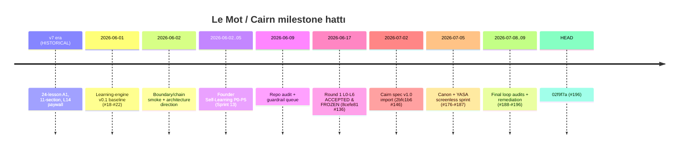

# Commit and Milestone Timeline

Up: [[Implementation Overview]] · PR'lar: [[PR Map]] · Sprint: [[Sprint Timeline]]

> [!warning] **Shallow clone:** yerel git yalnız `2bfc1b6` (#146) → `02f9f7a` (#196) arası
> 50 commit taşır. Bu aralık dışındaki hash/PR'lar statü dokümanlarından alıntıdır →
> `reported-only`. HEAD = **`02f9f7a` (#196)**.

## Milestone hattı

## Commit tablosu (window içi + kaydedilen hash'ler)

| Hash | PR/etiket | Ne | Kaynak |
|---|---|---|---|
| `86fdc0e`…`86c10f4` | #18–#22 | learning-engine v0.1 baseline | reported |
| `5b4470c` | #35/#37/#38 | L11→L12→L16 chain smoke PASS | reported |
| `c6d3028` | — | boundary-recognition UI + 14 macro decisions | reported |
| `9d331d7` | P0–P2 spine | graph/events/LocalRepository/grade()/mastery audit PASS | reported |
| `8a37fca` | #51–#57 | P3 learner renderer | reported |
| `aa0aa37` | #60–#65 | P4 Mon Lexique / Practice Pool | reported |
| `203f817` | — | mastery precision policy (near-miss soft signal) | reported |
| `786f5a0` | #69–#74 | P5 local privacy/data-rights | reported |
| `bf3619a` | — | repo-audit-disposition | reported |
| `32f1625` | — | release-guardrail-audit-plan | reported |
| `abb0b10` | #130 | L6 Un petit moment (integration payoff) | reported |
| `66d7aa7` | #131 | anti-memorization variation pass | reported |
| **`8cefe81`** | **#136** | **Round 1 runtime ACCEPTED** (Home greeting) | reported |
| `91f1b04` | #142 | compact L7 doorway → o zamanki main | reported |
| **`2bfc1b6`** | **#146** | Cairn product system map v0.1 (**window başı**) | ✅ git |
| `60bfda3` | #147 | docs README/precedence | ✅ git |
| `c5ccf06` | #148 | dev-apk checklist ↔ L0 handoff | ✅ git |
| `17eec7b` | #151 | Weave label/tone (Round 1.1) | ✅ git |
| `5f967ec` | #152 | Say It Your Way onay adımı (Round 1.1) | ✅ git |
| `ed85c07` | #153 | L2/L4/L5 chip/prompt temizliği (Round 1.1) | ✅ git |
| **`8cfdce75`** | **#154** | **L2 `ici` chip kapsamı → Round 1.1 baseline main** (GO / tester-ready; fiziksel spot-check TTS OK) | ✅ git |
| `5f27eee` | #155 | Round 1.2 Weave branding + target salience (`weaveCopy.ts`) | ✅ git |
| **`2df3469`** | **#156** | **Round 1.2 durak — L3 recap passive `oui` kaldır** (merged, APK/smoke-doğrulanmadı) | ✅ git |
| `0c9795d` | — | chip taxonomy + lexique lifecycle canon | ✅ git |
| `4aa4072` | — | atomize L4/L6 recaps (Faz 1) | ✅ git |
| `f32c096` | — | Cairn roadmap guards + Error Engine v0 (Faz 3) | ✅ git |
| `0a04068`→`1743f07`→`03c29ea` | — | Faz 4: lexique numeric contract → derived memory → carryover selector | ✅ git |
| `909e781` | — | Faz 5 decision gate | ✅ git |
| `0371e10` | — | Faz 6 content factory contract | ✅ git |
| `ae793a3` / `015f343` | — | telemetry v0 / event compaction v0 | ✅ git |
| `4debc25` | — | Unit 2 L7–L9 pilot content | ✅ git |
| `4d74219` | — | L10–L12 content | ✅ git |
| `84a5b8e` | — | L13–L15 content | ✅ git |
| `beb4331` | — | L1–L15 chip inventory audit | ✅ git |
| `9c799d9` | — | registry hygiene (R2–R4) | ✅ git |
| `0b31c69` | — | Payload Economy v0 | ✅ git |
| `7e83405` | — | Exercise Canon v0.4 | ✅ git |
| **`d16aa05`** | **#176** | **Lesson Flow Canon v1.0 + deployment roadmap** | ✅ git |
| `fd3d29b` | #177 | YASA 2 itemId immutability | ✅ git |
| `0513d19` | #178 | YASA 1 migration rails | ✅ git |
| `691cde3` | #179 | deriveDrill + practice selector v0 | ✅ git |
| `53c70b0` | #182 | karpathy import + K1–K6 | ✅ git |
| — | #186 | YASA 3 error-tag immutability | ✅ git |
| **`f655c19`** | **#187** | mechanize canon V3/V4/V5 | ✅ git |
| `60819e6`/`d5d8baa` | — | fable5-protocol skill + Stop hook | ✅ git |
| **`02f9f7a`** | **#196** | **PR-H local reset/export → HEAD** | ✅ git |

## Anahtar milestone semantiği

- **Round 1 FROZEN (`8cefe81`/#136):** L0–L6 runtime P0–P3 sıfır ile kabul; kod donduruldu.
  Sonra #139 Lesson Zero'yu yeniden kurdu, #141 hint'leri capledi → operator device smoke
  **rebuilt Lesson Zero'yu `91f1b04`'te yeniden kapsamalı** ([[Decision Index|D-39]]).
- **Cairn import (`2bfc1b6`/#146):** precedence `CLAUDE.md → STATUS.md → DEV_APK_MVP_CANON.md
  → Cairn v1.0 spec`; legacy `LEGACY — DO NOT BUILD ON THIS` banner'larıyla quarantine
  ([[Decision Index|D-34]]).
- **Round 1.1 baseline (`8cfdce75`/#154):** GO / tester-ready; 2026-06-29 fiziksel
  cihaz spot-check (Haktan) **TTS OK**, blocker yok; Tester 1 L0–L6 ~20–25 dk olumlu.
  [VERIFIED: device @`8cfdce75` — güncel HEAD `02f9f7a` (#196)'nın **gerisinde**]
  (kaynak: `PR_and_Smoke_Log.md`). Round 1.1/1.2 detay: [[Sprint Timeline]], [[PR Map]].
- **Round 1.2 durak (`2df3469`/#156):** #155 + #156 merged; **code-validated only
  (328/328), APK/smoke-doğrulanmadı.** [private EAS/APK artifacts held in operator vault]

## Related Notes

[[PR Map]] · [[Sprint Timeline]] · [[Product Timeline]] · [[Decision Index]] · [[03 Current State]] · [[Roadmap Crosswalk]] (Five Stones ↔ Faz 0–7 eşleme)
