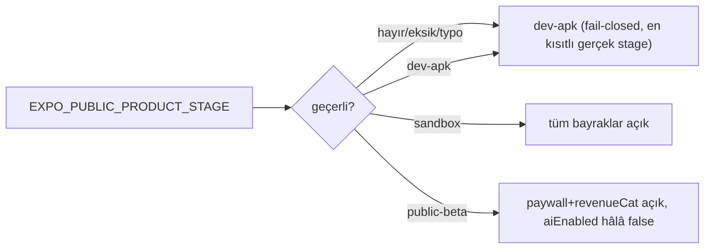

# Feature Flags Map

<!-- gh-toc -->

## İçindekiler

- [Tam bayrak × stage matrisi](#tam-bayrak-stage-matrisi)
- [Sevkedilen tester yüzeyi (dev-apk) — ne KAPALI](#sevkedilen-tester-yüzeyi-dev-apk-ne-kapali)
- [İki AI bayrağı neden ayrı](#iki-ai-bayrağı-neden-ayrı)
- [Fail-closed productStage — neden dev-apk, neden sandbox değil](#fail-closed-productstage-neden-dev-apk-neden-sandbox-değil)
- [HISTORICAL sabit](#historical-sabit)
- [Guardrail testleri](#guardrail-testleri)
- [Known Gaps](#known-gaps)
- [Related Notes](#related-notes)

Up: [[Implementation Overview]] · Ürün: [[Product Stages and Feature Flags]] · Mimari: [[Product Stage Architecture]]

> [!implemented] `ProductStage = sandbox | dev-apk | public-beta`. `FEATURES =
> FEATURES_BY_STAGE[PRODUCT_STAGE]` (`config/productStage.ts:71-136`). Kaynak env
> `EXPO_PUBLIC_PRODUCT_STAGE`; **fail-closed** olarak eksik/hatalı değer `dev-apk`'ye
> çözülür (`:14-40`). Bkz. [[Decision Index|D-20]].

## Tam bayrak × stage matrisi

| Feature flag | sandbox | dev-apk | public-beta |
|---|---|---|---|
| `paywall` | false | false | **true** |
| `revenueCat` | false | false | **true** |
| `aiChat` (Chat tab) | true | **false** | true |
| `aiLesson` (in-lesson AI) | true | **true** | true |
| `aiEnabled` (AI master switch) | true | **false** | **false** |
| `wordGraph` | true | false | false |
| `monLexique` | true | false | true |
| `leCarnet` | true | false | false |
| `practice` | true | false | true |
| `dailyReview` | true | false | true |
| `progress` | true | false | true |
| `v1LessonEngine` | true | false | false |

Kaynak: `FEATURES_BY_STAGE` (`config/productStage.ts:71-136`). Source-of-truth yorumu
`docs/DEV_APK_MVP_CANON.md`'ye işaret eder.

## Sevkedilen tester yüzeyi (dev-apk) — ne KAPALI

> [!canon] dev-apk = minimal tester yüzeyi. KAPALI: `paywall`, `revenueCat`, `aiChat`,
> `aiEnabled`, `wordGraph`, `monLexique`, `leCarnet`, `practice`, `dailyReview`, `progress`,
> `v1LessonEngine`. AÇIK: sadece `aiLesson=true` (ama `aiEnabled=false` olduğu için ders-içi
> AI de deterministik fallback'e düşer — yani AI stack **efektif dormant**). Bkz.
> [[Dev APK Scope]], [[AI Architecture]].

## İki AI bayrağı neden ayrı

`aiChat` (standalone Chat tab) ile `aiLesson` (ders-içi AI) **kasıtlı ayrıdır**: dev-apk'te
ders AI'ı yapısal olarak açık kalır ama Chat tab gizlenir. Yine de üstteki **master switch
`aiEnabled`** dev-apk VE public-beta'da `false` — yani `lib/ai.ts callEdgeFunction`
`FEATURES.aiEnabled && supabaseReady` olmadan **hiç network çağrısı yapmaz**, deterministik
fallback döner (`lib/ai.ts:32-33`; `productStage.ts:58-136`). Sonuç: shipped tester/beta
build'leri AI-closed çalışır.

## Fail-closed productStage — neden `dev-apk`, neden sandbox değil

Unconfigured/typo env → `dev-apk` (en kısıtlı **gerçek** stage), sandbox DEĞİL — böylece
yanlış yapılandırılmış bir build, en geniş founder yüzeyini değil, minimal yüzeyi sevk eder
(`productStage.ts:16-40`). Bu, eski **fail-open sandbox fallback**'ini süperseder
([[Decision Index|D-20]]; süperseded kayıt [[Superseded Decisions]]). Testler:
`productStageResolution.test.ts`, `devApkScope.test.ts`.

## HISTORICAL sabit

`DEV_APK_LESSON_LIMIT = 5` legacy 24-lesson filtresine bağlı **HISTORICAL** sabittir,
kod içinde açıkça frozen/legacy notu düşülmüş (`productStage.ts:138-146`). Surface B'nin
Home-cap'i (`number <= 6`) bundan bağımsızdır — bkz. [[Runtime Lesson Map]].

## Guardrail testleri

`devApkScope.test.ts` dev-apk'nin doğru daraltıldığını, `devApkCopyGuard`/`componentCopyGuard`
banned copy ("streak/XP/reward") sızıntısını mekanik olarak yakalar (bkz. [[Test Strategy]],
[[Decision Index|D-01]]).

## Known Gaps

- `aiEnabled` hiç açılmadan önce edge regression guard'ları gerekli (C3/C7/C13, PR-J) → [[Known Gaps]].
- Bayrakların cihazda stage-bazlı doğrulaması operator-only (fiziksel smoke) → [[Smoke Test Playbook]].

## Related Notes

[[Product Stages and Feature Flags]] · [[Product Stage Architecture]] · [[Feature Stage Matrix]] · [[Route Map]] · [[AI Architecture]]
