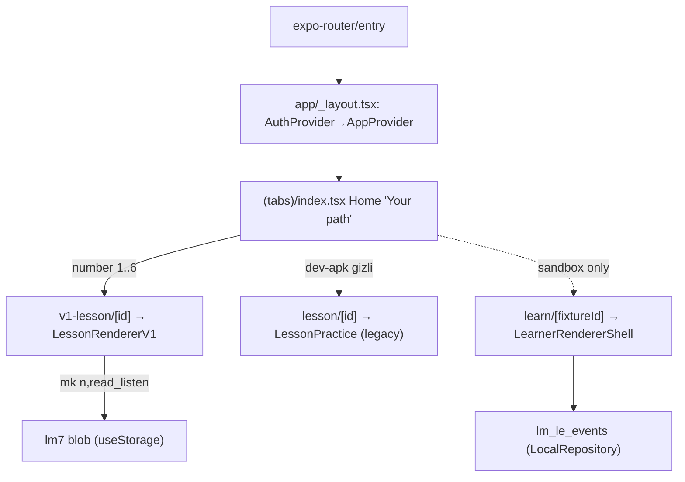

# Implementation Overview

Up: [[00 Le Mot Holy Codex]] · Komşu: [[System Architecture]] · [[Runtime Content Architecture]]

> [!implemented] Bu klasör **"ne KODLANDI ve neye BAĞLI"** sorusunu kanıtla cevaplar.
> Kararların (`09_DECISIONS`) ve spec'in (`02`/`03`/`04`) aksine, burada tek ölçüt
> repo'daki gerçek kod + testtir. Her iddia `path:line` ile bağlanır.

## Executive Summary

Kod tabanı Expo SDK ~55 / React Native 0.83.6 / React 19.2 / expo-router ~55 /
TypeScript ~5.9 strict / NativeWind 4 üzerine kurulu (`package.json`). Giriş
`expo-router/entry → app/_layout.tsx`, ağacı `AuthProvider → AppProvider` ile
sarar (`app/_layout.tsx:12-58`).

En kritik mimari gerçek: **aynı anda üç paralel ders runtime'ı** yaşıyor. Bu ayrım
tüm `08_IMPLEMENTATION` notlarının belkemiğidir.

| Yüzey | İçerik kaynağı | Renderer | Route | Erişilebilir | Statü |
|---|---|---|---|---|---|
| **A. Legacy 24-lesson** | `data/lessons` (`LESSONS`) | `LessonPractice` + `SECS` (11-section) | `/lesson/[id]` | sandbox, public-beta (dev-apk'te gizli) | IMPLEMENTED / HISTORICAL |
| **B. Static authored v1** | `content/lessons/v1/*` (16 dosya L0–L15) | `LessonRendererV1` | `/v1-lesson/[id]` | sandbox + dev-apk (Home L1–L6'ya kısıtlar) | **IMPLEMENTED — sevkedilen tester yüzeyi** |
| **C. Learning-engine** | `content/learning-engine/*` fixtures | `LearnerRendererShell` / dev player | `/learn/[fixtureId]`, `/dev/*` | yalnız sandbox (founder) | IMPLEMENTED-tested-only / SPEC-ONLY |

> [!warning] Yüzey B ve C **kod paylaşmaz**. `LessonRendererV1`, `content/learning-engine`'den
> hiçbir şey import etmez; authored `LessonScreen`'leri doğrudan render eder ve ilerlemeyi
> `useApp().mk` ile yazar (`components/lesson-v1/LessonRendererV1.tsx:8-16,26,38`).
> CLAUDE.md banner'ı bunu doğrular: "v1 geçici Dev APK smoke yüzeyi… learning-engine uzun
> vadeli ürün temeli. Do not expand v1." (bkz. [[Decision Index|D-08]]).

## Bu klasördeki notlar (okuma sırası)

| Not | Cevapladığı soru |
|---|---|
| [[Runtime Lesson Map]] | Hangi dersler kodda var, kayıtlı mı, görünür mü? (L0–L15) |
| [[Registry Map]] | `ITEM_REGISTRY` 54 item + itemId manifest (YASA 2/3) |
| [[Route Map]] | expo-router route ağacı + stage gate'leri |
| [[Module Ownership Map]] | learning-engine modülleri: wired-to-C vs tested-only vs shipped |
| [[Feature Flags Map]] | `FEATURES` bayrakları × stage matrisi + fail-closed |
| [[PR Map]] | PR kümeleri (#100–#196) neyi getirdi |
| [[Commit and Milestone Timeline]] | commit/hash zaman çizelgesi |
| [[Implementation Ledger]] | ana özellikler × kod/test/PR ledger tablosu |
| [[Known Gaps]] | kodlanmamış / bloke iş |
| [[Technical Debt]] | bilinen borç (iki store, unwired modüller) |
| [[Spec Runtime Divergences]] | **taç not** — spec ↔ runtime uçurumları |
| [[Test Strategy]] | 42-dosya test runner + validate:content/pools |
| [[Smoke Test Playbook]] | cihaz-günü smoke runbook |
| [[Release and Build Process]] | EAS preview build (operator-only) |

## Load-bearing kod haritası (30 saniye)

Home L1–L6 kartlarını `getV1LessonById` ile çeker ve `/v1-lesson/{id}`'ye yönlendirir
(`app/(tabs)/index.tsx:158-161,364`). Tamamlanınca tek monoton işaret
`{number}-read_listen` yazılır (`LessonRendererV1.tsx:23,38`). İki depolama namespace'i
(`lm7` vs `lm_le_events`) **ayrıktır** — detay [[Technical Debt]] ve [[Spec Runtime Divergences]].

## Runtime Implementation

- **Kod refs:** yukarıdaki tabloların hücreleri + alt notlar.
- **Test refs:** `scripts/tests/run.ts` 42 `*.test.ts` yükler; `validate:content`, `validate:pools`.
- **Product-stage availability:** shipped yüzey = **dev-apk B** (L1–L6); C = yalnız sandbox founder.

## Known Gaps

Tam liste: [[Known Gaps]]. En önemlisi: iki-store ayrımı ("main integration blocker"),
learning-engine'in %90'ının sandbox/tested-only kalması, EAS build + fiziksel smoke'un
operator-only ve bekliyor olması ([[05 Open Loops]]).

## Related Notes

[[Runtime Content Architecture]] · [[System Architecture]] · [[Product Stages and Feature Flags]] · [[03 Current State]]

<!-- gh-nav -->

## 🧭 GitHub Navigation

[⬆ README](../../README.md) · [🪨 Holy Codex](../00_START_HERE/00%20Le%20Mot%20Holy%20Codex.md) · [Current State](../00_START_HERE/03%20Current%20State.md) · [Open Loops](../00_START_HERE/05%20Open%20Loops.md)

**Bu klasördeki notlar (08_IMPLEMENTATION):**

- [Commit and Milestone Timeline](./Commit%20and%20Milestone%20Timeline.md)
- [Feature Flags Map](./Feature%20Flags%20Map.md)
- [Implementation Ledger](./Implementation%20Ledger.md)
- [Implementation Overview](./Implementation%20Overview.md) ⟵ *bu not*
- [Known Gaps](./Known%20Gaps.md)
- [Module Ownership Map](./Module%20Ownership%20Map.md)
- [PR Map](./PR%20Map.md)
- [Registry Map](./Registry%20Map.md)
- [Release and Build Process](./Release%20and%20Build%20Process.md)
- [Route Map](./Route%20Map.md)
- [Runtime Lesson Map](./Runtime%20Lesson%20Map.md)
- [Smoke Test Playbook](./Smoke%20Test%20Playbook.md)
- [Spec Runtime Divergences](./Spec%20Runtime%20Divergences.md)
- [Technical Debt](./Technical%20Debt.md)
- [Test Strategy](./Test%20Strategy.md)
