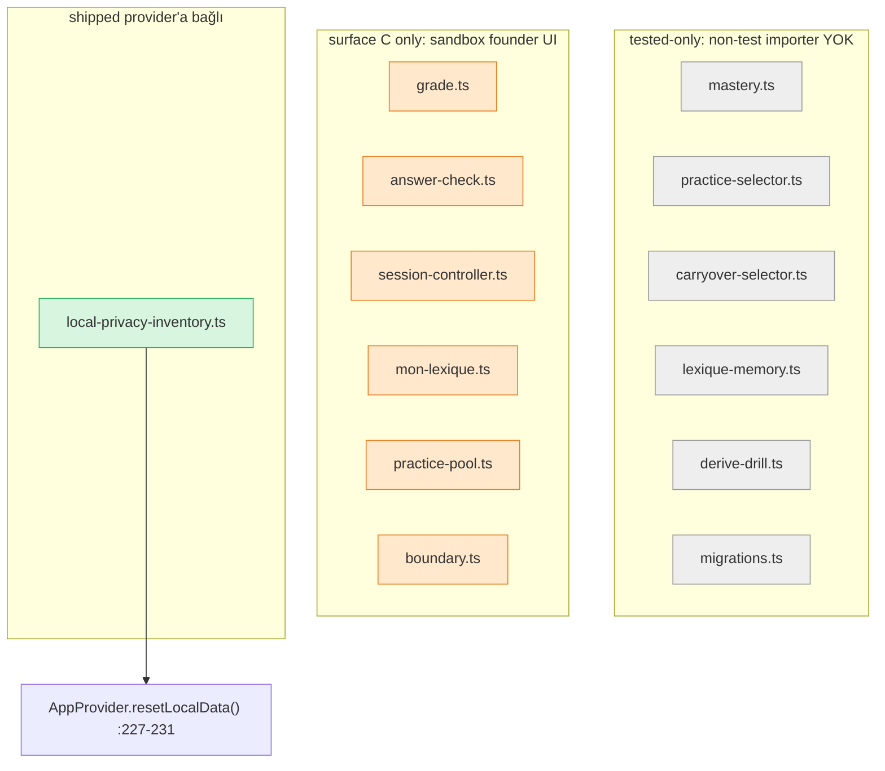

# Module Ownership Map

Up: [[Implementation Overview]] · Mimari: [[Learning Engine Architecture]] · Motor: [[Self-Producing Engine]]

> [!warning] Bu not, `08_IMPLEMENTATION`'ın en yanıltıcı-riskli sorusunu cevaplar:
> **learning-engine modülleri gerçekten runtime'a bağlı mı, yoksa sadece test mi geçiyor?**
> Cevap: **neredeyse tümü ya founder-sandbox-only UI (surface C) ya da tested-only.**
> Tek istisna `local-privacy-inventory` — sevkedilen bir provider'a bağlanan tek engine modülü.

`content/learning-engine/index.ts` kendini "Executable content contract (v0.1)" olarak
tanımlar; import'u "does NOT touch the live lesson renderer … the existing lesson
user-facing flow is unaffected" (`index.ts:1-13`).

## Modül wiring tablosu

| Modül | Non-test import yeri | Wiring statüsü |
|---|---|---|
| `grade.ts` (deterministik grader) | `components/learning-engine/{FillCard,ContextChainCard,RegisterSwitchCard}.tsx`, `buildSequence.ts` | IMPLEMENTED-tested-only (yalnız surface C bileşenleri; dev-apk'te yok) |
| `answer-check.ts` (normalize/checkAnswer) | `ContextChainCard.tsx` + engine index export | IMPLEMENTED-tested-only |
| `session-controller.ts` | `components/learning-engine/{FillCard,ContextChainCard,BuildCard,RegisterSwitchCard,useLearningEngineSession.ts}` | IMPLEMENTED-tested-only (surface C loop) |
| `mon-lexique.ts` | `LearnerRendererShell`, `MonLexiqueEntryCard`, `MonLexiqueShell` | IMPLEMENTED-tested-only (yalnız sandbox `/learn`) |
| `practice-pool.ts` | `PracticePoolShell`, `PracticePoolItemRow`, `LearnerRendererShell` | IMPLEMENTED-tested-only |
| `boundary.ts` | `LearnerRendererShell` | IMPLEMENTED-tested-only |
| `mastery.ts` (mastery reducer/snapshot) | **yalnız testler** | tested-only (non-test importer yok) |
| `practice-selector.ts` | **yalnız testler** | tested-only |
| `carryover-selector.ts` | **yalnız testler** | tested-only |
| `lexique-memory.ts` | **yalnız testler** | tested-only |
| `derive-drill.ts` | **yalnız testler** | tested-only |
| `migrations.ts` | **yalnız testler** | tested-only |
| `error-engine.ts` | `scripts/shippedErrorTags.ts` + testler | tested-only / build tooling |
| `telemetry.ts` | `PrivacyDataControls.tsx` (surface C) + `scripts/telemetryReport.ts` + testler | IMPLEMENTED-tested-only + build tooling |
| `repository/local.ts` (`LocalRepository`) | `session-controller` + privacy inventory + testler | IMPLEMENTED-tested-only (append-only event log) |
| **`local-privacy-inventory.ts`** | **`providers/AppProvider.tsx`** + `PrivacyDataControls` + testler | **✅ IMPLEMENTED-and-wired (sevkedilen provider'a ulaşan TEK modül)** |

## Üç kova — görsel

## Neden `local-privacy-inventory` özel

`AppProvider.resetLocalData()` (`AppProvider.tsx:227-231`) önce privacy reset epoch'unu
bump'lar, sonra `resetAllLocalPrivacyData()`'yi çağırır
(`local-privacy-inventory.ts`). Bu, engine namespace'i (`lm_le_*`) + `lm7`/`lm7_srs` +
`${key}__corrupt` sibling'larını **tek envanterden** siler/export eder — delete ve export'un
"asla drift edememesi" için tek-kaynak (`local-privacy-inventory.ts:1-70`). Yani engine'in
bu parçası sevkedilen privacy akışında **gerçekten çalışır** (P5/PR-H).

## Engine izolasyon kontratı

- Engine persistence ayrı `lm_le_*` namespace'inde; "never reads or writes the live-v7 keys
  `lm7`/`lm7_srs`" (`repository/local.ts:14-38`). İki-store ayrımı → [[Technical Debt]].
- `grade.ts` = **pure, AI-free, storage-free, clock-free** deterministik grader
  ("deterministic engine first; AI may explain later but never overrides", `grade.ts:1-30`).
  Karpathy purity kontratı ([[Decision Index|D-12]]).

## Known Gaps

- Tüm karar/mastery motoru (mastery/selectors/lexique/derive) **hiçbir sevkedilen yüzeye
  bağlı değil** — "main integration blocker" ([[Technical Debt]], KNOWN_GAPS #2).
- `migrations.ts`/compaction unwired (C12); telemetry reset/export'a bağlı ama quarantine
  eksik (C9) → [[Known Gaps]].

## Related Notes

[[Learning Engine Architecture]] · [[Self-Producing Engine]] · [[Mastery Model]] · [[Storage Architecture]] · [[Spec Runtime Divergences]]
